### Chapter 1:MEASUREMENT

1.The SI standard of time is based on:

ans: E

2.A nanosecond is:

ans: B

3.The SI standard of length is based on:

ans: E

4.In 1866, the U. S. Congress defined the U. S.yard as exactly 3600/3937 international meter. This was done primarily because:

ans: C

5.Which of the following is closest to a yard in length?

ans: C

6.There is no SI base unit for area because

ans: D

7.The SI base unit for mass is:

ans: C

8.A gram is:

ans: B

9.Which of the following weighs about a pound?

ans: D

10. $(5.0\times10^{4})\times(3.0\times10^{6})=$

ans: C

11. $(5.0\times10^{4})\times(3.0\times10^{-6})=$ A. $1.5\times10^{-3}$

ans: B

12. $5.0\times10^{5}+3.0\times10^{6}=$

ans: E

13. $(7.0\times10^{6})/(2.0\times10^{-6})=$ A. $3.5\times10^{-12}$

ans: E

14.The number of significant figures in 0.00150 is:

ans: B

15.The number of significant figures in 15.0 is:

ans: C

16. $3.2\times2.7=$

ans: C

17. 1.513+27.3=

A.29 B.28.8 C.28.9 D.28.81 E.28.813 ()Ans: B

18.1 mi is equivalent to 1609 m so 55 mph is:

ans: B

19.A sphere with a radius of 1.7 cm has a volume of

ans: A

20.A sphere with a radius of 1.7 cm has a surface area of

ans: C

21. A right circular cylinder with a radius of 2.3 cm and a height of 1.4 m has a volume of:

ans: D

22.A right circular cylinder with a radius of 2.3 cm and a height of 1.4 cm has a total surface area of:

ans: D

23.A cubicbox with an edge of exactly 1cmhas a volume of

ans: B

24.A square with an edge of exactly 1 cm has an area of

ans: B

25.1 m is equivalent to 3.281 ft.A cube with an edge of 1.5 ft has a volume of

ans: B

26.During a short interval of time the speed $\mathcal{U}$ in m/s of an automobile is given by $v=at^2+bt^3$ where the time $t$ is in seconds. The units of $u.$ and $b$ are respectively

ans: D

27. Suppose $A=BC$ ，where $A$ has the dimension L/M and $C$ has the dimension L/T. Then $B$ has the dimension:

ans: A

28.Suppose $A$ = $B^{n}C^{m}$ ，where $A$ has dimensions LT, $B$ has dimensions $\mathrm{L}^{2}\mathrm{T}^{-1}$ ，and $U$ has dimensions $LT^{2}$ .Then the exponents 772 and 711 have the values:

ans: D

### Chapter 2: MOTION ALONG A STRAIGHT LINE

1.A particle moves along the $3L$ axis from ${\mathcal{L}}_{i}$ to ${\mathcal{E}}f$ .Of the following values of the initial and final coordinates, which results in the displacement with the largest magnitude?

$$\begin{aligned}
&\mathrm{A.}\quad x_{i}&&&& =4\:\mathrm{m},\:x_{f}=6\:\mathrm{m} \\
& \mathrm{B.}\quad x_{i} &&&& =-4\:\mathrm{m},\:x_{f}=-8\:\mathrm{m} \\
&\mathrm{C.}\quad x_{i}& \\
&\text{D}&& x_{i}=4\:\mathrm{m},\:x_{f}=-2\:\mathrm{m} \\
&\text{E.}&& x_{i}=-4\:\mathrm{m},\:x_{f}=4\:\mathrm{m} \\
&&&\text{ans: E}
\end{aligned}$$

2.A particle moves along the $3L$ axis from ${\mathcal{L}}_{i}$ to ${\mathcal{E}}f$ . Of the following values of the initial and final coordinates, which results in a negative displacement?

ans: B

3.The average speed of a moving object during a given interval of time is always:

ans: B

4.Two automobiles are 150 kilometers apart and traveling toward each other.One automobile is moving at 60 km/h and the other is moving at 40 km/h mph. In how many hours will they meet?

ans: D

5.A car travels 40 kilometers at an average speed of 80 km/h and then travels 40 kilometers at an average speed of $40\operatorname{km/h}$ .The average speed of the car for this 80-km trip is

ans: D

6.A car starts from Hither,goes 50 km in a straight line to Yon,immediately turns around and returns to Hither. The time for this round trip is 2 hours. The magnitude of the average velocity of the car for thisround trip is

ans: A

7.A car starts from Hither,goes 50 km in a straight line to Yon,immediately turns around,and returns to Hither.The time for this round trip is 2 hours.The average speed of the car for this round trip is:

ans: B

8.The coordinate of a particle in meters is given by $x(t)=16t-3.0t^{3}$ ,where the time $t$ is ir seconds. The particle is momentarily at rest at $t=$

ans: B

9.A drag racing car starts from rest at $t=0$ and moves along a straight line with velocity given by $v=bt^{2}$ ,where $b$ is a constant.The expression for the distance traveled by this car from its position at $t=0$ is

ans: B

10. A ball rolls up a slope. At the end of three seconds its velocity is 20 cm/s ；; at the end of eight seconds its velocity is 0 .What is the average acceleration from the third to the eighth second？ A. 2.5cm/s$^2$

ans: B

8Chapter 2:MOTION ALONG A STRAIGHT LINE

11.The coordinate of an object is given as a function of time by $x=7t-3t^{2}$ ，where $3L$ is in meters and $t$ is in seconds. Its average velocity over the interval from $t=0$ to $t=4$s is

ans: B

12. The velocity of an object is given as a function of time by $v=4t-3t^{2}$ ，where $2U$ is in m/s and $t$ is in seconds. Its average velocity over the interval from $t=0$ to $t=2$ S

ans: A

13.The coordinate of an object is given as a function of time by $x=4t^2-3t^3$ ,where $3E$ is in meters and $t$ is in seconds.Its average acceleration over the intervalfrom $t=0$ to $t=2$s is

ans: C

14.Each of four particles move along an $U$ axis.Their coordinates (in meters) as functions of time (in seconds) are given by

particle 1: $x(t)=3.5-2.7t^{3}$ particle 2: $x(t)=3.5+2.7t^{3}$ particle 3: $x(t)=3.5+2.7t^{2}$ particle 4: $x(t)=3.5-3.4t-2.7t^{2}$

Which of these particles have constant acceleration?

ans: D

15.Each of four particles move along an $2L$ axis. Their coordinates (in meters) as functions of time (in seconds) are given by

particle 1: $x(t)=3.5-2.7t^{3}$ particle 2: $x(t)=3.5+2.7t^{3}$ particle 3: $x(t)=3.5+2.7t^{2}$ particle 4: $x(t)=3.5-3.4t-2.7t^{2}$

Which of these particles is speeding up for $t>0$

ans: A

16.An object starts from rest at the origin and moves along the $U$ axis with a constant acceleration of 4 m/ $s^{2}$ .Its average velocity as it goes from $x=2$m to $x=8$m is

ans: E

17.Of the following situations,which one is impossible?

ans: E

18.Throughout a time interval,while the speed of a particle increases as it moves along the $3L$ axis. its velocity and acceleration might be：

ans: C

19. A particle moves on the $U$ axis.When its acceleration is positive and increasing

ans: E

### Chapter 2

20.The position $y$ of a particle moving along the $y$ axis depends on the time $t$ according tothe equation $y=at-bt^{2}$ .The dimensions of the quantities $u$ and $t$ are respectively

ans: C

21. A particle moves along the $3E$ axis according to the equation $x=6t^{2}$ ,where $2L$ is in meters anc $t$ is in seconds. Therefore:

ans: E

22.Over a short intervalnear time $t=0$ the coordinate of an automobile in meters is given by $x(t)=27t-4.0t^{3}$ ,where $t$ is in seconds. At the end of 1.0 s the acceleration of the auto is:

ans: E

23.Over a short interval, starting at time $t=0$ ,the coordinate of an automobile in meters is giver by $x(t)=27t-4.0t^{3}$ ,where $t$ is in seconds.The magnitudes of the initial(at $t=0$ ) velocity and acceleration of the auto respectively are

ans: C

24. At time $t=0$ a car has a velocity of 16m/s .It slows down with an acceleration given by $-0.50t$ ,in m/ $s^{2}$ for $t$ in seconds.It stops at $t=$

ans: D

25.At time $t=0$ a car has a velocity of 16 m/s. It slows down with an acceleration given by $-0.50t$ ,in m/ $s^{2}$ for $t$ in seconds.At the end of 4.0 s it has traveled:

ans: E

26. At time $t=0$ a car has a velocity of 16 m/s. It slows down with an acceleration given by $-0.50t$ ，in m/ $s^{2}$ for $t$ in seconds.By the time it stops it has traveled

ans: D

27.Starting at time $t=0$ ,an object moves along a straight line with velocity in m/s given by $v(t)=98-2t^{2}$ ,where $t$ is in seconds. When it momentarily stops its acceleration is:

ans: D

28.Starting at time $t=0$ , an object moves along a straight line. Its coordinate in meters is given by $x(t)=75t-1.0t^{3}$ ，where $t$ is in seconds. When it momentarily stops its acceleration is:

ans: C

29.A car,initially at rest, travels 20 m in 4 s along a straight line with constant acceleration.The acceleration of the car is: A. 0.4m/ $s^{2}$

ans: C

12Chapter 2:MOTION ALONG A STRAIGHT LINE

30. A racing car traveling with constant acceleration increases its speed from 10m/s to 50m/s over a distance of 60m .How long does this take?

ans: B

31. A car starts from rest and goes down a slope with a constant acceleration of 5m/ $s^{2}$ .After 5 s the car reaches the bottom of the hill. Its speed at the bottom of the hill, in meters per second, is:

ans: C

32. A car moving with an initial velocity of 25 m/s north has a constant acceleration of 3m/$\mathrm{s}^2$ south.After 6 seconds itsvelocity will be:

ans: A

33. An object with an initial velocity of 12 m/s west experiences a constant acceleration of 4 m/ $s^{2}$ west for 3 seconds. During this time the object travels a distance of

ans: D

34. How far does a car travel in 6 s if its initial velocity is 2 m/s and its acceleration is 2m/$s^2$ in the forward direction?

ans: E

35.At a stop light, a truck traveling at 15m/s passes a car as it starts from rest. The truck travels at constant velocity and the car accelerates at 3m/s3 .How much time does the car take to catch up to the truck?

ans: B

36.A ball is in free fall. Its acceleration is:

ans: A

37. A ball is in free fall. Upward is taken to be the positive direction. The displacement of the ball during a short time intervalis:

ans: D

38. A baseball is thrown vertically into the air. The acceleration of the ball at its highest point is A.zero

ans: B

39.Which one of the following statements is correct for an object released from rest?

ans: A

40. A freely falling body has a constant acceleration of 9.8m/s$^2$ .This means that:

ans: C

41. An object is shot vertically upward. While it is rising

ans: B

42. An object is thrown straight up from ground level with a speed of 50 m/s. If $g=10$m/s$^2$ its distance above ground level 1.0 s later is:

ans: B

43. An object is thrown straight up from ground level with a speed of 50m/s .If $g=10$m/s$^2$ its distance above ground level 6.0 s later is:

ans: E

44.At a location where $g=9.80$m/s$^2$ , an object is thrown vertically down with an initial speed of 1.00m/s .After 5.00 s the object will have traveled

ans: B

45.An object is thrown vertically upward at 35 m/s. Taking $g=10$m/s$^2$ ，the velocity of the object 5 s later is:

ans: B

46.A feather,initially at rest,is released in a vacuum 12 m above the surface of the earth.Which of the following statements is correct?

ans: C

47.An object is released from rest.How far does it fall during the second second of its fall?

ans: C

48.A heavy ball falls freely,starting from rest.Between the third and fourth second of time it travels a distance of

ans: D

49.As a rocket is accelerating vertically upward at 9.8m/s$^2$ near Earth's surface, it releases a projectile. Immediately after release the acceleration (in m/ $^{\prime}\mathrm{s}^{2}$ )of the projectile iss

ans: A

16Chapter 2:MOTION ALONG A STRAIGHT LINE

50.A stone is released from a balloon that is descending at a constant speed of 10 m/s.Neglecting air resistance, after 20 s the speed of the stone iss

ans: C

51. An object dropped from the window of a tall building hits the ground in 12.0 s. Ifits acceleration is 9.80m/s$^2$ , the height of the window above the ground is

ans: E

52. Neglecting the effect of air resistance a stone dropped off a 175-m high building lands on the ground in:

ans: C

53.A stone is thrown vertically upward with an initial speed of 19.5 m/s. It will rise to a maximum height of:

ans: C

54.A baseball is hit straight up and is caught by the catcher 2.0 slater.The maximum height of the ball during this interval is

ans: A

55. An object is thrown straight down with an initial speed of 4 m/s from a window which is 8 m above the ground.The time it takes the object toreach the ground is:

ans: B

56.A stone isreleasedfrom rest from the edge of abuilding roof 190m aboye the ground.Ne glecting air resistance, the speed of the stone, just before striking the ground, is

ans: B

57. An object is thrown vertically upward with a certain initial velocity in a world where the acceleration due to gravity is 19.6m/ $s^{2}$ .The height to which it rises is that to which the object would rise if thrown upward with the same initial velocity on the Earth. Neglec. friction.

ans: A

58.A projectile is shot vertically upward with a given initial velocity.It reaches a maximum height of 100 m.If,on a second shot, the initial velocity is doubled then the projectile will reach a maximum height of

ans: E

59.One object is thrown vertically upward with an initial velocity of 100m/s and another object with an initial velocity of 10m/s .The maximum height reached by the first object will be that of the other.

ans: B

60.The area under a velocity-time graph represents

ans: E

61.Displacement can be obtained from:

ans: D

62. An object has a constant acceleration of 3m/ $s^{2}$ .The coordinate versus time graph for this object has a slope:

ans: A

63.The coordinate-time graph of an object is a straight line with a positive slope.The object has

ans: D

64.Which of the following five coordinate versus time graphs represents the motion of an object moving with a constant nonzero speed?

ans: B

65.Which of the following five acceleration versus time graphs is correct for an object moving in a straight line at a constant velocity of 20m/s'

ans: E

66. Which of the following five coordinate versus time graphs represents the motion of an object whose speed is increasing?

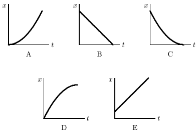

ans: A

67.A car accelerates from rest on a straight road.A short time later, the car decelerates to a stop and then returns to its original position in a similar manner,by speeding up and then slowing to a stop.Which of the following five coordinate versus time graphsbest describes the motion

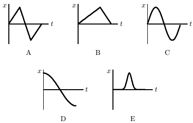

ans: E

68.The acceleration of an object,starting from rest,is shown in the graph below.Other than at $t=0$ ，when is the velocity of the object equal to zero?

ans: E

69.An elevator is moving upward with constant acceleration.The dashed curve shows the position $y$ of the ceiling of the elevator as a function of the time $t$ .At the instant indicated by the dot, a bolt breaks loose and drops from the ceiling.Which curve best represents the position of the bolt asafunction of time?

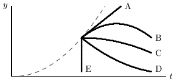

ans: B

70.The diagram shows a velocity-time graph for a car moving in a straight line.At point Q the car must be:

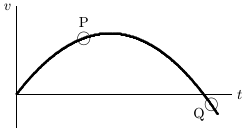

ans: E

71.The diagram shows a velocity-time graph for a car moving in a straight line. At point $P$ the car must be:

ans: C

72.The graph represents the straight line motion of a car.How far does the car travelbetween $t=2$ s and $t=5$ s?

ans: D

73.The diagram represents the straight line motion of a car.Which of the following statements is true?

ans: B

74.Consider the following five graphs (note the axes carefully).Which of these represents motior at constant speed?

ans: E

75. An object is dropped from rest. Which of the following five graphs correctly represents its motion? The positive direction is taken to be downward

ans: B

76.A stone is dropped from a cliff. The graph (carefully note the axes)which best represents its motion while it falls is:

ans: C

77.An object is thrown vertically into the air.Which of the following five graphs represents the velocity (v) of the object as a function of the time (t)? The positive direction is taken to be upward.

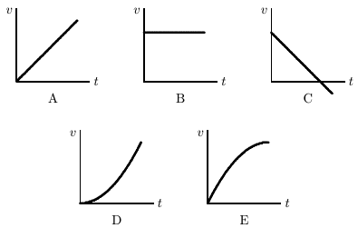

ans: C

### Chapter 3:VECTORS

ans: B

2.The vectors $\bar{a}$ $\bar{b}$ and $\bar{c}$ are related by $\vec{c}$ = $\vec{b} - \vec{a}$ .Which diagram below illustrates this relationship?

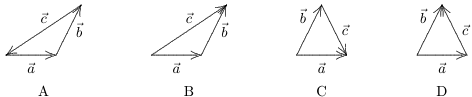

ans: D

3.A vector of magnitude 3 CANNOT be added to a vector of magnitude 4 so that the magnitude of the resultant is:

ans: A

4.A vector of magnitude 20 is added to a vector of magnitude 25.The magnitude of this sun might be

ans: C

5.A vector $\bar{S}$ ofmagnitude 6 and another vector $\vec{T}$ have a sum of magnitude 12.The vector $\bar{T}$ A.must have a magnitude of at least 6 but no more than 18

ans: A

6.The vector $-\bar{A}$ is:

ans: D

7.The vector $\vec{V}_{3}$ in the diagram is equal to

ans: C

8. If $|\vec{A}+\vec{B}|^2=A^2+B^2$ , then

ans: E

9.If $|\vec{A}+\vec{B}|=A+B$ and neither $\bar{A}$ nor $\vec{B}$ vanish, then

ans: A

10.If $|\vec{A}-\vec{B}|=A+B$ and neither $\bar{A}$ nor $\vec{B}$ vanish, then

ans: B

11. Four vectors ( $\bar{A}$ $\vec{B}$ ， $\tilde{C}$ ， $\bar{D}$ )all have the same magnitude. The angle $\theta$ between adjacent vectors is $45^{\circ}$ as shown. The correct vector equation is:

ans: B

12. Vectors $\bar{A}$ and $\vec{B}$ lie in the $xy$ plane.We can deduce that $\vec{A}=\vec{B}$ if

ans: C

13. A vector has a magnitude of 12. When its tail is at the origin it lies between the positive $3L$ axis and the negative $y$ axis and makes an angle of $30^{\circ}$ with the 22 axis. Its $y$ component is:

ans: D

14. If the ${:}L$ component of a vector $\bar{A}$ ，in the $xy$ plane, is half as large as the magnitude of the vector, the tangent of the angle between the vector and the 22 axis is:

ans: D

15.If $\vec{A}=(6$m$)\hat{\mathrm{i}}-(8$m$)\hat{\mathrm{j}}$ then $4\vec{A}$ has magnitude

ans: D

16.A vector has a component of 10m in the $+x$ direction, a component of $10m$ in the $+y$ direction and a component of $5m$ in the $+z$ direction. The magnitude of this vector is:

ans: B

17.Let $\vec{V}=(2.00$m$)\hat{\mathrm{i}}+(6.00$m$)\hat{\mathrm{j}}-(3.00$m$)\hat{\mathrm{k}}$ .The magnitude of $\vec{V}$ is A.5.00m

ans: C

### Chapter 3

18. A vector in the $xy$ plane has a magnitude of 25m and an $3L$ component of $12m$ .The angle it makes with the positive $3E$ axis is

ans: C

19.The angle between $\vec{A}=(25$m$)\hat{\mathrm{i}}+(45$m$)\hat{\mathrm{j}}$ and the positive $3L$ axis is: A. $29^{\circ}$

ans: B

20.The angle between $\vec{A}=(-25$m$)\hat{\mathbf{i}}+(45$m$)\hat{\mathbf{j}}$ and the positive $3L$ axis is

ans: C

21.Let $\vec{A} = ( 2$ m$) \hat{\mathrm{i} } + ( 6$ m$) \hat{\mathrm{j} } - ( 3$ m$) \hat{\mathrm{k} }$ and $\vec{B}=(4$m$)\hat{\mathrm{i}}+(2$m$)\hat{\mathrm{j}}+(1$m$)\hat{\mathrm{k}}$ .The vector sum $\vec{S}=\vec{A}+\vec{B}$ is:

ans: A

22.Let $\vec{A}=(2$m$)\mathbf{\hat{ı}}+(6$m$)\mathbf{\hat{j}}-(3$m$)\mathbf{\hat{k}}$ and $\vec{B}=(4$m$)\hat{\mathrm{i}}+(2$m$\hat{\mathrm{j}}+(1$m$)\hat{\mathrm{k}}$ .The vector difference $\vec{D}=\vec{A}-\vec{B}$ is:

ans: B

23.If $\vec{A} = ( 2$ m$) \hat{\mathrm{i} } - ( 3$ m$) \hat{\mathrm{j} }$ and $\vec{B}=(1$m$)^\mathbf{\hat{ı}}-(2$m$)\mathbf{\hat{J}}$ ,then $\vec{A}-2\vec{B}=$

ans: A

24.In the diagram, $\bar{A}$ has magnitude $12m$ and $\vec{B}$ has magnitude $8m$ The $3L$ component of $\vec{A}+\vec{B}$ is about:

ans: C

25.A certain vector in the $\mathcal{E}y$ plane has an $3E$ component of $4m$ anda $y$ component of $10m$ .It is then rotated in the $2y$ plane so its $3L$ component is doubled. Its new $y$ component is about:

ans: B

26.Vectors $\bar{A}$ and $\vec{B}$ each have magnitude $L$ .When drawn with their tails at the same point,the anglebetween them is $30^{\circ}$ .The value of $\vec{A}\cdot\vec{B}$ is

ans: C

27.Let $\vec{A} = ( 2$ m$) \hat{\mathrm{i} } + ( 6$ m$) \hat{\mathrm{j} } - ( 3$ m$) \hat{\mathrm{k} }$ and $\vec{B}=(4$m$)\mathbf{\hat{ı}}+(2$m$)\mathbf{\hat{j}}+(1$m$)\mathbf{\hat{k}}$ .Then $\vec{A}\cdot\vec{B}=$

ans: D

28. Two vectors have magnitudes of 10m and $15m$ .The angle between them when they are drawn with their tails at the same point is $65^{\circ}$ .The component of the longer vector along the line of the shorter is:

ans: C

29.Let $\vec{S}=(1$m$)\hat{\mathrm{i}}+(2$m$)\hat{\mathrm{j}}+(2$m$)\hat{\mathrm{k}}$ and $\vec{T}=\left(3\:\mathrm{m}\right)\hat{\mathrm{i}}+\left(4\:\mathrm{m}\right)\hat{\mathrm{k}}$ .The angle between these two vectors is given by

ans: D

30.Two vectors lie with their tails at the same point. When the angle between them is increased by $20^{\circ}$ their scalar product has the same magnitude but changes from positive to negative The original angle between them was:

ans: D

31.If the magnitude of the sum of two vectors is less than the magnitude of either vector,then

ans: A

32.If the magnitude of the sum of two vectors is greater than the magnitude of either vector, then

ans: E

33.Vectors $\bar{A}$ and $\vec{B}$ each have magnitude $L$ .When drawn with their tails at the same point,the angle between them is $60^{\circ}$ .The magnitude of the vector product $\vec{A}\times\vec{B}$ is:

ans: C

34.Two vectors lie with their tails at the same point.When the angle between them is increasec by $20^{\circ}$ the magnitude of their vector product doubles.The original angle between them was about:

ans: B

35.Two vectors have magnitudes of $10m$ and $15m$ The angle between them when they are drawn with their tails at the same point is $65^{\circ}$ .The component of the longer vector along the line perpendicular to the shorter vector, in the plane of the vectors, is:

ans: E

36.The two vectors (3m)î-(2m)î and (2 m) $\hat{\mathrm{i} } + ( 3$ m) $\hat{\mathrm{j} } - ( 2$ m) $\hat{\mathrm{k} }$ define a plane. It is the plane of the triangle with both tails at one vertex and each head at one of the other vertices.Which of the following vectors is perpendicular to the plane?

ans: A

37.Let $\vec{R}=\vec{S}\times\vec{T}$ and $\theta\neq90^{\circ}$ ,where $\theta$ is the angle between $\bar{S}$ and $\bar{T}$ when they are drawn with their tails at the same point. Which of the following is NOT true?

ans: E

38. The value of ${\stackrel{\Lambda}{\mathbf{i}}}\cdot({\stackrel{\Lambda}{\mathbf{j}}}\times{\stackrel{\Lambda}{\mathbf{k}}})$ is

ans: B

39. The value of $\hat{\mathbf{k}}\cdot(\hat{\mathbf{k}}\times\hat{\mathbf{i}})$ is

ans: A

### Chapter 4: MOTION IN TWO AND THREE DIMENSIONS

1.Velocity is defined as:

ans: A

2.Acceleration is defined as:

ans: C

3.Which of the following is a scalar quantity?

ans: A

4.Which of the following is a vector quantity？

ans: E

5. Which of the following is NOT an example of accelerated motion?

ans: E

### Chapter 4

6.A particle goes from $x=-2$m ， $y=3$m ， $z=1$m to $x=3$m ， $y$ = -1 m ， $z=4$m .Its displacement is:

ans: B

7.A jet plane in straight horizontal flight passes over your head. When it is directly above you, the sound seems to come from a point behind the plane in a direction $30^{\circ}$ from the vertical The speed of the plane is:

ans: B

8.A plane traveling north at 200m/s turns and then travels south at 200m/s .The change in its velocity is

ans: E

9.Two bodies are falling with negligible air resistance, side by side, above a horizontal plane. If one of the bodies is given an additional horizontal acceleration during its descent, it

ans: A

10.The velocity of aprojectile equals its initialvelocity added to

ans: D

11.A stone thrown from the top of a tall building follows a path that is:

ans: D

12.Identical guns fire identical bullets horizontally at the same speed from the same height above levelplanes,one on the Earth and one on theMoon.Which of the following three statements is/are true?

ans: B

13.A stone is thrownhorizontally and follows the path XYZ shown.The direction of the acceler ation of the stone at point Y is:

ans: A

14.A bullet shot horizontally from a gun

ans: C

15.A bomber fying in level fight with constant velocity releases a bomb before it is over the target. Neglecting air resistance,which one of the following is NOT true?

ans: C

16. The airplane shown is in level fight at an altitude of 0.50 km and a speed of 150km/h .At what distance d should it release a heavy bomb to hit the target X? Take $g= 10$ m/ $s^{2}$

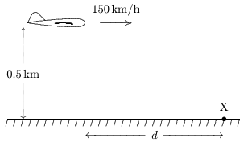

ans: C

17. An object is shot from the back of a railroad flatcar moving at $40\operatorname{km}/\operatorname{h}$ on a straight horizontal road. The launcher is aimed upward, perpendicular to the bed of the fatcar.The object falls

ans: C

18.A ball is thrown horizontally from the top of a 20-m high hill.It strikes the ground at an angle of $45^{\circ}$ .With what speed was it thrown?

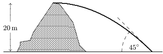

ans: B

19.A stone is thrown outward from the top of a59.4-mhigh cliff with an upwardvelocity compo nent of 19.5m/s . How long is stone in the air?

ans: C

20.A large cannon is fired from ground level over level ground at an angle of $30^{\circ}$ above the horizontal. The muzzle speed is 980m/s .Neglecting air resistance, the projectile will travel what horizontal distance before striking the ground?

ans: D

21.A boy on the edge of a vertical cliff 20m high throws a stone horizontally outward with a speec of 20m/s .It strikes the ground at what horizontal distance from the foot of the cliff? Use $g=10\mathrm{~m/s}^{2}$

ans: B

22. Which of the curves on the graph below best represents the vertical component ${\mathcal{U}}_{y}$ of the velocity versus the time $t$ for a projectile fired at an angle of $45^{0}$ above the horizontal?

ans: D

23.A cannon fires a projectile as shown.The dashed line shows the trajectory in the absence of gravity; points MNOP correspond to the position of the projectile at one second intervals.If $g= 10$ m/ $s^{2}$ , the lengths X,Y,Z are:

ans: B

24.A dart is thrown horizontally toward X at 20m/s as shown. It hits Y 0.1s later. The distance XY is:

ans: E

25.A projectile is fired from ground level over levelground with an initial velocity that has a vertical component of 20m/s and a horizontal component of 30m/s .Using $g= 10$ m/ $s^{2}$ ，the distance from launching to landing points is

ans: D

26.An object,tied to a string,moves in a circle at constant speed on a horizontal surface as shown The direction of the displacement of this object,as it travels from W to Xis

ans: E

27.A toy racing car moves with constant speed around the circle shown below. When it is at point A its coordinates are $x=0$ $y=3$m and its velocity is (6m/s)i .When it is at point B its velocity and acceleration are

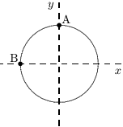

ans: C

28. An airplane makes a gradual $90^{\circ}$ turn while flying at a constant speed of 200m/s .The process takes 20.0 seconds to complete.For this turn the magnitude of the average acceleration of the plane is:

ans: D

29. An airplane is fying north at 500 km/h .It makes a gradual $180^{\circ}$ turn at constant speed changing its direction of travel from north through east to south. The process takes 40 s .The average acceleration of the plane for this turn (in km/h·s) is:

ans: E

30. An object is moving on a circular path of radius TI meters at a constant speed of 4.0m/s .The time required for one revolution is:

ans: B

31.A particle moves at constant speed in a circular path.The instantaneous velocity and instantaneous acceleration vectors are:

ans: C

32.A stone is tied to a string and whirled at constant speed in a horizontal circle.The speed is then doubled without changing the length of the string.Afterward the magnitude of the acceleration of the stone is:

ans: C

33. Two objects are traveling around different circular orbits with constant speed. They both have the same acceleration but object A is traveling twice as fast as object B. The orbit radius for object A is the orbit radius for object B

ans: E

34. A stone is tied to a 0.50-m string and whirled at a constant speed of 4.0m/s in a vertical circle. Its acceleration at the top of the circle is

ans: E

35. A stone is tied to a 0.50-m string and whirled at a constant speed of 4.0m/s in a vertical circle Its acceleration at the bottom of the circle is

ans: D

36.A car rounds a 20-m radius curve at 10m/s .The magnitude of its acceleration is:

ans: C

37. For a biological sample in a 1.0-m radius centrifuge to have a centripetal acceleration of 25g its speed must be:

ans: B

38.A girl jogs around a horizontal circle with a constant speed.She travels one fourth of a revolution, a distance of 25m along the circumference of the circle.in5.0s.The magnitude of her acceleration is: A. 0.31 m/ $s^{2}$

ans: C

39.A stone is tied to the end ofa string and is swung with constant speed arounda horizontal circle with a radius of $1.5m$ .If it makes two complete revolutions each second, the magnitude of its acceleration is

ans: D

40.A Ferris wheel with a radius of 8.0m makes 1 revolution every 10 s .When a passenger is at the top, essentially a diameter above the ground, he releases a ball. How far from the point on the ground directly under the release point does the ball land?

ans: D

41. A boat is able to move through still water at 20m/s . It makes a round trip to a town 3.0 km upstream. If the river flows at 5m/ s , the time required for this round trip is:

ans: E

42. A boat is traveling upstream at $14\operatorname{km/h}$ with respect to a river that is fowing at $6\operatorname{km/h}$ (with respect to the ground). A man runs directly across the boat, from one side to the other, at $6\operatorname{km/h}$ (with respect to the boat). The speed of the man with respect to the ground is:

ans: A

43. A ferry boat is sailing at 12 km/h $30^{0}$ W of N with respect to a river that is flowing at 6.0km/h E.As observed from the shore, the ferry boat is sailing

ans: B

44. A boy wishes to row across a river in the shortest possible time. He can row at 2m/ s in still water and the river is fowing at 1m/s .At what angle $\theta$ should he point the bow (front) of his boat?

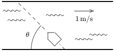

ans: E

47

45.A girl wishes to swim across ariver to a point directly opposite as shown.She can swim at 2m/s in still water and the river is fowing at 1m/s .At what angle $\theta$ with respect to the line joining the starting and finishing points should she swim?

ans: A

46.A motor boat can travel at 10 km/h in still water. A river fows at 5 km/h west. A boatel wishes to cross from the south bank to a point directly opposite on the north bank. At what angle must the boat be headed?

ans: B

47.Two projectiles are in flight at the same time.The acceleration of one relative to the other A. is always 9.8m/ $s^{2}$

ans: D

### Chapter 5FORCE AND MOTIONI

1.An example of an inertial reference frame is:

ans: B

2.An object moving at constant velocity in an inertial frame must

ans: D

3.In SIunits a force is numerically equal to the when the force is applied to it.

ans: D

4. Which of the following quantities is NOT a vector?

ans: A

5.A newton is the force：

ans: D

6.The unit of force called the newton is

ans: B

7.A force of $1N$ is:

ans: C

8.The standard 1-kg mass is attached to a compressed spring and the spring is released.If the mass initially has an acceleration of 5.6m/ $s^{2}$ , the force of the spring has a magnitude of:

ans: B

9.Acceleration is always in the direction:

ans: D

10.The term“mass”refers to the same physical concept as:

ans: B

### Chapter 5

11.The inertia ofabody tends to cause thebody to

ans: C

12.A heavy ball is suspended as shown.A quick jerk on the lower string will break that string but a slow pull on the lower string will break the upper string. The first result occurs because

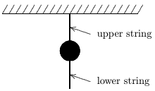

ans: C

13. When a certain force is applied to the standard kilogram its acceleration is 5.0m/s$^2$ .When the same force is applied to another object its acceleration is one-fifth as much.The mass of the object is:

ans: D

14.Mass differs from weight in that

ans: B

15.The mass of a body

ans: C

16.The mass and weight of a body

ans: E

17. An object placed on an equal-arm balance requires $12\lg$ to balance it. When placed on a spring scale， the scale reads 12 kg .Everything (balance, scale, set of weights and object) is now transported to the Moon where the free-fall acceleration is one-sixth that on Earth. The new readings of the balance and spring scale(respectively) are A. $12\lg$ ,12kg

ans: C

18. Two objects, one having three times the mass of the other, are dropped from the same height in a vacuum.At the end of their fall, their velocities are equal because

ans: E

19.A feather and a lead ball are dropped from rest in vacuum on the Moon.The acceleration of the feather is:

ans: B

52 Chapter 5FORCE AND MOTIONI

20.The block shown moves with constant velocity on ahorizontal surface.Two of the forces on it are shown.A frictional force exerted by the surface is the only other horizontal force on the block. The frictional force is:

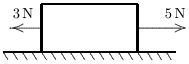

ans: B

21.Two forces,one with a magnitude of $3N$ and the other with a magnitude of $5N$ ,are applied to an object. For which orientations of the forces shown in the diagrams is the magnitude of the acceleration of the object the least?

ans: A

22.A crate rests on a horizontal surface and a woman pulls on it with a 10-N force.Rank the situations shown below according to the magnitude of the normal force exerted by the surface on the crate,least to greatest.

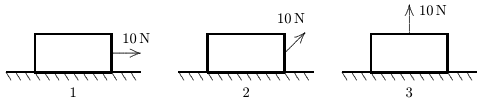

ans: E

23.A heavy woodenblock is draggedby aforce $\vec{F}$ along a rough steelplate.as shown in the diagrams for two cases. The magnitude of the applied force $\bar{F}$ is the same for both cases. The normal force in (ii),as compared with the normal force in (i) is

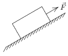
(i)

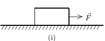

ans: C

24.Equal forces $\bar{F}$ act on isolated bodies A and B.The mass of B is three times that of A.The magnitude of the acceleration of A is:

ans: A

25.A car travels east at constant velocity.The net force on the car is:

ans: E

26.A constant force of 8.0 N is exerted for 4.0 s on a 16-kg object initially at rest.The change in speed of this object will be

ans: B

27. A 6-kg object is moving south. A net force of 12 N north on it results in the object having an acceleration of:

ans: A

28. A 9000-N automobile is pushed along a level road by four students who apply a total forward forceof 500N . Neglecting friction, the acceleration of the automobile is

ans: B

29.An object rests on a horizontal frictionless surface.A horizontal force of magnitude $F^{\prime}$ is applied. This force produces an acceleration:

ans: C

30.A 25-kg crate is pushed across a frictionless horizontal floor with a force of 20 N, directed $20^{\circ}$ below the horizontal. The acceleration of the crate is:

ans: B

31.A ball with a weight of $1.5N$ is thrown at an angle of $30^{\circ}$ above the horizontalwith an initial speed of 12m/s .At its highest point, the net force on the ball is:

ans: E

32.Two forces are applied to a5.0-kg crate:one is 6.0 $N$ to the north and the other is 8.0 $N$ to the west.The magnitude of the acceleration of the crate is: A. 0.50 m/ $s^{2}$

ans: B

33.A 400-N steel ballis suspended by a light rope from the ceiling.The tension in the rope is

ans: A

34.A heavy steel ball B is suspended by a cord from a block of wood W. The entire system is dropped through the air. Neglecting air resistance, the tension in the cord is:

ans: A

35.A circus performer ofweight $W$ is walking along a “high wire” as shown.The tension in the wire:

ans: D

36. A 1000-kg elevator is rising and its speed is increasing at 3 m/ $s^{2}$ .The tension force of the cable on the elevator is:

ans: E

*37.A 5-kg block is suspended by a rope from the ceiling of an elevator as the elevator accelerates downward at 3.0m/ $s^{2}$ .The tension force of the rope on the block is:

ans: B

38. A crane operator lowers a 16,000-N steel ball with a downward acceleration of 3 m/ $s^{2}$ .The tension force of the cable is

ans: B

39.A 1-N pendulum bob is held at an angle $\theta$ from the vertical by a 2-N horizontal force $F$ as shown.The tension in the string supporting the pendulum bob (in newtons)is:

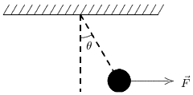

ans: C

40.A car moves horizontally with a constant acceleration of 3 m/ $s^{2}$ .A ball is suspended by a string from the ceiling of the car. The ball does not swing, being at rest with respect to the car.What angle does the string make with the vertical?

ans: A

41.A man weighing 700Nb is in an elevator that is accelerating upward at 4 m/ $s^{2}$ .The force exerted on him by the elevator foor is:

ans: E

42. You stand on a spring scale on the foor of an elevator. Of the following, the scale shows the highest reading when the elevator:

ans: A

43. You stand on a spring scale on the foor of an elevator. Of the following, the scale shows the highest reading when the elevator:

ans: B

44. When a 25-kg crate is pushed across a frictionless horizontal foor with a force of 200 N, directed $20^{\circ}$ below the horizontal, the magnitude of the normal force of the foor on the crate is:

ans: E

45.A block slides down a frictionless plane that makes an angle of $30^{\circ}$ with the horizontal.The acceleration of the block is

ans: E

46.A 25-N crate slides down a frictionless incline that is $25^{\circ}$ above the horizontal. The magnitud of the normal force of the incline on the crate is:

ans: B

47.A 25-N crate is held at rest on a frictionless incline by a force that is parallel to the incline.If the incline is $25^{\circ}$ above the horizontal the magnitude of the applied force is:

ans: D

48.A 25-N crate is held at rest on a frictionless incline by a force that is parallelto the incline.If the incline is $25^{\circ}$ above the horizontal the magnitude of the normal force of the incline on the crate is:

ans: E

49.A 32-N force, parallel to the incline, is required to push a certain crate at constant velocity up a frictionless incline that is $30^{\circ}$ above the horizontal.The mass of the crate is

ans: D

50. A sled is on an icy (frictionless) slope that is $30^{\circ}$ above the horizontal.When a 40-N force parallel to the incline and directed up the incline, is applied to the sled, the acceleration of the sled is 2.0m/ $s^{2}$ , down the incline. The mass of the sled is

ans: E

51.When a 40-N force,parallel to the incline and directed up the incline,is applied to a crate on a frictionless incline that is $30^{\circ}$ above the horizontal, the acceleration of the crate is 2.0 m/ $s^{2}$ up the incline. The mass of the crate is:

ans: C

52. The "reaction" force does not cancel the "action" force because

ans: B

53.A book rests on a table,exerting a downward force on the table.The reaction to this force is: A.the force of Earth on the book

ans: B

54.A lead block is suspended from your hand by a string.The reaction to the force of gravity on the blockis the force exerted by:

ans: E

55. A 5-kg concrete block is lowered with a downward acceleration of 2.8m/ $s^{2}$ by means of a rope The force of the block on the rope is

ans: D

56. A 90-kg man stands in an elevator that is moving up at a constant speed of 5.0m/s .The force exerted by him on the floor is about

ans: C

57. A 90-kg man stands in an elevator that has a downward acceleration of 1.4 m/ $s^{2}$ .The force exerted by him on the floor is about

ans: C

58.A 5-kg concrete block is lowered with a downward acceleration of 2.8m/ $s^{2}$ by means of a rope The force of the block on Earth is:

ans: E

59. Two blocks are connected by a string and pulley as shown. Assuming that the string and pulley are massless,the magnitude of the acceleration of each blockis

ans: E

60. A 70-N block and a 35-N block are connected by a string as shown. If the pulley is massless and the surface is frictionless, the magnitude of the acceleration of the 35-N block is:

ans: B

61.A 13-N weight and a 12-N weight are connected by a massless string over a massless,frictionless pulley.The 13-N weight has a downward acceleration with magnitude equal to that of a freely falling body times

ans: D

62.A massless rope passes over a massless pulley suspended from the ceiling.A 4-kg block is attached to one end and a 5-kg block is attached to the other end.The acceleration of the 5-kg block is:

ans: E

63. Two blocks,weighing 250N and 350 N,respectively, are connected by a string that passes ove a massless pulley as shown. The tension in the string is:

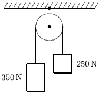

ans: B

64.Three books (X,Y,and Z)rest on a table.The weight of each book is indicated.The net force acting on book Y is

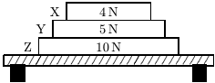

ans: D

65.Three books (X, Y, and Z) rest on a table. The weight of each book is indicated. The force of book Z on book Y is:

ans: C

66.Three blocks A,B,Ceach having mass $M$ ,are connected by strings as shown.Block C is pulled to the right by a force $\vec{F}$ that causes the entire system to accelerate. Neglecting friction, the net force acting on block B is:

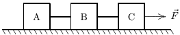

ans: B

67. Two blocks with masses 7712 and $M$ are pushed along a horizontal frictionless surface by a horizontal applied force $\vec{F}$ as shown.The magnitude of the force of either of these blocks on the other is:

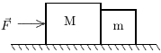

ans: A

68.Two blocks (A and B)are in contact on a horizontal frictionless surface.A 36-N constant force is applied to A as shown. The magnitude of the force of $A$ on B is

ans: D

69. A short 10-g string is used to pull a 50-g toy across a frictionless horizontal surface. If a $3.0\times10^{-2}$ -N force is applied horizontally to the free end, the force of the string on the toy, at the other end,is:

ans: C

### Chapter 6:FORCE AND MOTION-II

1.A brick slides on ahorizontal surface.Whichof the following willincrease the magnitude of the frictional force on it?

ans: A

2.The coefficient of kinetic friction

ans: E

3.When the brakes of an automobile are applied, the road exerts the greatest retarding force

ans: B

4.A forward horizontal force of $12N$ is used to pull a 240-N crate at constant velocity across a horizontal floor. The coefficient of friction is

ans: B

5.The speed of a 4.0-N hockey puck, sliding across a level ice surface,decreases at the rate of 0.61m/ $s^{2}$ .The coefficient of kinetic friction between the puck and ice isi

ans: A

### Chapter 6

6.A crate rests on a horizontal surface and a woman pulls on it witha 10-N force.No matter what the orientation of the force,the crate does not move.Rank the situations shown below according to the magnitude of the frictional force of the surface on the crate,least to greatest

ans: E

7.A crate with a weight of $50N$ rests on a horizontal surface.A person pulls horizontally on it with a force of $10N$ and it does not move. To start it moving, a second person pulls vertically upward on the crate.If the coefficient of static friction is O.4, what is the smallest vertical force for which the crate moves?

ans: D

8.A 40-N crate rests on a rough horizontal floor. A 12-N horizontal force is then applied to it. If the coefficients of friction are $\mu_{8}=0.5$ and $\mu_{k}=0.4$ ,the magnitude of the frictional force on the crate is

ans: B

9.A 24-N horizontal force is applied to a 40-N block initially at rest on a rough horizontal surface. If the coefficients of friction are $\mu_{8}=0.5$ and $\mu_{k}=0.4$ , the magnitude of the frictional force on the block is：

ans: C

10.A horizontal shove of at least $200N$ is required to start moving a 800-N crate initially at rest on a horizontalfloor.The coefficient of static friction is

ans: A

11. A force $\vec{F}$ (larger than the largest possible force of static friction） is applied to the left to an object moving to the right on a horizontal surface.Then

ans: C

12.A bureau rests on a rough horizontal surface ( $\mu_{8}=0.50$ ， $\mu_{k}=0.40$ ).A constant horizontal force, just sufficient to start the bureau in motion, is then applied. The acceleration of the bureau is

ans: B

13.A car is traveling at 15m/s on a horizontal road. The brakes are applied and the car skids to a stop in 4.0s.The coefficient of kinetic friction between the tires and road is

ans: A

14.A boy pulls a wooden box along a rough horizontal foor at constant speed by means of a force $\bar{P}$ as shown.In the diagram $f$ is the magnitude of the force of friction, $N$ is the magnitude of the normal force, and $F_{g}^{'}$ is the magnitude of the force of gravity. Which of the following must be true?

ans: A

15.A boy pulls a wooden box along a rough horizontal foor at constant speed by means of a force $\bar{P}$ as shown. In the diagram $f$ is the magnitude of the force of friction, $N$ is the magnitude of the normal force, and $F_{g}^{'}$ is the magnitude of the force of gravity. Which of the following must be true?

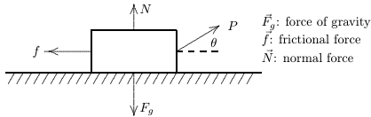

ans: C

16.A 400-N block is dragged along a horizontal surface by an applied force $\vec{F}$ as shown. The coef ficient of kinetic friction is $\mu_{k}=0.4$ :and the block moves at constant velocity. The magnitude of $\vec{F}$ is:

ans: B

17. A block of mass TIL is pulled at constant velocity along a rough horizontal floor by an appliec force $\bar{T}$ as shown. The magnitude of the frictional force is:

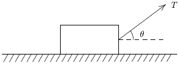

ans: A

18.A block of mass 711 is pulled along arough horizontal floor by an applied force $\bar{T}$ as shown The vertical component of the force exerted on the block by the floor is

ans: D

19.A 12-kg crate rests on a horizontal surface and a boy pulls on it with a force that is $30^{\circ}$ below thehorizontal.If the coefficient of static friction is 0.40,the minimum magnitude force he needs to start the crate moving is

ans: E

20.A crate resting on a roughhorizontalfloor is tobe moved horizontally.The coefficient of static friction is 0.40.To start the crate moving with the weakest possible applied force,in what direction should the force be applied

ans: C

21.A 50-N force is applied to a crate on a horizontal rough foor, causing it to move horizontally If the coefficient of kinetic friction is 0.50,in what direction should the force be applied to obtain the greatest acceleration?

ans: D

22. A professor holds an eraser against a vertical chalkboard by pushing horizontally on it. He pushes with a force that is much greater than is required to hold the eraser.The force of friction exerted by the board on the eraser increases if he

ans: D

23.A horizontal force of $12N$ pushes a 0.5-kg book against a vertical wall. The book is initially at rest. If the coefficients of friction are $\mu_{8}=0.6$ and $\mu_{k}=0.8$ which of the following is true?

ans: A

24.A horizontal force of 5.0N pushes a 0.50-kg book against a vertical wall. The book is initially at rest.If the coefficients of friction are $\mu_{8}=0.6$ and $\mu_{k}=0.80$ , the magnitude of the frictional force is:

ans: E

25. A horizontal force of 12N pushes a 0.50-kg book against a vertical wall. The book is initially at rest. If $\mu_{s}=0.6$ and $\mu_{k}=0.80$ ,the acceleration of the book in m/ $s^{2}$ is

ans: A

26.A horizontal force of 5.0N pushes a 0.50-kg block against a vertical wall. The block is initially at rest. If $\mu_{s}=0.60$ and $\mu_{k}=0.80$ , the acceleration of the block in m/ $s^{2}$ is:

ans: B

27.A heavy woodenblock is draggedby aforce $\vec{F}$ along a rough steel plate,as shown below for two possible situations. The magnitude of $\bar{F}$ is the same for the two situations. The magnitude of the frictional force in (i), as compared with that in (i) is:

ans: C

28. A block is first placed on its long side and then on its short side on the same inclined plane,as shown. The block slides down the plane on its short side but remains at rest on its long side A possible explanation is:

ans: A

29.A box rests on a rough board 10 meters long. When one end of the board is slowly raised to a height of 6 meters above the other end,the box begins to slide.The coefficient of static friction is:

ans: E

30.A block is placed on a rough wooden plane. It is found that when the plane is tilted $30^{\circ}$ to the horizontal, the block will slide down at constant speed. The coefficient of kinetic friction of the block with the plane is

ans: B

31.A crate is sliding down an incline that is $35^{0}$ above the horizontal. If the coefficient of kinetic friction is 0.40,the acceleration of the crate is

ans: B

32.A 5.0-kg crate is resting on a horizontal plank. The coefficient of static friction is 0.50 and the coefficient of kinetic friction is 0.40.After one end of the plank is raised so the plank makes an angle of $25^{\circ}$ with the horizontal, the force of friction is:

ans: C

33. A 5.0-kg crate is resting on a horizontal plank. The coefficient of static friction is 0.50 and the coefficient of kinetic friction is O.40.After one end of the plank is raised so the plank makes an angle of $30^{\circ}$ with the horizontal, the force of friction is:

ans: B

34.A 5.0-kg crate is on an incline that makes an angle of $30^{\circ}$ with the horizontal.If the coefficient of static friction is 0.50, the minimum force that can be applied parallel to the plane tohold the crate at rest is

ans: B

35. A 5.0-kg crate is on an incline that makes an angle of $30^{\circ}$ with the horizontal. If the coefficient of static friction is 0.5, the maximum force that can be applied parallel to the plane without moving the crate is:

ans: D

36.Block A,with mass $m_{A}$ ,is initially at rest on a horizontal floor. Block B, with mass $m_{B}$ ,is initially at rest on the horizontal top surface of A.The coefficient of staticfriction between the two blocks is $\mu_{8}$ .Block A is pulled with a horizontal force. It begins to slide out from under B if the force is greater than:

ans: E

37.The system shown remains at rest. Each block weighs 20 N. The force of friction on the uppel block is:

ans: B

38.Block A,with a mass of 50 kg ,rests on a horizontal table top. The coefficient of static friction is 0.40. A horizontal string is attached to A and passes over a massless,frictionless pulley as shown.The smallest mass $7mB$ of block B,attached to the dangling end,that will start A moving when it is attached to the other end of the string is:

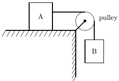

ans: A

39.Block A,with a mass of 10 kg ,rests on a $35^{0}$ incline.The coefficient of static friction is 0.40 An attached string is parallel to the incline and passes over a massless, frictionless pulley at the top. The largest mass TIlB of block B, attached to the dangling end, for which A begins to slide down the incline is:

ans: A

40.Block A,with a mass of 10 kg ,rests on a $35^{0}$ incline.The coefficient of static friction is 0.40 An attached string is parallel to the incline and passes over a massless,frictionless pulley at the top. The largest mass $THB$ ,attached to the dangling end,for which A remains at rest is:

ans: D

41.Block A, with a mass of $10\lg$ , rests on a $30^{\circ}$ incline. The coefficient of kinetic friction is 0.20 The attached string is parallel to the incline and passes over a massless, frictionless pulley at the top. Block B, with a mass of 8.0 kg ,is attached to the dangling end of the string. The acceleration of B is:

ans: B

42. Block A, with a mass of $10\lg$ , rests on a $30^{\circ}$ incline.The coefficient of kinetic friction is O.20 The attached string is parallel to the incline and passes over a massless,frictionless pulley at the top. Block B,with a mass of 3.0 kg ,is attached to the dangling end of the string. The acceleration of B is:

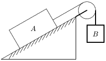

ans: A

43.A 1000-kg airplane moves in straight fight at constant speed. The force of air friction is 1800 N The net force on the plane is:

ans: A

44.Why do raindrops fallwith constant speed during thelater stages of their descent?

ans: B

45.A ball is thrown downward from the edge of a cliff with an initial speed that is three times the terminal speed. Initially its acceleration is

ans: A

46.A ball is thrown upward into the air with a speed that is greater than terminal speed.On the way up it slows down and, after its speed equals the terminal speed but before it gets to the top of its trajectory

ans: B

47.A ball is thrown upward into the air with a speed that is greater than terminal speed.It lands at the place where it was thrown.During its fight the force of air resistance is the greatest

ans: A

48.Uniform circular motion is the direct consequence of

ans: E

49. An object moving in a circle at constant speed

ans: D

50. An object of mass 7712 and another object of mass $2m$ are each forced to move along a circle of radius 1.0m at a constant speed of 1.0m/s .The magnitudes of their accelerations are

ans: A

51.The magnitude of the force required to cause a 0.04-kg object to move at 0.6m/s in a circle of radius 1.0m is

ans: B

52.A 0.2-kg stone is attached to a string and swung ina circle of radius 0.6m on a horizontal and frictionless surface.If the stone makes 150 revolutions per minute,the tension force of the string on the stone is:

ans: E

53. Which of the following five graphs is correct for a particle moving in a circle of radius 7 at8 constant speed of 10m/s

ans: E

54.An object moves arounda circle.If the radius is doubled keeping the speed the same then the magnitude ofthe centripetal force must be

ans: B

55. An object moves in a circle. If the mass is tripled, the speed halved, and the radius unchanged then themagnitude of the centripetal force must be multiplied by a factor of:

ans: B

56.If a satellite moves above Earth's atmosphere in a circular orbit with constant speed, then

ans: E

57.A 800-N passenger in a car presses against the car door with a 200N force when the car makes a left turn at 13m/s .The (faulty) door will pop open under a force of 800 N. Of the following, the least speed for which the passenger is thrown out of the car is:

ans: D

58.If a certain car, going with speed $v_{1}$ ,rounds a level curve with a radius $R_{1}$ ,it is just on the verge of skidding. If its speed is now doubled, the radius of the tightest curve on the same roac that it can round without skidding is:

ans: B

59.An automobile moves on alevelhorizontalroad in a circle ofradius 30m .The coefficient of friction between tires and road is 0.50.The maximum speed with which this car can rounc this curve is

ans: D

60.The driver of a 1000-kg car tries to turn through a circle of radius 100 m on an unbanked curve at a speed of 10 m/s.The actual frictional force between the tires and slippery road has a magnitude of 900 N. The car:

ans: E

61. A car rounds a 75-m radius curve at a constant speed of 18m/s .A ball is suspended by a string from the ceiling the car and moves with the car. The angle between the string and the vertical is:

ans: C

62.A giant wheel, having a diameter of $40m$ ,is fitted with a cage and platform on which a man of mass 7712 stands.The wheel is rotated in a verticalplane at such a speed that the force exerted by the man on the platform is equal to his weight when the cage is at X, as shown. The net force on the man at point $X$ is：

ans: D

63.A giant wheel, $40m$ in diameter,is fitted with a cage andplatform on which a man can stand The wheel rotates at such a speed that when the cage is at X (as shown) the force exerted by the man on the platform is equal to his weight.The speed of the man is:

ans: B

64.A person riding a Ferris wheel is strapped into her seat by a seat belt. The wheel is spun so that the centripetal acceleration is g. Select the correct combination of forces that act on her when she is at the top. In the table F, = force of gravity, down; F, = seat belt force, down; and Fg = seat force, up.

ans: B

65.One end of a 1.0-m long string is fixed, the other end is attached to a 2.0-kg stone. The stone swings in a vertical circle, passing the bottom point at 4.0m/s .The tension force of the string at this point is about:

ans: E

66.One end of a 1.0-m string is fixed,the other end is attached to a 2.0-kg stone.The stone swings in a vertical circle, passing the top point at 4.0m/s .The tension force of the string (in newtons)at this point is about:

ans: B

ans: C

68.The iron ball shown is being swung in a vertical circle at the end of a 0.7-m long string.How slowly can the ball go through its top position without having the string go slack?

ans: B

69.A block is suspended by a rope from the ceiling of a car.When the car rounds a 45-m radius horizontal curve at 22m/s (about 50mph ),what angle does the rope make with the vertical? A.0

ans: C

70. Circular freeway entrance and exit ramps are commonly banked to handle a car moving at 13m/s .To design a similar ramp for 26m/s one should：

ans: C

71.At what angle should the roadway on a curve with a 50m radius be banked to allow cars to negotiate the curve at 12m/s even if the roadway is icy (and the frictional force is zero)

ans: B

### Chapter 7:KINETIC ENERGY AND WORK

1.Which of the following is NOT a correct unit for work

ans: C

2.Which of the following groups does NOT contain a scalar quantity?

ans: B

3.A boy holds a 40-N weight at arm's length for 10 s .His arm is 1.5m above the ground.The work done by the force of the boy on the weight while he is holding it is

ans: A

4.A crate moves $10m$ to the right on a horizontal surface as a woman pulls on it with a 10-N force Rank the situations shown below according to the work done by her force,least to greatest.

ans: E

### Chapter 7

5.An object moves in a circle at constant speed. The work done by the centripetal force is zero because:

ans: E

6.An object of mass $1\lg$ is whirled in a horizontal circle of radius 0.5m at a constant speed of 2m/ s .The work done on the object during one revolution is

ans: A

7.The work done by gravity during the descent of a projectile：

ans: A

8.A baseball is hit high into the upper bleachers of left field. Over its entire fight the work done by gravity and the work done by air resistance, respectively, are

ans: D

9.A line drive to the shortstop is caught at the same height as it was originally hit.Over its entire flight the work done by gravity and the work done by air resistance, respectively, are:

ans: B

10.A 2-kg object is moving at 3m/s .A 4-N force is applied in the direction of motion and then removed after the object has traveled an additional 5m . The work done by this force is:

ans: D

11. A sledge (including load) weighs 5000N .It is pulled on level snow by a dog team exerting a horizontal force on it.The coefficient of kinetic friction between sledge and snow is 0.05.How much work is done by the dog team pulling the sledge 1000m at constant speed

ans: B

12. Camping equipment weighing 6000N is pulled across a frozen lake by means of a horizontal rope.The coefficient of kinetic friction is 0.o5.The work done by the campers in pulling the equipment 1000m at constant velocity is:

ans: C

13.Camping equipment weighing 6000N is pulled across a frozen lake by means of a horizontal rope. The coefficient of kinetic friction is 0.05.How much work is done by the campers in pulling the equipment $1000m$ if its speed is increasing at the constant rate of 0.20m/ $s^{2}?$

ans: D

14.A 1-kg block is lifted vertically $1m$ by a boy.The work done by theboy is about

ans: C

15.A 0.50-kg object moves in ahorizontal circular track with a radius of 2.5m .An external force of 3.0 $\mathbb{N}$ ,always tangent to the track, causes the object to speed up as it goes around. The work done by the external force as the mass makes one revolution is:

ans: B

16. A man pulls a 100-N crate up a frictionless $30^{\circ}$ slope 5 m high, as shown. Assuming that the crate moves at constant speed, the work done by the man is:

ans: E

17.A man pushes an 80-N crate a distance of 5.0m upward along a frictionless slope that makes an angle of $30^{\circ}$ with the horizontal. His force is parallel to the slope.If the speed of the crate decreases at a rate of 1.5m/ $s^{2}$ , then the work done by the man is:

ans: C

18. A man pushes an 80-N crate a distance of 5.0m upward along a frictionless slope that makes an angle of $30^{\circ}$ with the horizontal. The force he exerts is parallel to the slope.If the speed of the crate is constant,then the work done by the man is:

ans: D

19. An 80-N crate slides with constant speed a distance of 5.0m downward along a rough slope that makes an angle of $30^{\circ}$ with the horizontal. The work done by the force of gravity is:

ans: D

20. A man pulls a sled along a rough horizontal surface by applying a constant force $\vec{F}$ at an angle $\theta$ above the horizontal.In pulling the sled a horizontal distance $d$ ，the work done by the man is:

ans: B

21.A man wishes to pull a crate $15m$ across a rough floor by exerting a force of $100N$ .The coefficient of kinetic friction is 0.25.For the man to do the least work, the angle between the force and the horizontal should be:

ans: A

22.A particle moves 5m in thepositive $2L$ direction while being acted upon by a constant force $\vec{F}=(4$N$)\hat{\mathrm{i}}+(2$N$)\hat{\mathrm{j}}-(4$N)k .The work done on the particle by this force is

ans: A

23. A block is attached to the end of an ideal spring and moved from coordinate $L_{i}$ to coordinate $x_{f}$ . The relaxed position is at $x=0$ .The work done by spring is positive if:

ans: E

24.An ideal spring.with a pointer attached to its end,hangs next to a scale.With a 100-N weight attached, the pointer indicates “40" on the scale as shown. Using a 200-N weight instead results in “60" on the scale. Using an unknown weight X instead results in “30" on the scale. The weight of Xis

ans: E

25. Three identical ideal springs (X,Y,Z) are arranged as shown. When a 4.0-kg mass is hung on X, the mass descends 3.0cm .When a 6.0-kg mass is hung on Y, the mass descends:

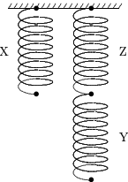

ans: E

26. When a certain rubber band is stretched a distance $3L$ , it exerts a restoring force of magnitude $F^{\prime}=Ax$ ,where $A$ is a constant. The work done by a person in stretching this rubber band from $x=0$ to $x=L$ ,beginning and ending at rest,is

ans: E

27. When a certain rubber band is stretched a distance $3L$ ,it exerts a restoring force of magnitude $F=ax+bx^{2}$ ,where $u.$ and $b$ are constants.Thework done in stretching this rubber band from $x=0$ to $x=L$ is:

ans: E

28.An ideal spring is hung vertically from the ceiling. When a 2.0-kg mass hangs at rest from it the spring is extended 6.0cm from its relaxed length. A downward external force is now appliec to the mass to extend the spring an additional 10cm .While the spring isbeing extended by the force, the work done by the spring is:

ans: A

29.An ideal spring is hung vertically from the ceiling. When a 2.0-kg block hangs at rest from it the spring is extended 6.0cm from its relaxed length. A upward external force is then applied to the block to move it upward a distance of 16cm .While the block is moving upward the work done by the spring is

ans: A

30.Which of the following bodies has the largest kinetic energy?

ans: C

31.Two trailers, X with mass 500 kg and Y with mass $2000kg$ , are being pulled at the same speed. The ratio of the kinetic energy of Y to that of X is:

ans: C

32. A 8000-N car is traveling at 12m/s along a horizontal road when the brakes are applied. The car skids to a stop in 4.0 s .How much kinetic energy does the car lose in this time?

ans: B

33.The velocity of a particle moving along the 22 axis changes from $v_{i}$ to $v_{f}$ .For which values of $U_{i}$ and ${\mathcal{U}}f$ is the total work done on the particle positive?

ans: E

34.An object is constrained by a cord to move in a circular path of radius 0.5m on a horizonta frictionless surface.The cord will break if its tension exceeds $16N$ .The maximum kinetic energy the object can have is:

ans: A

35.The weight of an object on the moon is one-sixth of its weight on Earth. The ratio of the kinetic energy of a body on Earth moving with speed $V$ to that of the same body moving with speed $V$ on the moon is:

ans: C

36.Which of the following is the correct combination of dimensions for energy?

ans: C

37. The amount of work required to stop a moving object is equal to

ans: B

38.A 5.0-kg cart is moving horizontally at 6.0m/s .In order to change its speed to 10.0m/s ,the net work done on the cart must be:

ans: C

39.A crate is initially at rest on a horizontalfrictionless table.A constant horizontal force $F$ is applied. Which of the following five graphs is a correct plot of work $W$ as a function of the crate's speed $\upsilon$

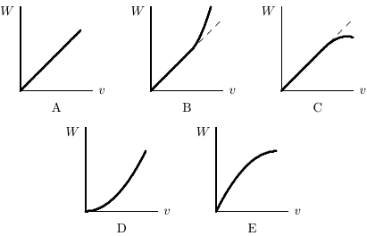

ans: D

40. An 8-N block slides down an incline. It has an initial speed of 7m/s .The work done by the resultant force on this block is:

ans: D

41. A 4-kg cart starts up an incline with a speed of 3m/s and comes to rest 2m up the incline The total work done on the car is:

ans: D

42.Two objects with masses of $71l1$ and $71l2$ have the same kinetic energy and are both moving tc the right.The same constant force $\vec{F}$ is applied to the left to both masses.If $m_{1}=4m_{2}$ ,the ratio of the stopping distance of $7m_{1}$ to that of $TIl_{2}$ is

ans: E

43. A Boston Red Sox baseball player catches a ball of mass 7772 that is moving toward him with speed $t$ .While bringing the ball to rest, his hand moves back a distance $d$ . Assuming constant deceleration,the horizontal force exerted on the ball by his hand is

ans: E

44.A 0.50-kg object moves on a horizontal circular track with a radius of 2.5m .An external force of 3.0 N , always tangent to the track, causes the object to speed up as it goes around. If it starts from rest its speed at the end of one revolution is:

ans: B

45.A 0.50-kg object moves on a horizontal frictionless circular track with a radius of 2.5m .An external force of 3.0 $\mathbb{N}$ ，always tangent to the track,causes the object to speed up as it goes around.If it starts from rest,then at the end of one revolution the radial component of the force of the track on it is:

ans: B

46. A 2-kg block is attached to a horizonal ideal spring with a spring constant of 200N/m .When the spring has its equilibrium length the block is given a speed of 5m/s .What is the maximum elongation of the spring？

ans: C

47.At time $t=0$ a particle starts moving along the $3L$ axis. If its kinetic energy increases uniformly with $t$ the net force acting on it must be:

ans: E

48.At time $t=0$ a 2-kg particle has a velocity of (4 m/ s) $\hat{ı }$- ( 3m/ s) $\:\hat{\mathbf{j} }$ .At $t=3$s its velocity is (2m/s)i+(3m/s)j .During this time the work done on it was

ans: C

49.A particle starts from rest at time $t=0$ and moves along the $U$ axis.If the net force on it is proportional to $t$ ,its kinetic energy is proportional to

ans: C

50. A 1.5-kg crate falls from a height of 2.0m onto an industrial spring scale with a spring constant of $1.5\times10^{5}$N/m .At its greatest compression the reading on the scale is

ans: E

51. A particle moving along the 22 axis is acted upon by a single force $F=F_0e^{-kx}$ ,where $F_{0}$ and $k$ are constants. The particle is released from rest at $x=0$ .It will attain a maximum kinetic energy of:

ans: A

52.The mechanical advantage of any machine is

ans: D

53. In raising an object to a given height by means of an inclined plane, as compared with raising the object vertically, there is a reduction in:

ans: D

54.Awatt is:

ans: C

55. Power has the dimensions of

ans: D

56.Which of the following five units represents a quantity that isNOT the same as the other four?

ans: C

57.Which of the following five quantities is NOT an expression for energy?Here 7112 is a mass $y$ is the acceleration due to gravity, $h$ and $d$ are distances, $F$ is a force, $7b$ is a speed, $u$ is an acceleration, $P$ is power,and $t$ is time

ans: D

58.A watt-second is a unit of:

ans: E

59.A watt per hour is a unit of

ans: E

60.A kilowatt-hour is a unit of

ans: C

61.A man moves the10-g object shown in averticalplane from position $X$ to position Y along a circular track ofradius $20m$ .The process takes $0.75\min$ .The work done by the man is about

ans: C

62.A woman lifts a barbell 2.0m in 5.0s.If she lifts it the same distance in 10s,the work done by her is:

ans: C

63. An escalator is used to move 20 people ( 60 kg each)per minute from the first foor of a de partment store to the second foor, $5m$ above. Neglecting friction, the power required is approximately:

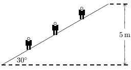

ans: C

64. A person holds an 80-N weight $2m$ above the foor for 30 seconds. The power required to do this is:

ans: E

65.A 50-N force is the only force on a 2-kg object that starts from rest. When the force has been acting for 2s the rate at which it is doing work is:

ans: D

66.A 50-N force is the only force a 2-kg crate that starts from rest.At the instant the object has gone $2m$ the rate at which the force is doing work is:

ans: E

67.Aparticle starts from rest and is acted onby a net force that does work at a rate that is proportional to the time $t$ .The speed of the particle is proportional to:

ans: A

### Chapter 8: POTENTIAL ENERGY AND CONSERVATION OF ENERGY

1.Only if a force on a particle is conservative

ans: A

2.A nonconservative force:

ans: E

3.The sum of the kinetic and potential energies of a system of objects is conserved：

ans: E

4.A force on a particle is conservative if

ans: D

5.Two particles interact by conservative forces.In addition,an external force acts on eacl particle. They complete round trips, ending at the points where they started.Which of the following must have the same values at the beginning and end of this trip?

ans: B

### Chapter 8

6.Two objects interact with each other and with no other objects. Initially object A has a speed of 5m/s and object B has a speed of 10m/s .In the course of their motion they return to their initial positions. Then A has a speed of 4 m/ s and B has a speed of 7m/s .We can conclude

ans: C

7.A good example of kinetic energy is provided by

ans: C

8.No kinetic energy is possessed by:

ans: D

9.The wound spring of a clock possessesi

ans: B

10. A body at rest in a system is capable of doing work if:

ans: D

11.Which one of the following five quantities CANNOT beused as a unit of potentialenergy

ans: B

12. Suppose that the fundamental dimensions are taken to be: force (F),velocity V) and time (T). The dimensions of potential energy are then:

ans: B

13. The graphs below show the magnitude of the force on a particle as the particle moves along the positive $2L$ axis from the origin to $x=x1$ .The force is parallel to the $U$ axis and is conservative The maximum magnitude $F_{1}$ has the same value for all graphs. Rank the situations according to the change in the potential energy associated with the force, least (or most negative) to greatest (or most positive).

ans: E

14.A golf ball is struck by a golf club and falls on a green three meters above the tee.The potential energy of the Earth-ball system is greatest：

ans: E

15.A ball is held at a height H above a foor.It is then released and falls to the floor.If ain resistance can be ignored, which of the five graphs below correctly gives the mechanical energy E of the Earth-ball system as a function of the altitude $y$ of the ball?

ans: E

16.A 6.0-kg block is released from rest $80m$ above the ground. When it has fallen $60m$ its kineti energy is approximately

ans: B

17.A 2-kg block is thrown upward from a point $20m$ above Earth's surface.At what height above Earth's surface will the gravitational potential energy of the Earth-block system have increased by 500 J?

ans: C

18.An elevator is rising at constant speed.Consider the following statements

ans: E

19. A projectile of mass 0.50 kg is fired with an initial speed of 10m/s at an angle of $60^{\circ}$ above the horizontal. The potential energy of the projectile-Earth system (relative potential energ) when the projectile is at ground level) is

ans: B

20.For a block of mass 7712 to slide without friction up the rise of height $h$ shown,it must have a minimum initial kinetic energy of

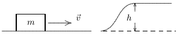

ans: B

21.A 2.2-kg block starts from rest on a rough inclinedplane that makes an angle of $25^{0}$ with the horizontal. The coefficient of kinetic friction is 0.25.As the block goes 2.0m down the plane the mechanical energy of theEarth-block system changes by:

ans: B

22. A simple pendulum consists of a 2.0-kg mass attached to a string. It is released from rest at X as shown. Its speed at the lowest point Y is about:

ans: D

23.The long pendulum shown is drawn aside until the ballhas risen 0.50m .Itisthen given ar initial speed of 3.0m/s .The speed of the ball at its lowest position is

ans: E

24.A particle movesalong the $3E$ axis under the influence of a stationary object.The net force on the particle is given by $F=(8\mathrm{~N/m}^{3})x^{3}$ .If the potential energy is taken to be zero for $x=0$ then the potential energy is given by

ans: B

25.A 0.20-kg particle moves along the $2L$ axis under the influence of a stationary object.The potential energy is given by

$$U(x)=(8.0\:\mathrm{J/m}^2)x^2+(2.0\:\mathrm{J/m}^4)x^4\:,$$

where $3L$ is in coordinate of the particle.If the particle has a speed of 5.0m/s when it is at $x=1.0$m ,its speed when it is at the origin is:

ans: E

26.Which of the five graphs correctly shows the potential energy of a spring as a function of its elongation 2

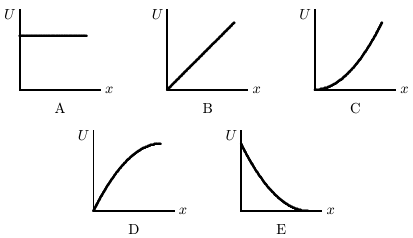

ans: C

27.A force of $10N$ holds an ideal spring with a 20-N/m spring constant in compression.The potential energy stored in the spring is:

ans: B

28.An ideal spring is used to fire a 15.0-g pellet horizontally. The spring has a spring constant of 20N/m and is initially compressed by 7.0cm .The kinetic energy of the pellet as it leaves the spring is:

ans: C

29.A 0.50-kg block attached to an ideal spring with a spring constant of 80N/m oscillates on a horizontal frictionless surface. The total mechanical energy is 0.12. .The greatest extensior of the spring from its equilibrium length is:

ans: D

30.A 0.50-kg block attached to an ideal spring with a spring constant of 80N/m oscillates on a horizontal frictionless surface. The total mechanical energy is. 0.12. .The greatest speed of the block is:

ans: D

31. A 0.50-kg block attached to an ideal spring with a spring constant of 80N/m oscillates on a horizontal frictionless surface. When the spring is. 4.0cm longer than its equilibrium length the speed of the block is 0.50m/s .The greatest speed of the block is:

ans: D

32.A 0.5-kg block slides along a horizontal frictionless surface at 2m/s .It is brought to rest by compressing a very long spring of spring constant 800N/m .The maximum spring compressior is:

ans: C

33.A block of mass 7772 is initially moving to the right on a horizontal frictionless surface at a speed $V$ .It then compresses a spring of spring constant $k$ .At the instant when the kinetic energy of the block is equal to the potential energy of the spring, the spring is compressed a distance of:

ans: A

34.A 700-N man jumps out of a window into a fire net 10m below. The net stretches $2m$ before bringing the man to rest and tossing him back into the air. The maximum potential energy of the net, compared to its unstretched potential energy, is:

ans: E

35. A toy cork gun contains a spring whose spring constant is 10.0N/m .The spring is compressed 5.00 cm and then used to propel a 6.00-g cork. The cork, however, sticks to the spring for 1.00cm beyond its unstretched length before separation occurs.The muzzle velocity of this cork is:

ans: C

36.A small object of mass 711 ,on the end ofa light cord.is heldhorizontally ata distance 7 from a fixed support as shown. The object is then released. What is the tension force of the cord when the object is at the lowest point of its swing?

ans: D

37.The string in the figure is 50cm long.When the ball is released from rest,it swings along the dotted arc. How fast is it going at the lowest point in its swing?

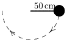

ans: C

38.A block is released from rest at point P and slides along the frictionless track shown.At point Q,its speed is:

ground level

ans: D

39.A small object of mass 7772 starts from rest at the position shown and slides along the frictionless loop-the-loop track of radius $k$ .What is the smallest value of $y$ such that the object will slide withoutlosing contact with the track?

ans: B

40.A small object slides along the frictionless loop-the-loop with a diameter of $3m$ .What minimum speed must it have at the top of the loop?

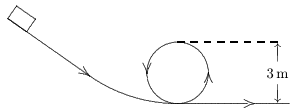

ans: B

41.A rectangular block is moving along a frictionless path when it encounters the circular loop as shown. The block passes points 1,2,3,4,1 before returning to the horizontal track. At poin 3:

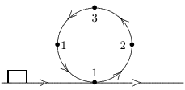

ans: D

42.A ball of mass 7712 ,at one end of a string of length $L$ rotates in a vertical circlejust fast enougl to prevent the string from going slack at the top of the circle. The speed of the ball at the bottom of the circle is:

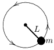

ans: D

43.A particle is released from rest at the point ${\mathcal{L}}={\mathcal{L}}$ andmoves along the $3L$ axis subject to the potential energy function $U(x)$ shown. The particle:

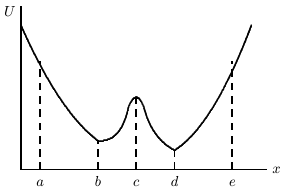

ans: B

44.The potentialenergy of a particle moving along the X axis is given by

$$U(x)=(8.0\:\mathrm{J/m}^2)x^2+(2.0\:\mathrm{J/m}^4)x^4\:.$$

If the totalmechanicalenergy is 9.0.1 ,the limits of motion are

ans: A

45.The potentialenergy of a 0.20-kg particle moving along the $U$ axis is given by

$$U(x)=(8.0\:\mathrm{J/m}^2)x^2+(2.0\:\mathrm{J/m}^4)x^4\:.$$

When the particle is at $x=1.0$m it is traveling in the positive $U$ direction with a speedof 5.0m/s .It next stops momentarily to turn around at $\hat{\boldsymbol{L}}=$

ans: C

46. Given a potential energy function $U(x)$ ,the corresponding force $\vec{F}$ is in the positive $U$ directior if:

ans: D

47.As a particle moves along the $iL$ axis it is actedupon by a conservative force.The potential energy is shown below as a function of the coordinate $3L$ of the particle.Rank the labeled regions according to the magnitude of the force,least to greatest

ans: D

48.The first graph shows the potential energy $U(x)$ for a particle moving on the $3L$ axis. Which of the other five graphs correctly gives the force $F$ exerted on the particle?

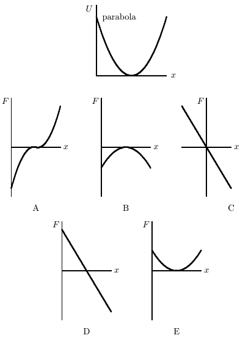

ans: D

49. The diagram shows a plot of the potential energy as a function of $3L$ for a particle moving along the $2L$ axis. The points of stable equilibrium are

ans: B

50.The diagram shows a plot of the potential energy as a function of $3L$ for a particle moving along the $2L$ axis. The points of unstable equilibrium are:

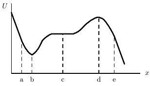

ans: D

51. The diagram shows a plot of the potential energy as a function of $3L$ for a particle moving along the $2L$ axis. Of the labeled points, the points of neutral equilibrium are:

ans: C

52.The potential energy of abody of mass 7712 is given by $U=-mgx+{\frac{1}{2}}kx^{2}$ . The corresponding force is:

ans: E

53.The potentialenergy ofa 0.20-kg particle moving along the $U$ axis is given by

$$U(x)=(8.0\:\mathrm{J/m}^2)x^2+(2.0\:\mathrm{J/m}^4)x^4\:.$$

When the particle is at $x=1.0$m the magnitude ofits acceleration is:

ans: D

54. The potential energy for the interaction between the two atoms in a diatomic molecule is $U$ = $A/ x^{12}- B/ x^{6}$ ，where $A$ and $B$ are constants and 22 is the interatomic distance.The magnitude of the force of one atom on the other is

ans: A

55.The thermal energy of a system consisting of a thrown ball, Earth, and the air is most closely associated with:

ans: D

56.Three identical blocks move either on a horizontal surface,up a plane,or down a plane,as shown below.They start with different speeds and continue to move until brought to rest by friction.They all move the same distance.Rank the three situations according to the initial speeds, least to greatest.

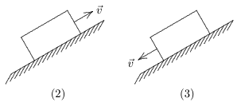

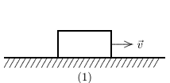

ans: D

57. Objects A and B interact with each other via both conservative and nonconservative forces Let $K_{A}$ and $K_{B}$ be the kinetic energies, $U$ be the potential energy,and $E_{\mathrm{int}}$ be the thermal energy.Ifno external agent does work on the objects then

ans: E

58.A block slides across a rough horizontal table top. The work done by friction changes

ans: E

59.A 25-g ball is released from rest 80m above the surface ofEarth.During the fall the tota internal energy of the ball and air increases by 15. .Just before it hits the surface its speed is

ans: A

60.A 5-kg projectile is fired over level ground with a velocity of 200m/s at an angle of $25^{0}$ above the horizontal. Just before it hits the ground its speed is 150m/s .Over the entire trip the change in the internal energy of the projectile and air is:

ans: C

61.A 0.75-kg block slides on a rough horizontal table top.Just before it hits a horizontal ideal spring its speed is 3.5m/s .It compresses the spring 5.7 cm before coming to rest. If the spring constant is 1200N/m , the internal energy of the block and the table top must have:

ans: C

### Chapter 9: CENTER OF MASS AND LINEAR MOMENTUM

1.Which one of thefollowing statements is true?

ans: E

2.The ${:}L$ and $y$ coordinates of the center of mass of the three-particle system shown below are

ans: C

3.The center ofmass of a uniform disk ofradius $k$ is located

ans: E

4.The center ofmass of the svstem consisting of Earth,the Sun.and the planet Mars is:

ans: B

### Chapter 9

5.The center of mass of Earth's atmosphere is

ans: D

6.A thick uniform wire is bent into the shape of the letter “U"as shown.Which point indicates the location of the center of mass of this wire?

ans: B

7.Amachinist starts with three identical square platesbut cuts one corner from one of them,two corners from the second, and three corners from the third.Rank the three plates according to the r coordinate of their centers of mass,from smallest to largest.

ans: E

8.Block A, with a mass of $4kg$ , is moving with a speed of 2.0m/s while block B, with a mass of $8kg$ , is moving in the opposite direction with a speed of 3 m/ s .The center of mass of the two block-system is moving with a velocity of:

ans: B

9.At the same instant that a 0.50-kg ball is dropped from $25m$ above Earth,a second ball, with a mass of 0.25 kg , is thrown straight upward from Earth's surface with an initial speed of 15m/s They move along nearby lines and pass each other without colliding.At the end of 2.0s the heightabove Earth's surface of the center ofmass of the two-ball svstem is

ans: D

10.At the same instant that a 0.50-kg ball is dropped from 25m above Earth,a second ball, with a massof 0.25 kg , is thrown straight upward from Earth's surface with an initial speed of 15m/s They move along nearby lines and pass without colliding. At the end of 2.0s the velocity of the center of mass of the two-ball system is:

ans: C

11.At the same instant that a 0.50-kg ball is dropped from 25m above Earth,a second ball, with a mass of $0.25\log$ ,is thrown straight upward from Earth’s surface with an initial speed of 15m/s They move along nearby lines and pass without colliding. At the end of 2.0 s the magnitude of the acceleration of the center of mass of the two-ball system is:

ans: D

12. A light rope passes over a light frictionless pulley attached to the ceiling. An object with a large mass is tied to one end and an object with a smaller mass is tied to the other end. Starting from rest the heavier object moves downward and the lighter object moves upward with the same magnitude acceleration. Which of the following statements is true for the system consisting of the two masses?

ans: E

13.Two 4.0-kg blocks are tied together with a compressed spring between them. They are thrown from the ground with an initialvelocity of 35m/s ， $45^{0}$ above the horizontal.At the highest point of the trajectory they become untied and spring apart.About how far below the highest point is the center of mass of the two-block system 2.0s later,before either fragment has hit the ground?

ans: B

14.The center of mass of a system of particles has a constant velocity if:

ans: B

15.The center of mass of a system of particles remains at the same place if:

ans: A

16.A man sits in the back of a canoe in still water.He then moves to the front of the canoe and sits there.Afterwards the canoe A. is forward of its original position and moving forward

ans: E

17. A 640-N hunter gets a rope around a 3200-N polar bear. They are stationary, $20m$ apart, on frictionless level ice. When the hunter pulls the polar bear to him, the polar bear will move

ans: B

18.Two boys, with masses of $40\lg$ and 60 kg , respectively, stand on a horizontal frictionless surface holding the ends of a light 10-m long rod.The boys pull themselves together along the rod When they meet the 60-kg boy willhave moved what distance?

ans: A

19.The center of mass of a system of particles obeys an equation similar to Newton's second law $\vec{F}=m\vec{a}_{\mathrm{com}}$ ,where:

ans: C

20. A large wedge with a mass of 10 kg rests on a horizontal frictionless surface, as shown. A block with a mass of 5.0 kg starts from rest and slides down the inclined surface of the wedge which is rough. At one instant the vertical component of the block's velocity is 3.0m/s and the horizontal component is 6.0m/s .At that instant the velocity of the wedge is

ans: B

21. A 2.0-kg block is attached to one end of a spring with a spring constant of 100 N/m and a 4.0-kg block is attached to the other end.The blocks are placed on a horizontal frictionless surface and set into motion.At one instant the 2.0-kg block is observed to be traveling to the right with a speed of 0.50m/s and the 4.0-kg block is observed to be traveling to the left with a speed of 0.30m/s .Since the only forces on the blocks are the force of gravity, the normal force of the surface, and the force of the spring, we conclude that

ans: D

22. A 2.0-kg mass is attached to one end of a spring with a spring constant of 100 N/m and a 4.0-kg mass is attached to the other end. The masses are placed on a horizontal frictionless surface and the spring is compressed 10cm .The spring is then released with the masses at rest and the masses oscillate. When the spring has its equilibrium length for the first time the 2.0-kg mass has a speed of 0.36m/s .The mechanical energy that has been lost to the instant is:

ans: B

23.Momentummay be expressed in

ans: C

24.The momentum of an object at a given instantisindependent of its:

ans: E

25.Two bodies,A and B,have equal kinetic energies.The mass of A is nine times that of B. The ratio ofthe momentum of Ato thatof Bis:

ans: D

26.Two objects,P and Q, have the same momentum. Q has more kinetic energy than P if it:

ans: B

27.A particle moves along the 22 axis.Its momentum is graphed below as a function of time.Rank the numbered regions according to the magnitude of the force acting on the particle, least to greatest.

ans: B

28.A 1.0-kg ball moving at 2.0m/s perpendicular to a wall rebounds from the wall at 1.5m/s The change in the momentum of the ball is:

ans: D

29. If the total momentum of a system is changing

ans: D

30.When you step on the accelerator to increase the speed ofyour car,the force that accelerates the car is:

ans: B

31.A 2.5-kg stone is released from rest and falls toward Earth.After 4.0s,the magnitude of its momentum is:

ans: A

32.A 64-kg woman stands on frictionless level ice with a 0.10-kg stone at her feet. She kicks the stone with her foot so that she acquires a velocity of 0.0017m/s sin the forward direction. The velocity acquired by the stone is

ans: B

33.A man is marooned at rest on level frictionless ice.In desperation.he hurls his shoe to the right at 15m/s .If the man weighs 720N and the shoe weighs 4.0 N, the man moves to the left with a speed of:

ans: C

34.Two spacemen are floating together with zero speed in a gravity-free region of space. The mass of spaceman A is 120 kg and that of spaceman B is 90 kg .Spaceman A pushes B away from him with B attaining a final speed of 0.5m/s . The final recoil speed of A is:

ans: B

35.A projectile in fight explodes into several fragments.The total momentum of the fragments immediately after this explosion

ans: A

36.A rifle of mass M is initially at rest but free to recoil. It fires a bullet of mass m and velocity v (relative to the ground).After firing,the velocity of the rifle (relative to the ground) is

ans: C

37.Bullets from two revolvers are fired with the same velocity.The bullet from gun#1 is twice as heavy as the bullet from gun $\#2$ .Gun #1 weighs three times as much as gun $\#2$ .The ratic of the momentum imparted to gun #1 to that imparted to gun $\#2$ is:

ans: C

38. A 5-kg object can move along the $3E$ axis. It is subjected to a force $\vec{F}$ in the positive $U$ direction a graph of $F^{\prime}$ as a function of time $t$ is shown below. Over the time the force is applied the change in the velocity of the object is

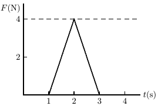

ans: A

39.Force:

ans: D

40. Cart A, with a mass of 0.20 kg , travels on a horizontal air track at 3.0m/s and hits cart B, which has a mass of 0.40 kg and is initially traveling away from A at 2.0m/s .After the collision the center of mass of the two cart system has a speed of

ans: B

41. A 500-kg sack of coal is dropped on a 2000-kg railroad fatcar which was initially moving at 3m/s as shown. After the sack rests on the flatcar, the speed of the flatcar is:

ans: D

42.A cart loaded with sand slides forward along a horizontalfrictionless track.As the cart moves sand trickles out at a constant rate through a hole in the back of the cart. The acceleration of the cart is:

ans: E

43.The thrust of a rocket is:

A.a gravitational force acting on the rocket B.the force of the exiting fuel gases on the rocket C.any force that is external to the rocket-fuel system D.a force that arises from the reduction in mass of the rocket-fuel system E.none of the above ans: B:

44. At one instant of time a rocket is traveling in outer space at 2500m/ s and is exhausting fuel at a rate of $100\log/$s . If the speed of the fuel as it leaves the rocket is 1500m/s ,relative to the rocket.the thrust is:

ans: C

45.A rocket exhausts fuel with a velocity of 1500m/ s ,relative to the rocket. It starts from rest in outer space with fuel comprising 80 per cent of the total mass. When all the fuel has been exhausted its speed is:

ans: B

46.A 1000-kg space probe is motionless in space.To start moving,its main engine is fired for 5s during which time it ejects exhaust gases at 5000m/s .At the end of this process it is moving at 20m/s .The approximate mass of the ejected gas is:

ans: B

47.The physical quantity “impulse” has the same dimensions as that of

ans: D

48.The law of conservation ofmomentum applies to a system of colliding objects only if

ans: D

49. Sphere X, of mass $2kg$ , is moving to the right at 10m/s .Sphere Y, of mass $4kg$ , is moving to the left at 10m/s .The two spheres collide head-on. The magnitude of the impulse of X on Y is: A. twice the magnitude of the impulse of Y on X

ans: E

50.Two bodies of unequal mass, placed at rest on a frictionless surface, are acted on by equa horizontal forces for equal times. Just after these forces are removed, the body of greater mass will have:

ans: E

51.A 0.2-kg rubber ball is dropped from the window of a building. It strikes the sidewalk below at 30m/s and rebounds up at 20m/s . The impulse on the ball during the collision is:

ans: A

52. A 10-kg block of ice is at rest on a frictionless horizontal surface. A 1.0-N force is applied in an easterly direction for 1.0 s .During this time interval, the block:

ans: C

53.A uniform narrow bar, resting on ice,is given a transverse horizontal impulse $\bar{J}$ at one end as shown. The center of mass of the bar COM will then:

ans: C

54.What magnitude impulse will give a 2.0-kg object a momentum change of magnitude + 50 kg m/s?

ans: C

55.A student's life was saved in an automobile accident because an airbag expanded in front of his head. If the car had not been equipped with an airbag, the windshield would have stopped the motion of his head in a much shorter time.Compared to the windshield,the airbag

ans: D

56. A ball hits a wall and rebounds with the same speed, as diagramed below. The changes in the components of the momentum of the ball are:

ans: C

57.A golf ball of mass 7772 is hit by a golf club so that the ball leaves the tee with speed $V$ .The club is in contact with the ball for time $I$ .The magnitude of the average force on the club on the ball during the time 7 is

ans: B

58.A 640-N acrobat falls 5.0m from rest into a net. The net tosses him back up with the same speed he had just before he hit the net. The magnitude of the average upward force exerted on him by the net during this collision is:

ans: E

59.Whenever an object strikes a stationary object of equal mass

ans: E

60.For a two-body collision involving objects with different masses, a frame of reference which has the same velocity relative to the laboratory as does the center of mass of the two objects is:

ans: D

61.An inelastic collision is one in which

ans: D

62.A 4.0-N puck is traveling at 3.0m/s .It strikes a 8.0-N puck, which is stationary. The two pucks stick together. Their common final speed is

ans: A

63.A 3.00-g bullet traveling horizontally at 400m/s hits a 3.00-kg wooden block, which is initially at rest on a smooth horizontal table.The bullet buries itself in the block without passing through. The speed of the block after the collision is:

ans: B

64. A 2-kg cart, traveling on a horizontal air track with a speed of 3 m/ s , collides with a stationary 4-kg cart. The carts stick together. The impulse exerted by one cart on the other has a magnitude of

ans: B

65.A 3-g bullet is fired horizontally into a 10-kg block of wood suspended by a rope from the ceiling. The block swings in an arc,rising 3mm above its lowest position. The velocity of the bullet was:

ans: B

66.A 3.0-kg and a 2.0-kg cart approach each other on a horizontal air track. They collide and stick together.After the collision their total kinetic energy is 40, .The speed of their center of mass is:

ans: C

67. Blocks A and B are moving toward each other. A has a mass of 2.0 kg and a velocity of 50m/s while B has a mass of 4.0 kg and a velocity of -25m/s .They suffer a completely inelastic collision.The kinetic energy lost during the collision is

ans: C

68.For a completely inelastic two-body collision the kinetic energy retained by the objects is the same as:

ans: C

69.A 75-kg man is riding in a 30-kg cart at 2.0m/s . He jumps off in such a way as to land on the ground with no horizontal velocity. The resulting change in speed of the cart is

ans: D

70. An elastic collision is one in which

ans: C

71.Object A strikes the stationary object B head-on in an elastic collision. The mass of A is fixed you may choose the mass of B appropriately.Then:

ans: E

72.Block A, with a mass of 2.0 kg , moves along the $2L$ axis with a velocity of 5.0m/s in the positive x direction. It suffers an elastic collision with block B, initially at rest, and the blocks leave the collision along the $3L$ axis.If B is much more massive than A, the speed of A after the collision is:

ans: C

73. A very massive object traveling at 10m/s strikes a very light object, initially at rest, and the light object moves off in the direction of travel of the heavy object.If the collision is elastic the speed of the lighter object is:

ans: D

74.Sphere A has mass 7772 and is moving with velocity $V$ .It makes a head-on elastic collision with a stationary sphere B of mass $2m$ .After the collision their speeds ( $v_{A}$ and $vB$ )are

ans: B

75. Blocks A and B are moving toward each other along the 22 axis. A has a mass of 2.0 kg and a velocity of 50m/s , while B has a mass of 4.0 kg and a velocity of -25m/s .They suffer an elastic collision and move off along the $3L$ axis.The kinetic energy transferred from A to B during the collision is:

ans: A

76.When a particle suffers a head-on elastic collision with another particle.initially at rest,the greatest fraction of kinetic energy is transferredif：

ans: E

77.Two objects,X and Y, are held at rest on a horizontal frictionless surface and a spring is compressed between them. The mass of $X$ is 2/5 times the mass of Y. Immediately after the spring is released, X has a kinetic energy of 50. and Y has a kinetic energy of

ans: D

78.Two carts (A and B), having spring bumpers, collide as shown. Cart A has a mass of $2kg$ and is initially moving to the right. Cart B has a mass of $3kg$ and is initially stationary.When the separation between the carts is a minimum:

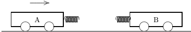

ans: E

79. Two identical carts travel at 1m/s in opposite directions on a common horizontal surface. They collide head-on and are reported to rebound, each with a speed of 2m/s .Then:

ans: B

80.A block moves at 5.0m/s in the positive $3L$ direction and hits an identical block, initially at rest.A small amount of gunpowder had been placed on one of the blocks. The explosion does not harm the blocks but it doubles their totalkinetic energy.After the explosion the blocks move along the $3E$ axis and the incident block has a speed in of:

ans: A

81.A stream of gas consists of n molecules. Each molecule has mass 7112 and speed $t$ .The stream is reflected elastically from a rigid surface as shown. The magnitude of the change in the total momentum ofthe stream is:

ans: B

### Chapter 10:ROTATION

1.A radian is about

ans: D

2.One revolution is the same as

ans: E

3.One revolution per minute is about:

ans: B

4.If a wheel turns with constant angular speed then

ans: C

5. If a wheel is turning at 3.0rad/s , the time it takes to complete one revolution is about:

ans: E

### Chapter 10

6.If wheel turning at a constant rate completes 100 revolutions in 10s its angular speed is

ans: E

7.The angular speed of the second hand of a watch is:

ans: C

8.The angular speed of the minute hand of a watch is

ans: D

9.A fywheel is initially rotating at 20 rad/s and has a constant angular acceleration. After 9.0 s it has rotated through 450rad .Its angular acceleration is

ans: D

10. Ten seconds after an electric fan is turned on, the fan rotates at 300rev/min Its average angular acceleration is:

ans: A

11.A wheel rotates with a constant angular acceleration of $\pi$rad/s$^2$ .During a certain time interval its angular displacement is $\pi$rad .At the end of the interval its angular velocity is $2\pi$ rad/s .Its angular velocity at the beginning of the interval is:

ans: D

12.A fywheel rotating at 12 rev/s is brought to rest in 6 s. The magnitude of the average angular acceleration in rad/s2 of the wheel during this process is:

ans: D

13. A phonograph turntable, initially rotating at 0.75 rev/s, slows down and stops in 30s. The magnitude of its average angular acceleration in rad/s² for this process is

ans: D

14.The angular velocity of a rotating wheel increases by $2\operatorname{rev/s}$ every minute.The angular accel eration inrad/ $\mathrm{s}^{\prime}$ of this wheel is:

ans: D

15. A wheel initially has an angular velocity of 18rad/s. It has a constant angular acceleration of 2.0 rad$/\mathrm{s}^2$ and is slowing at first. What time elapses before its angular velocity is 18rad/s in the direction opposite to its initial angular velocity?

ans: D

16. A wheel initially has an angular velocity of 36rad/s but after 6.0s its angular velocity is 24rad/s . If its angular acceleration is constant its value is:

ans: B

17. A wheel initially has an angular velocity of -36rad/s but after 6.0 s its angular velocity is $-24\operatorname{rad}/$s .If its angular acceleration is constant the value is:

ans: A

18.A wheel initially has an angular velocity of 18rad/s but it is slowing at a rate of $2.0\operatorname{rad/s}^{2}$ By the time it stops it will have turned through

ans: A

19. A wheel starts from rest and has an angular acceleration of 4.0 rad/s$^2$ .When it has made 10 rev its angular velocity is

ans: B

20. A wheel starts from rest and has an angular acceleration of $4.0\operatorname{rad/s^{2}}$ .The time it takes to make 10 rev is:

ans: E

21. A wheel starts from rest and has an angular acceleration that is given by $\alpha(t)=(6\operatorname{rad}/\mathrm{s}^{4})t^{2}$ The angle through which it turns in time $t$ is given by:

ans: C

22. A wheel starts from rest and has an angular acceleration that is given by $\alpha(t)=(6.0\operatorname{rad}/\mathrm{s}^4)t^2$ The time it takes to make 10rev is:

ans: B

23.A wheel starts from rest and has an angular acceleration that is given by $\alpha(t)=(6.0\operatorname{rad}/\mathrm{s}^4)t^2$ After it has turned through 10 rev its angular velocity is

ans: B

24.A wheel is spinning at 27 rad/s but is slowing with an angular acceleration that has a magnitude given by $(3.0\operatorname{rad/s}^{4})t^{2}$ . It stops in a time of:

ans: C

25.If the angular velocity vector of a spinning body points out of the page then, when viewed from above the page, the body is spinning

ans: B

26.The angular velocity vector of a spinningbody points out of the page.If the angular acceleration vector points into the page then

ans: A

27. A child, riding on a large merry-go-round, travels a distance of 3000m in a circle of diameter 40m The total angle through which she revolves is:

ans: C

28. The figure shows a cylinder of radius $0.7m$ rotating about its axis at 10 rad/s .The speed of the point P is

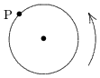

ans: A

29.The fan shown has been turned on and is now slowing as it rotates clockwise. The direction of the acceleration of the point X on the fan tip could be:

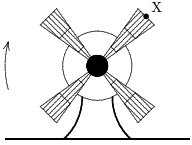

ans: D

30.A wheel of diameter 3.0 cm has a 4.0-m cord wrapped around its periphery. Starting from rest, the wheel is given a constant angular acceleration of 2.0 rad/s$^2$ .The cord will unwind in

ans: D

31.A particle moves in a circular path of radius 0.10m with a constant angular speed of 5rev/s The acceleration of the particle is: A. $0. 10\pi$m/ $s^{2}$

ans: E

32.A car travels north at constant velocity.It goes over a piece of mud,which sticks to the tire The initial acceleration of the mud, as it leaves the ground, is:

ans: A

33. Wrapping paper is being from a 5.0-cm radius tube, free to rotate on its axis. If it is pulled at the constant rate of 10cm/s and does not slip on the tube, the angular velocity of the tube is:

ans: A

34.String is wrapped around the periphery ofa5.0-cm radius cylinder,free to rotate on its axis The string is pulled straight out at a constant rate of 10 cm/s and does not slip on the cylinder As each small segment of string leaves the cylinder, its acceleration changes by:

ans: E

35.A fywheel of diameter $1.2m$ has a constant angular acceleration of 5.0rad$/ s^2$ The tangentia acceleration of a point on its rim is:

ans: B

36.For a wheel spinning with constant angular acceleration on an axis through its center, the ratio of the speed of a point on the rim to the speed of a point halfway between the center and the rim is:

ans: B

37.For a wheel spinning on an axis through its center, the ratio of the tangential acceleration of a point on the rim to the tangential acceleration of a point halfway between the center and the rim is:

ans: B

38.For a wheel spinning on an axis through its center, the ratio of the radial acceleration of a point on the rim to the radial acceleration of a point halfway between the center and the rim is:

ans: B

39.Two wheels are identical but wheel B is spinning with twice the angular speed of wheel A. The ratio of the magnitude of the radial acceleration of a point on the rim of B to the magnitude of the radial acceleration of a point on the rim of A is:

ans: D

40. A wheel starts from rest and spins with a constant angular acceleration. As time goes on the acceleration vector for a point on the rim:

ans: D

41. The magnitude of the acceleration of a point on a spinning wheel is increased by a factor of 4 if:

ans: E

42.Three identical balls are tied by light strings to the same rod and rotate around it,as shown below. Rank the balls according to their rotational inertia, least to greatest

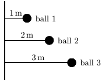

ans: A

43.Four identical particles, each with mass $771L$ ,are arranged in the $iE,y$ plane as shown.They are connected by light sticks to form a rigid body. If $m= 2. 0$ kg and $a=1.0$m ，the rotational inertia of this array about the $y$ axis is:

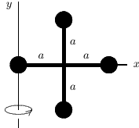

ans: B

44.Three identical balls.with masses of $M$ ， $2M$ ,and $3M$ .are fastened to a massless rod of lengtl $L$ as shown.The rotationalinertia about theleft endof therod is

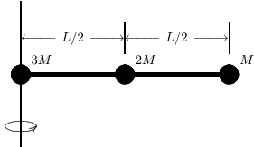

ans: E

45.The rotational inertia of a thin cylindrical shell of mass $M$ ,radius $k$ ,and length $L$ about its central axis (X-X') is

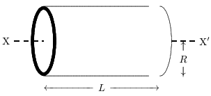

ans: D

46.The rotational inertia of a wheel about its axle does not depend upon its:

ans: D

47.Consider four objects,each having the same mass and the same radius:

1.a solid sphere 2.a hollow sphere 3.a flat disk in the ${\mathcal{L}},y$ plane 4.a hoop in the $x,y$ plane

The order of increasing rotational inertia about an axis through the center of mass and parallel tothe $z$ axisis:

ans: C

48. A and B are two solid cylinders made of aluminum. Their dimensions are shown. The ratio of the rotational inertia of $B$ to thatof Aabout the common axis $X-X^{\prime}$ is

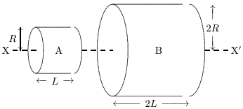

量ans:E

49.Two uniform circular disks having the same mass and the same thickness are made from different materials. The disk with the smaller rotational inertia is:.

ans: A

50.A uniform solid cylinder made of lead has the same mass and the same length as a uniform solid cylinder made of wood.The rotational inertia of the lead cylinder compared to the wooden one is:

ans: B

51. To increase the rotational inertia of a solid disk about its axis without changing its mass:

ans: B

52.The rotational inertia of a disk about its axis is 0.70 kg$\cdot \mathrm{m} ^{2}$ .When a 2.0-kg weight is added to its rim, 0.40m from the axis,the rotational inertia becomes

ans: E

53.When a thin uniform stick of mass $M$ and length $L$ is pivoted about its midpoint,its rotationa inertia is $ML^{2}/12$ .When pivoted about a parallel axis through one end, its rotational inertia is:

ans: C

54.The rotational inertia of a solid uniform sphere about a diameter is $(2/5)MR^{2}$ ,where $M$ is its mass and $R.$ is its radius. If the sphere is pivoted about an axis that is tangent to its surface its rotational inertia is:

ans: E

55.A solid uniform sphere of radius $R$ and mass $M$ has a rotational inertia about a diamete that is given by $(2/5)MR^{2}$ .A light string of length $3k$ is attached to the surface and used to suspend the sphere from the ceiling.Its rotationalinertia about the point of attachment at the ceiling is: A. $(2/5)MR^{2}$

ans: E

56.A force with a given magnitude is to be applied to a wheel. The torque can be maximized by:

ans: D

57.The meter stick shown below rotates about an axis through the point marked $\textbf{0}$ ， 20cm from one end. Five forces act on the stick: one at each end, one at the pivot point, and two 40cm from one end, as shown. The magnitudes of the forces are all the same. Rank the forces according to the magnitudes of the torques they produce about the pivot point,least to greatest

ans: E

58.A rod is pivoted about its center.A 5-Nforce is applied $4m$ from the pivot and another 5-N force is applied $2m$ from the pivot,as shown.The magnitude of the total torque about the pivot (in N·m) is:

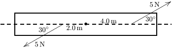

ans: D

59. $\tau=I\alpha$ for an object rotating about a fixed axis,where 7 is the net torque acting on it, $I$ is its rotational inertia, and $\boldsymbol{U}$ is its angular acceleration. This expression:

ans: D

60.A meter stick on a horizontal frictionless table top is pivoted at the 80-cm mark.It is initially at rest. A horizontal force $\vec{F}_{1}$ is applied perpendicularly to the end of the stick at 0cm ,as shown.A second horizontal force $\vec{F}_{2}$ (not shown)is applied at the 100-cm end of the stick.If the stick does not rotate:

ans: A

61.A uniform disk,a thin hoop,anda uniform sphere,all with the same mass and same outer radius,are each free to rotate about a fixed axis through its center.Assume the hoop is connected to the rotation axis by light spokes.With the objects starting from rest,identical forces are simultaneously applied to the rims, as shown. Rank the objects according to their angular accelerations, least to greatest

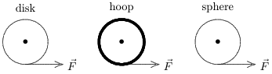

ans: D

62.A disk is free to rotate on a fixed axis.A force of given magnitude $F$ ,in the plane of the disk is to be applied.Of the following alternatives the greatest angular acceleration is obtained if the force is:

ans: B

63. A cylinder is 0.10m in radius and 0.20m in length. Its rotational inertia, about the cylinde axis on which it is mounted, is 0.020 kg$\cdot \mathrm{m} ^{2}$ .A string is wound around the cylinder and pulled with a force of 1.0N .The angular acceleration of the cylinder is:

ans: B

64.A disk with a rotational inertia of $2.0\lg\cdot\mathrm{m}^{2}$ and a radius of 0.40m rotates on a frictionless fixed axis perpendicular to the disk faces and through its center.A force of 5.0N is applie tangentially to the rim.The angular acceleration of the disk is

ans: C

65.A disk with a rotational inertia of $5.0\lg\cdot\mathrm{m}^{2}$ and a radius of 0.25m rotates on a frictionless fixed axis perpendicular to the disk and through its center. A force of 8.0 $\mathbb{N}$ is applied along the rotation axis.The angular acceleration of the disk is:

ans: A

66.A disk with a rotational inertia of 5.0 kg$\cdot m^2$ and a radius of 0.25 m rotates on a frictionless fixed axis perpendicular to the disk and through its center. A force of 8.0 $N$ is applied tangentially to the rim.If the disk starts at rest, then after it has turned through half a revolution its angular velocity is:

ans: D

67.A thin circular hoop of mass 1.0 kg and radius 2.0m isrotating about an axis through its center and perpendicular to its plane. It is slowing down at the rate of 7.0 rad$/\mathrm{s}^2$ .The net torque acting on it is:

ans: C

68.A certain wheel has a rotational inertia of $12\lg \cdot m^2$ .As it turns through 5.0rev its angular velocity increases from 5.0rad/s to 6.0rad/s . If the net torque is constant its value iss

ans: D

69.A 16-kgblock is attached to a cordthat is wrapped around the rim of a fvwheel of diametel 0.40m and hangs vertically, as shown. The rotational inertia of the fywheel is 0.50kg$\cdot\mathrm{m}^{2}$ When theblock is released and the cord unwinds,the acceleration of theblock is:

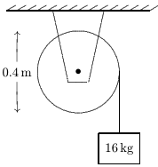

ans: B

70.A 8.0-cm radius disk with a rotational inertia of 0.12kg$\cdot m^2$ is free to rotate on a horizontal axis. A string is fastened to the surface of the disk and a 10-kg mass hangs from the other end The mass is raised by using a crank to apply a 9.0-N-m torque to the disk. The acceleration of the mass is:

ans: A

71.A 0.70-kg disk with a rotational inertia given by $MR^{2}/2$ is free to rotate on a fixed horizontal axis suspended from the ceiling. A string is wrapped around the disk and a 2.0-kg mass hangs from the free end. If the string does not slip, then as the mass falls and the cylinder rotates. the suspension holding the cylinder pulls up on the cylinder with a force of: A.6.9N

ans: B

72. A small disk of radius $R_{1}$ is mounted coaxially with a larger disk of radius $R_{2}$ .The disks are securely fastened to each other and the combination is free to rotate on a fixed axle that is perpendicular to a horizontal frictionless table top, as shown in the overhead view below The rotational inertia of the combination is $I.$ A string is wrapped around the larger disk and attached to a block of mass 711 ,on the table. Another string is wrapped around the smaller disk and is pulled with a force $\bar{F}$ as shown.The acceleration of the block is

ans: C

73.A small disk of radius $R_{1}$ is fastened coaxially to a larger disk of radius $R_{2}$ . The combinatior is free to rotate on a fixed axle,which is perpendicular to a horizontal frictionless table top. as shown in the overhead view below.The rotational inertia of the combination is $I$ .A string is wrapped around the larger disk and attached to a block of mass 711 ,on the table.Another string is wrapped around the smaller disk and is pulled with a force $\vec{F}$ as shown.The tension in the string pulling the block is:

ans: C

74.A block is attached to each end of a rope that passes over a pulley suspended from the ceiling The blocks do not have the same mass. If the rope does not slip on the pulley, then at any instant after the blocks start moving, the rope:

ans: A

75.A pulley with a radius of 3.0cm and a rotational inertia of $4.5\times10^{-3}$kg$\cdot\mathrm{m}^2$ is suspended from the ceiling. A rope passes over it with a 2.0-kg block attached to one end and a 4.0-kg block attached to the other. The rope does not slip on the pulley. When the speed of the heavier blockis 2.0m/s the kinetic energy of the pulley is:

ans: D

76. A pulley with a radius of 3.0cm and a rotational inertia of $4.5\times10^{-3}$kg$\cdot\mathrm{m}^2$ is suspended from the ceiling. A rope passes over it with a 2.0-kg block attached to one end and a 4.0-kg block attached to the other.The rope does not slip on the pulley.At any instant after the blocks start moving,the object with the greatest kinetic energy is:

ans: C

77.A disk with a rotational inertia of 5.0kg$\cdot\mathrm{m}^{2}$ and a radius of 0.25m rotates on a fixed axis perpendicular to the disk and through its center. A force of 2.0 $\mathbb{N}$ is applied tangentially to the rim.As the disk turns through half a revolution the work done by the force is:

ans: A

78.A circular saw is powered by a motor.When the saw is used to cut wood,the wood exerts a torque of 0.80 N . m on the saw blade. If the blade rotates with a constant angular velocity of 20rad/s the work done on the blade by the motor in $1.0\min$ is

ans: C

79.A disk has a rotational inertia of 6.0kg$\cdot m^2$ and a constant angular acceleration of 2.0 rad/s$^2$ If it starts from rest the work done during the first 5.0s by the net torque acting on it is

ans: D

80.A disk starts from rest androtates around a fixed axis,subject to a constant net torque.The as the work done during the first 5s. work done by the torque during the second 5s is ,

ans: D

81. A disk starts from rest and rotates about a fixed axis, subject to a constant net torque. The as the work done during the work done by the torque during the second revolution is first revolution.

ans: A

### Chapter 11: ROLLING,TORQUE,AND ANGULAR MOMENTUM

1.A wheel rolls without sliding along a horizontal road as shown.The velocity of the center of the wheel is represented by 一.Point P is painted on the rim of the wheel. The instantaneous velocity of point P is:

ans: E

2.A wheel of radius 0.5m rolls without sliding on a horizontal surface as shown.Starting from rest, the wheel moves with constant angular acceleration 6rad/ $s^{2}$ .The distance traveled by the center of the wheel from $t=0$ to $t=3$s is

ans: C

3.Two wheels roll side-by-side without sliding, at the same speed. The radius of wheel 2 is twice the radius of wheel 1. The angular velocity of wheel 2 is:

ans: C

### Chapter 11

4.Aforward force on the axle accelerates a rolling wheel on a horizontalsurface.If the wheel does not slide the frictionalforce ofthe surface on the wheelis

ans: D

5.When the speed of a rear-drive car is increasing on a horizontal road the direction of the frictional force on the tires is:

ans: D

6.A solid wheel with mass $M$ ,radius $k$ and rotational inertia $MR^{2}/2$ ,rolls without sliding on a horizontal surface. A horizontal force $F$ is applied to the axle and the center of mass has an acceleration $d$ .The magnitudes of the applied force $F^{\prime}$ and thefrictional force $f$ of the surface respectively, are:

ans: E

7.The coefficient of static friction between a certain cylinder and a horizontal foor is 0.40.If the rotational inertia of the cylinder about its symmetry axis is given by $I=(1/2)MR^{2}$ ,then the magnitude of the maximum acceleration the cylinder can have without sliding is

ans: D

8.A thin-walled hollow tube rolls without sliding along the foor.The ratio of its translational kinetic energy to its rotational kinetic energy (about an axis through its center of mass) is:

ans: A

9.A sphere and a cylinder of equal mass and radius are simultaneously released from rest on the same inclined plane and roll without sliding down the incline. Then

ans: E

10.A hoop, a uniform disk, and a uniform sphere, all with the same mass and outer radius, start with the same speed and roll without sliding up identical inclines.Rank the objects according to how high they go, least to greatest A.hoop, disk, sphere

ans: A

11.A hoop rolls with constant velocity and without sliding along levelground.Its rotationa kinetic energy is:

ans: B

12.Two identical disks, with rotational inertia. $I$ $={\frac{1}{2}}MR^{2}$ ),roll without sliding across a horizontal foor with the same speed and then up inclines.Disk A rolls up its incline without sliding. On the other hand, disk B rolls up a frictionless incline. Otherwise the inclines are identical. Disk A reaches a height 12cm above the floor before rolling down again.Disk B reaches a height above the floor of:

ans: D

13.A yo-yo, arranged as shown, rests on a frictionless surface. When a force $\vec{F}$ is applied to the string as shown, the yo-yo:

ans: B

14. When we apply the energy conservation principle to a cylinder rolling down an incline without sliding,we exclude the work done by friction because

ans: D

15. Two uniform cylinders have different masses and different rotational inertias. They simultane ously start from rest at the top of an inclinedplane androll without sliding down the plane The cylinder that gets to the bottom first is: A. the one with the larger mass

ans: E

16.A 5.0-kg ball rolls without sliding from rest down an inclined plane.A 4.0-kg block,mounted on roller bearings totaling $100g$ , rolls from rest down the same plane. At the bottom, the block has:

ans: A

17. A cylinder of radius $R=6.0$cm is on a rough horizontal surface.The coefficient ofkinetic friction between the cylinder and the surface is 0.30 and the rotational inertia for rotation about the axis is given by $MR^{2}/2$ ，where $M$ is its mass.Initially it is not rotating but its center of mass has a speed of 7.0m/s .After 2.0s the speed of its center of mass and its angulal velocity about its center of mass, respectively, are:

ans: D

18. The fundamental dimensions of angular momentum are:

ans: E

19.Possible units of angular momentum are

ans: D

20. The unit kg$\cdot m^{2}$/ s can be used for:

ans: A

21.The newton·second is a unit of:

ans: D

22. A 2.0-kg block travels around a 0.50-m radius circle with an angular velocity of $12\operatorname{rad/s}$ .The magnitude of its angular momentum about the center of the circle is:

ans: A

23.The angular momentum vector of Earth about its rotation axis,due to its daily rotation,is directed:

ans: C

24. A 6.0-kg particle moves to the right at 4.0m/s as shown. The magnitude of its angular mo mentum about the point O is:

ans: C

25.Two objects are moving in the $x,y$ plane as shown.The magnitude of their total angulal momentum (about the origin O) is:

ans: D

26.A 2.0-kg block starts from rest on the positive $U$ axis 3.0 m from the origin and thereafter has an acceleration given by $\vec{a} = ( 4. 0$ $\mathrm{m/ s}^{2})$ $\hat{ı }$- ( 3. 0m/ $s^{2}$) $\:\hat{j}$ .At the end of 2.0 s its angular momentum about the origin is:

ans: B

27.A 15-g paper clip is attached to the rim of a phonograph record with a radius of 30cm , spinning at 3.5rad/s .The magnitude of its angular momentum is:

ans: B

28. As a 2.0-kg block travels around a 0.50-m radius circle it has an angular speed of 12rad/s The circle is parallel to the $xy$ plane and is centered on the Z axis, 0.75m from the origin.The magnitude ofits angular momentum around the origin is:

ans: C

29.As a 2.0-kg block travels around a 0.50-m radius circle it has an angular speed of 12rad/s. The circle is parallel to the $xy$ plane and is centered on the Z axis, a distance of 0.75m from the origin. The $z$ component of the angular momentum around the origin is

ans: A

30. As a 2.0-kg block travels around a 0.50-m radius circle it has an angular speed of $12\operatorname{rad/s}$ The circle is parallel to the $xy$ plane and is centered on the Z axis, 0.75 m from the origin.The component in the $xy$ plane of the angular momentum around the origin has a magnitude of

ans: C

31.A uniform disk has radius $R$ and mass $M$ When it is spinning with angular velocity $u$ about an axis through its center and perpendicular to its face its angular momentum is $Iw$ .When it is spinning with the same angular velocity about a parallel axis a distance $h$ away its angular momentum is:

ans: B

32. A pulley with radius $R$ and rotational inertia $I$ is free to rotate on a horizontal fixed axis through its center. A string passes over the pulley. A block of mass $7ml1$ is attached to one end and a block of mass $71l2$ is attached to the other. At one time the block with mass $7m_{1}$ is moving downward with speed $t$ .If the string does not slip on the pulley, the magnitude of the total angular momentum,about the pulley center, of the blocks and pulley, considered as a system. is given by:

ans: B

33.A single force acts onaparticle situated on the positive $3L$ ：axis.The torque about the origin is in the negative Z direction.The force might be

ans: B

34. A rod rests on frictionless ice. Forces that are equal in magnitude and opposite in directior are then simultaneously applied to its ends as shown. The quantity that vanishes is its

ans: C

35. A 2.0-kg stone is tied to a 0.50-m long string and swung around a circle at a constant angular velocity of 12rad/s.The net torque on the stone about the center of the circle is

ans: A

36.A 2.0-kg stone is tied toa 0.50-mlong string and swung around a circle at a constant angulai velocity of 12rad/s .The circle is parallel to the $xy$ plane and is centered on the Z axis, 0.75m from the origin.Themagnitudeof the torque about the origin is:

ans: E

37.A2.0-kg block starts from rest on the positive $3L$ axis 3.0m from the origin andthereafter has an acceleration given by $\vec{a}=(4.0\mathrm{~m/s}^{2})\hat{\mathrm{~i}}-(3.0\mathrm{~m/s}^{2})\hat{\mathrm{~j}}$ .The torque, relative to the origin, acting on it at the end of 2.0s is:

ans: B

38.A uniform disk,a thin hoop,anda uniform sphere,all with the same mass and same outer radius,are each free to rotate about a fixed axis through its center.Assume the hoop is connected to the rotation axis by light spokes.With the objects starting from rest,identical forces are simultaneously applied to the rims,as shown.Rank the objects according to their angular momenta after a given time $t$ ,least to greatest

ans: A

39.A single force acts on a particle P.Rank each of the orientations of the force shown below according to the magnitude of the time rate of change of the particle's angular momentun about the point O, least to greatest.

ans: C

40.A pulley with radius $R$ is free to rotate on a horizontal fixed axis through its center.A string passes over the pulley. Mass $7m_{1}$ is attached to one end and mass $7m_{2}$ is attached to the other The portion of the string attached to $7ml1$ has tension $T_{1}$ and the portion attached to $771l2$ has tension $T_{2}$ .The magnitude of the total external torque,about the pulley center, acting on the masses and pulley, considered as a system,is given by:

ans: A

41. An ice skater with rotational inertia $I_{0}$ is spinning with angular speed $w_{0}$ .She pulls her arms in, thereby increasing her angular speed to $4\omega_{0}$ .Her rotational inertia is then

ans: D

42.A man,with his arms at his sides,is spinning on a light frictionless turntable.When he extends his arms:

ans: E

43.A man,holding a weight in each hand,stands at the center of a horizontal frictionless rotating turntable.The effect of the weights is to double the rotational inertia of the system.As he is rotating, the man opens his hands and drops the two weights. They fall outside the turntable. Then:

ans: B

44.A uniform sphere of radius $k$ rotates about a diameter with an angular momentum of magnitude L. Under the action of internal forces the sphere collapses to a uniform sphere of radius $R/2$ The magnitude ofits new angular momentum is:

ans: C

45. When a man on a frictionless rotating stool extends his arms horizontally. his rotational kinetic energy:

ans: B

46.When a woman on a frictionless rotating turntable extendsher arms out horizontally,her angular momentum:

ans: C

47.Two disks are mounted on low-friction bearings on a common shaft. The first disc has rotationa inertia $I$ and is spinning with angular velocity $UU$ .The second disc has rotational inertia $2I$ and is spinning in the same direction as the first disc with angular velocity $2\omega$ as shown.The two disks are slowly forced towardeach other along the shaft until they couple andhave afinal common angular velocity of:

ans: A

48. A wheel with rotational inertia $I$ mounted on a vertical shaft with negligible rotational inertia. is rotating with angular speed $w0$ . A nonrotating wheel with rotational inertia $2I$ is suddenly dropped onto the same shaft as shown.The resultant combination of the two wheels and shaf willrotate at:

ans: C

49.Aphonograph record is dropped onto a freely spinning turntable.Then:

ans: D

50.A playground merry-go-round has a radius $R$ and a rotational inertia $I$ .When the merry-go round is at rest, a child with mass 711 runs with speed $t$ along aline tangent to the rim and jumps on.The angular velocity of the merry-go-round is then:

ans: E

51.A playground merry-go-round has a radius of 3.0m and a rotationalinertia of 600 kg$\cdot \mathrm{m} ^{2}$ .It is initially spinning at 0.80rad/s when a 20-kg child crawls from the center to the rim.When the child reaches the rim the angular velocity of the merry-go-round is: A.0.62rad/s

ans: A

52.Two pendulum bobs of unequal mass are suspended from the same fixed point by strings of equallength.The lighter bob is drawn aside and then released so that it collides with the other bob on reaching the vertical position. The collision is elastic. What quantities are conserved in the collision?

ans: A

53.A particle,held by a string whose other end is attached to a fixed point C,moves in a circle on a horizontal frictionless surface.If the string is cut, the angular momentum of the particle about the point C:

ans: C

54.A block with mass $M$ ,on the end of a string, moves in a circle on a horizontal frictionless table as shown. As the string is slowly pulled through a small hole in the table

ans: A

### Chapter 12:EQUILIBRIUM AND ELASTICITY

1.A net torque applied to a rigid object always tends to produce?

ans: C

2.The conditions that the net force and the net torque both vanish

ans: A

3.For an object in equilibrium the net torque acting on it vanishes only if each torque is calculated about:

ans: E

4.For a body to be in equilibrium under the combined action of several forces:

ans: C

5.For abody to be in equilibriumunder the combined action of several forces:

ans: D

### Chapter 12

6. To determine if a rigid body is in equilibrium the vector sum of the grayitational forces acting on the particles of the body can be replaced by a single force acting at:

ans: C

7.The center of gravity coincides with the center of mass:

ans: D

8.The location of which of the followingpoints within an object might depend on the orientatior of the object?

ans: B

9.A cylinder placed so it can roll on a horizontal table top,with its center of gravity above its geometrical center, is:

ans: B

10. A cylinder placed so it can roll on a horizontal table top, with its center of gravity below its geometrical center, is:

ans: A

11.A cube balanced with one edge in contactwith a table top andwith its center of gravity directly above the edge is in equilibrium with respect to rotation about the edge and in equilibrium with respect torotation about a horizontal axis that is perpendicular to the edge.

ans: C

12.A meter stick on a horizontal frictionless table top is pivoted at the 80-cm mark.A force $\vec{F}_{1}$ is applied perpendicularly to the end of the stick at 0cm ,as shown. A second force $\vec{F}_{2}$ (not shown)is applied perpendicularly at the100-cm end of the stick.The forces are horizontal.If the stick does not move,the force exerted by the pivot on the stick：

ans: E

13.A meter stick on a horizontal frictionless table top is pivoted at the 80-cm mark. A force $\vec{F}_{1}$ is applied perpendicularly to the end of the stick at 0cm ，as shown. A second force $\vec{F}_{2}$ (not shown) is applied perpendicularly at the 60-cm mark. The forces are horizontal. If the stick does not move,the force exerted by the pivot on the stick

ans: B

14.Three identicaluniform rods are each acted on by two or more forces,allperpendicular to the rods and all equal in magnitude. Which of the rods could be in static equilibrium if ar additional force is applied at the center ofmass of the rod?

ans: C

15.A 160-N child sits on a light swing and is pulled back and held with a horizontal force of 100 N. The magnitude of the tension force of each of the two supporting ropes is:

ans: B

16.The diagram shows a stationary 5-kg uniform rod (AC),1m long.held against a wall by a rope(AE)andfriction between the rodand the wall.To use a single equation to find the force exerted on the rod by the rope at which point should you place the reference point for computing torque?

ans: C

17.A picture Pofweight $W$ is hung by two strings as shown.The magnitude of the tension force of each string is $^{'}I$ .The total upward pull of the strings on the picture is:

ans: D

18.A picture can be hung on a wall with string in three different ways, as shown.The magnitude of the tension force of the string is:

$\begin{array}{ll}\mathrm{A.}&\mathrm{least~in~I}\\\mathrm{B.}&\mathrm{greatest~in~I}\\\mathrm{C.}&\mathrm{greatest~in~I}\\\mathrm{D.}&\mathrm{least~in~II}\\\mathrm{E.}&\mathrm{greatest~in~II}\\\mathrm{ans:~E}\end{array}$

19.A uniform plank is supported by two equal 120-N forces at X and Y, as shown.The supporr at X is then moved to Z (half-way to the plank center).The supporting forces at Y and Z are then:

ans: D

20.A uniform rod AB is 1.2m long andweighs $16N$ .It is suspended by strings AC and BD as shown.A block P weighing $96N$ is attached at E, 0.30m from A. The magnitude of the tension force of the string BD is

ans: C

21. A 5.0-m weightless strut, hinged to a wall, is used to support an 800-N block as shown. The horizontal and vertical components of the force of the hinge on the strut are

ans: B

22.A uniform plank is 6.0m long and weighs 80 N. It is balanced on a sawhorse at its center. An additional 160N weight is now placed on theleft end of the plank.Tokeep the plank balanced it must be movedwhat distance to the left?

ans: B

23.A uniform 240-g meter stick can be balanced by a 240-g weight placedat the 100-cm mark if the fulcrum is placed at the point marked:

ans: A

24.A ladder leans against a wall.If the ladder is not to slip,which one of the following must be true?

ans: B

25. An 80-N uniform plank leans against a frictionless wall as shown. The magnitude of the torque (about point P) applied to the plank by the wall is

ans: C

26.An 800-N man stands halfway up a 5.0-m long ladder of negligible weight.The base of the ladder is 3.0m from the wall as shown.Assuming that the wall-ladder contact is frictionless the wall pushes against the ladder with a force of magnitude:

ans: B

27. A uniform ladder is 10m long and weighs 400N .It rests with itsupper end against a frictionless vertical wall. Its lower end rests on the ground and is prevented from slipping by a peg driven into the ground.The ladder makes a $30^{\circ}$ angle with the horizontal.The magnitude of the force exertedon thepegby theladder is:

ans: D

28.A window washer attempts to lean a ladder against africtionless wall.He finds that the ladder slips on the ground when it is placed at an angle of less than $75^{0}$ to the ground but remains in place when the angle is greater than $75^{0}$ .The coefficient of static friction between the ladder and the ground：

ans: A

29. The 600-N ball shown is suspended on a string AB and rests against a frictionless vertical wall The string makes an angle of $30^{\circ}$ with the wall.The magnitude of the tension force of the string is:

ans: A

30.The 600-N ball shown is suspended on a string AB and rests against a frictionless vertical wall The string makes an angle of $30^{\circ}$ with the wall. The ball presses against the wall with a force of mangitude

ans: C

31.The uniform rod shown below is held in place by the rope and wall.Suppose you know the weight of the rod and all dimensions. Then you can solve a single equation for the force of the rope on the rod, provided you write expressions for the torques about the point

ans: B

32.A 240-N weight is hung from two ropes as shown.The tension force of the horizontal rope has magnitude:

ans: D

33.A 960-N block is suspended as shown.The beam AB is weightless and is hinged to the wall af A.The tension force of the cable BC has magnitude

ans: D

34.A horizontal beam of weight $W$ is supported by a hinge and cable as shown.The force exertec on the beam by the hinge has a vertical component thatmust be:

ans: A

35. A 400-N uniform vertical boom is attached to the ceiling by a hinge, as shown. An 800-N weight $W$ and a horizontal guy wire are attached to the lower end of the boom as indicated The pulley is massless and frictionless.The tension force $I$ of the horizontal guy wire has magnitude:

ans: B

36.A picture is to be hung from the ceiling by means of two wires. Order the following arrangements of the wires according to the tension force of wire B, from least to greatest

ans: D

37.The pull $P$ is just sufficient to keep the 14-N block and the weightless pulleys in equilibrium as shown.The magnitude $I$ of the tension force of the upper cableis:

ans: C

38.The ideal mechanicaladvantage (i.e.the ratio of the weight $W$ to thepull $P$ for equilibrium of the combination ofpulleys shown is

ans: D

39. Stress can be measured in:

ans: A

40.Strain can be measured in: A. N/m2

ans: E

41. Young's modulus can be correctly given in:

ans: B

42.Young's modulus is aproportionality constant that relates theforce per unit area applied perpendicularly at the surface of an object to

ans: C

43.Young's modulus can be used to calculate the strain for a stress that is:

ans: C

44.The ultimate strength of a sample is the stress at which the sample

ans: C

45.A certain wire stretches 0.90cm when outward forces with magnitude $F$ are applied to each end.The same forces are applied to a wire of the same material but with three times the diameter and three times the length. The second wire stretches

ans: B

46.A force of 5000 N is applied outwardly to each end of a 5.0-m long rod with a radius of 34.0 cm and a Young's modulus of $125\times10^{8}\mathrm{~N/m}^{2}$ .The elongation of the rod is:

ans: D

47.A 4.0-m long steel beam with a cross-sectional area of $1.0\times10^{-2}\mathrm{m}^{2}$ and aYoung's modulus of $2.0\times10^{11}\mathrm{~N/m}^{2}$ is wedged horizontally between two vertical walls. In order to wedge the beam,it is compressed by 0.020mm .If the coefficient of static friction between the beam and the walls is 0.70 the maximum mass (including its own) it can bear without slipping is:

ans: E

48.Two supports,made of the same material and initially of equal length,are 2.0m apart.A stiff board with a length of 4.0m and a mass of 10 kg is placed on the supports,with one support at the left end and the other at the midpoint.A block is placed on the board a distance of 0.50m from the left end.As a result the board is horizontal.The mass of the block is

ans: E

49. The bulk modulus is a proportionality constant that relates the pressure acting on an object to:

ans: B

50.A cube with edges exactly 2 cm long is made of material with a bulk modulus of $3. 5\times 10^{9}$ N/ $m^{2}$ When it is subjected to a pressure of $3.0\times10^{5}$ Pa its volume is

ans: B

51.A cube with 2.0-cm sides is made of material with a bulk modulus of $4.7\times10^{5}$N/m$^2$ .When it is subjected to a pressure of $2.0\times10^{5}$ Pa the length of its any of its sides is:

ans: C

52.To shear a cube-shaped object,forces of equal magnitude and opposite directions might be applied:

ans: B

53.A shearing force of $50N$ is applied to an aluminum rod with a length of $10m$ ,a cross-sectiona area of $1.0\times10^{-5}$m , and a shear modulus of $2.5\times10^{10}\mathrm{~N/m}^{2}$ .As a result the rod is sheared through a distance of

ans: B

### Chapter 13:GRAVITATION

1.In the formula $F=Gm_{1}m_{2}/r^{2}$ ，the quantity $G$

ans: D

2.The magnitude of the acceleration of a planet in orbit around the Sun is proportional to:

ans: B

3.Suitable units for the gravitational constant $G$ are:

ans: E

4. The gravitational constant $G$ has the derivedunits

ans: D

5.Earth exerts a gravitational force on the Moon,keeping it in its orbit. The reaction to this force, in the sense of Newton’s third law, is:

ans: C

6.A particle might be placed

1.inside a uniform spherical shell of mass $M$ ，but not at the center 2.inside a uniform spherical shell of mass $M$ ,atthe center 3. outside a uniform spherical shell of mass $M$ , a distance 7 from the center 4.outside a uniform solid sphere of mass $M$ a distance $2r$ from the center

Rank these situations according to the magnitude of the gravitational force on the particle least to greatest.

ans: D

7.Three particles,two with mass 7112 and one with mass $M$ ，might be arranged in any of the four configurations known below. Rank the configurations according to the magnitude of the gravitational force on $M$ ,least to greatest.

ans: B

8.Four particles, each with mass 7112 are arranged symmetrically about the origin on the $2L$ axis A fifth particle, with mass $M$ ,is on the $y$ axis. The direction of the gravitational force on $M$ is:

ans: B

### Chapter 13

9.Let $F_{1}$ be the magnitude of the gravitational force exerted on the Sun by Earth and $F_{2}$ be the magnitude of the force exerted on Earth by the Sun.Then

ans: C

10.Let $M$ denote the mass of Earth and let $R$ denote its radius. The ratio $g/G$ at Earth’s surface is:

ans: B

11.Venus has a mass of about 0.0558 times the mass of Earth and a diameter of about 0.381 times the diameter of Earth. The acceleration of a body falling near the surface of Venus is about

ans: D

12. The approximate value of $y$ at an altitude above Earth equal to one Earth diameter is: A. 9.8m/ $s^{2}$

ans: E

13. A rocket ship is coasting toward a planet. Its captain wishes to know the value of $y$ atthe surface of the planet. This may be inferred by:

ans: E

14. To measure the mass of a planet with the same radius as Earth, an astronaut drops an object from rest (relative to the planet)from an altitude ofone radius above the surface.When the object hits its speed is 4 times what it would be if the same experiment were carried out for Earth.In units of Earth masses, the mass of the planet is:

ans: D

15.Suppose you have a pendulum clock that keeps correct time on Earth(acceleration due to gravity =9.8m/ $s^{2}$ ).Without changing the clock, you take it to the Moon (acceleration due to gravity $=1.6\mathrm{~m/s}^{2}$ ). For every hour interval (on Earth) the Moon clock will record:

ans: E

16.The mass of an object

ans: C

17.An astronaut on the Moon simultaneously drops a feather and a hammer. The fact that they land together shows that:

ans: C

18. The mass of a hypothetical planet is 1/100 that of Earth and its radius is 1/4 that of Earth If a person weighs 600N on Earth, what would he weigh on this planet?

ans: C

19.An object at the surface of Earth (at a distance $k$ from the center of Earth)weighs 90 N.Its weight ata distance $3R$ from the center of Earth is

ans: A

20.An object israised from the surface ofEarth to a height of twoEarthradii aboveEarth.Then

ans: C

21.A spring scale, calibrated in newtons, is used to weigh sugar.If it were possible to weigh sugar at the following locations,where will the buyer get the most sugar to a newton

ans: C

22.Of the following where would the weight of an object be the least?

ans: D

23.If Earth were to rotate only 100 times per year about its axis:

ans: C

24. An astronaut in an orbiting spacecraft feels "weightless" because she

ans: D

25.Each of the four corners of a square with edge $d$ is occupied by a point mass 777 There is a fifth mass, also 7112 , at the center of the square. To remove the mass from the center to a point far away the work that must be done by an external agent is given by:

ans: C

26.Two particles,each of mass 7112 .are adistance $d$ apart.To bring a third particle,with mass $2m$ ，from far away to a resting point midway between the two particles the work done by an external agentis given by

ans: D

27.The escape speed at the surface of Earth is approximately 8km/s .What is the mass, in units of Earth’s mass, of a planet with twice the radius of Earth for which the escape speed is twice that for Earth?

ans: C

28. Neglecting air resistance,a 1.0-kg projectile has an escape velocity of about 11km/s at the surface of Earth. The corresponding escape velocity for a 2.0 kg projectile is

ans: E

29.Neglecting air resistance, the escape speed from a certain planet for an empty space vehicle is $1.12\times10^{4}$m/s .What is the corresponding escape speed for the fully loaded vehicle, which has triple the mass of the empty one?

ans: B

30.An object is dropped from an altitude of one Earth radius above Earth's surface.If $M$ is the mass of Earth and $R$ is its radius the speed of the object just before it hits Earth is given by： A. $\sqrt{GM/R}$

ans: A

31.A projectile is fired straight upward from Earth's surface with a speed that is half the escape speed. If $R$ is the radius of Earth, the highest altitude reached,measured from the surface,is

ans: B

32.The mass density of a certain planet has spherical symmetry but varies in such a way that the mass inside every spherical surface with center at the center of the planet is proportional to the radius of the surface. If 7 is the distance from the center of the planet to a point mass inside the planet,the gravitational force on the mass is:

ans: D

33. A spherical shell has inner radius $R_{1}$ ，outer radius $R_{2}$ ，and mass $M$ ,distributed uniformly throughout the shell.The magnitude of the gravitational force exerted on the shell by a point mass particle of $777t$ ,located a distance $d$ from the center,inside the inner radius,is:

ans: A

34.A spherical shell has inner radius $R_{1}$ ,outer radius $R_{2}$ ，and mass $M$ ,distributed uniformly throughout the shell.The magnitude of the gravitational force exerted on the shell by a point mass 711 ,located a distance $d$ from the center,outside the outer radius,is:

ans: C

35. A spherical shell has inner radius $R_{1}$ ,outer radius $R_{2}$ ,and mass $M$ distributed uniformly throughout the shell.The magnitude of the gravitational force exerted on the shell by a point particle of mass 7712 located a distance $d$ from the center,outside the inner radius and inside the outer radius, is:

ans: D

36.An artificial satellite of Earth releases a bomb.Neglecting air resistance, the bomb will:

ans: E

37.An astronaut finishes some work on the outside of his satellite,which is in circular orbit arounc Earth. He leaves his wrench outside the satellite. The wrench will

ans: C

38.The elliptical orbit of aplanet around the Sun is shown on the diagram.Which of the following statements is true?

ans: E

39.Consider the statement:“Earth moves in a stable orbit aroundthe Sun and is therefore in equilibrium". The statement is:

ans: D

40.A planet travels in an elliptical orbit about a star X as shown.The magnitude of the acceleration of the planet is:

ans: D

41.In planetary motion theline from the star to the planet sweeps out equal areas in equal times This is a direct consequence of:

ans: C

42.The speed of a comet in an ellipticalorbit about theSun

ans: A

43. A planet travels in an elliptical orbit about a star as shown. At what pair of points is the speed of the planet the same?

ans: D

44.Planet 1 and planet 2 are both in circular orbits around the same central star.The orbit of planet 2 has a radius that is much larger than the radius of the orbit of planet 1. This means that:

ans: D

45. For a planet in orbit around a star the perihelion distance is $Tp$ ad its speed at perihelion is $v_{p}$ The aphelion distance is $r_{a}$ and its speed at aphelion is $U_{a}$ .Which of the following is true?

ans: C

46.A planet is in circular orbit around the Sun.Its distance from the Sun is four times the average distance of Earth from the Sun.The period of this planet,in Earth years,is

ans: B

47.Two planets are orbiting a star in a distant galaxy.The first has a semimajor axis of $150\times$ $10^{6}$km , an eccentricity of 0.20, and a period of 1.0 Earth years. The second has a semimajor axis of $250\times10^{6}$km ,an eccentricity of 0.30,and a period of

ans: E

48.A small satellite is in elliptical orbit around Earth as shown.If $L$ denotes the magnitude of its angular momentum and $K$ denotes kinetic energy

ans: E

49.Assume that Earth is in circular orbit around the Sun with kinetic energy $K$ and potentia energy $U$ taken to be zero for infinite separation.Then, the relationship between $K$ and $U$

ans: D

50.An artificialEarth satellite ismoved from a circular orbit with radius $k$ to a circular orbit with radius $2R$ .During this move

ans: E

51.An artificial satellite of Earth nears the end of its life due to air resistance. While still in orbit

ans: A

52. A spaceship is returning to Earth with its engine turned off. Consider only the gravitationa field of Earth and let $M$ be the mass of Earth, 7772 be the mass of the spaceship, and $k$ bethe distance from the center of Earth.In moving from position 1 to position 2 the kinetic energy of the spaceship increases by:

ans: D

53.Given the perihelion distance,aphelion distance,and speed at perihelion of a planet,which of the following CANNOT be calculated?

ans: B

54.The orbit of a certain satellite has a semimajor axis of $1.5\times10^{7}$ m and an eccentricity of 0.20 Its perigee (minimum distance) and apogee (maximum distance) are respectively

ans: A

55.A planet in another solar system orbits a star with a mass of $4.0\times10^{30}$kg .At one point in its orbit it is $250\times10^{6}$ km from the star and is moving at 35 km/s . Take the universal gravitational constant to be $6.67\times10^{-11}\mathrm{m}^{2}/\mathrm{s}^{2}\cdot$kg and calculate the semimajor axis of the planet's orbit. The result is:

ans: C

### Chapter 14:FLUIDS

1.All fuids arer

ans: C

2.Gases may be distinguished from other forms of matter by their

ans: C

3.1Pa is

ans: D

4.Mercury is a convenient liquid to use in a barometer because

ans: D

5.To obtain the absolute pressure from the gauge pressurel

ans: B

6.Barometers and open-tube manometers are two instruments that are used to measure pressure

ans: D

7.To measure moderately low pressures oil with a density of $8.5\times10^{2}\operatorname{kg/m}^{3}$ is used in place of mercury in a barometer. A change in the height of the oil column of 1.0mm indicates a change in pressure of about

ans: E

8.The pressure exertedon the ground by a man is greatest when

ans: C

9.The vessels shown below all contain water to the same height.Rank them according to the pressure exerted by the water on the vessel bottoms,least to greatest.

ans: E

10. In a stationary homogeneous liquid:

ans: D

11.Which of the following five statements, concerning the upper surface pressure of a liquid,is FALSE?

ans: D

12.Several cans of different sizes and shapes are all filled with the same liquid to the same depth Then:

ans: E

13. An airtight box, having a lid of area 80 c$m^{2}$ ,is partially evacuated.Atmospheric pressure is $1.01\times10^5$Pa .A force of $600N$ is required to pull the lid off the box. The pressure in the box was:

ans: A

14. A closed hemispherical shell of radius $R$ is filled with fluid at uniform pressure $P$ .The net force of the fluid on the curvedportion of the shell is given by A. $2\pi R^{2}p$

B. $\pi R^{2}p$ C. $4\pi R^{2}p$ B $(4/3)\pi R^{3}p$ $(4/3)\pi R^{2}p$

15.The diagram shows a U-tube with cross-sectional area A and partially filled with oil of density $\mu$ .A solid cylinder, which fits the tube tightly but can slide without friction, is placed in the right arm.The system is in equilibrium.The weight of the cylinder is

ans: A

16. The density of water is 1.0 g$/\mathrm{cm}^3$ .The density of the oil in the left column of the U-tube shown below is:

ans: B

17. A uniform U-tube is partially filled with water. Oil, of density 0.75 $\mathrm{g/ cm}^{3}$ ,is poured into the right arm until the water level in the left arm rises $3cm$ .The length of the oil column is then:

ans: B

18. A long U-tube contains mercury (density $=14\times10^{3}\operatorname{kg/m}^{3}$ ).When 10cm of water (density $=1.0\times10^{3}\operatorname{kg/m}^{3}$ is poured into the left arm, the mercury in the right arm rises above its original level by:

ans: A

19. A bucket of water is pushed from left to right with increasing speed across a horizontal surface Consider the pressure at two points at the same level in the water

ans: B

20.A bucket resting on the foor of an elevator contains an incompressible fuid of density $\rho$ .When the elevator has an upward acceleration of magnitude $u$ the pressure difference between two points in a fluid separated by a vertical distance $\Delta h$ , is given by:

ans: C

21. A bucket resting on the floor of an elevator contains an incompressible fluid of density $\rho$ .When the elevator has a downward acceleration of magnitude $d$ the pressure difference between two points in a fuid, separated by a vertical distance $\Delta h$ ,is given by

ans: D

### Chapter 14

22.“An object completely submerged in a fluid displaces its own volume of fuid". This is:

ans: D

23.A certain object floats in fluids of density

1. $0.9\rho_{0}$ 2. $\rho_{0}$ 3. $1.1.1\rho_{0}$ po $\rho0$ Which of the following statementsis true?

ans: C

24.A certain object foats in fuids of density

1. $0.9\rho_{0}$ 2. $\rho_{0}$ 3. $1.1.1\rho_{0}$ Po $\rho0$

Rank these fluids according to the volume displaced by the object, least to greatest

ans: B

ans: C

26.A block of ice at $0^{\circ}C$ is foating on the surface of ice water in a beaker.The surface of the water just comes to the top of the beaker.When the ice melts the water level will：

ans: B

27.A block of ice at $0^{0}C$ containing a piece of cork is floating on the surface of ice water in a beaker.When the ice has melted the water level:

ans: C

28.A pirate chest rests at the bottom of an ocean.If the water is still,the net force it exerts on the chest:

ans: B

29.A small steel ball foats in a half-full container of mercury.When water is added

ans: B

30.A cork foats on the surface of an incompressible liquid in a container exposed to atmospheri pressure.The container is then sealed and the air above the liquid is evacuated.The cork

ans: C

31.An object hangs from a spring balance. The balance indicates $30N$ in air and 20 $N$ when the object is submerged in water. What does the balance indicate when the object is submersed in a liquid with a density that is half that of water?

ans: B

32.A fir wood board floats in fresh water with $60\%$ of its volume under water. The density of the wood in g/cm² is:

ans: C

33.A boat floating in fresh water displaces 16,000N of water.How many newtons of saltwater would it displace if it foats in saltwater of specific gravity 1.17?

ans: C

34.A rock,which weighs 1400 $\mathbb{N}$ in air, has an apparent weight of 900N when submerged in fresh water $(998\log/\mathrm{m}^{3}$ ).The volume of the rock is:

ans: D

35. A loaded ship passes from a lake (fresh water) to the ocean (saltwater). Saltwater is more dense than fresh water and as a result the ship will:

ans: A

36.The dimensions of a wooden raft (density = = 150 $\mathrm{kg/ m}^{3}$ ）are 3.0m$\times3.0$m$\times1.0$m What maximum load can it carry in seawater (density $=1020\operatorname{kg/m}^{3}$ ）

ans: B

37. A tin can has a volume of $1000\mathrm{~cm}^{3}$ and a mass of $100g$ Approximately whatmass of lead shot can it carry without sinking in water?

ans: A

38.A block of wood weighs 160N and has a specific gravity of 0.60. To sink it in fresh water requires an additional downward force of:

ans: D

39.A student standardizes the concentration of a saltwater solution by slowly adding salt until an egg will just float. The procedure is based on the assumption that:

ans: C

40.A solid has a volume of $8cm^{3}$ .When weighed on a spring scale calibrated in grams, the scale indicates 20 g .What does the scale indicate if the object is weighed while immersed in a liquid of density 2 $\mathrm{g/ cm}^{3}$

ans: A

41. A 210-g object apparently loses 30 g when suspended in a liquid of density 2.0 $\mathrm{g/ cm}^{3}$ .The density of the object is:

ans: D

42.A steel ax and an aluminum piston have the same apparent weight in water.When they are weighed in air:

ans: C

43.The apparent weight of a steel sphere immersed in various liquids is measured using a spring scale.The greatest reading isobtained for that liquid

ans: A

44.A 0.50-N metal sinker appears (as measured using a spring scale) to have a weight of 0.45 N when submerged in water. The specific gravity of the metal is:

ans: D

45. An object floats on the surface of a fuid. For purposes of calculating the torque on it,the buoyant force is taken to act at:

ans: C

46.A blast ofwind tips a sailboat in the clockwise direction when viewed from the stern.When the wind ceases the boat rotates back toward the upright position if,when it is tilted,the center of buoyancy A.is above the center of gravity

ans: C

47.A cork foats in water in a bucket resting on the foor of an elevator.The elevator then accelerates upward. During the acceleration:

ans: C

48.Two balls have the same shape and size but one is denser than the other.Iffrictional forces are negligible when they are dropped in air, which has the greater acceleration?

ans: A

49.The principle of fluid pressure that is used in hydraulic brakes or lifts is that:

ans: B

50.Which of the following statements about Pascal's principle is true?

ans: E

51.The hydraulic automobile jack illustrates

ans: B

52.One piston in a hydraulic lift has an area that is twice the area of the other. When the pressure at the smaller piston is increased by $\Delta p$ the pressure at the larger piston:

ans: C

53.A hydraulic press has one piston of diameter 2.0cm and the other piston of diameter 8.0cm What force must be applied to the smaller piston to obtain a force of 1600N at the larger piston?

ans: C

54.The two arms of a U-tube are not identical, one having twice the diameter of the other. A cork in the narrow arm requires a force of $16N$ to remove it. The tube is filled with water and the wide arm is fitted with a piston.The minimum force that must be applied to the piston to push the cork out is:

ans: E

55.A U-tube has dissimilar arms,one having twice the diameter of the other.It contains an incompressible fuid and is fitted with a sliding piston in each arm,with each piston in contact with the fuid. When the piston in the narrow arm is pushed down a distance $d$ ,the piston in the wide arm rises a distance

ans: E

56.A U-tube has dissimilar arms,one having twice the diameter of the other.It contains an incompressible fuid and is fitted with a sliding piston in each arm,with each piston in contact with the fuid.When an applied force does work $W$ in pushing the piston in the narrow arm down, the fluid does work on the piston in the wide arm.

ans: A

57.A fluid is undergoing “incompressible” fow. This means that:

ans: E

58. A fluid is undergoing steady flow. Therefore

ans: C

59.If $P$ is a pressure and $\mu$ is a density then $p/\rho$ has units of A.m²

ans: B

60. One end of a cylindrical pipe has a radius of 1.5 cm. Water (density$=1.0\times10^3$kg/m$^3$ ) streams steadily out at 7.0m/s .The rate at which mass is leaving the pipe is

ans: B

61. One end of a cylindrical pipe has a radius of 1.5cm .Water (density$=1.0\times10^3\mathrm{~kg/m}^{3}$ ) streams steadily out at 7.0m/s .The volume flow rate is

ans: A

62.The equation of continuity for fluid flow can be derived from the conservation of

ans: B

63.The diagram shows a pipe of uniform cross section in which water is fowing.The directions of fow and the volume flow rates (in $\mathrm{cm}^{3}/$s ） are shown for various portions of the pipe. The direction of fow and the volume fow rate in the portion marked A are:

ans: E

64. An incompressible liquid fows along the pipe as shown. The ratio of the speeds $v_2/v_1$ is:

$v_{1}/v_{2}$ $A_{1}/A_{2}$ $\sqrt{A_{2}/A_{1}}$ $\begin{array}{c}{A_{2}/A_{1}}\\{\sqrt{A_{1}/A_{2}}}\\\end{array}$ 票ans: A

65.Water fows through a cylindrical pipe of varying cross section. The velocity is 3.0m/s ata point where the pipe diameter is 1.0cm .At a point where the pipe diameter is 3.0cm ,the velocity is:

ans: D

66.A constriction in a pipe reduces its diameter from 4.0cm to 2.0cm .Where the pipe is narrow the water speed is 8.0m/s .Where it is wide the water speed is:

ans: C

67.Water fows from a 6.0-cm diameter pipe into an 8.0-cm diameter pipe. The speed in the 6.0-cm pipe is 5.0m/s .The speed in the 8.0-cm pipe is:

ans: A

68. A lawn sprinkler is made of a 1.0-cm diameter garden hose with one end closed and 25 holes, each with a diameter of 0.050cm ,cut near the closed end.If water fows at 2.0m/s in the hose the speed of the water leaving a hole is:

ans: B

69.Bernoulli's equation can be derived from the conservation of:

ans: A

70.Which of the following assumptions is NOT made in the derivation of Bernoulli's equation?

ans: D

71.The quantity $y$ appearing in Bernoulli's equation MUST be measured:

ans: E

72.Water fows through a constriction in a horizontalpipe.As it enters the constriction,the water's:

ans: A

73.Water is pumped through the hose shown below,from a lower level to an upper level. Comparec to the water at point 1, the water at point 2:

ans: B

74.A non-viscous incompressible liquid is fowing through a horizontal pipe of constant cross section. Bernoulli's equation and the equation of continuity predict that the drop in pressure along the pipe:

ans: A

75.A non-viscous incompressible fuid is pumped steadily into the narrow end of a long taperec pipe and emerges from the wide end. The pressure at the input is greater than at the output A possible explanation is:

ans: C

76. Water is pumped into one end of a long pipe at the rate of 40L/min .It emerges at the other end at 24L/min .A possible reason for this decrease in flow is:

ans: E

77.Consider a pipe containing a fuid,with the fuid being at rest.To apply Bernoulli's equation to this situation:

ans: A

78.Water (density $=1.0\times10^{3}$kg/m$^3$ )flows through a horizontal tapered pipe. At the wide end its speed is 4.0m/s .The difference in pressure between the two ends is $4.5\times10^{3}$ Pa. The speec of the water at the narrow end is

ans: E

79.Water is streaming downward from a faucet opening with an area of $3.0\times10^{-5}\mathrm{m}^{2}$ .It leaves the faucet with a speedof 5.0m/s .The cross-sectionalarea of the stream 0.50m below the faucet is:

ans: C

80.A large water tank,open at the top,has a small hole in the bottom.When the water level is $30m$ above thebottom of the tank,the speed of the waterleaking from the hole：

ans: B

81.A large tank filled with water has two holes in the bottom,one with twice the radius of the other. In steady flow the speed of water leaving the larger hole is the speed of the water. leaving the smaller.

ans: E

82.A non-viscous incompressible fluid is pumped steadily up a vertical pipe with uniform cross section. The difference in pressure between points at the top and bottom

ans: A

83.A water line enters a house 2.0m below ground.A smaller diameter pipe carries water to a faucet 5.0m above ground, on the second foor.Water fows at 2.0m/s in the main line and at 7.0m/s on the second floor. Take the density of water to be $1.0\times10^{3}$kg/m$^3$ .The difference in pressure between the main line and the second foor is:

ans: A

84. A person blows across the top of one arm of a U-tube partially filled with water. The water in that arm:

ans: A

### Chapter 15:OSCILLATIONS

1.In simple harmonic motion,the restoring force must be proportional to the:

ans: D

2.An oscillatory motion must be simple harmonic if

ans: D

3.In simple harmonic motion,the magnitude of the acceleration is:

ans: B

4.A particle is in simple harmonic motion with period 7 .At time $t=0$ it is at the equilibrium point. Of the following times, at which time is it furthest from the equilibrium point?

ans: B

5. A particle moves back and forth along the $3L$ axis from $x=-x_{m}$ to $x=+x_{m}$ , in simple harmonic motion with period $^{'}I$ .At time $t=0$ it is at $x=+x_{m}$ .When $t=0.75T$

ans: A

### Chapter 15

6.A particle oscillating in simple harmonic motion is:

ans: D

7.An object is undergoing simple harmonic motion.Throughout a complete cycle it：

ans: D

8.When a body executes simple harmonic motion,its acceleration at the ends of its path must be:

ans: E

9.A particle is in simple harmonic motion with period 7 .At time $t=0$ it is halfway betweer the equilibrium point and an end point of its motion, traveling toward the end point. The next time it is at the same place is

ans: E

10.An object attached to one end of a spring makes 20 complete oscillations in 10s.Its period is

ans: E

11. An object attached to one end of a spring makes 20 vibrations in 10s. Its frequency is:

ans: A

12. An object attached to one end of a spring makes 20 vibrations in 10s .Its angular frequency is:

ans: E

13.Frequency $f$ and angular frequency $UU$ are related by

ans: D

14.A block attached to a spring oscillates in simple harmonic motion along the $3L$ axis.The limits of its motion are $x=10$cm and $x=50$cm and itgoesfrom one of these extremesto theother in 0.25s .Its amplitude and frequency are:

ans: B

15.A weight suspended from an ideal spring oscillates up and down with a period $I$ .If the amplitude of the oscillation is doubled, the period will ber

ans: A

16.In simple harmonic motion, the magnitude of the acceleration is greatest when:

ans: B

17.In simple harmonic motion, the displacement is maximum when the：

ans: C

18.In simple harmonic motion:

ans: A

19. The amplitude and phase constant of an oscillator are determined by

ans: E

20.Two identical undamped oscillators have the same amplitude of oscillation only if

ans: D

21.The amplitude of any oscillator can be doubled by:

ans: E

22. It is impossible for two particles, each executing simple harmonic motion, to remain in phase with each other if they have different.

ans: B

23.The acceleration of a body executing simple harmonic motion leads the velocity by what phase?

ans: D

24. The displacement of an object oscillating on a spring is given by $x(t)=x_{m}\cos(\omega t+\phi)$ . If the initial displacement is zero and the initial velocity is in the negative $U$ direction, then the phas constant $\phi$ is：

ans: B

25. The displacement of an object oscillating on a spring is given by $x( t)$ = $x_{m}\cos ( \omega t+ \phi )$ .If the object is initially displaced in the negative $3L$ direction and given a negative initial velocity then the phase constant $\phi$ is between

ans: B

26.A certain spring elongates 9.0mm when it is suspended vertically and a block of mass $M$ is hung on it. The natural angular frequency of this block-spring system: A.is 0.088rad/s

ans: B

27. An object of mass 7772 ,oscillating on the end of a spring with spring constant $k$ ,has amplitude $A$ . Its maximum speed is:

B. $A^{2}k/m$ A~/m $A\sqrt{k/m}$ C. $A\sqrt{m/k}$ # $Am/k$ $A^{2}m/k$

28. A 0.20-kg object attached to a spring whose spring constant is 500N/m executes simple harmonic motion. If its maximum speed is 5.0m/s , the amplitude of its oscillation is:

ans: B

29.A simple harmonic oscillator consists of an particle of mass 7112 and an ideal spring with spring constant $k$ .Particle oscillates as shown in (i) with period $I$ If the spring is cut in half and used with the same particle,as shown in (ii),the period will be

ans: C

30.A particle moves in simple harmonic motion according to $x=2\cos(50t)$ ,where $3L$ is in meters and $t$ is in seconds.Its maximum velocity in m/sis:

ans: C

31.A 3-kg block, attached to a spring, executes simple harmonic motion according to $x=2\cos(50t)$ where ${:}L$ is in meters and $t$ is in seconds. The spring constant of the spring is:

ans: D

32.Let $U$ be the potential energy (with the zero at zero displacement) and $K$ be the kinetic energy of a simple harmonic oscillator. $U_{\mathrm{avg}}$ and $K_{\mathrm{avg}}$ are the average values over a cycle. Then

ans: C

33.A particle is in simple harmonic motion along the $U$ axis. The amplitude of the motion is iLm At one point in its motion its kinetic energy is $K=5.$ and its potential energy (measured with $U=0$ at $x=0$ ）is $U=3.$ .When it is at ${\mathcal{L}}={\mathcal{L}}_{m}$ ,the kinetic and potential energies are:

ans: D

34. A particle is in simple harmonic motion along the $2L$ axis. The amplitude of the motion is $\mathcal{L}m$ When it is at ${\boldsymbol{L}}={\boldsymbol{L}}1$ ,its kinetic energy is $K=5.$ and its potential energy (measured with $U=0$ at $x=0$ )is $U=3.$ .When it is at $x=-\frac{1}{2}x_{1}$ ,the kinetic and potential energies are

ans: A

35.A 0.25-kg block oscillates on the end of the spring with a spring constant of 200N/m .If the system has an energy of $6.0.J$ ，then the amplitude of the oscillation is:

ans: C

36.A 0.25-kg block oscillates on the end of the spring with a spring constant of 200N/m .If the svstemhas an energy of 6.0.1 then the maximum speed of the block is

ans: E

37. A 0.25-kg block oscillates on the end of the spring with a spring constant of 200N/m .If the oscillation is started by elongating the spring 0.15m and giving the block a speed of 3.0m/s then the maximum speed of the blockis

ans: D

38. A 0.25-kg block oscillates on the end of the spring with a spring constant of 200N/m If the oscillation is started by elongating the spring 0.15m and giving the block a speed of 3.0m/s then the amplitude of the oscillation is:

ans: B

39. An object on the end of a spring is set into oscillation by giving it an initial velocity while it is at its equilibrium position.In the first trial the initialvelocity is $U0$ and in the second it is $4v_0$ .In the second trial:

ans: C

40.A block attached to a spring undergoes simple harmonic motion on a horizontal frictionless surface. Its total energy is 50. .When the displacement is half the amplitude,the kinetic energy is:

ans: D

41.A mass-spring system is oscillating with amplitude $A$ .The kinetic energy will equal the po tential energy only when the displacement is:

ans: C

42.If the length of a simple pendulum is doubled, its period will

ans: B

43. The period of a simple pendulum is 1 s on Earth. When brought to a planet where $y$ is one-tenth that on Earth, its period becomes:

ans: D

44.The amplitude of oscillation of a simple pendulum is increased from $1^{0}$ to $4^{0}$ .Its maximum acceleration changes by a factor of:

ans: D

45. A simple pendulum of length $L$ and mass $M$ has frequency $f$ To increase its frequency to $2f$

ans: D

46.A simple pendulum consists ofa smallballtiedto a string andset in oscillation.As the pendulum swings the tension force ofthe stringis:

ans: E

47.A simple pendulum has length $L$ and period 7 .As it passes through its equilibrium position the string is suddenly clamped at its midpoint.The period then becomes

ans: E

48.A simple pendulum is suspended from the ceiling of an elevator. The elevator is accelerating upwards with acceleration $u$ .The period of this pendulum, in terms of its length $L$ ， $g$ ,and $d$ is:

ans: B

49. Three physical pendulums, with masses $7m1$ $m_{2}=2m_{1}$ , and $m_{3}=3m_{1}$ ,have the same shape and size and are suspended at the same point. Rank them according to their periods, from shortest to longest

ans: E

50. Five hoops are each pivoted at a point on the rim and allowed to swing as physical pendulums. The masses and radii are

hoop 1: $M=150$g and $R=50$ cm hoop 2: $M=200$g and $R=40$cm hoop 3: $M=250$g and $R=30$cm hoop 4: $M=300$g and $R=20$cm hoop 5: $M=350$g and $R=10$cm

Order the hoops according to the periods of their motions, smallest to largest.

51.A meter stick is pivotedat a point a distance $u$ from its center and swings as a physical pendulum. Of the following values for $u$ , which results in the shortest period of oscillation?

ans: C

52. The rotational inertia of a uniform thin rod about its end is ML2/3,where $M$ is the mass and $L$ is the length.Such arod is hung vertically from one end and set into small amplitude oscillation. If $L=1.0$m this rod will have the same period as a simple pendulum of length

ans: C

53.Two uniform spheres are pivoted on horizontal axes that are tangent to their surfaces. The one with the longerperiod of oscillation is the one with:

ans: E

54.The $2L$ and $y$ coordinates of a point each execute simple harmonic motion. The result might be a circular orbit if:

ans: B

55.The ${:}L$ and $y$ coordinates of a point each execute simple harmonic motion.The frequencies are the same but the amplitudes are different. The resulting orbit might be:

ans: A

56.For an oscillator subjected to a damping force proportional to its velocity

ans: E

57.Five particles undergo damped harmonic motion.Values for the spring constant $k$ ,the damping constant $b$ ，and the mass 7112 are given below.Which leads to the smallest rate of loss of mechanical energy?

$$\begin{gathered}
k=100\:\mathrm{N/m,}\:m=50\:\mathrm{g,}\:b=8\:\mathrm{g/s} \\
k=150\:\mathrm{N/m,}\:m=50\:\mathrm{g,}\:b=5\:\mathrm{g/s} \\
k=150\:\mathrm{N/m,}\:m=10\:\mathrm{g,}\:b=8\:\mathrm{g/s} \\
k=200\:\mathrm{N/m,}\:m=8\:\mathrm{g,}\:b=6\:\mathrm{g/s} \\
k=100\:\mathrm{N/m,}\:m=2\:\mathrm{g,}\:b=4\:\mathrm{g/s} 
\end{gathered}$$

58.A sinusoidal force with a given amplitude is applied to an oscillator.To maintain the largest amplitude oscillation the frequency of the applied force should be

ans: B

59. A sinusoidal force with a given amplitude is applied to an oscillator. At resonance the amplitud of the oscillation is limited by

ans: A

60. An oscillator is subjected to a damping force that is proportional to its velocity. A sinusoidal force is applied to it.After a long time:

ans: C

61. A block on a spring is subjected to a damping force that is proportional to its velocity and to an applied sinusoidal force.The energy dissipated by damping is supplied by

ans: E

62.The table below gives the values of the spring constant $k$ , damping constant $t$ , and mass 7772 for a particle in damped harmonic motion. Which of these takes the longest time for its mechanical energy to decrease to one-fourth of its initial value?

|    | k         | b     | m   |
|----|-----------|-------|-----|
| A  | $k_0$     | $b_0$ | $m_0$ |
| B  | $3k_0$    | $2b_0$| $m_0$ |
| C  | $k_0/2$   | $6b_0$| $2m_0$ |
| D  | $4k_0$    | $b_0$ | $2m_0$ |
| E  | $k_0$     | $b_0$ | $10m_0$ |

ans: E

### Chapter 16:WAVESI

1.For a transverse wave on a string the string displacement is described by $y(x,t)=f(x-at)$ where $f$ is a given function and $u$ is a positive constant.Which of the following does NOT necessarily follow from this statement?

ans: E

2.A sinusoidal wave is traveling toward the right as shown.Which letter correctly labels the amplitude of the wave?

ans: D

3.A sinusoidalwave is traveling toward the right as shown.Which letter correctly labels the wavelength of the wave?

ans: A

4.In the diagram below, the interval PQ represents

ans: D

5.Let $f$ be the frequency, $U$ the speed, and ${'I}$ the period of a sinusoidal traveling wave.The correct relationship is:

ans: A

6.Let $f$ be the frequency, $U$ the speed,and 7 the period of a sinusoidal traveling wave. The angular frequency is given by:

ans: B

7.The displacement of a string is given by

$$y(x,t)=y_m\sin(kx+\omega t)\:.$$

The wavelength of the wave is:

ans: D

240 Chapter 16WAVESI

8.Three traveling sinusoidal waves are on identical strings,with the same tension.The math ematical forms of the waves are $y_{1}( x, t)$ = $y_{m}\sin ( 3x- 6t)$ ， $y_{2}( x, t)$ = $y_{m}\sin ( 4x- 8t)$ ，and $y_{3}(x,t)=y_{m}\sin(6x-12t)$ ,where $U$ is in meters and $t$ is in seconds.Match each mathematical form to the appropriate graph below.

ans: A

9.The displacement of a string is given by

$$y(x,t)=y_m\sin(kx+\omega t)\:.$$

The speed of the wave is:

ans: B

10.A wave is described by $y(x,t)=0.1\sin(3x+10t)$ ,where $3L$ is in meters, $y$ is in centimeters, anc $t$ is in seconds. The angular wave number is:

ans: E

11.A wave is described by $y(x,t)=0.1\sin(3x-10t)$ ,where 22 is in meters, $y$ is in centimeters,and $t$ is in seconds. The angular frequency is:

ans: E

12.Water waves in the sea are observed tohave a wavelength of 300m and a frequency of 0.07Hz The speed of these waves is:

ans: C

13. Sinusoidal water waves are generated in a large ripple tank. The waves travel at 20cm/s and their adjacent crests are 5.0cm apart.The time required for each new whole cycle to be generated is:

ans: E

14.A traveling sinusoidalwave is shown below.At which point is the motion $180^{\circ}$ out of phase with the motion at point P?

ans: C

15.The displacement of a string carrying a traveling sinusoidalwave is given by

$$y(x,t)=y_m\sin(kx-\omega t-\phi)\:.$$

At time $t=0$ the point at $x=0$ has a displacement of 0 and is moving in the positive direction. The phase constant $\phi$ is:

ans: D

242 Chapter 16WAVESI

16.The displacement of a string carrying a traveling sinusoidal wave is given by

$$y(x,t)=y_m\sin(kx-\omega t-\phi)\:.$$

At time $t=0$ the point at $x=0$ has a velocity of 0 and a positive displacement. The phase constant $\phi$ is

ans: E

17.The displacement of a string carrying a traveling sinusoidal wave is given by

$$y(x,t)=y_m\sin(kx-\omega t-\phi)\:.$$

At time $t=0$ the point at $x=0$ has velocity $v0$ and displacement $y0$ .The phase constant $\phi$ is given by $\tan\phi=$

ans: B

18.A sinusoidal transverse wave is traveling on a string. Any point on the string:

ans: C

19. Here are the equations for three waves traveling on separate strings. Rank them according to the maximum transverse speed, least to greatest

ans: C

20.The transverse wave shown is traveling from left to right in a medium.The direction of the instantaneous velocity of the medium at point P is:

ans: A

21.A wave traveling to the right on a stretched string is shown below.The direction of the instantaneous velocity of the point P on the string is:

ans: B

22. Sinusoidal waves travel on five different strings, all with the same tension. Four of the strings have the same linear mass density,but the fifth has a different linear mass density.Use the mathematical forms of the waves,given below,to identify the string with the different linear mass density. In the expressions $3L$ and $y$ are in centimeters and $t$ is in seconds.

ans: B

23.Any point on a string carrying a sinusoidal wave is moving with its maximum speed when:

ans: C

### Chapter 16

24.The mathematical forms for three sinusoidal traveling waves are given by

wave 1: $y(x,t)=(2\operatorname{cm})\sin(3x-6t)$ wave 2: $y(x,t)=(3\operatorname{cm})\sin(4x-12t)$ wave 3: $y(x,t)=(4\operatorname{cm})\sin(5x-11t)$

where ${:}L$ is in meters and $t$ is in seconds. Of these waves:

ans: D

25.Suppose the maximum speed of a string carrying a sinusoidal wave is $v_{s}$ .When the displacement of a point on the string is half its maximum, the speed of the point is

ans: E

26.A string carries a sinusoidalwave with an amplitude of 2.0cm and afrequency of $100Hz$ .The maximum speed of any point on the string is:

ans: D

27. A transverse traveling sinusoidal wave on a string has a frequency of $100Hz$ ,a wavelength of 0.040m , and an amplitude of 2.0mm .The maximum velocity in m/s of any point on the string

ans: B

28.A transverse traveling sinusoidalwave on a string has a frequency of $100Hz$ awavelength of 0.040m ,and an amplitude of 2.0mm .The maximum acceleration in m/ $s^{2}$ of any point on the string is:

ans: D

29.The speed of a sinusoidal wave on a string depends on

ans: D

30.The time required for a smallpulse to travel from A toB on a stretched cord shown is NOT altered by changing:

ans: C

31.The diagrams show three identicalstrings that have been put under tension by suspending blocks of $5kg$ each. For which is the wave speed the greatest?

ans: D

32.For agiven medium,the frequency of a wave is:

ans: C

33.The tension in a string with a linear mass density of $0.0010\log/{\mathrm{m}}$ is 0.40 N. A sinusoidal wave with a wavelength of 20cm on this string has a frequency of

ans: C

34.When a 100-Hz oscillator is used to generate a sinusoidal wave on a certain string the wavelength is 10cm .When the tension in the string is doubledthe generator produces a wave with a frequency and wavelength of:

ans: D

35.A source offrequency $f$ sends waves of wavelength $\lambda$ traveling with speed $2U$ in some medium If the frequency is changed from $f$ to $2f$ , then the new wavelength and new speed are (respec tively):

ans: B

36.A long string is constructed by joining the ends of two shorter strings. The tension in the strings is the same but string I has 4 times the linear mass density of string II.When a sinusoidal wave passes from string I to string II:

ans: D

37.Three separate strings are made of the same material. String 1 has length $L$ and tension T string 2 has length $2L$ and tension $2\tau$ ,and string 3has length $3L$ and tension 37 .A pulse is started at one end of each string. If the pulses start at the same time, the order in which they reach the other end is:

ans: A

38.A long string is constructed by joining the ends of two shorter strings. The tension in the strings is the same but string I has 4 times the linear mass density of string II. When a sinusoida wave passes from string I to string II:

ans: E

39.Two identical but separate strings, with the same tension, carry sinusoidal waves with the same frequency.Wave A has a amplitude that is twice that of wave B and transmits energy at a rate that is—that of wave B

ans: D

40.Two identical but separate strings,with the same tension, carry sinusoidal waves with the same frequency. Wave A has an amplitude that is twice that of wave B and transmits energy at a rate that isthat of wave B

ans: D

41.A sinusoidal wave is generated by moving the end of a string up and down periodically. The generator must supply the greatest power when the end of the string

ans: E

42. A sinusoidal wave is generated by moving the end of a string up and down periodically. The generator does not supply any power when the end of the string

ans: B

43.The sum of two sinusoidal traveling waves is a sinusoidal traveling wave only if:

ans: C

44.Two traveling sinusoidal waves interfere to produce a wave with the mathematical form

$$y(x,t)=y_m\sin(kx+\omega t+\alpha)\:.$$

If the value of $\phi$ is appropriately chosen, the two waves might be

ans: E

45.Fully constructive interference between two sinusoidal waves of the same frequency occurs only if they:

ans: C

46.Fully destructive interference between two sinusoidal waves of the same frequency and ampli tude occurs only if they:

ans: D

47. Two sinusoidal waves travel in the same direction and have the same frequency. Their ampli tudes are $y_{1m}$ and $y_{2m}$ .The smallest possible amplitude of the resultant wave isi

ans: B

48.Two sinusoidal waves have the same angular frequency, the same amplitude $ym$ , and travel in the same direction in the same medium.If they differ in phase by $50^{\circ}$ ,the amplitude of the resultant wave is given by

ans: D

49.Two separated sources emit sinusoidal traveling waves that have the same wavelength $\lambda$ and are in phase at their respective sources. One travels a distance $\ell_{1}$ to get to the observation point while the other travels a distance $\ell_{2}$ .The amplitude is a minimum at the observation point if $\ell_{1}-\ell_{2}$ is:

ans: A

50.Two separated sources emit sinusoidal traveling waves that have the same wavelength $\lambda$ and are in phase at their respective sources.One travels a distance $\ell_{1}$ to get to the observation point while the other travels a distance $\ell_{2}$ .The amplitude is a maximum at the observation point if $\ell_{1}-\ell_{2}$ is:

ans: C

51. Two sources, $S_{1}$ and $\mathrm{S}_{2}$ 2 $^{72}$ ，each emit waves of wavelength $\lambda$ in the same medium. The phase difference between the two waves,at the point P shown, is $(2\pi/\lambda)(\ell_{2}-\ell_{1})+\epsilon$ .The quantity $t$ is:

ans: D

52.A wave on a stretched string is reflected from a fixed end P of the string.The phase difference at P.between the incident and reflected waves is

ans: B

53.The sinusoidal wave

$$y(x,t)=y_m\sin(kx-\omega t)$$

is incident on the fixed end of a string at $x=L$ .The reflected wave is given by

ans: D

54.A wave on a string is reflected from a fixed end. The reflected wave:

ans: B

55.A standing wave:

ans: A

56.Which of the following represents a standing wave?
$$\begin{aligned}
&\text{U} \\
&\text{y} =(6.0\:\mathrm{mm})\sin[(3.0\:\mathrm{m}^{-1})x+(2.0\:\mathrm{s}^{-1})t]-(6.0\:\mathrm{mm})\cos[(3.0\:\mathrm{m}^{-1})x+2.0] \\
&\text{y} \\
&\text{y} =(6.0\:\mathrm{mm})\cos[(3.0\:\mathrm{m}^{-1})x-(2.0\:\mathrm{s}^{-1})t]-(6.0\:\mathrm{mm})\sin[(2.0\:\mathrm{s}^{-1})t-3.0] \\
&\text{y} \\
&\text{y} =(6.0\:\mathrm{mm})\sin[(3.0\:\mathrm{m}^{-1})x]+(6.0\:\mathrm{mm})\cos[(2.0\:\mathrm{s}^{-1})t] \\
\end{aligned}$$

ans: B

57.When a certain string is clamped at both ends, the lowest four resonant frequencies are 50100, 150, and $200Hz$ .When the string is also clamped at its midpoint, the lowest four resonan frequencies are:

ans: C

58.When a certain string is clamped at both ends,the lowest four resonant frequencies are mea sured to be 100, 150, 200, and 250Hz .One of the resonant frequencies (below 200Hz ）is missing. What is it?

ans: B

252 Chapter 16WAVESI

59.Two traveling waves $y_{1}=A\sin[k(x-vt)]$ and $y_{2}=A\sin[k(x+vt)]$ are superposed on the same string.The distance between the adjacent nodes is:

ans: D

60.If $\lambda$ is the wavelength of each of the component sinusoidal traveling waves thatform a standing wave, the distance between adjacent nodes in the standing wave is

ans: B

61.A standing wave pattern is established in a string as shown.The wavelength of one of the component traveling waves is:

ans: E

62.Standing waves are produced by the interference of two traveling sinusoidal waves,each of frequency $100Hz$ .The distance from the second node to thefifth node is 60cm The wavelength of each of the two original waves is:

ans: B

63. A string of length 100cm is held fixed at both ends and vibrates in a standing wave pattern The wavelengths of the constituent traveling waves CANNOT be

ans: A

64.A string of length $L$ is clamped at each end and vibrates in a standing wave pattern. The wavelengths of the constituent traveling waves CANNOT be:

ans: E

65. Two sinusoidal waves, each of wavelength 5 m and amplitude 10cm ,travel in opposite direction on a 20-m long stretched string that is clamped at each end. Excluding the nodes at the ends of the string, how many nodes appear in the resulting standing wave?

ans: D

66.A string,clamped at its ends, vibrates in three segments. The string is 100cm long.The wavelength is:

ans: B

67.A stretched string, clamped at its ends, vibrates in its fundamental frequency. To double the fundamental frequency, one can change the string tension by a factor of

ans: B

254 Chapter 16WAVESI

68.When a string is vibrating in a standing wave pattern the power transmitted across an antinode compared to the power transmitted across a node, is:

ans: C

69. A 40-cm long string, with one end clamped and the other free to move transversely, is vibrating in its fundamental standing wave mode. The wavelength of the constituent traveling waves is:

ans: E

70.A 30-cm long string, with one end clamped and the other free to move transversely, is vibrating in its second harmonic. The wavelength of the constituent traveling waves is:

ans: C

71. A 40-cm long string, with one end clamped and the other free to move transversely, is vibrating in its fundamental standing wave mode. If the wave speed is 320cm/s the frequency is:

ans: E

### Chapter 17WAVES II

1.The speed of a sound wave is determined by

ans: E

2. Take the speed of sound to be 340m/s .A thunder clap is heard about 3s after the lightning is seen.The source of both light and sound is

ans: D

3.A sound wave has a wavelength of 3.0m .The distance from a compression center to the adjacent rarefaction center is

ans: B

4.A fire whistle emits a tone of $170Hz$ .Take the speed of sound in air to be 340m/s .The wavelength of this sound is about:

ans: C

5.During a time interval of exactly one period of vibration of a tuning fork,the emitted sounc travels a distance

ans: E

256 Chapter 17WAVESII

6.At points in a sound wave where the gas is maximally compressed, the pressure

ans: A

7.You are listening to an “A” note played on a violin string. Let the subscript “s”refer to the violin string and “a” refer to the air. Then

ans: A

8.“Beats” in sound refer to:

ans: B

9.To produce beats it is necessary to use two waves

ans: B

10. In order for two sound waves to produce audible beats, it is essential that the two waves have

ans: E

11. The largest number of beats per second will be heard from which pair of tuning forks?

ans: D

12.Two stationary tuning forks (350 and $352Hz$ ) are struck simultaneously. The resulting sound is observed to:

ans: A

13.Whenlistening to tuning forks of frequency 256 Hz and 260Hz ,one hears the following number of beats per second

ans: C

14.Two identical tuning forks vibrate at $256Hz$ .One of them is then loaded with a drop of wax after which 6 beats/s are heard. The period of the loaded tuning fork is

ans: C

15.Which of the following properties of a sound wave determine its “pitch"?

ans: C

16.Two notes are an “octave”apart.The ratio of their frequencies is

ans: D

17.Consider two imaginary spherical surfaces with different radii,each centered on a point sounc source emitting spherical waves. The power transmitted across the larger sphere is — the power transmitted across the smaller and the intensity at a point on the larger sphere is the intensity ata point on the smaller

ans: D

18. The sound intensity 5.0m from a point source is $0.50\mathrm{~W/m}^{2}$ .The power output of the source is:

ans: B

19.The standard reference sound level is about:

ans: A

20.The intensity of sound wave A is 100 times that of sound wave B.Relative to wave B the sound level of wave A is:

ans: D

21.The intensity of a certain sound wave is $6\mu$W/cm$^2$ .If its intensity is raised by 10db ,the new intensity (in μW/cm²) is:

ans: A

22. If the sound level is increased by 10db the intensity increases by a factor of

ans: C

23. The sound level at a point P is $14\operatorname{db}$ below the sound level at a point 1.0m from a point source. The distance from the source to point P is:

ans: D

24.To raise the pitch of a certain piano string,the piano tuner:

ans: B

25.A piano wire has length $L$ andmass $M$ .If its fundamental frequency is $f$ ,its tension is:

ans: E

26.If thelength ofa piano wire (of given density)is increased by $5\%$ what approximate change in tension is necessary to keep its fundamental frequency unchanged?

ans: C

27. A piano wire has a length of 81cm and a mass of 2.0 g .If its fundamental frequency is to be $394Hz$ ,its tension must be:

ans: B

28.A stretched wire of length 1.0m is clamped at both ends.It is plucked at its center as shown The three longest wavelengths in the wire are (in meters):

ans: C

29.Two identical strings,A and B,have nearly the same tension.When they both vibrate in their fundamental resonant modes, there is a beat frequency of $3Hz$ .When string Bis tightenec slightly, to increase the tension, the beat frequency becomes $6Hz$ .This means:

ans: D

30. Two pipes are each open at one end and closed at the other. Pipe A has length $L$ and pipe B has length $2L$ .Which harmonic of pipe B matches in frequency the fundamental of pipe A? A. The fundamental

ans: E

31.A column of argon is open at one end and closed at the other.The shortest length of such a column that will resonate with a $200Hz$ tuning fork is 42.5cm .The speed of sound in argon must be:

ans: C

32.A tuning fork produces sound waves of wavelength $\lambda$ in air.This sound is used to cause resonance in an air column,closed at one end and open at the other.The length of this columr CANNOT be:

ans: B

33.A $1024Hz$ tuning fork is used to obtain a series of resonance levels in a gas column of variable length,with one end closed and the other open.The length of the column changes by 20cm from resonance to resonance. From this data, the speed of sound in this gas is

ans: E

34.A vibrating tuning fork is held over a water column with one end closed and the other open. As the water level is allowed to fall, a loud sound is heard for water levels separated by 17cm If the speed of sound in air is 340m/s , the frequency of the tuning fork is: A. $500Hz$

ans: B

262 Chapter 17WAVESII

35. An organ pipe with one end open and the other closed is operating at one of its resonant frequencies. The open and closed ends are respectively

ans: B

36.An organ pipe with one end closed and the other open has length $L$ . Its fundamental frequency is proportional to:

ans: B

37.Five organ pipes are described below. Which one has the highest frequency fundamental?

ans: C

38. If the speed of sound is 340m/s , the length of the shortest closed pipe that resonates at 218 Hz is:

ans: C

39.The lowest tone produced by a certain organ comes from a 3.0-m pipe with both ends open. If the speed of sound is 340m/s , the frequency of this tone is approximately

ans: D

40. The speed of sound in air is 340m/s .The length of the shortest pipe, closed at one end, that will respond to a 512Hz tuning fork is approximately

ans: C

41. If the speed of sound is 340m/s , the two lowest frequencies of an 0.5-m organ pipe, closed at one end, are approximately:

ans: B

42. Organ pipe Y (open at both ends) is half as long as organ pipe X (open at one end) as shown. The ratio of their fundamental frequencies $f_{X}{:}f_{Y}$ is:

ans: A

43. A 200-cm organ pipe with one end open is in resonance with a sound wave of wavelength 270cm .The pipe is operating in its

ans: B

44. An organ pipe with both ends open is 0.85 m long. Assuming that the speed of sound is 340m/s the frequency of the third harmonic of this pipe is:

ans: D

45.The “A"on a trumpet and a clarinet have the same pitch.but the two are clearly distin guishable. Which property is most important in enabling one to distinguish between these two instruments?

ans: E

46.The valves of a trumpet and the slide of a trombone are for the purpose of

ans: D

47. Two small identical speakers are connected (in phase) to the same source. The speakers are $3m$ apart and at ear level. An observer stands at X, $4m$ in front of one speaker as shown. If the amplitudes are not changed, the sound he hears will be most intense if the wavelength is:

ans: A

48.Two small identical speakers are connected (in phase) to the same source.The speakers are $3m$ apart and at ear level. An observer stands at X,4m in front of one speaker as shown. The sound she hears will be most intense if the wavelength is:

ans: E

49.The rise in pitch of an approaching siren is an apparent increase in its: A.speed

ans: C

50.The diagram shows four situations in which a source of sound Swith variable frequency and a detector D are either moving or stationary.The arrows indicate the directions of motion.The speeds are all the same. Detector 3 is stationary. The frequency detected is the same. Rank the situations according to the frequency of the source,lowest to highest.

ans: B

51.A stationary source generates 5.0Hz water waves whose speed is 2.0m/s .A boat is approaching the source at 10m/s . The frequency of these waves, as observed by a person in the boat, is:

ans: E

52.A stationary source S generates circular outgoing waves on a lake. The wave speed is 5.0m/s and the crest-to-crest distance is 2.0m .A person in a motor boat heads directly toward S at 3.0m/s .To this person, the frequency of these waves is:

ans: D

53.A stationary source emitsa sound wave of frequency $f$ .If it were possible for a man to travel toward the source at the speed of sound,he would observe the emitted sound to have a frequency of

ans: D

54.A source emits sound with a frequency of $1000Hz$ .It and an observer are moving in the same direction with the same speed, 100m/s .If the speed of sound is 340m/s ，the observer hears sound with a frequency of:

ans: C

55. A source emits sound with a frequency of $1000Hz$ .It and an observer are moving toward each other, each with a speed of 100m/s . If the speed of sound is 340m/s ,the observer hears sounc with a frequency of:

ans: D

60. If the speed of sound is 340m/s a plane fying at 400m/s creates a conical shock wave with an apex half angle of:

ans: E

61. The speed of sound is 340m/s .A plane fys horizontally at an altitude of 10,000 m and a speed of 400m/s .When an observer on the ground hears the sonic boom the horizontal distance from the point on its path directly above the observer to the plane is:

ans: B

### Chapter 19:TEMPERATURE.HEAT. AND THE FIRST LAW OF THERMODYNAMICS

1.If two objects are in thermal equilibrium with each other

ans: D

2.When two gases separated by a diathermal wall are in thermal equilibrium with each other:

ans: E

3.A balloon is filled with cold air and placed in a warm room. It is NOT in thermal equilibrium with the air of the room until

ans: C

4.Suppose object C is in thermal equilibrium with object A and with object B.The zeroth law of thermodynamics states:

ans: C

5.The zerothlawof thermodynamics allows us to define

ans: C

### Chapter 18

6.If the zeroth law of thermodynamics were notvalid,which of the following could not be considered a property of an object?

ans: E

7.The international standard thermometer is kept:

ans: E

8.In constructing a thermometer it is NECESSARY touse a substance that

ans: E

9.The “triple point” of a substance is that point for which the temperature and pressure are such that:

ans: D

10. Constant-volume gas thermometers using different gases all indicate nearly the same temper ature when in contact with the same object if

ans: E

11.A constant-volume gas thermometer is used to measure the temperature of an object.When the thermometer is in contact with water at its triple point (273.16K)the pressure in the thermometer is $8.500\times10^{4}$Pa .When it is in contact with the object the pressure is $9.650\times$ $10^4$ Pa.The temperature of the object is

ans: C

12.When a certain constant-volume gas thermometer is in thermal contact with water at its triple point (273.16 K) the pressure is $6.30\times10^{4}$ Pa.For this thermometer a kelvin corresponds to a change in pressure of about：

ans: B

13.The diagram shows four thermometers,labeled W,X,Y,and Z. The freezing and boiling points of water are indicated.Rank the thermometers according to the size of a degree on their scales. smallest to largest

$\begin{array}{lll}\mathrm{A.}&\mathrm{W,X,Y,Z}\\\mathrm{B.}&\mathrm{Z,Y,X,W}\\\mathrm{C.}&\mathrm{Z,Y,W,X}\\\mathrm{D.}&\mathrm{Z,X,W,Y}\\\mathrm{E.}&\mathrm{W,Y,Z,X}\\\mathrm{ans:D}\end{array}$

14.There is a temperature atwhich the reading on the Kelvin scaleisnumerically

ans: C

15.Fahrenheit and Kelvin scales agree numerically at a reading of:

ans: E

16.Which one of the following statements is true?

ans: C

17. A Kelvin thermometer and a Fahrenheit thermometer both give the same reading for a certain sample. The corresponding Celsius temperature is

ans: C

18.Room temperature is about 20 degrees on the

ans: B

19.A thermometer indicates $98. 6^{\circ }$ C .It maybe：

ans: C

20.The air temperature on a summer day might be about

ans: C

21.The two metallic strips that constitute some thermostats must differ in:

ans: E

22.Thin strips of iron and zinc are riveted together to form a bimetallic strip that bends wher heated. The iron is on the inside of the bend because

ans: B

23.It is more difficult to measure the coefficient of volume expansion of a liquid than that of a solid because:

ans: E

24.A surveyor’s 30-m steel tape is correct at $68^{\circ}$ F. On a hot day the tape has expanded to 30.01 m On that day,the tape indicates a distance of 15.52m between two points.The true distance between these points is

ans: B

274Chapter 18: TEMPERATURE, HEAT, AND THE FIRST LAW OF THERMODYNAMICS

25.The figure shows a rectangular brass plate at $0^{\circ}C$ in which there is cut a rectangular hole of dimensions indicated. If the temperature of the plate is raised to. $150^{\circ}$C

ans: D

26.The Stanfordlinear accelerator contains hundreds of brass disks tightly fitted into a steel tube (see figure). The coefficient of linear expansion of the brass is $2.00\times10^{-5}$ per $C^{0}$ .The system was assembled by cooling the disks in dry ice $( - 57^{\circ }$ $\mathbf{C} )$ to enable them to just slide into the close-fitting tube.If the diameter of a disk is 80.00mm at $43^{\circ }$ C ，what is its diameter in the dry ice?

ans: D

27.When the temperature of a copper penny isincreased by $100^{\circ}$C its diameter increases by $0.17\%$ .The area of one of its faces increases by

ans: B

28.An annular ring of aluminum is cut from an aluminum sheet as shown.When this ring is heated:

ans: C

29.Possible units for the coefficient of volume expansion are:

ans: E

30.The mercury column in an ordinary medical thermometer doubles in length when its temper ature changes from $95^{\circ}F$ to $105^{\circ}$F .Choose the correct statement

ans: E

31. The coefficient of linear expansion of iron is $1.0\times10^{-5}$per C$^{\circ}$ .The surface area of an iron cube,with an edge length of 5.0cm ,will increase by what amount if it is heated from $10^{\circ}C$ to $60^{\circ }$C

ans: D

276Chapter 18: TEMPERATURE, HEAT, AND THE FIRST LAW OF THERMODYNAMICS

32.The diagram shows four rectangular platesand their dimensions.Allare made of the same material. The temperature now increases. Of these plates:

ans: D

33. The coefficient of linear expansion of steel is $11\times10^{-6}$per C$^{\circ}$ .A steel ball has a volume of exactly $100\mathrm{~cm}^{3}$ at $0^{\circ}C$ .When heated to $100^{\circ}$C , its volume becomes

ans: A

34.The coefficient of linear expansion of a certain steelis 0.000012 per $C^{0}$ .The coefficient of volume expansion, in $(\mathrm{C}^{\circ})^{-1}$ ,is

ans: C

35.Metal pipes,used to carry water,sometimes burst in the winter because

ans: E

36.A gram of distilled water at $4^{\circ}C$

ans: D

37.Heat is:

ans: A

38.Heat has the same units as:

ans: B

39.A calorie is about:

ans: D

40.The heat capacity of an object is

ans: A

41.The specific heat of a substance is:

ans: D

42.Two different samples have the same mass and temperature.Equal quantities of energy are absorbed as heat by each.Their final temperatures may be different because the samples have different: A. thermal conductivities

ans: E

43. The same energy $Q$ enters five different substances as heat

ans: B

44.For constant-volume processes the heat capacity of gas A is greater than the heat capacity of gas B. We conclude that when they both absorb the same energy as heat at constant volume: A. the temperature of A increases more than the temperature of B

ans: B

45.The heat capacity at constant volume and the heat capacity at constant pressure have different values because

ans: D

46. A cube of aluminum has an edge length of 20cm .Aluminum has a density 2.7 times that of water (1 ${\mathrm{g} }/ {\mathrm{cm}}^{3})$ and a specific heat 0.217 times that of water (1cal/g$\cdot$C$^{\circ})$ .When the interna energy of the cube increases by 470o0 cal its temperature increases by

ans: B

47.An insulated container,filled with water,contains a thermometer and a paddle wheel. The paddle wheel can be rotated by an external source.This apparatus can be used to determine

ans: E

48. Take the mechanical equivalent of heat as 4J/cal. A 10-g bullet moving at 2000m/s plunges into $1\log$ of paraffin wax (specific heat 0.7cal/g$\cdot\mathrm{C}^{\circ}$ ).The wax was initially at $20^{\circ }$ C .Assuming that all the bullet's energy heats the wax,its final temperature (in ${}^{0}C$ ）is：

ans: D

49.The energy given off as heat by $300g$ of an alloy as it cools through $50C^{0}$ raises the temperature of $300g$ of water from $30^{\circ}C$ to $40^{\circ}C$ .The specific heat of the alloy (in $\operatorname{cal/g}\cdot\operatorname{C^{\circ}}$ ）is

ans: D

50.The specific heat of lead is 0.030cal/g$\cdot\mathrm{C}^{\circ}$ . 300 g of lead shot at $100^{\circ}$C is mixed with $100g$ of water at $70^{\circ}C$ in an insulated container.The final temperature of the mixture is:

ans: E

280Chapter 18: TEMPERATURE,HEAT, AND THE FIRST LAW OF THERMODYNAMICS

51.Object A,with heat capacity $C_{A}$ and initially at temperature $T_{A}$ ,is placed in thermal contact with object B,with heat capacity $C_{B}$ and initially at temperature $I_{B}$ .The combination is thermally isolated.If the heat capacities are independent of the temperature and nophase changes occur, the final temperature of both objects is:

ans: B

52.The heat capacity of object B is twice that of object A. Initially A is at $300K$ and B is at 450K They are placed in thermal contact and the combination is isolated.The final temperature of both objects is:

ans: C

53.A heat of transformation of a substance is:

ans: B

54.The heat of fusion of water is $\operatorname{cal/g}$ . This means 80cal of energy are required to:

ans: D

55.Solid A,with mass $M$ ,is at its melting point $T_{A}$ .It is placed in thermal contact with solid B,with heat capacity $C_{B}$ and initially at temperature $I_{B}$ $T_{B}>T_{A}$ ).The combination is thermally isolated.A has latent heat of fusion $L$ and when it has melted has heat capacity $C_{A}$ If A completely melts the final temperature of both A and B is:

ans: A

56.During the time thatlatent heatis involved in a change of state

ans: A

57.The formation of ice from water is accompanied by:

ans: A

58.How many calories are required to change one gram of $0^{\circ}C$ ice to $100^{\circ }$ C steam? The latent heat of fusion is 80cal/g and the latent heat of vaporization is 540cal/g .The specific heat of water is 1.00cal/g$\cdot$K

ans: D

59.Ten grams of ice at $-20^{\circ}$C is to be changedto steam at $130^{\circ }$ C .The specific heat of both ice and steam is 0.5cal/g$\cdot\mathrm{C}^{0}$ .The heat of fusion is 80cal/g and the heat of vaporization is 540cal/g .The entire process requires

ans: D

60.Steam at 1atm and 100°C enters aradiator and leaves as water at 1 atm and $80^{\circ}C$ .Take the heat of vaporization to be 540cal/g .Of the total energy given off as heat, what percent arises from the cooling of the water?

ans: E

282Chapter 18:TEMPERATURE.HEAT.AND THE FIRST LAW OF THERMODYNAMIC

61.A certain humidifier operates by raising water to the boiling point and then evaporating it. Every minute 30 $g$ of water at $20^{\circ }$ $\mathbb{C}$ are added to replace the 30 $g$ that are evaporated.The heat of fusion of water is 333kJ/kg ， the heat of vaporization is 2256kJ/kg ，and the specific heat is 4190 ${\mathbf{J} }/ {\mathbf{kg}}\cdot {\mathbf{K} }$ .How many joules of energy per minute does this humidifier require?

ans: B

62.A metal sample of mass $M$ requires a power input $P$ tojust remain molten.When the heater is turned off, the metal solidifies in a time 7 .The specific latent heat of fusion of this metal is

ans: E

63.Fifty grams ofice at $0^{\circ}C$ is placed in a thermos bottle containing one hundred grams of wate at $6^{0}C$ .How many grams of ice will melt? The heat of fusion of water is 333kJ/kg and the specific heat is 4190J/kg$\cdot$K

ans: A

64.According to the first law of thermodynamics,applied to a gas,the increase in the internal energy during any process:

ans: B

65.Pressure versus volume graphs for a certain gas undergoing five different cyclic processes are shown below. During which cycle does the gas do the greatest positive work?

ans: D

66.During an adiabatic process an object does 100, of work and its temperature decreases by $5K$ During another process it does 25. of work and its temperature decreases by $5K$ .Its heat capacity for the second process is:

ans: D

67.A system undergoes an adiabatic process in which its internal energy increases by 20 J. Whicl of the following statements is true?

ans: A

68.In an adiabatic process:

ans: D

284Chapter 18: TEMPERATURE, HEAT, AND THE FIRST LAW OF THERMODYNAMICS

69.In a certain process a gas ends in its original thermodynamic state. Of the following, which is possible as the net result of the process? A. It is adiabatic and the gas does 50. ofwork

ans: E

70.Of the following which might NOT vanish over one cycle of a cyclic process

ans: C

71.Of the following which might NOT vanish over one cycle of a cyclic process?

ans: C

72.The unit of thermal conductivity might be:

ans: B

73.A slab of material has area $A$ , thickness $L$ , and thermal conductivity $k$ .One of its surfaces (P) is maintained at temperature $T_{1}$ and the other surface (Q) is maintained at a lower temperature $I_{2}$ .The rate of heat flow by conduction from $P$ to Q is:

ans: C

74.The rate of heat flow by conduction through a slab does NOT depend upon the

ans: E

75.The rate of heat flow by conduction through a slab is $P_{\mathrm{cond}}$ .If the slab thickness is doubled its cross-sectional area is halved, and the temperature difference across it is doubled, then the rate of heat flow becomes:

ans: B

76.The diagram shows four slabs of different materials with equalthickness.placed side by side Heat flows from left to right and the steady-state temperatures of the interfaces are given Rank the materials according to their thermal conductivities, smallest to largest

77.Inside a room at a uniform comfortable temperature, metallic objects generally feel cooler to the touch than wooden objects do.This is because:

ans: B

78. On a very cold day, a child puts his tongue against a fence post. It is much more likely that his tongue will stick to a steel post than to a wooden post. This is because:

ans: D

79. An iron stove, used for heating a room by radiation, is more efficient if

ans: D

80.To help keep buildings cool in the summer,dark colored window shades have been replaced by light colored shades. This is because light colored shades

ans: C

81.Which of the following statements pertaining to a vacuum fask(thermos)is NOT correct‘

ans: D

82. A thermos bottle works well because.

ans: E

### Chapter 19: THE KINETIC THEORY OF GASES

1.Evidence that a gas consists mostly of empty space is the fact that:

ans: A

2.Air enters a hot-air furnace at $7^{\circ}C$ and leaves at $77^{\circ}C$ .If the pressure does not change eacl entering cubic meter of air expands to

ans: B

3. $273\operatorname{cm}^{3}$ of an ideal gas is at $0^{0}C$ .It is heated at constant pressure to $10^{\circ}\left(0\right)$ .It will now occupy

ans: C

4.Two identical rooms in a house are connected by an open doorway. The temperatures in the two rooms are maintained at different values.Which room contains more air?

ans: B

5.It is known that $28g$ of a certain ideal gas occupy 22.4 liters at standard conditions $0^{\mathrm{p}}$ C 1 atm). The volume occupied by 42 g of this gas at standard conditions is

ans: C

### Chapter 19

6.An automobile tire is pumped up to a gauge pressure of $2.0\times10^{5}$ Pa when the temperature is $27^{\circ }$ C .What is its gauge pressure after the car has been running on a hot day so that the tire temperature is $77^{\circ }$ C? Assume that the volume remains fixed and take atmospheric pressure to be $1.013\times10^{5}$Pa

ans: A

7.A sample of an ideal gas is compressed by a piston from $10\mathrm{m}^{3}$ to $5\mathrm{m}^{3}$ and simultaneously cooled from $273^{\circ}$C to $0^{\circ}C$ .As a result there is

ans: E

8.A 2-m² weather balloon is loosely filled with helium at 1atm (76cm Hg) and at $27^{\circ}$C .At an elevation of 20,000 ft,the atmospheric pressure is down to 38cm Hg and the helium has expanded, being under no constraint from the confining bag. If the temperature at this elevation is $- 48^{\circ }$C ,the gas volume (in m²)is:

ans: A

9.Oxygen(molar mass =32g)occupies a volume of 12liters when its temperature is $20^{\circ }$ C and its pressure is 1 atm .Using $R=0.082$ liter · $\cdot$atm/mol$\cdot$K ,calculate the mass of the oxygen

ans: C

10.An ideal gas occupies 12liters at $293K$ and 1atm (76cm Hg).Its temperature is now raised to $373K$ and its pressure increased to 215 cm Hg.The new volume is:

ans: B

11. Use $R= 8. 2\times 10^{- 5}$ $m^{3}\cdot$atm/ mol$\cdot$K and $N_{A}=6.02\times10^{23}\bmod^{-1}$ .The approximate number of air molecules in a $1m^{3}$ volume at room temperature （ 300K and atmospheric pressure is:

ans: C

12. An air bubble doubles in volume as it rises from the bottom of a lake $(1000\mathrm{kg/m}^{3}$ ). Ignoring any temperature changes, the depth of the lake is

ans: D

13. An isothermal process for an ideal gas is represented on a $P$ $V$ diagram by

ans: E

14. An ideal gas undergoes an isothermal process starting with a pressure of $2\times10^{5}$ Pa and a volume of $6cm^{3}$ .Which of the following might be the pressure and volume of the final state'? A. $1\times10^{5}$Pa and $10\mathrm{~cm}^{3}$

ans: D

15. The pressures $P$ and volumes $V$ of five ideal gases,with the same number of molecules,are given below.Which has the highest temperature?

ans: B

16. During a slow adiabatic expansion of a gas:

ans: D

17. An adiabatic process for an ideal gas is represented on a $P$ $V$ diagram by：

ans: E

18.A real gas undergoes a process that can be represented as a curve on a $P$ $\cdot V$ diagram. The work done by the gas during this process is:

ans: D

19.A real gas is changed slowly from state 1 to state 2. During this process no work is done on or by the gas. This process must be

ans: C

20.A given mass of gas is enclosed in a suitable container so that it may be maintained at constant volume.Under these conditions,there can be no change in what property of the gas?

ans: B

21.A quantity of an ideal gas is compressed to half its initial volume. The process may be adiabatic, isothermal,or isobaric.Rank those three processes in order of the work required of an externa agent, least to greatest.

ans: E

22.During a reversible adiabatic expansion of an ideal gas, which of the following is NOT true

ans: E

23.In order that a single process beboth isothermalandisobaric

ans: C

24.Over 1 cycle of a cyclic process in which a system does net work on its environment：

ans: E

25.Evidence that molecules of a gas are in constant motion is

ans: B

26.According to the kinetic theory of gases, the pressure of a gas is due to:

ans: B

27. The force on the walls of a vessel of a contained gas is due to:

ans: C

28.A gas is confined to a cylindrical container of radius 1 cm and length 1 m. The pressure exerted on an end face,compared with the pressure exerted on the long curved face,is:

ans: E

29. Air is pumped into a bicycle tire at constant temperature. The pressure increases because

ans: A

30.The temperature of a gas is most closely related to:

ans: A

31.The temperature of low pressure hydrogen is reduced from $100^{\circ }$ C to $20^{\circ}$C . The rms speed of its molecules decreases by approximately:

ans: E

32.The mass of an oxygen molecule is 16 times that of a hydrogen molecule. At room temperature. the ratio of the rms speed of an oxygen molecule to that of a hydrogen molecule is:

ans: D

33. The rms speed of an oxygen molecule at $0^{\circ}C$ is 460m/s .If the molar mass of oxygen is 32 g and that of helium is $4\lg$ , then the rms speed of a helium molecule at $0^{\circ}C$ is

ans: E

34. A sample of argon gas (molar mass 40 $g$ )is at four times the absolute temperature of a sample of hydrogen gas (molar mass $2g$ ).The ratio of the rms speed of the argon molecules to that of the hydrogen is:

ans: D

35.If the molecules in a tank ofhydrogenhave the same rms speed as the molecules in a tank of oxygen, we may be sure that:

ans: E

36.The principle of equipartition of energy states that the internal energy of a gas is shared equally:

ans: C

37.The number of degrees of freedom of a rigid diatomic molecule is

ans: D

38.The number of degrees of freedom of a triatomic molecule is:

ans: E

39. Five molecules have speeds of 2.8, 3.2, 5.8, 7.3, and 7.4m/s. Their root-mean-square speed is closest to:

ans: B

40.The speeds of 25 molecules are distributed as follows: 5 in the range from 2 to 3m/s,10 in the range from 3 to 4 m/s, 5 in the range from 4 to 5m/ s , 3 in the range from 5 to 6m/s, 1 in the range from 6 to 7m/s , and 1 in the range from 7 to 8m/s .Their average speed is about:

ans: C

41. In a system of N gas molecules, the individual speeds are $v_{1}$ ， $v_{2}$ ，., $v_{N}$ .The rms speed of these molecules is:

ans: C

42.A system consists of $N$ gas molecules, each with mass 711 Their rms speed is $v_{\mathrm{rms}}$ .Their total translational kinetic energy is

ans: D

43. The average speeds $7b$ and molecular diameters $d$ of five ideal gases are given below. The number of molecules per unit volume is the same for all of them.For which is the collision rate the greatest?

ans: D

44.The internal energy of an ideal gas depends on:

ans: A

45. The diagram shows three isotherms for an ideal gas, with $T_{3}-T_{2}$ the same as $T_{2}-T_{1}$ .It also shows five thermodynamic processes carried out on the gas. Rank the processes in order of the change in the internal energy of th gas,least to greatest.

ans: B

46.An ideal gas of $N$ monatomic molecules is in thermal equilibrium with an ideal gas of the same number of diatomic molecules and equilibrium is maintained as the temperature is increased The ratio of the changes in the internal energies $\Delta E_{\mathrm{dia}}/\Delta E_{\mathrm{mon}}$ is:

ans: D

47.Two ideal gases,each consisting of $N$ monatomic molecules, are in thermal equilibrium with each other and equilibrium is maintained as the temperature is increased. A molecule of the first gas has mass 711 and a molecule of the second has mass $4m$ .The ratio of the changes in the internal energies $\Delta E_{4m}/\Delta E_{m}$ is

ans: C

48.Three gases, one consisting of monatomic molecules, one consisting of diatomic molecules,and one consisting of polyatomic molecules, are in thermal equilibrium with each other and remain in thermal equilibrium as the temperature is raised.All have the same number of molecules The gases with the least and greatest change in internal energy are respectively

ans: B

49. An ideal gas of $N$ diatomic molecules has temperature ${^{\prime}}I$ .If the number of molecules is doubled without changing the temperature, the internal energy increases by

ans: D

50.Both the pressure and volume of an ideal gas of diatomic molecules are doubled.The ratio of the new internal energy to the old,both measured relative to the internal energy at $0K$ is

ans: E

51.The pressure of an ideal gas of diatomic molecules is doubled by halving the volume.The ratio of the new internal energy to the old,both measured relative to the internal energy at 0K ,is

ans: C

52.When work $W$ is done on an ideal gas of $N$ diatomic molecules in thermal isolation the tem perature increases by

ans: D

53.When work $W$ is done on an ideal gas of diatomic molecules in thermal isolation the increase in the total rotational energy of the molecules is

ans: D

54.When work $W$ is done on an ideal gas of diatomic molecules in thermal isolation the increase in the total translational kinetic energy of the molecules is

ans: D

55. The pressure of an ideal gas is doubled in an isothermal process. The root-mean-square speed of the molecules:

ans: A

56.The Maxwellian speed distribution provides a direct explanation of

ans: D

57. For a gas at thermal equilibrium the average speed $V$ ，the most probable speed $v_{p}$ ， and the root-mean-square speed $U_{\mathrm{rmse}}$ are in the order

ans: D

58.The average speed of air molecules at room temperature is about:

ans: D

59.The root-mean-square sped of molecules in a gas is

ans: E

60.According to the Maxwellian speed distribution,as the temperature increases the number of molecules with speeds within a small interval near the most probable speed:

ans: B

61. According to the Maxwellian speed distribution, as the temperature increases the most probable speed:

ans: A

62. According to the Maxwellian speed distribution, as the temperature increases the average speed:

ans: A

63. As the pressure in an ideal gas is increased isothermally the average molecular speed:

ans: E

64. As the volume of an ideal gas is increased at constant pressure the average molecular speed:

ans: A

65.Two ideal monatomic gases are in thermal equilibrium with each other.Gas A is composed of molecules with mass 7112 while gas $B$ is composed of molecules with mass $4m$ .The ratio of the average molecular speeds $v_A/v_B$ is A. 1/4

ans: D

66.Ideal monatomic gas A is composed of molecules with mass 7712 while ideal monatomic gas B is composed of molecules with mass $4m$ .The average molecular speeds are the same if the ratio of the temperatures $T_{A}/T_{B}$ is

ans: A

67.Two monatomic ideal gases are in thermal equilibrium with each other.Gas A is composed of molecules with mass 7112 while gas $B$ is composed of molecules with mass $4m$ ..The ratio of the average translational kinetic energies $K_{A}/K_{B}$ is:

ans: C

68. Ideal monatomic gas A is composed of molecules with mass 7712 while ideal monatomic gas B is composed of molecules with mass $4m$ .The average translational kinetic energies are the same if the ratio of the temperatures $T_{A}/T_{B}$ is

ans: C

69.Which of the following change when the pressure of an ideal gas is changed isothermally?

ans: A

70.When an ideal gas undergoes a slow isothermal expansion

ans: A

71. The pressure of an ideal gas is doubled during a process in which the energy given up as heat by the gas equals the work done on the gas. As a result, the volume is:

ans: B

72.The energy absorbed as heat by an ideal gas for an isothermal process equals

ans: A

73. An ideal gas has molar specific heat $C_{p}$ at constant pressure.When the temperature of 77 moles is increased by $\Delta I$ the increase in the internal energy is:

ans: C

74.The temperature of 7L moles of an ideal monatomic gas is increased by $\Delta T$ at constant pressure The energy $U_{\mathcal{L}}$ absorbed as heat, change $\Delta E_{\mathrm{int}}$ in internal energy, and work $W$ done by the environment are given by:

C. $Q= ( 5/ 2) nR$ $\Delta T$
$$\begin{aligned}
&T,\Delta E_{\mathrm{int}}&& =0,\:W=-nR\:\Delta T \\
&T,\Delta E_{\mathrm{int}}&& =(5/2)nR\:\Delta T,\:W=-(3/2)nR\:\Delta T \\
&\text{一} T,\Delta E_{\mathrm{int}} \\
&T,\Delta E_{\mathrm{int}}&& =0,\:W=-nR\:\Delta T \\
&T,\Delta E_{\mathrm{int}}&& =(3/2)nR\:\Delta T,\:W=-nR\:\Delta T 
\end{aligned}$$
ans: E

75.The temperature of n moles of an ideal monatomic gas is increased by $\Delta T$ at constant volume The energy $Q$ absorbed as heat,change $\Delta E_{\mathrm{int}}$ in internal energy，and work $W$ done by the environment are given by:

ans: B

76.The heat capacity at constant volume of an ideal gas depends ons

ans: D

77.The specific heat at constant volume of an ideal gas depends on:

ans: E

78.The difference between the molar specific heat at constant pressure and the molar specific heat at constant volume for an ideal gas is:

ans: B

79.An ideal monatomic gas has a molar specific heat $C_{v}$ at constant volume of

ans: B

80.The specific heat $C_{v}$ at constant volume of a monatomic gas at low pressure is proportional to $T^{m}$ where the exponent $7t.$ is：

ans: B

81. An ideal diatomic gas has a molar specific heat at constant pressure $C_{p}$ of

ans: D

82.The specific heat of a polyatomic gas is greater than the specific heat of a monatomic gas because:

ans: C

83.The ratio of the specific heat of a gas at constant volume to its specific heat at constant pressure is:

ans: B

84.The ratio of the specific heat of an ideal gas at constant volume to its specific heat at constant pressure is:

ans: E

85.Consider the ratios of the heat capacities $\gamma$ = $C_{p}/ C_{v}$ for the three types of ideal gases monatomic, diatomic, and polyatomic.

ans: A

86. $TV^{\gamma-1}$ is constant for an ideal gas undergoing an adiabatic process,where 7 is the ratio of heat capacities $C_{p}/C_{v}$ . This is a direct consequence of:

ans: E

87. Monatomic, diatomic, and polyatomic ideal gases each undergo slow adiabatic expansions from the same initial volume and the same initial pressure to the same final volume. The magnitude of the work done by the environment on the gas:

ans: A

88.The mean free path of a gas molecule is:

ans: E

89.The mean free path of molecules in a gas is:

ans: B

90.The mean free path of air molecules at room temperature and atmospheric pressure is about:

ans: C

91.The mean free path of molecules in a gas is proportional to:

ans: B

92.The mean free path of molecules in a gas is proportional to:

ans: D

93.In a certain gas the molecules are $5.0\times10^{-9}$m apart on average, have a mean free path of $5.0\times10^{-6}$ m, and have an average speed of 500m/s .The rate at which a molecule has collisions with other molecules is about:

ans: D

94.If the temperature ${'I}$ of an ideal gas is increased at constant pressure the mean free path

ans: C

95.A certain idealgashas a temperature 300K and a pressure $5.0\times10^{4}$ Pa.The molecules have a mean free path of $4.0\times10^{-7}$m .If the temperature is raised to 350K and the pressure is reduced to $1.0\times10^4$ Pa the mean free path is then

ans: E

### Chapter 20: ENTROPY AND THE SECOND LAW OF THERMODYNAMICS

1.In a reversible process the system:

ans: A

2.A slow (quasi-static)process is NOT reversible if:

ans: D

3.The difference in entropy $\Delta S=S_{B}-S_{A}$ for two statesA andBof a system can be computec as the integral $\int dQ/T$ provided:

ans: C

4.Possible units of entropy are:

ans: B

5.Which of the following is NOT a state variable?

ans: A

### Chapter 20

6.The change in entropy is zero for:

ans: A

7.Which of the following processes leads to a change in entropy of zero for the system undergoing the process?

ans: D

8.Rank,from smallest to largest,the changes in entropy of a pan of water on a hot plate, as the temperature of the water

ans: E

9.An ideal gas expands into a vacuum in a rigid vessel. As a result there is

ans: A

10.Consider allpossible isothermal contractions of an ideal gas.The change in entropy of the gas

ans: E

11.An ideal gas is to taken reversibly from state i, at temperature $T_{1}$ ，to any of the other states labeled I, II, III, IV, and V on the $P$ $\cdot V$ diagram below.All are at the same temperature $I_{2}^{\prime}$ Rank the five processes according to the change in entropy of the gas,least to greatest

ans: A

12. An ideal gas,consisting of 7L moles, undergoes a reversible isothermal process during which the volume changes from $V_{i}$ to $Vf$ .The change in entropy of the thermal reservoir in contact with the gas is given by:

ans: C

13. One mole of an ideal gas expands reversibly and isothermally at temperature 7 until its volume is doubled. The change of entropy of this gas for this process is:

ans: A

14. An ideal gas, consisting of 74 moles, undergoes an irreversible process in which the temperature has the same value at the beginning and end.If the volume changes from $V_{i}$ to $V_{f}$ ,the change in entropy of the gas is given by:

ans: D

15.The temperature of $7\boldsymbol{t}.$ moles of a gas is increased from $I_{i}$ to $T_{f}$ at constant volume.If the molar specific heat at constant volume is $C_{V}$ and is independent of temperature,then change in the entropy of the gas is:

ans: A

16. Consider the following processes: The temperature of two identical gases are increased from the same initial temperature to the same final temperature. Reversible processes are used. For gas A the process is carried out at constant volume while for gas B it is carried out at constant pressure. The change in entropy:

ans: C

17.A hot object and a cold object are placed in thermal contact and the combination is isolated. They transfer energy until they reach a common temperature. The change $\Delta S_{h}$ in theentropy of the hot object,the change $\Delta S_{c}$ in the entropy of the cold object, and the change $\Delta S_{\mathrm{total}}$ in the entropy of the combination are:

ans: B

18.Let $S_{I}$ denote the change in entropy of a sample for an irreversible process from state A to state B.Let $S_{R}$ denote the change in entropy of the same sample for a reversible process from state A to state B.Then

ans: B

19.For all adiabatic processes

ans: E

20.For all reversible processes involving a system and its environment

ans: C

21.For all irreversible processes involving a system and its environment:

ans: D

22.According to the second law of thermodynamics

ans: A

23.Consider the following processes:

1.Energy flows as heat from a hot object to a colder object II.Work is done on a system and an equivalent amount of energy is rejected as heat by the system III. Energy is absorbed as heat by a system and an equivalent amount of work is done by the system

Which are never found to occur?

ans: C

24.An inventor suggests that a house might be heated by using a refrigerator to draw energy as heat from the ground and reject energy as heat into the house. He claims that the energy supplied to the house as heat can exceed the work required to run the refrigerator.This

ans: E

25.In a thermally insulated kitchen, an ordinary refrigerator is turned on and its door is left open The temperature of the room:

ans: B

26.A heat engine:

ans: C

27. A heat engine absorbs energy of magnitude $|Q_{H}|$ as heat from a high temperature reservoir, does work of magnitude $\left|W\right|$ , and transfers energy of magnitude $\left|Q_{L}\right|$ as heat to a low temperature reservoir. Its efficiency is:

ans: D

28. The temperatures $I_{C}$ of the cold reservoirs and the temperatures $T_{H}$ of the hot reservoirs for four Carnot heat engines are

engine 1: $T_{C}=400$K and $T_{H}=500$K engine 2: $T_{C}=500$K and $T_{H}=600$K engine 3: $T_{C}=400$K and $T_{H}=600$K engine 4: $T_{C}=600$K and $T_{H}=800$K

Rank these engines according to their efficiencies,least to greatest

ans: E

29.A Carnot heat engine runs between a cold reservoir at temperature $I_{C}$ and ahotreservoir at temperature $T_{H}$ .You want to increase its efficiency. Of the following, which change results in the greatest increase in efficiency? The value of $\Delta I$ is the same for all changes.

ans: D

30.31.A certain heat engine draws 500 cal/s from a water bath at $27^{\circ}$C and transfers 400cal/s to a reservoir at a lower temperature. The efficiency of this engine is

ans: E

32.A heat engine that in each cycle does positive work and loses energy as heat, with no heat energy input, would violate:

ans: B

33.A cyclical process that transfers energy as heat from a high temperature reservoir to a low temperature reservoir with no other change would violate

ans: E

34.On a warm day a pool of water transfers energy to the air as heat and freezes. This is a direct violation of:

ans: C

35.A heat engine in each cycle absorbs energy of magnitude $\left|Q_{H}\right|$ as heat from a high temperature reservoir, does work of magnitude $|W|$ ，and then absorbs energy of magnitude $\left|Q_{L}\right|$ as heat from a low temperature reservoir. If $|W|=|Q_{H}|+|Q_{L}|$ this engine violates: A. the zeroth law of thermodynamics

ans: C

36.A heat engine in each cycle absorbs energy from a reservoir as heat and does an equivalent amount of work, with no other changes. This engine violates

ans: C

37.A Carnot cycle

ans: A

38.According to the second law of thermodynamics:

ans: D

39. A Carnot heat engine operates between 400 K and 500 K. Its efficiency is:

ans: A

40. A Carnot heat engine operates between a hot reservoir at absolute temperature $I_{H}$ and a cold reservoir at absolute temperature $T_{C}$ .Its efficiency is

ans: D

41.A heat engine operates between a high temperature reservoir at $T_{H}$ anda low temperature reservoir at $T_{L}$ .Its efficiency is given by $1-T_{L}/T_{H}$

ans: B

42. The maximum theoretical efficiency of a Carnot heat engine operating between reservoirs at the steam point and at room temperature is about:

ans: B

43.An inventor claims to have a heat engine that has an efficiency of $40\%$ when it operates between a high temperature reservoir of $150^{\circ}$C and a low temperature reservoir of $30^{\circ }$ C .This engine

ans: C

44.A Carnot heat engine and an irreversible heat engine both operate between the same high temperature and low temperature reservoirs.They absorb the same energy from the high temperature reservoir as heat. The irreversible engine:

ans: B

45.A perfectly reversible heat pump with a coefficient of performance of 14 supplies energy to a building as heat to maintain its temperature at $27^{\circ}$C .If the pump motor does work at the rate of 1kW, at what rate does the pump supply energy to the building as heat?

ans: A

46.A heat engine operates between $200K$ and $100K$ .In each cycle it takes 100, from thehot reservoir, loses 25J to the cold reservoir, and does 75.1 of work.This heat engine violates

ans: C

47. A refrigerator absorbs energy of magnitude $|Q_{C}|$ as heat from a low temperature reservoir and transfers energy of magnitude $\left|Q_{H}\right|$ as heat to a high temperature reservoir.Work $W$ is done on the working substance.The coefficient of performance is given by

ans: A

48. A reversible refrigerator operates between a low temperature reservoir at $I_{C}$ and a high tem perature reservoir at $TH$ . Its coefficient of performance is given by

ans: B

49.An Carnot refrigerator runs between a cold reservoir at temperature $T_{C}$ and a hot reservoir at temperature $T_{H}$ .You want to increase its coefficient of performance. Of the following, which change results in the greatest increase in the coefficient? The value of $\Delta I$ is the same for all changes.

ans: B

50. For one complete cycle of a reversible heat engine, which of the following quantities is NOT zero?

ans: D

51.Twenty-five identical molecules are in a box.Microstates are designated by identifying the molecules in the left and right halves of the box. The multiplicity of the configuration with 15 molecules in the right half and 10 molecules in the lefthalf is:

ans: B

52. Twenty-five identical molecules are in a box. Microstates are designated by identifying the molecules in the left and right halves of the box. The Boltzmann constant is $1.38\times10^{-23}$J/K The entropy associated with the configuration for which 15 molecules are in the left half and 10 molecules are in the right half is:

ans: A

53.The thermodynamic state of a gas changesfrom one with $3.8\times10^{18}$ microstates to one with $7.9\times10^{19}$ microstates. The Boltzmann constant is $1.38\times10^{-23}$J/K .The change in entropy is:

ans: D

54.Let $k$ be the Boltzmann constant. If the configuration of the molecules in a gas changes so that the multiplicity is reduced to one-third its previous value, the entropy of the gas changes by:

ans: D

55.Let $k$ be the Boltzmann constant.If the configuration of molecules in a gas changes from one with a multiplicity of $M_{1}$ to one with a multiplicity of $M_{2}$ , then entropy changes by

ans: E

56.Let $k$ be the Boltzmann constant.If the thermodynamic state of a gas at temperature $T$ changes isothermally andreversibly to a state with three times the number ofmicrostates as initially, the energy input to the gas as heat is:

ans: D

### Chapter 21:ELECTRIC CHARGE

1.A coulomb is the same as:

ans: D

2.A kiloampere-hour is a unit of

ans: D

3.The magnitude of the charge on an electron is approximately

ans: D

4.The total negative charge on the electrons in 1mol of helium (atomic number 2,molar mass 4) is:

ans: C

5.The total negative charge on the electrons in 1 $kg$ of helium (atomic number 2, molar mass 4) is:

ans: C

6.A wire carries a steady current of $2A$ .The charge that passes a cross section in 2 s is

ans: E

7.A wire contains a steady current of $2A$ .The number of electrons that pass a cross section in 2 s is:

ans: E

8.The charge on a glass rod that has been rubbed with silk is called positive

ans: A

9.To make an uncharged object have a negative charge we must:

ans: C

10.To make an uncharged object have a positive charge

ans: D

11.When a hard rubber rod is given a negative charge by rubbing it with wool:

ans: D

12.An electrical insulator is a material

ans: B

13. A conductor is distinguished from an insulator with the same number of atoms by the number of:

ans: C

14.The diagram shows two pairs of heavily charged plastic cubes.Cubes 1 and 2 attract each other and cubes 1 and 3 repel each other.

Which of the following illustrates the forces of cube 2 on cube 3 and cube 3 on cube 2?

ans: C

Cube 3 is a conductor and is uncharged. Which of the following illustrates the forces between cubes 1 and 3 and between cubes 2 and 3?

ans: C

16. A neutral metal ball is suspended by a string. A positively charged insulating rod is placed near the ball, which is observed to be attracted to the rod. This is because:

ans: E

17. A positively charged insulating rod is brought close to an object that is suspended by a string If the object is attracted toward the rod we can conclude:

ans: E

18. A positively charged insulating rod is brought close to an object that is suspended by a string If the objectis repelledaway from therodwe can conclude

ans: A

19.Two uncharged metal spheres,L and M,are in contact.A negatively charged rod is brought close to L,but not touching it, as shown.The two spheres are slightly separated and the roc is then withdrawn.As a result

ans: D

20.A positively charged metal sphere A is brought into contact with an uncharged metal sphere B.As a result:

ans: A

21.The leaves of a positively charged electroscope diverge more when an object is brought near the knob of the electroscope.The object must be: A.a conductor

ans: C

22.A negatively charged rubber rod is brought near the knob of apositively charged electroscope The result is that:

ans: C

23. An electroscope is charged by induction using a glass rod that has been made positive by rubbing it with silk. The electroscope leaves:

ans: A

24. Consider the following procedural steps

1. ground an electroscope 2.remove the ground from the electroscope 3. touch a charged rod to the electroscope 4. bring a charged rod near, but not touching, the electroscope 5.remove the charged rod To charge an electroscope by induction,use the sequence:

ans: B

25.A charged insulator can be discharged by passing it just above a fame. This is because the fame:

ans: D

26. A small object has charge $U_{\mathcal{L}}$ .Charge 4 is removed from it and placed on a second small object. The two objects are placed $1m$ apart. For the force that each object exerts on the other to be a maximum. 4 should be:

ans: C

27.Two small charged objects attract each other with a force $F$ when separated by a distance d. If the charge on each object is reduced to one-fourth of its original value and the distance between them is reduced to $d/2$ the force becomes

ans: C

28.Two identical conducting spheres A and B carry equal charge.They are separated by a distance much larger than their diameters.A third identical conducting sphere C is uncharged.Sphere C is first touched to A,then to B,and finally removed.As a result,the electrostatic force between A and B, which was originally $F$ becomes

ans: C

29.Two particles, X and Y,are $4m$ apart.X has a charge of $2Q$ and Y has a charge of $U_{\mathcal{L}}$ .The force of X on Y:

ans: E

30. The units of $1/4\pi\epsilon_0$ are:

ans: D

31.A 5.0-C charge is $10m$ froma -2.0 -C charge.The electrostatic force on the positive charge is:

ans: A

32.Two identical charges, 2.0m apart, exert forces of magnitude 4.0N on each other.The value ofeither charge is

ans: C

33.Two electrons ( $e1$ and $e2$ ) and a proton (p) lie on a straight line, as shown. The directions of the force of $e2$ on $e1$ , the force of $P$ on $e1$ , and the total force on $e_{1}$ respectively, are

ans: D

34.Two protons ( $P1$ and $\mathrm{p}_{2}$ )and an electron (e) lie on a straight line, as shown. The directions of the force of $P1$ on e, the force of P2 on e, and the total force on e,respectively,are

鞋

35.Two particles have charges $Q$ and $-Q$ (equal magnitude and opposite sign). For a net force of zero to be exerted on a third charge it must be placed：

ans: E

36. Particles 1, with charge 41 ,and 2, with charge $\Psi2$ , are on the X axis, with particle 1 at $\mathcal{L}=\boldsymbol{u}$ and particle 2 at $x=-2a$ .For the net force on a third charged particle, at the origin, to be zero, $q1$ and $\Psi2$ must be related by $q2=$

ans: B

37.Two particles A and B have identical charge $Q$ . For a net force of zero to be exerted on a third charged particle it must be placed：

ans: A

38. A particle with charge 2 $^{\prime}H$ C is placed at the origin, an identical particle,with the same charge is placed $2m$ from the origin on the $2L$ axis, and a third identical particle, with the same charge, is placed $2m$ from the origin on the $y$ axis.The magnitude of the force on the particle at the origin is:

ans: C

39.Charge $Q$ is spread uniformly along the circumference of a circle of radius $k$ .A point particle with charge 4 is placed at the center of this circle. The total force exerted on the particle can be calculated by Coulomb'slaw:

ans: D

40.Two particles, each with charge $U_{\mathcal{L}}$ , and a third particle, with charge 4 ,are placed at the vertices of an equilateral triangle as shown. The total force on the particle with charge 4 is

ans: D

41.A particle with charge $Q$ is on the $y$ axis a distance $u$ from the origin and a particle with charge q is on the $2L$ axis a distance $d$ from the origin.The value of $d$ for which the $3L$ component of the force on the second particle is the greatest is:

ans: E

42.In the Rutherford model of the hydrogen atom, a proton (mass $M$ ，charge $U_{v}$ )is the nucleus and an electron (mass $7/t$ ,charge 4 )moves around the proton in a circle of radius 7 .Let $k$ denote the Coulomb force constant $(1/4\pi\epsilon_{0})$ and $G$ the universal gravitational constant. The ratio of the electrostatic force to the gravitational force between electron and proton is:

ans: E

43.A particle with a charge of $5\times10^{-6}$C and a mass of 20 g moves uniformly with a speed of 7 m/s in a circular orbit around a stationary particle with a charge of $-5\times10^{-6}$C .The radius of the orbit is:

ans: B

### Chapter 21

44. Charge is distributed uniformly on the surface of a spherical balloon (an insulator). A point particle with charge 4 is inside. The electrical force on the particle is greatest when: A. it is near the inside surface of the balloon

ans: E

45. Charge is distributed on the surface of a spherical conducting shell. A point particle with charge 4 is inside. If polarization effects are negligible the electrical force on the particle is greatest when:

ans: A

### Chapter 22:ELECTRIC FIELDS

1.An electric field is most directly related to:

ans: D

2.As used in the definition of electric field,a “test charge"

ans: E

3.Experimenter A uses a test charge 40 and experimenter B uses a test charge $-2q_{0}$ to measure an electric field produced by stationary charges.A finds a field that is:

ans: A

4.The units of the electric field are:

ans: D

5.The units of the electric field are：

ans: A

### Chapter 22

6.Electric field lines

ans: E

7.Two thin spherical shells, one with radius $k$ and the other withradius $2R$ surround an isolated charged point particle.The ratio of the number of field lines through the larger sphere to the number through the smaller is:

ans: A

8.A certain physics textbook shows a region of space in which two electric field lines cross eack other.We conclude that:

ans: E

9.Choose the correct statement concerning electric field lines:

ans: B

10.The diagram shows the electric field lines due to two chargedparallel metal plates.We conclude that:

ans: B

11.Let $k$ denote $1/4\pi\epsilon_{0}$ .The magnitude of the electric field at a distance 7 from an isolatedpoint particle with charge 4 is:

ans: D

12.The diagram shows the electric fieldlines in a region of space containing two smallcharged spheres (Y and Z). Then:

ans: D

13. The diagram shows the electric field lines in a region of space containing two small charged spheres (Y and Z). Then:

ans: D

14.The electric field at a distance of 10 cm from an isolated point particle with a charge of $2\times10^{-9}$ C is:

ans: D

15. An isolated charged point particle produces an electric field with magnitude. $E$ at a point $2m$ away from the charge. A point at which the field magnitude is $E/4$ is

ans: D

16. An isolated charged point particle produces an electric field with magnitude $E$ at a point $2m$ away. At a point $1m$ from the particle the magnitude of the field is

ans: C

17.Two protons ( $P1$ and $P2$ ) are on the $2L$ axis, as shown below. The directions of the electric field at points 1,2,and 3,respectively, are

18.Two point particles,with a charges of q and q.are placed a distance 7 apart.The electric fiel is zero at a point $P$ between the particles on the line segment connecting them.We conclude that:

ans: C

19.The diagrams below depict four different charge distributions.The charge particles are all the same distance from the origin.The electric field at the origin:

ans: C

20.The diagram shows a particle with positive charge $Q$ and a particle with negative charge $-Q$ The electric field at point $P$ on the perpendicular bisector of the line joining them is

ans: A

21.The diagram shows two identical particles, each with positive charge $Q$ .The electric field at point P on the perpendicular bisector of the line joining them is

ans: C

22. Two point particles, one with charge $+8\times10^{-9}$C and the other with charge $-2\times10^{-9}$C ,are separated by $4m$ .The electric field in N/C midway between them is:

ans: E

23. Two charged point particles are located at two vertices of an equilateral triangle and the electric field is zero at the third vertex.We conclude

ans: E

24.Two point particles,with the same charge, are located at two vertices of an equilateral triangle A third charged particle is placed so the electric field at the third vertex is zero.The third particle must:

ans: A

25.Positive charge $Q$ is uniformly distributed on a semicircular rod. What is the direction of the electric field atpoint P,the center of the semicircle？

ans: D

26.Positive charge $+Q$ is uniformly distributed on the upper half a semicircular rod and negative charge $-Q$ is uniformly distributed on the lower half. What is the direction of the electric field at point P,the center of the semicircle？

ans: B

27.Positive charge $+U$ is uniformly distributed on the upper half a rod and negative charge $-Q$ is uniformly distributed on the lower half.What is the direction of the electric field at point P, on the perpendicular bisector of the rod?

能ans: B

28.The electric fielddue to a uniform distribution of charge on a spherical shell is zero

ans: D

29.A charged particle is placed in an electric field that varies with location.No force is exerted on this charge:

ans: A

30.The magnitude of the force of a 400-N/C electric field on a 0.02-C point charge is:

ans: A

31.A 200-N/C electric field is in the positive 22 direction.The force on an electron in this field is

ans: D

32.An electron traveling north enters a region where the electric field is uniform and points north The electron:

ans: B

33. An electron traveling north enters a region where the electric field is uniform and points west The electron:

ans: C

34.Two charged particles are arranged as shown. In which region could a third particle, with charge +1 C , be placed so that the net electrostatic force on it is zero?

ans: A

35.An electric dipole consists of a particle with a charge of $+6\times10^{-6}$C at the origin anda particle with a charge of $-6\times10^{-6}$C on the $3L$ axis at $x=3\times10^{-3}$m .Its dipole moment is

ans: B

36.The force exerted by a uniform electric field on a dipole is:

ans: E

37.An electric field exerts a torque on a dipole only if:

ans: B

ans: C

39.The diagrams show four possible orientations of an electric dipole in a uniform electric field $\bar{E}$ Rank them according to the magnitude of the torque exerted on the dipole by the field, least to greatest

ans: E

40.A uniform electric field of 300 N/C makes an angle of $25^{0}$ with the dipole moment of an electric dipole. If the torque exerted by the field has a magnitude of $2.5\times10^{-7}$N-m ,the dipole moment must be:

ans: C

41.When the dipole moment of a dipole in a uniform electric field rotates tobecome more nearly alignedwith the field

ans: B

42.The dipolemoment ofa dipole in a 300-N/C electric field is initially perpendicular to thefield but it rotates so it is in the same direction as the field. If the moment has a magnitude of $2\times10^{-9}$C$\cdot$m ，the work done by the field is

ans: D

43.An electric dipole is oriented parallel to a uniform electric field,as shown

It is rotated to one of the five orientations shown below.Rank the final orientations according to the change in the potential energy of the dipole-field system,most negative to most positive

ans: A

44.The purpose of Milliken’s oil drop experiment was to determine

ans: B

45.A charged oil drop with a mass of $2\times10^{-4}$kg is held suspended by a downward electric field of 300N/C .The charge on the drop is

ans: D

### Chapter 23:GAUSSLAW

1.A total charge of $6.3\times10^{-8}$C is distributed uniformly throughout a 2.7-cm radius sphere.The volume charge density is:

ans: E

2.Charge is placed on the surface of a 2.7-cm radius isolated conducting sphere. The surface charge density is uniform and has the value $6. 9\times 10^{- 6}$C/ $m^{2}$ .The total charge on the sphere is:

ans: D

3.A spherical shell has an inner radius of 3.7cm and an outer radius of 4.5cm .If charge is distributed uniformly throughout the shell with a volume density of $6.1\times10^{-4}\mathrm{~C/m}^{3}$ the total charge is:

ans: A

4.A cylinder has a radius of 2.1cm and a length of 8.8 cm.Total charge $6.1\times10^{-7}$ C is distributec uniformly throughout. The volume charge density is

ans: D

5.When a piece of paper is held with one face perpendicular to a uniform electric field the flux through it is 25 N$\cdot \mathrm{m} ^2/$C .When the paper is turned. $25^{\circ}$ with respect to the field the flux through it is:

ans: D

6.The flux of the electric field. (24N/C)i+(30N/C)j+(16N/C)k through a $2.0\mathrm{m}^{2}$ portion of the $yz$ plane is:

ans: D

7.Consider Gauss's law: $\oint\vec{E}\cdot d\vec{A}=q/\epsilon_{0}$ Which of the following is true?

ans: C

8.A charged point particle is placed at the center of a spherical Gaussian surface.The electric flux $\Phi_{E}$ is changed if:

ans: D

9.Choose the INCORRECT statement

ans: E

### Chapter 23

10. The outer surface of the cardboard center of a paper towel roll

ans: D

11.A physics instructor in an anteroom charges an electrostatic generator to $25\mu C$ ，then carries it into the lecture hall. The net electric fux in $\mathbf{N}\cdot\mathbf{m}^{2}/\mathbf{C}$ through the lecture hall walls iss

ans: D

12.A point particle with charge 4 is placed inside the cube but not at its center. The electric fux through any one side of the cube:

ans: E

13.A particle with charge 5.0 $\mu$ C is placed at the corner of a cube.The total electric fux in N$\cdot m^{2}$/ C through all sides of the cube is

ans: E

14. A point particle with charge 4 is at the center of a Gaussian surface in the form of a cube. The electric flux through any one face of the cube is

ans: D

15. The table below gives the electric fux in N$\cdot m^{2}$/ C through the ends and round surfaces of four Gaussian surfaces in the form of cylinders.Rank the cylinders according to the charge inside from the most negative to the most positive.

cylinder 1: 
left end $+2\times10^{-9}$ 
right end $+4\times10^{-9}$ 
rounded surface $-6\times10^{-9}$ 
cylinder 2: 
left end $+3\times10^{-9}$ 
right end $-2\times10^{-9}$ 
rounded surface $+5\times10^{-9}$ 
cylinder 3: 
left end $-2\times10^{-9}$ 
right end $-5\times10^{-9}$ 
rounded surface $-3\times10^{-9}$

ans: E

16.A conducting sphere of radius 0.01m has a charge of $1.0\times10^{-9}$C deposited on it.The magnitude of the electric field in N/C just outside the surface of the sphere is

ans: C

17.A round wastepaper basket with a 0.15-m radius opening is in a uniform electric field of 300N/C,perpendicular to the opening.The total fux through the sides and bottom,in N$\cdot m^{2}$C ,is:

ans: C

18. $10C$ of charge are placed on a spherical conducting shell.A particle with a charge of $-3C$ is placed at the center of the cavity. The net charge on the inner surface of the shell is:

ans: D

19. $10C$ of charge are placed on a spherical conducting shell.A particle with a charge of $-3C$ is placed at the center of the cavity. The net charge on the outer surface of the shell is:

ans: E

20. A 30-N/C uniform electric field points perpendicularly toward the left face of a large neutral conducting sheet. The surface charge density in C/ $m^{2}$ on the left and right faces, respectively are:

B.
$$\begin{aligned}
&-2.7\times10^{-9}\:\mathrm{C/m}^{2};\:+2.7\times10^{-9}\:\mathrm{C/m}^{2} \\
&+2.7\times10^{-9}\:\mathrm{C/m}^{2};\:-2.7\times10^{-9}\:\mathrm{C/m}^{2} \\
&-5.3\times10^{-9}\:\mathrm{C/m^{2};}\:+5.3\times10^{-9}\:\mathrm{C/m^{2}} \\
&+5.3\times10^{-9}\:\mathrm{C/m}^{2};\:-5.3\times10^{-9}\:\mathrm{C/m}^{2} \\
&\text{0.0}
\end{aligned}$$
ans: A

21.A solid insulating sphere ofradius $k$ contains positive charge that is distributed with a volume. charge density that does not depend on angle but does increase with distance from the sphere center. Which of the graphs below might give the magnitude $E$ of the electric field as a function ofthe distance 7 from the center of the sphere？

ans: D

22.Which of the following graphs represents the magnitude of the electric field as a function of the distance from the center of a solid charged conducting sphere of radius $k$

ans: E

23.Charge $Q$ is distributed uniformly throughout an insulating sphere of radius $H$ .The magnitude of the electric field at a point $R/2$ from the center is:

ans: D

24. Positive charge $Q$ is distributed uniformly throughout an insulating sphere of radius $R$ centered at the origin.A particle with positive charge $Q$ is placed at $x=2k$ on the $3E$ axis.The magnitude of the electric field at $x=R/2$ on the $3L$ axis is:

ans: C

25.Charge $U_{\mathcal{L}}$ is distributed uniformly throughout a spherical insulating shell. The net electric fux in N$\cdot m^{2}$/ C through the inner surface of the shell is:

ans: A

26. Charge $Q$ is distributed uniformly throughout a spherical insulating shell. The net electric flux in N$\cdot m^{2}$/ C through the outer surface of the shell is

ans: B

27.A 3.5-cm radius hemisphere contains a total charge of $6.6\times10^{-7}$C .The fux through the rounded portion of the surface is $9.8\times10^{4}$N$\cdot\mathrm{m}^2/$C . The flux through the fat base is:

ans: C

28.Charge is distributed uniformly along a long straight wire. The electric field 2cm from the wire is 20N/C .The electric field 4cm from the wire is:

ans: D

29.Positive charge $Q$ is placed on a conducting spherical shell with inner radius $R_{1}$ and outer radius $R_{2}$ .A particle with charge 4 is placed at the center of the cavity. The magnitude of the electric field at a point in the cavity,a distance 7 from the center,is

ans: C

30.Positive charge $Q$ is placed on a conducting spherical shell with inner radius $R_{1}$ and outer radius $R_{2}$ .A point charge 4 is placed at the center of the cavity. The magnitude of the electric field at a point outside the shell, a distance 7 from the center, is

ans: D

31. Positive charge $Q$ is placed on a conducting spherical shell with inner radius $R_{1}$ and outer radius $R_{2}$ .A point charge 4 is placed at the center of the cavity. The magnitude of the electric field produced by the charge on the inner surface at a point in the interior of the conductor,a distance 7 from the center,is:

ans: D

32.A long line of charge with $\lambda_{\ell}$ charge per unit length runs along the cylindrical axis of a cylin drical shell which carries a charge per unit length of $\lambda_{c}$ .The charge per unit length on the inner and outer surfaces of the shell, respectively are:

ans: B

33.Charge is distributed uniformly on the surface of a large flat plate.The electric field 2cm from the plate is 30 ${\mathbf{N} }/ {\mathbf{C} }$ .The electric field 4cm from the plate is

ans: C

34.Two large insulating parallel plates carry charge of equal magnitude, one positive and the other negative, that is distributed uniformly over their inner surfaces. Rank the points 1 through 5 according to the magnitude of the electric field at the points, least to greatest.

ans: C

35.Two large parallel plates carry positive charge of equal magnitude that is distributed uniformly over their inner surfaces.Rank the points1 through 5 according to the magnitude of the electric field at the points,least to greatest.

ans: E

36.A particle with charge $Q$ is placed outside a large neutral conducting sheet.At any point in the interior of the sheet the electric field produced by charges on the surface is directed

ans: C

37.A hollow conductor is positively charged.A smalluncharged metalball is lowered by a silk thread through a small opening in the top of the conductor and allowed to touch its inner surface.After the ball is removed, it will have

ans: C

38.A spherical conducting shell has charge $U$ .A particle with charge 4 is placed at the center of the cavity. The charge on the inner surface of the shell and the charge on the outer surface of the shell, respectively, are:

ans: D

### Chapter 24:ELECTRIC POTENTIAI

1.An electron moves from point $i$ to point $f$ , in the direction of a uniform electric field. During this displacement

ans: B

2.A particle with a charge of $5.5\times10^{-8}$ is 3.5 cm from a particle with a charge of $-2.3\times10^{-8}$C The potential energy of this two-particle system, relative to the potential energy at infinite separation, is:

ans: B

3.A particle with a charge of $5.5\times10^{-8}$C is fixed at the origin.A particle with a charge of $-2.3\times10^{-8}$C is moved from $x=3.5$cm on the $3L$ axis to $y=4.3$cm on the $y$ axis. The change in potential energy of the two-particle system is A. $3.1\times10^{-3}$,

ans: C

4.A particle with a charge of $5.5\times10^{-8}$C charge is fixed at the origin.A particle with a charge of $-2.3\times10^{-8}$C charge is moved from $x=3.5$cm on the $3L$ axis to $y=3.5$cm on the $y$ axis The change in the potential energy of the two-particle system is

ans: E

5.Three particles lie on the $3E$ axis: particle 1,with a charge of $1\times10^{-8}$C is at $x=1$cm particle 2, with a charge of $2\times10^{-8}$C , is at $x=2$cm , and particle 3,with a charge of $-3\times10^{-8}$C is at $x=3$cm The potential energy of this arrangement, relative to the potential energy for infinite separation, is:

ans: B

6.Two identical particles, each with charge 4 ,are placed on the $3E$ axis, one at the origin and the other at $x=5$cm .A third particle,with charge $-q$ ,is placed on the $3L$ axis so the potential energy of the three-particle system is the same as the potential energy at infinite separation. Its $2L$ coordinate is:

ans: A

7.Choose the correct statement:

ans: E

8.If 500.1 of work are required to carry a charged particle between two points with a potential difference of $20V$ ，the magnitude of the charge on the particle is

ans: B

9.The potentialdifference between two points is $100V$ .If a particle with acharge of $2C$ is transported from one of these points to the other, the magnitude of the work done is

ans: A

10.During a lightning discharge, $30C$ of charge move through a potential difference of $1.0\times10^{\circ}$ V in $2.0\times10^{-2}$s .The energy released by this lightning bolt is:

ans: B

11.Points R and T are each a distance $d$ from each of two particles with charges of equal magnitude and opposite signs as shown. If $k=1/4\pi\epsilon_{0}$ ,the work required to move a particle with a negative charge 4 from Rto 1 is:

ans: A

12.Points R and T are each a distance $d$ from each of two particles with equalpositive charges as shown. If $k=1/4\pi\epsilon_{0}$ ，the work required to move a particle with charge 4 fromRtoT is

ans: A

13.Two particle with charges $U_{\mathcal{L}}$ and $-Q$ are fixed at the vertices of an equilateral triangle with sides of length $u$ If $k=1/4\pi\epsilon_{0}$ , the work required to move a particle with charge 4 from the other vertex to the center of theline joining the fixed particles is

ans: A

14. A particle with mass TIL and charge $-q$ is projected with speed $v_{0}$ into the region between two parallel plates as shown.The potential difference between the two plates is $V$ and their separation is $d$ The change in kinetic energy of the particle as it traverses this region is:

ans: C

15.An electron is accelerated from rest through a potential difference $V$ .Its final speed is propor tional to:

ans: C

16.In separate experiments,four different particles each start from far away with the same speed and impinge directly on a gold nucleus. The masses and charges of the particles are

particle 1: mass $7m_{0}$ ,charge $q0$ particle 2: mass $2m_{0}$ ,charge $2q_0$ particle 3: mass $2m_{0}$ ,charge $q_{0}/2$ particle 4: mass $m_{0}/2$ ,charge $2q_{0}$

Rank the particles according to the distance of closest approach to the gold nucleus, from smallest to largest.

ans: C

17.Two large parallel conducting plates are separated by a distance $d$ ,placed in a vacuum, and connected to a source of potential difference $V$ .An oxygen ion, with charge $2\epsilon$ , starts from rest on the surface of one plate and accelerates to the other. If $E$ denotes the magnitude of the electron charge,the final kinetic energy of this ion is:

ans: E

18.An electron volt is:

ans: C

19. An electron has charge $-e$ and mass THe .A proton has charge $E$ and mass $1840m_{e}$ .A “proton volt” is equal to

ans: A

20.Two conducting spheres,onehaving twice the diameter of the other,are separated by a distance large compared to their diameters. The smaller sphere (1) has charge 4 and the larger sphere (2) is uncharged.If the spheres are then connected by a long thin wire:

ans: A

21.Two conducting spheres are far apart. The smaller sphere carries a total charge $U$ .The larger sphere has a radius that is twice that of the smaller and is neutral. After the two spheres are connected by a conducting wire,the charges on the smaller and larger spheres,respectively are:

ans: B

22.Three possible configurations for an electron e and a proton p are shown below. Take the zero of potential to be at infinity and rank the three configurations according to the potential at S, from most negative to most positive

ans: D

23. A conducting sphere with radius $R.$ is charged until the magnitude of the electric field just outside its surface is $E$ .The electric potentialof the sphere,relative to the potentialfar away is:

ans: D

24.A 5-cm radius conducting sphere has a surface charge density of $2\times10^{-6}$C/m$^2$ on its surface Its electric potential, relative to the potential far away, is:

ans: A

25. A hollow metal sphere is charged to a potential $V$ .The potential at its center is

ans: A

26. Positive charge is distributed uniformly throughout a non-conducting sphere. The highes electric potential occurs:

ans: A

27.A total charge of $7\times10^{-8}$C is uniformly distributed throughout a non-conducting sphere with. a radius of $5cm$ .The electric potential at the surface,relative to the potential far away,is about:

ans: B

28.Eight identical spherical raindrops are each at a potential $V$ ,relative to the potentialfar away They coalesce to make one spherical raindrop whose potential is

ans: D

29.A metal sphere carries a charge of $5\times10^{-9}$C and is at a potentialof $400V$ ,relative to the potential far away.The potential at the center of the sphere is:

ans: A

30.A 5-cm radius isolated conducting sphere is charged so its potential is +100V ,relative to the potential far away. The charge density on its surface is

ans: E

31.A conducting sphere has charge $Q$ and its electric potential is $V$ ,relative to the potential far away. If the charge is doubled to $2Q$ ,the potential is:

ans: B

32.The potential difference between the ends of a 2-meter stick that is parallel to a uniform electric field is 400V .The magnitude of the electric field is:

ans: E

33.Ina certain region of space the electric potentialincreases uniformly from east to west and doesnot vary in any other direction.The electric field：

ans: B

### Chapter 24

34.If the electricfield is in the positive $2L$ direction and has a magnitude given by $E=Cx^{2}$ ,where $C$ is a constant, then the electric potential is given by $V=$

ans: D

35. An electron goes from one equipotential surface to another along one of the four paths showr below.Rank the paths according to the work done by the electric field,from least to greatest

ans: D

36.The work required to carry a particle with a charge of 6.0 C from a 5.0-V equipotential surface to a 6.0-V equipotential surface and back again to the 5.0-V surface is: A.0

ans: A

37. The equipotential surfaces associated with a charged point particles are:

ans: D

38.The electric field in a region around the origin is given by $\vec{E}$ = $C( x$ $\hat{\mathbf{i} } + y$ $\hat{\mathbf{j} } )$ ,where $C$ isa constant.The equipotential surfaces in that region are

ans: A

39.The electric potential in a certain region of space is given by $V=-7.5x^{2}+3x$ ,where $V$ is in volts and ${:}L$ is in meters.In this region the equipotential surfaces are

ans: B

40. In the diagram, the points 1, 2, and 3 are all the same very large distance from a dipole. Rank the points according to the values of the electric potential at them, from the most negative to the most positive.

2·

$\bar{p}$

·3

ans: D

41.A particle with charge 4 is to be brought from far away to a point near an electric dipole. No work is done if the final position of the particle is on:

ans: B

42. Equipotential surfaces associated with an electric dipole are.

ans: E

43. The diagram shows four pairs of large parallel conducting plates. The value of the electric potential is given for each plate. Rank the pairs according to the magnitude of the electric field between the plates,least to greatest

ans: D

### Chapter 25:CAPACITANCE

1.The units of capacitance are equivalent to:

ans: E

2.A farad is the same as a:

ans: C

3.A capacitor C “has a charge Q".The actual charges on its plates are:

ans: C

4.Eachplate of a capacitor stores a charge of magnitude1 mC when a 100-Vpotential difference is applied. The capacitance is

ans: B

5.To charge a 1-F capacitor with 2C requires a potential difference of A.2V

ans: A

### Chapter 25

6.The capacitance of a parallel-plate capacitor with plate area $A$ and plate separation $d$ is given by: A. $\epsilon_0d/A$

ans: C

7.The capacitance of a parallel-plate capacitor is:

ans: A

8.The plate areas and plate separations of five parallel plate capacitors are

capacitor 1: area $A_{0}$ , separation $d_{0}$ capacitor 2: area $2A_{0}$ , separation $2d_{0}$ capacitor 3: area $2A_{0}$ , separation $d_{0}/2$ capacitor 4: area $A_{0}/2$ , separation $2d_{0}$ capacitor 5: area $A_{0}$ , separation $d_{0}/2$

Rank these according to their capacitances,least to greatest

ans: D

9.The capacitance of a parallel-plate capacitor can be increased by

ans: D

10.If both the plate area and the plate separation of a parallel-plate capacitor are doubled, the capacitance is:

ans: C

11. If the plate area of an isolated charged parallel-plate capacitor is doubled

ans: B

12.If the plate separation of an isolated charged parallel-plate capacitor is doubled:

ans: E

13.Pulling the plates of an isolated charged capacitor apart:

ans: B

14.If the charge on a parallel-plate capacitor is doubled

ans: D

15. A parallel-plate capacitor has a plate area of $0.2\mathrm{m}^{2}$ and a plate separation of $0.1mm$ .To obtain an electric field of $2.0\times10^{6}$V/m between the plates, the magnitude of the charge on each plate should be:

ans: D

16. A parallel-plate capacitor has a plate area of $0.2\mathrm{m}^{2}$ and a plate separation of 0.1mm .If the charge on each plate has a magnitude of $4\times10^{-6}$C the potential difference across the plates is approximately:

ans: D

17. The capacitance of a spherical capacitor with inner radius $u$ and outer radius $t$ is proportional to: A. $a/b$

ans: D

18.The capacitance of a single isolated spherical conductor with radius $R$ is proportional to:

ans: A

19.Two conducting spheres have radi of $R_{1}$ and $R_{2}$ ，with $R_{1}$ greater than $R_{2}$ .If they are far apart the capacitance is proportional to:

ans: A

20.The capacitance of a cylindrical capacitor can be increased by

ans: B

21.A battery is used to charge a series combination of two identical capacitors.If the potential difference across the battery terminals is $V$ and total charge $Q$ fows through thebattery during the charging process then the charge on the positive plate of each capacitor and the potential difference across each capacitor are:

ans: D

22.A battery is used to charge a parallel combination of two identical capacitors.If the potential difference across the battery terminals is $V$ and total charge $Q$ fows through thebattery during the charging process then the charge on the positive plate of each capacitor and the potential difference across each capacitor are:

ans: C

23.A2 $\mu F$ and a 1. $\mu F$ capacitor are connected in series and a potential difference is applied across the combination. The 2- $\mu k$ capacitor has: A.twice the charge of the 1 $\mu F$ capacitor

ans: D

24.A 2 $\cdot\mu\Gamma$ and a 1- $\mu F$ capacitor are connected in parallel and a potential difference is applied across the combination. The 2 $\cdot\mu$F capacitor has

ans: A

25.Let $Q$ denote charge, $V$ denote potential difference, and. $U$ denote stored energy.Of these quantities, capacitors in series must have the same:

ans: A

26.Let $Q$ denote charge, $V$ denote potential difference, and $U$ denote stored energy.Of these quantities, capacitors in parallel must have the same:

ans: B

27. Capacitors $C_{1}$ and $C_{2}$ are connected in parallel. The equivalent capacitance is given by

ans: E

28.Capacitors $C_{1}$ and $C_{2}$ are connected in series.The equivalent capacitance is given by

ans: A

29.Capacitors $C_{1}$ and $C_{2}$ are connected in series and a potential difference is applied to the combination.If the capacitor that is equivalent to the combination has the same potential difference, then the charge on the equivalent capacitor is the same as:

ans: A

30.Capacitors $U_{1}$ and $C_{2}$ are connected in parallel and a potential difference is applied to the combination.If the capacitor that is equivalent to the combination has the same potential difference, then the charge on the equivalent capacitor is the same as

ans: B

31.Two identical capacitors are connected in series and two,each identical to the first, are con nected in parallel.The equivalent capacitance of the series connection is— the equivalen capacitance of parallel connection.

ans: D

32.Two identical capacitors, each with capacitance $C$ ,are connected in parallel and the combination is connected in series to a third identical capacitor.The equivalent capacitance of this arrangement is:

ans: A

33.A2 $\mu F$ and a 1- $\cdot\mu$F capacitor are connected in series and charged from a battery. They store charges $P$ and $U$ respectively. When disconnected and charged separately using the same battery, they have charges $R$ and $S$ respectively.Then

ans: A

34.Capacitor $C_{1}$ is connected alone to a battery and charged until the magnitude of the charge on each plate is $4.0\times10^{-8}$C .Then it is removed from the battery and connected to two other capacitors $C_{2}$ and $C_{3}$ , as shown. The charge on the positive plate of $C_{1}$ is then $1.0\times10^{-8}$C The charges on the positive plates of $C_{2}$ and $C_{3}$ are

ans: A

35.Each of the four capacitors shown is $500\mu$F .The voltmeter reads 1000 V.The magnitude of the charge,in coulombs,on each capacitor plate is:

ans: B

36.The diagram shows four 6 $\cdot\mu$F capacitors. The capacitance between points a and b is:

ans: C

37. Each of the two 25- $\cdot\mu F$ capacitors shown is initially uncharged. How many coulombs of charge pass through the ammeter A after the switch S is closed?

ans: B

38.A 20-F capacitor is charged to 200V.Its stored energy is:

ans: C

39.A charged capacitor stores 10C at $40V$ .Its stored energy is:

ans: E

40.A 2 $\mu$F and a 1 $\cdot\mu F$ capacitor are connected in series and charged by a battery.They store energies $P$ and $U_{\mathcal{L}}$ ，respectively. When disconnected and charged separately using the same battery, they store energies $k$ and S ,respectively. Then

ans: E

41. The quantity $(1/2)\epsilon_{0}E^{2}$ has the significance of

ans: D

42. Capacitors A and B are identical. Capacitor A is charged so it stores 4. of energy and capacitor B is uncharged. The capacitors are then connected in parallel.The total stored energy in the capacitors is now:

ans: D

43.To store a totalof 0.040Jof energy in the two identical capacitors shown.each shouldhave a capacitance of:

ans: C

44. A battery is used to charge a parallel-plate capacitor, after which it is disconnected. Then the plates are pulled apart to twice their originalseparation.This process willdouble the

ans: C

45.A parallel-plate capacitor has a plate area of $0.3\mathrm{m}^{2}$ andaplate separation of $0.1mm$ If the charge on each plate has a magnitude of $5\times10^{-6}$C then the force exertedby one plate on the other has a magnitude of about:

ans: B

46.A certain capacitor has a capacitance of $5.0\mu$F After it is charged to $5.0\mu\mathbf{C}$ and isolated, the plates are brought closer together so its capacitance becomes $10\mu$F .The work done by the agent is about

ans: C

47. A dielectric slab is slowly inserted between the plates of a parallel plate capacitor, while the potential difference between the plates is held constant by a battery. As it is being inserted:

ans: E

48.An air-filled parallel-plate capacitor has a capacitance of 1pF .The plate separation is then doubled and a wax dielectric is inserted, completely filling the space between the plates. As a result, the capacitance becomes 2pF The dielectric constant of the wax is

ans: D

49.One of materials listed below is to be placed between two identical metal sheets,with no,air gap, to form a parallel-plate capacitor. Which produces the greatest capacitance?

ans: E

50.Two capacitors are identical except that one is filled with air and the other with oil. Both capacitors carry the same charge.The ratio of the electric fields $E_{\mathrm{air}}/E_{\mathrm{oil}}$ is

ans: D

51. A parallel-plate capacitor, with air dielectric, is charged by a battery, after which the battery is disconnected. A slab of glass dielectric is then slowly inserted between the plates.As it is being inserted：

ans: B

52.Two parallel-plate capacitors with the same plate separation but different capacitance are connected in parallel to a battery. Both capacitors are filled with air.The quantity that is NOT the same for both capacitors when they are fully charged is:

ans: D

53.Two parallel-plate capacitors with the same plate area but different capacitance are connected in parallel to a battery.Both capacitors are filled with air.The quantity that is the same fon both capacitors when they are fully charged is:

ans: A

54.Two parallel-plate capacitors with different plate separation but the same capacitance are connected in series to a battery. Both capacitors are filled with air. The quantity that is NOT the same for both capacitors when they are fully charged is: A. potential difference

ans: C

55.Two parallel-plate capacitors with different capacitance but the same plate separation are connected in series to a battery.Both capacitors are filled with air.The quantity that is the same for both capacitors when they are fully charged is

ans: E

### Chapter 26: CURRENT AND RESISTANCE

1.A car battery is rated at 80 A · h.An ampere-hour is a unit of

ans: D

2.Current has units

ans: B

3.Current has units

ans: B

4.The units of resistivity are:

ans: B

5.The rate at which electrical energy is used may be measured in:

ans: C

6.Energy may be measured in:

ans: D

7.Which one of the following quantities is correctly matched to its unit?

ans: C

8.Current is a measure of

ans: D

9.A 60-watt light bulb carries a current of 0.5A The total charge passing through it in one hou is:

ans: E

10.A 10-ohm resistor has a constant current.If 1200 C of charge flow through it in 4minutes what is the value of the current?

ans: D

11.Conduction electrons move to the right in a certain wire.This indicates that:

ans: B

12.Two wires made of different materials have the same uniform current density.They carry the same current only if:

ans: B

13.Awire with a length of 150 m and a radius of 0.15mm carries a current with a uniform current density of $2.8\times10^{7}\mathrm{~A/m}^{2}$ .The current is

ans: B

14.In a conductor carrying a current we expect the electron drift speed to be

ans: B

15.Two substances are identicalexcept that the electron mean free time for substance A is twice the electron mean free time for substance B. If the same electric field exists in both substances the electron drift speed in A is: A.the same as in B

ans: B

### Chapter 26

16.The current is zero in a conductor when no potential difference is applied because

ans: C

17.The current density is the same in two wires.Wire A has twice the free-electron concentratior of wire B. The drift speed of electrons in A is

ans: C

18. Copper contains $8.4\times10^{28}$ free electrons/m3.A copper wire of cross-sectional area $7.4\times10^{-7}\mathrm{~m}^{2}$ carries a current of $1A$ .The electron drift speed is approximately

ans: D

19.If $\bar{J}$ is the current density and $d\vec{A}$ is a vector element of area then the integral $\int\vec{J}\cdot d\vec{A}$ over an area represents:

ans: E

20.If the potential difference across a resistor is doubled:

ans: A

21.Five cylindricalwires are made of the same material.Theirlengths and radii are

wire 1:length ,radius 7 wire 2: length f/4, radius $r/2$ wire 3: length /2, radius $r/2$ wire 4: length f, radius $r/2$ wire 5:length 5f,radius $2r$

Rank the wires according to their resistances, least to greatest

ans: C

22.Of the following, the copper conductor that has the least resistance is:

ans: B

23. A cylindrical copper rod has resistance $k$ .It is reformed to twice its original length with no change of volume. Its new resistance is:

ans: C

24.The resistance of a rod does NOT depend on

ans: E

25. A certain wire has resistance $R$ .Another wire,of the same material,has half the length and half the diameter of the first wire.The resistance of the second wire is

ans: D

26.A nichrome wire is $1m$ long and $1\times10^{-6}\mathrm{m}^{2}$ in cross-sectional area.When connected to a potential difference of $2V$ , a current of $4A$ exists in the wire. The resistivity of this nichrome is:

ans: D

27.Two conductors are made of the same material and have the same length.Conductor A is a solid wire of diameter $1m$ .Conductor B is a hollow tube of inside diameter $1m$ and outside diameter $2m$ The ratio of their resistance, $R_{A}/R_{B}$ ，is

ans: D

28.Conductivity is

ans: D

29.A certain sample carries a current of $4A$ when the potential difference is $2V$ and a current of 10A when the potential difference is 4 V. This sample

ans: B

30.A current of 0.5 $A$ exists in a 60-ohm lamp.The applied potential difference is:

ans: B

31. Which of the following graphs best represents the current-voltage relationship of an incandes cent light bulb?

ans: A

32. Which of the following graphs best represents the current-voltage relationship for a device thal obeys Ohm's law?

ans: B

33.Two wires are made of the same material and have the same length but different radi.They are joined end-to-end and a potential difference is maintained across the combination.Of the following the quantity that is the same for both wires is:

ans: B

34.For an ohmic substance the resistivity is the proportionality constant for:

ans: D

35. For an ohmic resistor, resistance is the proportionality constant for.

ans: E

36.For an ohmic substance,the resistivity depends on

ans: D

37.For a cylindrical resistor made of ohmic material, the resistance does NOT depend on

ans: A

38.For an ohmic substance,the electron drift velocity is proportional to:

ans: D

39.You wish to triple the rate of energy dissipation in a heating device.To do this you could triple:

ans: D

40. A student kept her 60-watt, 120-volt study lamp turned on from 2:00 PM until 2:00 AM. How many coulombs of charge went through it?

ans: E

41.A fat iron is marked “120V,600 W".In normal use,the current in it is

ans: C

42. An certain resistor dissipates 0.5W when connected to a $3V$ potential difference. When con nected to a 1 V potential difference, this resistor will dissipate:

ans: D

43.An ordinary light bulb is marked “60 W, 120 V".Its resistance is:

ans: D

44.The mechanical equivalent of heat is 1cal=4.18J .The specific heat of water is 1cal/g$\cdot$K .An electric immersion water heater, rated at $400W$ ,should heat a kilogram of water from $10^{\circ }$ $\mathbb{C}$ to $30^{\circ}$C in about：

ans: A

45. It is better to send $10,000kW$ of electric power long distances at 10,000v rather than at 220V because:

ans: A

46. Suppose the electric company charges 10 cents per kW-h. How much does it cost to use a 125 W lamp 4 hours a day for 30 days?

ans: B

47. A certain x-ray tube requires a current of 7mA at a voltage of $80kV$ .The rate of energy dissipation (in watts) is:

ans: A

48.The mechanical equivalent of heat is 1cal=4.18. .A heating coil, connected to a 120-V source provides 60, 000 calories in 10 minutes. The current in the coil iss A.0.83 A

ans: C

49.You buy a “75W" light bulb.Thelabel means that:

ans: E

50.A current of 0.3 A is passed through a lamp for 2 minutes using a 6-V power supply. The energy dissipated by this lamp during the 2 minutes is

ans: E

### Chapter 27:CIRCUITS

1.“The sum of the currents into a junction equals the sum of the currents out of the junction” is a consequence of:

ans: E

2."The sum of the emf’s and potential differences around a closed loop equals zero"is a conse quence of:

ans: D

3.A portion of a circuit is shown,with the values of the currents given for some branches.What is the direction andvalue of the current $i$

ans: A

4.Four wires meet at a junction.The first carries $4A$ into the junction,the secondcarries 5A out of the junction,and the third carries $2A$ out of the junction.The fourth carries:

ans: D

5.In the context of the loop and junctions rules for electrical circuits a junction is:

ans: D

6. For any circuit the number of independent equations containing emf's, resistances, and currents equals:

ans: C

7.If a circuit has $L$ closed loops, $B$ branches, and $J$ junctions the number of independent loop equations is:

ans: A

8.A battery is connected across a series combination of two identical resistors.If the potential difference across the terminals is $V$ and the current in the battery is $i$ ,then: A.the potential difference across each resistor is $V$ and the current in each resistor is $i$

ans: D

9.A battery is connected across a parallel combination of two identical resistors.If the potential difference across the terminals is $V$ and the current in the battery is $i$ ,then:

ans: C

10.A total resistance of 3.0.2 is to be produced by combining an unknown resistor $k$ witha $12\Omega$ resistor. What is the value of $k$ and how is it to be connected to the $12\Omega$ resistor?

ans: A

11. By using only two resistors, $R_{1}$ and $R_{2}$ ,a student is able to obtain resistances of $3\Omega$ ， $4\Omega$ ， $12\Omega$ and $16\Omega$ .The values of $R_{1}$ and $R_{2}$ (in ohms)are

ans: D

12.Four 20 .12 resistors are connected in parallel and the combination is connected to a 20-V emi device.The current in the device is:

ans: C

13.Four 20 .12 resistors are connected in parallel and the combination is connected to a 20-V emf device. The current in any one of the resistors is:

ans: B

14.Four 20- $.\boldsymbol{\Omega}$ resistors are connected in seriesand the combination is connected toa 20-Vemf device. The current in any one of the resistors is

ans: A

15.Four 20 .12 resistors are connected in series and the combination is connected toa 20-Vemf device.The potential difference across any one of the resistors is

ans: C

16.Nine identical wires, each of diameter $d$ and length $L$ ,are connected in parallel.The combina tion has the same resistance as a single similar wire of length $L$ but whose diameter is

ans: A

17.Nine identical wires, each of diameter $d$ and length $L$ are connected in series.The combination has the same resistance as a single similar wire of length $L$ butwhose diameter is

ans: C

18. Two wires made of the same material have the same lengths but different diameters. They are connected in parallel to a battery. The quantity that is NOT the same for the wires is:

ans: B

19.Two wires made of the same material have the same lengths but different diameters.They are connected in series to a battery.The quantity that is the same for the wires is

ans: B

20.The equivalent resistance between points 1and 2 of the circuit shown is:

ans: C

21.Each of the resistors in the diagram has a resistance of $12\Omega$ .The resistance of the entire circuit is:

ans: B

22.The resistance of resistor 1is twice the resistance of resistor 2.The two are connected in parallel and a potential difference is maintained across the combination. Then

ans: B

23.The resistance of resistor 1 is twice the resistance of resistor 2. The two are connected in series and a potential difference is maintained across the combination.Then:

ans: C

24. Resistor 1 has twice the resistance of resistor 2. The two are connected in series and a potential difference is maintained across the combination.The rate of thermal energy generation in 1 is：

ans: B

25. Resistor 1 has twice the resistance of resistor 2. The two are connected in parallel and a po tential difference is maintained across the combination.The rate of thermal energy generation in 1 is:

ans: C

26. The emf of a battery is equal to its terminal potential difference

ans: D

27.The terminal potential difference of a battery is less than its emf:

ans: C

28.A battery has an emf of $9V$ and an internal resistance of $2\Omega$ .If the potential difference across its terminals is greater than $9V$

ans: D

29.A battery with an emf of $24V$ is connected to a 6 $.\Omega$ resistor.As a result,current of $3A$ exists in the resistor.The terminal potential difference of the battery is：

ans: D

30.In the diagram $R_{1}>R_{2}>R_{3}$ .Rank the three resistors according to the current in them, least to greatest.

ans: E

31. Resistances of $2.0\Omega$ ， $4.0\Omega$ ,and $6.0\Omega$ and a 24-V emf device are all in parallel.The current in the 2.0 $S2$ resistor is

ans: A

32.Resistances of $2.0\Omega$ . $4.0\Omega$ ，and $6.0\Omega$ anda 24-Vemf device are all in series.The potentia difference across the 2.0 $SE$ resistor is

ans: A

33.A battery with an emf of $12V$ and an internal resistance of $1\Omega$ is used to charge a battery with an emf of $10V$ and an internalresistance of $1\Omega$ .The current in the circuit is:

ans: A

34.In the diagram, the current in the 312 resistor is $4A$ The potential difference between points 1 and 2 is:

ans: E

35.The current in the 5.0 $.\boldsymbol{\Omega}$ resistor in the circuit shown is

ans: C

### Chapter 27

36.A3 .12 and a 1.5 .12 resistor are wiredin paralleland the combination is wired in series toa 4 .12 resistor anda 10-V emf device.The current in the 3 .12 resistor is

ans: B

37.A 3 $.S2$ and a 1.5 $.S2$ resistor are wired in parallel and the combination is wired in series to a 4 .92 resistor and a 10-V emf device. The potential difference across the 3 .12 resistor is:

ans: A

38.Two identical batteries,each with an emf of $18V$ and an internalresistance of 1192 ,are wired in parallel by connecting their positive terminals together and connecting their negative terminals together.The combination is then wired across a 4 $.\boldsymbol{\Omega}$ resistor. The current in the 4 $.\Omega$ resistor is:

ans: C

39.Two identical batteries,each with an emf of $18V$ and an internal resistance of 1182 ,are wired in parallel by connecting their positive terminals together and connecting their negative terminals together. The combination is then wired across a 4 $\Omega$ resistor.The current in each battery is:

ans: B

40.Two identical batteries,each with an emf of $18V$ and an internal resistance of 1192 are wired in parallel by connecting their positive terminals together and connecting their negative terminals together. The combination is then wired across a 4 .12 resistor. The potential difference across the 4 $.\Omega$ resistor is:

ans: D

41.. In the diagrams. all light bulbs are identical and all emf devices are identical.. In which circui (A,B, C, D,E)will the bulbs glow with the same brightness as in circuit X?

ans: D

42.In the diagrams,all light bulbs are identical and all emf devices are identical.In which circuit (A,B,C,D,E)will the bulbs be dimmest?

ans: D

43.A 120-V power line is protected by a 15-A fuse.What is the maximum number of * $120V$ 500 W" light bulbs that can be operated at full brightness from this line?

ans: C

44.Two 110-V light bulbs, one “25 W" and the other “100 W",are connected in series to a 110 V Source.Then:

ans: E

45. A resistor with resistance $R_{1}$ and a resistor with resistance $R_{2}$ are connected in parallel to an ideal battery with emf $\xi$ .The rate of thermal energy generation in the resistor with resistance $R_{1}$ is:

ans: A

46.In an antique automobile, a 6-V battery supplies a total of $48W$ to two identicalheadlights in parallel. The resistance (in ohms) of each bulb is:

ans: B

47. Resistor 1 has twice the resistance of resistor 2. They are connected in parallel to a battery The ratio of the thermal energy generation rate in 1 to that in 2 is:

ans: B

48. A series circuit consists of a battery with internal resistance 7 and an externalresistor $R$ .If these two resistances are equal( $r=R$ )then the thermal energy generated per unit time by the internal resistance 7 is:

ans: A

49.The positive terminals of two batteries with emf's of $\xi_{1}$ and $\xi_{2}$ respectively, are connected together.Here ${\mathcal E}_{2}>{\mathcal E}_{1}$ .The circuit is completed by connecting the negative terminals.If each battery has an internal resistance 7 ，the rate with which electrical energy is converted to chemical energy in the smaller battery is:

ans: D

50.In the figure,voltmeter $V_{1}$ reads $600V$ .voltmeter $V_{2}$ reads $580V$ .and ammeter A reads 100A The power wasted in the transmission line connecting the power house to the consumer is:

ans: B

51.The circuit shown was wired for the purpose of measuring the resistance of the lamp L.Inspec tion shows that:

ans: D

52.When switch S is open,the ammeter in the circuit shown reads 2.0A .When S is closed,the ammeter reading:

ans: A

53.A certain galvanometer has a resistance of $100\Omega$ and requires $1mA$ for full scale deflection.To make this into a voltmeter reading 1V full scale, connect a resistance of

ans: B

54.To make a galvanometer into an ammeter,connect:

ans: D

55.A certain voltmeter has an internal resistance of $10,000\leq2$ and a range from 0 to $100V$ .To give it arange from 0 to 1000V ,one should connect

ans: E

56.A certain ammeter has an internalresistance of $1\Omega$ and a range from 0 to 50mA .To make its range from 0 to $5A$ ,use:

ans: D

57.A galvanometer has an internalresistance of $12\Omega$ and requires 0.01A for full scale deflection To convert it to a voltmeter reading $3V$ full scale, one must use a series resistance of

ans: B

58.A certain voltmeter has an internal resistance of $10,000\leq2$ and a range from 0 to $12V$ .To extend its range to $120V$ ,use a series resistance of

ans: B

59.Four circuits have the form shown in the diagram.The capacitor is initially uncharged and the switch S is open

The values of the emf $\xi$ , resistance $k$ and capacitance $U$ for each of the circuits are

circuit 1: $\xi=18$V ， $R=3\Omega$ ， $C=1\mu$F circuit 2: $\xi=18$V ， $R=6\Omega$ ， $C=9\mu$F circuit 3: $\xi=12$v ， $R=1\Omega$ ， $C=7\mu$F circuit 4: ${\mathcal E}=10$V ， $R=5\Omega$ ， $C=7\mu$F

Rank the circuits according to the current just after switch S is closed least to greatest

60.Four circuits have the form shown in the diagram.The capacitor is initially uncharged and the switch S is open.

The values of the emf $\xi$ , resistance $k$ , and capacitance $U$ for each of the circuits are

circuit 1: ${\mathcal E}=18$V ， $R=3\Omega$ ， $C=1\mu$F circuit 2: $\xi=18$V ， $R=6\Omega$ ， $C=9\mu$F circuit 3: $\xi=12$v ， $R=1\Omega$ ， $C=7\mu$F circuit 4: ${\mathcal E}=10$V ， $R=5\Omega$ 1， $C=7\mu$F

Rank the circuits according to the time after switch S is closed for the capacitors to reach half their final charges, least to greatest. A.1, 2, 3, 4

ans: C

61.The time constant $RC$ has units of

ans: E

62. In the circuit shown, both resistors have the same value $k$ .Suppose switch S is initially closed. When it is then opened, the circuit has a time constant $7_{a}$ .Conversely, suppose S is initially open. When it is then closed, the circuit has a time constant $7b$ .The ratio $\tau_{a}/\tau_{b}$ is

ans: B

63.In the circuit shown,the capacitor is initially uncharged.At time $t=0$ switch S is closed.If 7 denotes the time constant, the approximate current through the 382 resistor when $t=\tau/10$ is:

ans: D

64.Suppose the current charging a capacitor is kept constant. Which graph below correctly gives the potential difference $V$ across the capacitor as a function of time'

ans: C

65. A charged capacitor is being discharged through a resistor. At the end of one time constant the charge has been reduced by $(1-1/e)=63\%$ of its initial value. At the end of two time constants the charge has been reduced by what percent of its initial value?

ans: B

66.An initially uncharged capacitor C is connected in series with resistor R.This combination is then connected to a battery of emf $V_{0}$ .Sufficient time elapses so that a steady state is reached. Which of the following statementsis NOT true?

ans: C

67.A certain capacitor,in series with a resistor,is being charged.At the end of 10ms its charge is half the final value. The time constant for the process is about:

ans: E

68. A certain capacitor, in series with a 720- 12 resistor, is being charged. At the end of 10ms its charge is half the final value. The capacitance is about

ans: C

69.In the capacitor discharge formula $q=q_{0}e^{-t/RC}$ the symbol $t$ represents

ans: E

### Chapter 28: MAGNETIC FIELDS

1.Units of a magnetic field might be

ans: D

2.In the formula $\vec{F}=q\vec{v}\times\vec{B}$

ans: E

3.An electron moves in the negative $3L$ direction, through a uniform magnetic field in the negative $y$ direction. The magnetic force on the electron is:

ans: E

4.At any point the magnetic field lines are in the direction of:

ans: E

5.The magnetic force on a charged particle is in the direction of its velocity if

ans: E

6.A magnetic field exerts a force on a charged particle

ans: C

7.The direction of the magnetic field in a certain region of space is determined by firing a test charge into the region with its velocity in various directions in different trials.The field direction is:

ans: A

8.An electron is moving north in a region where the magnetic field is south. The magnetic force exerted on the electron is:

ans: A

9.A magnetic field CANNOT

ans: D

### Chapter 28

10.A proton (charge E ),traveling perpendicular to a magnetic field, experiences the same force as an alpha particle (charge $2e$ ) which is also traveling perpendicular to the same field. The ratio of their speeds, $v_{\mathrm{proton}}/v_{\mathrm{alpha}}$ ,is

ans: C

11.A hydrogen atom that has lost its electron is moving east in a region where the magnetic field is directed from south to north.It will be deflected：

ans: A

12.A beam of electrons is sent horizontally down the axis of a tube to strike afuorescent screen at the end of the tube. On the way, the electrons encounter a magnetic field directed vertically downward.The spot on the screen will therefore be deflected：

ans: C

13. An electron (charge$=-1.6\times10^-19$C) is moving at $3\times10^{5}$m/s in the positive $U$ direction. A magnetic field of 0.8T is in the positive Z direction.The magnetic force on the electron is

ans: D

14.At one instant an electron (charge$=-1.6\times10^-19$C is moving in the $xy$ plane, the components of its velocity being $v_{x}=5\times10^{5}$m/s and $v_{y}=3\times10^{5}$m/s .A magnetic field of 0.8T is in the positive ${:}L$ direction. At that instant the magnitude of the magnetic force on the electron is:

ans: C

15. At one instant an electron (charge$=-1.6\times10^-19$C) is moving in the $xy$ plane, the components of its velocity being $v_{x}=5\times10^{5}$m/s and $v_{y}=3\times10^{5}$m/s .A magnetic field of $0.8^{\prime}$ is in the positive ${:}L$ direction.At that instant the magnitude of the magnetic force on the electron is

ans: B

16. An electron travels due north through a vacuum in a region of uniform magnetic field $\vec{B}$ that is also directed due north.It will

ans: A

17.At one instant an electron is moving in the positive $3E$ direction along the $3L$ axis in a region where there is a uniform magnetic field in the positive Z direction. When viewed from a poin on the positive Z axis,it subsequent motion is：

ans: B

18.A uniform magnetic field is directed into the page.A charged particle,moving in the plane of the page, follows a clockwise spiral of decreasing radius as shown.A reasonable explanation is

ans: B

19. An electron and a proton each travel with equal speeds around circular orbits in the same uniform magnetic field, as shown in the diagram (not to scale). The field is into the page on the diagram.Because the electron is less massive than the proton and because the electron is negatively charged and the proton is positively charged

ans: A

20.An electron is launched with velocity $\bar{v}$ in a uniform magnetic field $\bar{B}$ .The angle $\theta$ between $\bar{v}$ and $\vec{B}$ is between 0 and $90^{\circ}$ .As a result,the electron follows a helix,its velocity vector $\vec{v}$ returning to its initial value in a time interval of

ans: A

21.An electron and a proton are both initially moving with the same speed and in the same direction at $90^{\circ}$ to the same uniform magnetic field. They experience magnetic forces, whicl are initially:

ans: B

22.An electron enters a region of uniform perpendicular $\vec{E}$ and $\vec{B}$ fields. It is observed that the velocity $\bar{v}$ of the electron is unaffected.A possible explanation is:

ans: D

23.A charged particle is projected into a region of uniform.parallel. $\vec{E}$ and $\vec{B}$ fields.The force on the particle is

ans: B

24.A uniform magnetic field is in the positive $Z$ direction. A positively charged particle is moving in the positive $3E$ direction through the field.The net force on the particle can be made zero by applying an electric field in what direction?

ans: B

25. An electron is traveling in the positive ${:}L$ direction. A uniform electric field $\bar{E}$ is in the negative $y$ direction.If a uniform magnetic field with the appropriate magnitude and direction also exists in the region,the total force on the electron will be zero.The appropriate direction for the magnetic field is:

ans: C

26. An ion with a charge of $+3.2\times10^{-19}C$ Cis in a region where a uniform electric field of $5\times10^{4}$V/m is perpendicular to a uniform magnetic field of $0.8^{\prime}$ .If its acceleration is zero then its speed must be:

ans: D

27.The current is from left to right in the conductor shown.The magnetic field is into the page and point S is at a higher potential than point T.The charge carriers are：

ans: A

28.Electrons mass 7112 ,charge $-e$ )are accelerated from rest through a potential difference $V$ and are then deflected by a magnetic field $\vec{B}$ that isperpendicular to their velocity.The radius of the resulting electron trajectory is:

ans: C

29.In a certain mass spectrometer,an ion beam passes through a velocity filter consisting of mutually perpendicular fields $\vec{E}$ and $\vec{B}$ .The beam then enters a region of another magnetic field $\vec{B}^{\prime}$ perpendicular to the beam.The radius of curvature of the resulting ion beam is proportional to A. $EB^{\prime}/B$

ans: E

30.A cyclotron operates with a given magneticfieldand ata given frequency.If $R$ denotes the radius of the final orbit,the final particle energy is proportional to

ans: C

31.J. J. Thomson's experiment, involving the motion of an electron beam in mutually perpendic ular $\vec{E}$ and $\bar{B}$ fields, gave the value of:

ans: D

32. The diagram shows a straight wire carrying a fow of electrons into the page. The wire is between the poles of a permanent magnet.The direction of the magnetic force exerted on the wire is:

ans: A

33.The figure shows the motion of electrons in a wire that is near the N pole of a magnet.The wire will be pushed:

ans: D

34.The diagram shows a straight wire carrying current $\dot{\boldsymbol{\tau}}$ in a uniform magnetic field. The magneti force on the wire is indicated by an arrow but the magnetic field is not shown. Of the following possibilities, the direction of the magnetic field is

ans: E

35.The figure shows a uniform magnetic field $\vec{B}$ directed to theleft andawire carrving a currenf into the page.The magnetic force acting on the wire is:

ans: A

36.A loop of wire carrying a current of 2.0A is in the shape of a right triangle with two equal sides. each 15 cm long.A 0.7T uniform magnetic field is parallel to thehypotenuse.The resultan magnetic force on the two equal sides has a magnitude of:

ans: A

37.A loop of wire carrying a current of 2.0A is in the shape of a right triangle with two equal sides,each 15 cm long.A $0.7^{\prime}$ uniform magnetic field is in the plane of the triangle and is perpendicular to the hypotenuse. The magnetic force on either of the two equal sides has a magnitude of:

ans: C

38. A current is clockwise around the outside edge of this page and a uniform magnetic field is directed parallel to the page, from left to right. If the magnetic force is the only force acting on thepage,thepage will turn so theright edge

ans: A

39. A square loop of wire lies in the plane of the page and carries a current I as shown. There is a uniform magnetic field $\vec{B}$ parallel to the side MK as indicated. The loop will tend to rotate

ans: A

40.The units of magnetic dipole moment are

ans: C

41.You are facing a loop of wire which carries a clockwise current of 3.0A and which surrounds an area of $5.8\times10^{-2}\mathrm{m}^{2}$ . The magnetic dipole moment of the loop is:

ans: C

42.The magnetic torque exerted on a flat current-carryingloop of wire bya uniformmagnetic field $\vec{B}$ is:

ans: B

43.A circular loop of wire with a radius of 20cm lies in the $xy$ plane and carries a current of $2A$ counterclockwise when viewed from a point on the positive Z axis. Its magnetic dipole moment is:

ans: A

44.The diagrams show five possible orientations of a magnetic dipole $\bar{\mu}$ in a uniform magnetic field $\vec{B}$ .For which of these does the magnetic torque on the dipole have the greatest magnitude?

ans: A

45.The magnetic dipole moment of a current-carrying loop of wire is in the positive Z direction If a uniform magnetic field is in the positive $L$ direction the magnetic torque on the loop is

ans: B

46.For a loop of current-carrying wirein a uniform magnetic field the potential energy is a minimum if the magnetic dipole moment of the loop is

ans: A

47.The diagrams show five possible orientations of a magnetic dipole $\bar{\mu}$ in a uniform magnetic field $\vec{B}$ .For which of these is the potential energy the greatest？

ans: E

416Chapter 28:MAGNETIC FIELDS

48.A loop of current-carrying wirehas a magnetic dipole moment of $5\times10^{-4}$A$\cdot\mathrm{m}^2$ . The momen initially is aligned with a 0.5-T magnetic field. To rotate the loop so its dipole moment is perpendicular to the field and hold it in that orientation, you must do work of.

ans: B

### Chapter 29: MAGNETIC FIELDS DUE TO CURRENTS

1.Suitable units for $\mu_{0}$ are

ans: E

2.A “coulomb” is:

ans: D

3.Electrons are going around a circle in a counterclockwise direction as shown.At the center of the circle they produce amagneticfield that is

ans: A

4.In the figure, the current element $i\operatorname{d}\bar{\boldsymbol{\ell}}$ , the point P, and the three vectors (1, 2, 3) are all in the plane of the page. The direction of ${\mathrm{d}}\vec{B}$ ,due to this current element, at the point P is:

ans: E

5.The magnitude of the magnetic field at point P, at the center of the semicircle shown, is giver by:

ans: E

6.The diagrams show three circuits consisting of concentric circular arcs (either half or quarter circles of radi 7 ， $2r$ , and $3r$ )and radial lengths.The circuits carry the same current.Rank them according to the magnitudes of the magnetic fields they produce at C,least to greatest

ans: B

7.Lines of the magnetic field produced by a long straightwire carrying a current are A.in the direction of the current

ans: E

8.In an overhead straight wire,the current is north.The magnetic field due to this current,at our point of observation, is:

ans: E

9.A wire carrying a large current $i$ from east to west is placed over an ordinary magnetic compass The end of the compass needle marked“N"will point:

ans: B

### Chapter 29

10.The magnetic field outside a long straight current-carrying wire depends on the distance $R$ from the wire axis according to:

ans: B

11.Which graph correctly gives the magnitude of the magnetic field outside an infinitely long straight current-carrying wire as a function of the distance 7 from the wire?.

ans: D

12.The magnetic field a distance 2cm from a long straight current-carrying wire is $2.0\times10^{-5}$T The current in the wire is:

ans: C

13.Two long parallel straight wires carry equal currents in opposite directions.At a point midway between the wires,the magnetic field they produce is:

ans: D

14. Two long straight wires are parallel and carry current in the same direction. The currents are 8.0 and $12A$ and the wires are separatedby 0.40cm .The magneticfield in tesla atapoint midway between the wires is

ans: B

15.Two long straight wires are parallel and carry current in opposite directions. The currents are 8.0and $12A$ and the wires are separated by 0.40cm .Themagnetic field in tesla atapoint midway between the wires is:

ans: E

16.Two long straight current-carrying parallel wires cross the $3E$ axis and carry currents $I$ and 3I in the same direction, as shown. At what value of $2L$ is the net magnetic field zero?

ans: C

17.Two long straight wires pierce the plane of the paper atvertices of an equilateral triangle as shown below.They each carry $2A$ ，out of the paper.The magnetic field at the third vertex (P)has magnitude (in T):

ans: B

18.The diagram shows three equally spaced wires that are perpendicular to the page.The currents are all equal, two being out of the page and one being into the page. Rank the wires according to the magnitudes of the magnetic forces on them, from least to greatest

ans: B

19.Two parallelwires carrying equal currents of 10A attract each other with a force of 1mN .If both currents are doubled, the force of attraction will be

ans: B

20.Two parallel long wires carry the same current and repel each other with a force $F$ perunit length. If both these currents are doubled and the wire separation tripled, the force per unit length becomes

ans: D

21.Two parallel wires, 4 cm apart, carry currents of $2A$ and $4A$ respectively, in the same direction The force per unit length in N/m of one wire on the other is:

ans: D

22.Two parallel wires,4cm apart, carry currents of $2A$ and 4 A respectively,in opposite directions. The force per unit length in N/m of one wire on the other isi

ans: C

23. Four long straight wires carry equal currents into the page as shown. The magnetic force exerted on wire $F^{*}$ is:

ans: B

24.A constant current is sent through a helical coil.The coil

ans: A

25.The diagram shows three arrangements of circular loops,centered on vertical axes and car rying identical currents in the directions indicated.Rank the arrangements according to the magnitudes of the magnetic fields at the midpoints between the loops on the central axes

ans: C

26.Helmholtz coils are commonly usedin the laboratory because the magneticfield between them

ans: E

27.If the radius of a pair of Helmholtz coils is $R$ then the distance between the coils is

ans: C

28.If $R$ is the distance from a magnetic dipole, then the magnetic field it produces is proportional to:

ans: E

29.A square loop of current-carrying wire with edge length $d$ is in the $xy$ plane,the origin being at its center.Along which of the following lines can a charge move without experiencing a magnetic force?

ans: D

30.In Ampere's law, $\oint\vec{B}\cdot d\vec{s}=\mu_{0}\dot{v}$ , the integration must be over any:

ans: D

31. In Ampere's law, $\oint\vec{B}\cdot d\vec{s}=\mu_{0}\dot{v}$ ,the symbol $d\vec{s}$ is

ans: E

32. In Ampere's law, $\oint\vec{B}\cdot d\vec{s}=\mu_{0}\hat{v}$ , the direction of the integration around the path

ans: E

33.A long straight wire carrying a 3.0A current enters a room through a window 1.5 m high and 1.0m wide. The path integral $\oint\vec{B}\cdot d\bar{s}$ around the window frame has the value (in T·m):

ans: D

34.Two long straight wires enter a room through a door.One carries a current of 3.0A into the room while the other carries a current of 5.0A out. The magnitude of the path integral $\oint\vec{B}\cdot d\vec{s}$ around the door frame is:

ans: A

35.If the magnetic field $\vec{B}$ is uniform over the area bounded by a circle with radius $R$ the net current through the circle is

ans: A

36.The magnetic field at any point is given by $\vec{B}=A\vec{r}\times\hat{\mathrm{k}}$ ,where $\bar{r}$ is the position vector of the point and $A$ is a constant. The net current through a circle of radius $k$ ,in the $xy$ plane and centered at the origin is given by

ans: D

37.A hollow cylindrical conductor (inner radius =a,outer radius =b)carries a current $\dot{x}$ uniformly spread over its cross section.Which graph below correctly gives $B$ as a function of the distance 7 from the center of the cylinder?

ans: C

38. A long straight cylindrical shell carries current $i$ parallel to its axis and uniformly distributed over its cross section.The magnitude of the magnetic field is greatest:

ans: B

39. A long straight cylindrical shell has inner radius $R_{i}$ and outer radius $R_{o}$ .It carries current $i$ ，uniformly distributed over its cross section.A wire is parallel to the cylinder axis,in the hollow region ( $r<R_{i}$ ).The magnetic field is zero everywhere outside the shell ( $r>R_{\omega}$ ).We conclude that the wire:

ans: D

40.A long straight cylindrical shell has inner radius $R_{i}$ and outer radius $R_{o}$ .It carries a current $\dot{\boldsymbol{\tau}}$ uniformly distributed over its cross section.A wire is parallel to the cylinder axis,in the hollow region( $r<R_{i}$ ).The magnetic field is zero everywhere in the hollow region. We conclude that the wire:

ans: E

41.The magnetic field $B$ inside a long ideal solenoid is independent of

ans: D

42.Two long ideal solenoids (with radi 20mm and 30mm respectively) have the same number of turns of wire per unit length. The smaller solenoid is mounted inside the larger, along a common axis. The magnetic field within the inner solenoid is zero. The current in the inner solenoid must be:

ans: E

43.Magnetic field lines inside the solenoid shown are:

ans: C

44 . Solenoid 2 has twice the radius and six times the number of turns per unit length as solenoi 1.The ratio of the magnetic field in the interior of 2 to that in the interior of 1 is:

ans: C

45.A solenoid is 3.0cm long and has a radius of 0.50cm .It is wrapped with 500 turns of wire carrying a current of 2.0A .The magnetic field at the center of the solenoid is:

ans: C

46.A toroidwith a square cross section carries current $i$ .The magnetic field has its largest magnit ude:

ans: B

47.A toroid has a square cross section with the length of an edge equal to the radius of the inner surface.The ratio of the magnitude of the magnetic field at the inner surface to the magnitude of the field at the outer surface is:

ans: D

### Chapter 30: INDUCTION AND INDUCTANCE

1.The normal to a certain 1-m² area makes an angle of $60^{\circ}$ with a uniform magnetic field The magnetic fux through this area is the same as the fux through a second area that is perpendicular to the fieldif the second area is

ans: C

2.Suppose this page is perpendicular to a uniform magnetic field and the magnetic fux through it is 5 Wb.If the page is turned by $30^{\circ}$ around an edge the fux through it will be

ans: B

3.A 2-T uniform magnetic field makes an angle of $30^{\circ}$ with the $z$ axis. The magnetic fux througl a 3-m² portion of the $xy$ plane is:

ans: C

4.A uniform magnetic field makes an angle of $30^{\circ}$ with the Z axis.If the magnetic fux througl a 1-m² portion of the $xy$ plane is 5 Wb then the magnetic fux through a 2-m² portion of the same plane is:

ans: E

5.1weber is the same as:

ans: D

6.1weber is the same as:

ans: A

7.The units ofmotionalemf are:

ans: E

8.Faraday'slaw states that an induced emf is proportional to:

ans: C

9.The emf that appears in Faraday's law is:

ans: B

10.If the magnetic fux through a certain region is changing with time:

ans: D

### Chapter 30

11.A square loop of wire lies in the plane of the page. A decreasing magnetic field is directed into the page.The induced current in the loop is:

ans: B

12. As an externally generated magnetic field through a certain conducting loop increases in mag nitude,the field produced at points inside the loop by the current induced in the loop must be:

ans: D

13.At any instant of time the total magnetic fux through a stationary conducting loop is less in magnitude than the fux associated with an externally applied field.This might occur because A. the applied field is normal to the loop and increasing in magnitude

ans: A

14.A long straight wire is in the plane of a rectangular conducting loop. The straight wire carries a constant current $i$ , as shown. While the wire is being moved toward the rectangle the current in the rectangle is

ans: C

15. A long straight wire is in the plane of a rectangular conducting loop. The straight wire carries an increasing current in the direction shown. The current in the rectangle is

ans: C

16. A long straight wire is in the plane of a rectangular conducting loop. The straight wire initially carries a constant current $\dot{\boldsymbol{\tau}}$ in the direction shown.While the current $i$ is being shut off, the current in the rectangle is:

ans: B

17.A rectangular loop of wire is placed midway between two long straight parallel conductors as shown. The conductors carry currents $i_{1}$ and $i_2$ ，,as indicated. If $i_1$ is increasing and $i_2$ is constant,then the induced current in theloop is:

ans: C

18.Youpush a permanent magnet with its northpole away from you toward a loop of conducting wire in front of you. Before the north pole enters the loop the current in the loop is

ans: C

19.A verticalbar magnet is dropped through the center of a horizontal loop of wire.with itsnorth pole leading. At the instant when the midpoint of the magnet is in the plane of the loop, the induced current at point P,viewed from above,is:

ans: E

20.A circular loop of wire rotates about a diameter in a magnetic field that is perpendicular to the axis of rotation.Looking in the direction of the field at the loop the induced current is

ans: E

21.In the experiment shown:

ans: D

22.The emf developed in a coil X due to the current in a neighboring coil Y is proportional to the

ans: B

23.One hundred turns of insulated copper wire are wrapped around an iron core of cross-sectional area $0.100\mathrm{~m}^{2}$ .The circuit is completed by connecting the coil to a 10- .12 resistor. As the magnetic field along the coil axis changes from 1.00T in one direction to $1.00^{\prime}$ in the other direction,the total charge that fows through the resistor is:

ans: D

24.In the circuit shown,there will be a non-zero reading in galvanometer G

ans: E

25.A magnet moves inside a coil.Consider the following factors

I.strength of the magnet II. number of turns in the coil III. speed at which the magnet moves Which can affect the emf induced in the coil?

ans: E

26.The graph shows the magnitude $B$ of a uniform magnetic field that is perpendicular to the plane of a conducting loop. Rank the five regions indicated on the graph according to the magnitude of the emf induced in the loop,from least to greatest

ans: B

27.The circuit shown is in a uniform magnetic field that is into the page.The current in the circuit is 0.20A .At what rate is the magnitude of the magnetic field changing?Is it increasing or decreasing?

ans: B

28.A changing magnetic field pierces the interior of a circuit containing three identical resistors Two voltmeters are connected to the same points,as shown. $V_{1}$ 1 reads $1mV$ $V_{2}$ 2 reads

ans: E

29. A circular loop of wire is positioned half in and half out of a square region of constant uniform magnetic field directed into the page, as shown. To induce a clockwise current in this loop

ans: A

30.The four wire loops shown have edge lengths of either $L$ ， $2L$ ，or $3L$ .They will move with the same speed into a region of uniform magnetic field $\vec{B}$ ，directed out of the page. Rank them according to the maximum magnitude of the induced emf,least to greatest

ans: D

31. A square loop of wire moves with a constant speed $7b$ from a field-free region into a region of constant uniform magnetic field,as shown.Which of the five graphs correctly shows the induced current $\dot{\boldsymbol{\tau}}$ in the loop as a function of time $t$

$$\begin{aligned}
\text{区区区区区} \\
\text{区区区区区} \\
\text{区区区区区区} \\
\bigsqcup\xrightarrow{\vec{v}}\otimes_{\otimes}^{\otimes}\otimes_{\otimes}^{\otimes}\otimes_{\otimes}^{\otimes}\otimes_{B} \\
\text{区区区区区区} \\
\text{区区区区} \\
\text{区区区区区区}
\end{aligned}$$

ans: C

32.The figure shows a bar moving to the right on two conducting rails.To make an inducec current $i$ in the direction indicated,a constant magnetic field in region A should be in what direction?

ans: C

33. A car travels northward at 75km/h along a straight road in a region where Earth's magnetic field has a vertical component of $0.50\times10^{-4}$ T.The emf induced between the left and right side, separated by 1.7m ,is

ans: B

34.Coils P and Q each have a large number of turns of insulated wire.When switch S is closed the pointer of galvanometer G is deflected toward the left.With S now closed, to make the pointer of Gdeflecttoward the right one could：

ans: D

35.A rod lies across frictionless rails in a constant uniform magnetic field $\vec{B}$ ，as shown.The rod moves to the right with speed $\mathcal{U}$ .In order for the emf around the circuit to be zero, the magnitude of the magnetic field should：

ans: C

36.A rectangular loop of wire has area A.It is placedperpendicular to a uniform magnetic field $B$ and then spun around one of its sides at frequency $f$ .The maximum inducedemf is:

ans: D

37. A rectangular loop of wire is placed perpendicular to a uniform magnetic field and then spun around one of its sides at frequency $f$ .The induced emf is a maximum when:

ans: A

38.The diagram shows a circular loop of wire that rotates at a steady rate about a diameter O that is perpendicular to a uniform magnetic field.The maximum induced emf occurs when the point X on the loop passes:

ans: C

39. A copper hoop is held in a vertical east-west plane in a uniform magnetic field whose field lines run along the north-south direction.The largest induced emf is produced when thehoop is:

ans: B

40. A 10-turn conducting loop with a radius of 3.0cm spins at 60 revolutions per second in a magnetic field of 0.50T The maximum emf generated is:

ans: C

41. A single loop of wire with a radius of 7.5cm rotates about a diameter in a uniform magnetic field of 1.6 T. To produce a maximum emf of 1.0V ,it should rotate at：

ans: D

42. A merry-go-round has an area of $300\mathrm{m}^{2}$ and spins at 2rpm about a vertical axis at a place where Earth's magnetic field is verticaland has a magnitude of $5\times10^{-5}$T .The emfarounc the rim is:

ans: A

43.A copper penny slides on a horizontal frictionless table.There is a square region of constant uniform magnetic field perpendicular to the table, as shown.Which graph correctly shows the speed $2U$ of thepenny as a function of time $t$

ans: D

44.A rod with resistance $R$ lies across frictionless conducting railsin a constant uniform magnetic field $\vec{B}$ , as shown. Assume the rails have negligible resistance. The magnitude of the force that must be applied by a person to pull the rod to the right at constant speed $U$ is：

ans: D

45. A rod of length $L$ and electrical resistance $k$ moves through a constant uniform magnetic field $\vec{B}$ ，perpendicular to the rod.The force that must be applied by a person to keep the rod moving with constant velocity $\bar{v}$ is：

ans: A

46.As a loop of wire with a resistance of $10\Omega$ moves in a constant non-uniform magnetic field,it loses kinetic energy at a uniform rate of 4.0mJ/s . The induced current in the loop

ans: D

47.As a loop of wire with a resistance of $10\Omega$ moves in a non-uniform magnetic field,it loses kinetic energy at a uniform rate of 5mJ/s .The induced emf in the loop

ans: B

48.An electric field is associated with every

ans: B

49.A cylindrical region of radius R=3.0cm contains a uniform magnetic field parallel to its axis. If the electric field induced at a point $R/2$ from the cylinder axis is $4.5\times10^{-3}$V/m the magnitude of the magnetic field must be changing at the rate:

ans: C

50.A cylindrical region of radius $R$ contains a uniform magnetic field parallel to its axis. The field is zero outside the cylinder. If the magnitude of the field is changing at the rate $dB/dt$ ，the electric field induced at a point $2R$ from the cylinder axis is:

ans: E

51. A cylindrical region of radius $R.$ contains a uniform magnetic field,parallel to its axis,with magnitude that is changing linearly with time. If 7 is the radial distance from the cylinder axis, the magnitude of the induced electric field inside the cylinder is proportional to:

ans: B

52. A cylindrical region of radius $R.$ contains a uniform magnetic field, parallel to its axis, with magnitude that is changing linearly with time.If 7 is theradial distance from the cylinder axis,the magnitude of the induced electric field outside the cylinder is proportional to:

ans: D

53.The unit “henry”is equivalent to

ans: A

54.The diagram shows an inductor that is part of a circuit.The direction of the emf induced in the inductor is indicated. Which of the following is possible?

ans: D

55.A 10-turn ideal solenoid has an inductance of 3.5mH .When the solenoid carriesa current of 2.0A the magnetic fux through each turn is

ans: C

56.A 10-turn ideal solenoid has an inductance of 4.0mH .To generate an emf of 2.0V the current should change at a rate of:

ans: E

57.A long narrow solenoid has length $E$ and a total of $N$ turns, each of which has cross-sectional area $A$ .Its inductance is:

ans: B

58. A flat coil of wire, having 5 turns, has an inductance $L$ .The inductance of a similar coil having 20 turns is:

ans: C

59. An inductance $L$ ,resistance $H$ and ideal battery of emf $\xi$ are wired in series.A switch in the circuit is closed at time 0 ,at which time the current is zero.At any later time $t$ the current $i$ is given by:

ans: E

60.An inductance $L$ resistance R, and ideal battery of emf $E$ are wired in series.A switch in the circuit is closed at time 0 ,atwhich time the current is zero.At any later time $t$ the emf of the. inductor isgiven by:

ans: D

61. An inductance $L$ , resistance $k$ ,and ideal battery of emf $\xi$ are wired in series. A switch in the circuit is closed at time 0 at which time the current is zero.At any later time $t$ the potential difference across the resistor is given by:

ans: E

62.An 8.0-mH inductor and a 2.0 $\Omega$ resistor are wired in series to an ideal battery.A switch in the circuit is closed at time 0 ，at which time the current is zero.The current reaches half its final value at time:

ans: A

63.An 8.0-mH inductor and a 2.012 resistor are wired in series to a 20-V idealbattery.A switch in the circuit is closed at time O, at which time the current is zero. After a long time the current in the resistor and the current in the inductor are：

ans: B

64. An 8.0-mH inductor and a 2.012 resistor are wired in series to a 20- V ideal battery. A switch in the circuit is closed at time O, at which time the current is zero. Immediately after the switch is thrown the potential differences across the inductor and resistor are:

ans: B

65.An inductor with inductance $L$ resistor with resistance $R$ are wired in series to an ideal battery with emf $\xi$ .A switch in the circuit is closed at time 0 ，at which time the current is zero. A long time after the switch is thrown the potential differences across the inductor and resistor

ans: A

66.If both the resistance and the inductance in an $Lk$ series circuit are doubled the new inductive time constant will be:

ans: E

67.When the switch Sin the circuit shown is closed,the time constant for the growth of current in $R_{2}$ is:

ans: B

68. The diagrams show three circuits with identical batteries, identical inductors, and identica resistors. Rank them according to the current through the battery just after the switch is closed,from least to greatest

ans: C

69.Immediately after switch S in the circuit shown is closed,the current through thebattery is

ans: D

70. A 3.5-mH inductor and a 4.5-mH inductor are connected in series. The equivalent inductance is:

ans: E

71.A 3.5-mH inductor and a 4.5-mH inductor are connected in series and a time varying current is established in them.When the total emf of the combination is $16V$ , the emf of the larger inductor is:

ans: B

72. A 3.5-mH inductor and a 4.5-mH inductor are connected in parallel. The equivalent inductance is:

ans: A

73.A 3.5-mH inductor and a 4.5-mH inductor are connected in parallel. When the total emf of the combination is $16V$ ,the rate of change of the current in the larger inductor is

ans: B

74.An inductor with inductance $L$ and an inductor with inductance $2L$ are connected in parallel When the rate of change of the current in the larger inductor is 1200A/s the rate of change of the current in the smaller inductor is

ans: E

75.The stored energy in an inductor:

ans: E

76.An inductance $L$ and a resistance $k$ are connectedin series to an idealbattery.A switch in the circuit is closed at time 0 at which time the current iszero.The energy stored in the inductor is a maximum:

ans: E

77. An inductance $L$ and a resistance $R$ are connected in series to an ideal battery.A switch in the circuit is closed at time 0 ，at which time the current is zero.The rate ofincrease of the energy stored in the inductor is a maximum:

ans: D

78.In each of the following operations, energy is expended. The LEAST percentage of returnable electrical energy will be yielded by：

ans: C

79.A current of 10A in a certain inductor results in a stored energy of 40J.When the current is changed to $5A$ in the opposite direction,the stored energy changes by

ans: B

80.A 6.0-mH inductor is in a series circuit with a resistor and an ideal battery.At the instant the current in the circuit is 5.0A the energy stored in the inductor is

ans: B

81.A $6.0{-m}$H inductor is in a circuit.At the instant the current is 5.0A and its rate of change is 200 A/s , the rate with which the energy stored in the inductor is increasing is:

ans: E

82.A 6.0-mH inductor and a 3.0 .92 resistor are wired in series to a 12-V ideal battery. A switch in the circuit is closed at time 0 , at which time the current is zero. 2.0ms later the energy stored in the inductor is:

ans: C

83.The quantity $B^{2}/\mu_{0}$ has units of

ans: D

84.A 0.20-cm radius cylinder, 3.0cm long,is wrapped with wire to form an inductor.At the instant the magnetic field in the interior is 5.0mT the energy storedin thefield is about:

ans: B

85. In the diagram, assume that all the magnetic field lines generated by coil 1 pass through coil 2.Coil 1 has 100 turns and coil2 has 400 turns.Then:

ans: E

### Chapter 31:ELECTROMAGNETIC OSCILLATIONS AND ALTERNATING CURRENT

1.A charged capacitor and an inductor are connected in series. At time $t=0$ the current is zero but the capacitor is charged.If $I$ is the period of the resulting oscillations, the next time after $t=0$ that the current is amaximum is: 'I $T/4$

ans: B

2.A charged capacitor and an inductor are connected in series. At time $t=0$ the current is zero, but the capacitor is charged. If $I$ is the period of the resulting oscillations, the next time after $t=0$ that the charge on the capacitor is a maximum is:

ans: C

3.A charged capacitor and an inductor are connected in series. At time $t=0$ the current is zero but the capacitor is charged. If $I$ is the period of the resulting oscillations, the next time after $t=0$ that the voltage across the inductor is a maximum is:

ans: C

4.A charged capacitor and an inductor are connected in series. At time $t=0$ the current is zero, but the capacitor is charged. If $I$ is the period of the resulting oscillations, the next time after $t=0$ that the energy stored in the magnetic field of the inductor is a maximum iss

ans: B

5.A charged capacitor and an inductor are connected in series. At time $t=0$ the current is zero, but the capacitor is charged.If $I$ is the periodof the resulting oscillations.the next time afte $t=0$ that the energy stored in the electric field of the capacitor is a maximum is A. 7

ans: C

6.Acapacitor in an $LC$ oscillator has a maximum potential difference of $15V$ and a maximun energy of $360\mu J$ .At a certain instant the energy in the capacitor is 40 $\mu$, .At that instann what is the potential difference across the capacitor?

ans: B

7.Which of the following has the greatest effect in decreasing the oscillation frequency of an $LC$ circuit? Using instead

ans: D

8.We desire to make an $LC$ circuit that oscillates at $100Hz$ using an inductance of $2.5H$ .We also need a capacitance of:

ans: C

9.An $LC$ circuit consists of a 1- $\mu k$ capacitor and a 4mH inductor. Its oscillation frequency is approximately

ans: D

### Chapter 31

10.An $LC$ circuit has an oscillation frequency of $10^{5}$Hz .If $\mathbf{C} = 0. 1$ $\mu$F ,thenLmust be about

ans: C

11.In the circuit shown,switch S is first pushed up to charge the capacitor.When S is then pushed down, the current in the circuit will oscillate at a frequency of

ans: A

12.Radioreceivers are usually tuned by adjusting the capacitor of an $LC$ circuit.If $C=C_{1}$ for& frequency of $600kHz$ then for a frequency of $1200kHz$ one must adjust $C$ to:

ans: B

13.An $LC$ series circuit with an inductance $L$ and a capacitance $U$ has an oscillation frequency $f$ Two inductors, each with inductance $L$ , and two capacitors, each with capacitance $C$ , are all wired in series and the circuit is completed.The oscillation frequency is

ans: C

14.The electrical analog of a spring constant $k$ is：

ans: D

15.Consider the mechanical system consisting of two springs and a block,as shown.Which one of the five electrical circuits (A,B, C,D,E)is the analog of the mechanical system?

ans: A

16. A 150-g block on the end of a spring with a spring constant of 35N/m is pulled aside 25cm and released from rest.In the electrical analog the initial charge on the capacitor is:

ans: C

17. A 150-g block on the end of a spring with a spring constant of 35 N/m is pulled aside 25 cm and released from rest. In the electrical analog the maximum charge on the capacitor is 0.25 ( The maximum current in the $LC$ circuit is：

ans: A

18. A capacitor in an $LC$ oscillator has a maximum potential difference of $15V$ and a maximum energy of $360\mu$, .At a certain instant the energy in the capacitor is 40 $\mu$, .At that instant what is the potential difference across the capacitor?

ans: B

19.A capacitor in an $LC$ oscillator has a maximum potential difference of. $15V$ and a maximun energy of $360\mu.$ .At a certain instant the energy in the capacitor is $40\mu J$ .At that instant what is the emf induced in the inductor?

ans: C

20.In an oscillating $LC$ circuit,the total stored energy is $U$ .The maximum energy stored in the capacitor during one cycle is:

ans: C

21.In an oscillating $LC$ circuit,the total stored energy is $U$ and the maximum charge on the capacitor is $Q$ .When the charge on the capacitor is $Q/2$ ，the energy stored in the inductor is:

ans: E

22. The total energy in an $LC$ circuit is $5.0\times10^{-6}$ J .If $\mathbf{C}=15\mu$F the charge on the capacitor is

ans: C

23.Thetotalenergy in an $LC$ circuit is $5.0\times10^{-6}$J I.If $L=25$mH the maximum current is

ans: C

24.At time $t=0$ the charge on the 50 $\mu F$ capacitor in an $LC$ circuit is $15\mu C$ and there is no current.If the inductance is 20mH the maximum current is:

ans: D

25.An $LC$ circuit has an inductance of 20mH and a capacitance of $5.0\mu$F .At time $t=0$ the charge on the capacitor is $3.0\mu\mathbf{C}$ and the current is 7.0mA The total energy is:

ans: D

26.An $LC$ circuit has a capacitance of $30\mu F$ and an inductance of 15mH .At time $t=0$ the charge on the capacitor is $10\mu C$ and the current is 20mA . The maximum charge on the capacitor is:

ans: D

27.An $LC$ circuit has an inductance of 15mH and a capacitance of $10\mu F$ .At one instant the charge on the capacitor is $25\mu$ C.At that instant the current is changing at the rate of

ans: E

28.An $LC$ circuit has a capacitance of $30\mu$F and an inductance of 15mH .At time $t=0$ the charge on the capacitor is $10\mu C$ and the current is 20mA .The maximum current is:

ans: C

29.The graphs show the total electromagnetic energy in two RLC circuits as functions of time. Which of the following statements might be true?

ans: A

30.An $RLC$ circuit has a resistance of 20012 and an inductance of 15mH . Its oscillation frequency is $7000Hz$ .At time $t=0$ the current is 25mA and there is no charge on the capacitor. After five complete cycles the current is:

ans: C

31.An $RLC$ circuit has an inductance of 25mH and a capacitance of $5.0\mu$F .Thecharge on the capacitor does NOT oscillate but rather decays exponentially to zero. The resistance in the circuit must be:

ans: A

32.A series circuit with an inductance of 15mH ,a capacitance of $35\mu$F .and a resistance of $5.0\Omega$ contains a sinusoidal source of emf with a frequency of 500Hz .The frequency with which the charge on the capacitor oscillates is:

ans: A

33.The rapid exponential decay in just a few cycles of the charge on the plates of capacitor in an $RLC$ circuit might be due to

ans: D

34.An $RLC$ circuit has a capacitance of $12\mu$F ，an inductance of 25mH ,and a resistance of 6002 The current oscillates with an angular frequency of

ans: B

35.The angular frequency of a certain $RLC$ series circuit is $w0$ .A source of sinusoidal emf,with angular frequency $2\omega$ ,is inserted into the circuit.After transients die out the angular frequency of the current oscillations is

ans: C

36.The angular frequency of a certain $RLC$ series circuit is $w_{0}$ .A source of sinusoidal emf, with angular frequency $UU$ is inserted into the circuit and $UU$ is variedwhile the amplitude of the source is held constant. For which of the following values of $UU$ is the amplitude of the current oscillations the greatest?

ans: C

37.An $RLC$ circuit has a sinusoidal source of emf. The average rate at which the source supplies energy is 5nW .This must also be:

ans: C

38.In apurely capacitive circuit the current：

ans: A

39.In a purely resistive circuit the current:

ans: E

40.In a purely inductive circuit, the current lags the voltage by:

ans: B

41.A series $RL$ circuit is connected to an emf source of angular frequency $UU$ .The current:

ans: B

42.A series $RC$ circuit is connected to an emf source having angular frequency $UU$ .The current

ans: A

43.In an $RLC$ series circuit,which is connected to a source of emf ${\mathcal E}_{m}\cos(\omega t)$ ，the current lags the voltage by $45^{\circ}$ if

ans: C

44.A coil has a resistance of $60\Omega$ and an impedance of 10012 .Its reactance, in ohms, is

ans: C

45. The reactance in ohms of a 35- $\mu F$ capacitor connected to a 400-Hz generator is:

ans: D

46.A 35 $\cdot/L$ F capacitor is connected to a source of sinusoidal emf with a frequency of $400Hz$ anda maximum emf of 20V The maximum current is:

ans: C

47. A 45-mH inductor is connected to a source of sinusoidal emf with a frequency of $400Hz$ and a maximum emf of 20V The maximum current is:

ans: B

48. The impedance of an $RLC^{\prime}$ series circuit is definitely increased if

ans: D

49.An $RLC$ series circuit has $R=4\Omega$ ， $X_{C}= 3$ $\Omega$ ,and $X_{L}= 6$ $\Omega$ .The impedance of this circuit is:

ans: A

50.Theimpedance of the circuit shown is

ans: D

51.An electric motor, under load,has an effective resistance of $30\Omega$ and an inductive reactance of 4012 .When powered by a source with a maximum voltage of $420V$ , the maximum current is:

ans: B

52.An $RL$ series circuit is connected to an ac generator with a maximum emf of 20 $V$ .If the maximum potential difference across the resistor is 16 V, then the maximum potential difference across the inductor is:

ans: C

53.When the amplitude of the oscillator in a series $RLC$ circuit is doubled

ans: E

54.When the frequency of the oscillator in a series $RLC$ circuit is doubled

ans: B

55.In an $RLC$ series circuit, the source voltage is leading the current at a given frequency $f$ .If $f$ is lowered slightly, then the circuit impedance will:

ans: B

56.In the diagram, the function $y( t)$ = $y_{m}\sin ( \omega t)$ is plotted as a solid curve. The other three curves have the form $y(t)=y_{m}\sin(\omega t+\phi)$ ，where $\phi$ is between $-\pi/2$ and $+\pi/2$ .Rank the curves according to the value of $\phi$ ，from the most negative to the most positive.

ans: D

57.An $RLC$ series circuit has $L=100$mH and $C=1\mu$F .It is connected to a 1000-Hz source anc the source emf is found to lead the current by $75^{\circ}$ .The value of $k$ is

ans: B

58.An $RLC$ series circuit is driven by a sinusoidal emf with angular frequency $\omega_{d}$ .If $\omega_{d}$ is increased without changing the amplitude of the emf the current amplitude increases.If $L$ is the inductance, $C$ is the capacitance,and $H$ is the resistance, this means that:

ans: B

59.In a sinusoidally driven series $RLC$ circuit, the inductive reactance is $X_{L}= 200$ $\Omega$ ,the capac itive reactance is $X_{C}=100\Omega$ ,and the resistance is $R=50\Omega$ .The current and applied emf would be in phase if:

ans: E

60. In a sinusoidally driven series $RLC^{\prime}$ circuit the current lags the applied emf. The rate at which energy is dissipated in the resistor can be increased by:

ans: A

61.An $RLC$ series circuit,connected to a source E ,is at resonance.Then

ans: B

62.An $RLC$ series circuit is connected to an oscillator with a maximum emf of 100V .If the voltage amplitudes $V_{R}$ ， $V_{L}$ ,and $V_{C}$ are all equal to each other, then $V_{R}$ must be:

ans: E

63.A resistor, an inductor, and a capacitor are connected in parallel to a sinusoidal source of emf Which of the following is true?

ans: B

64.The rms value ofan ac current is:

ans: C

65. The rms value of a sinusoidal voltage is $V_{0}/{\sqrt{2}}$ ，where $V_{0}$ is the amplitude. What is the rms value of its fully rectified wave? Recall that $V_{\mathrm{rect}}(t)=|V(t)|$

ans: D

66. A sinusoidal voltage $V(t)$ has an rms value of $100V$ Its maximum value is

ans: D

67. An ac generator produces $10V$ (rms)at 400rad/s .It is connected to a series $RL$ circuit $R=17.3\Omega$ ， $L=0.025$H ).The rms current is:

ans: D

68.An ac generator producing $10V$ (rms)at 200rad/s is connected in series with a 50- .92 resistor a 400-mH inductor, and a 200- $\cdot F$ F capacitor.The rms current in amperes is:

ans: B

69.An ac generator producing 10V(rms)at 200rad/s is connected in series with a 50- .92 resistor, a 400-mH inductor, and a 200 $\cdot F$ F capacitor. The rms voltage (in volts) across the resistor is:

ans: C

70.An ac generator producing 10 V (rms) at 200rad/s is connected in series with a 50 .52 resistor, a 400-mH inductor, and a 200- $\mu$ F capacitor. The rms voltage (in volts) across the capacitor is

ans: B

71.An ac generator producing 10V (rms)at 200rad/s is connected in series with a 50 .52 resistor a 400-mH inductor, and a 200- $\mu F$ capacitor. The rms voltage (in volts) across the inductor is)

ans: E

72.The ideal meters shown read rms current andvoltage.The average power delivered to the load is:

ans: C

73. The average power supplied to the circuit shown passes through a maximum when which one of thefollowingis increased continuously from a very low to a veryhighvalue?

ans: B

74.In a series $RLC$ circuit the rms value of the generator emf is $E$ and the rms value of the current is $\dot{\boldsymbol{\tau}}$ .The current lags the emf by $\phi$ .The average power supplied by the generator is given byy

ans: E

75. The units of the power factor are:

ans: E

76.A series circuit consists of a 15- $S2$ resistor, a 25-mH inductor, and a 35 $\cdot F$ 从$\mu F$ capacitor.If the frequency is $100Hz$ the power factor is:

ans: C

77.The main reason that alternating current replaced direct current for general use is

ans: B

78.A step-down transformer is used to:

ans: D

79.Iron,rather than copper,is used in the core of transformers because iron:

ans: C

80.The core of a transformer is made in a laminated form to

ans: E

81.A generator supplies $100V$ to the primary coil of a transformer.The primary has 50 turns and the secondary has 500 turns. The secondary voltage is

ans: A

82.The resistance of the primary coil of a well-designed, 1:10 step-down transformer is $1\Omega$ .With the secondary circuit open,the primary is connected to a $12V$ ac generator. The primary current is:

ans: A

83.The primary of an ideal transformer has 100 turns and the secondary has 600 turns. Then:

ans: D

84.The primary of a 3:1 step-up transformer is connected to a source and the secondary is connected to a resistor $k$ . The power dissipated by $k$ in this situation is $P$ . If $H$ is connected directly to the source it will dissipate a power of

ans: A

85. In an ideal 1:8 step-down transformer, the primary power is $10kW$ and the secondary current is 25A .The primary voltage is

ans: B

86.A source with an impedance of $100\Omega$ is connected to the primary coil of a transformer and a resistance $R$ is connected to the secondary coil. If the transformer has 500 turns in its primary coil and 100 turns in its secondary coil the greatest power will be dissipated in the resistor if $R=$

ans: C

### Chapter 32: MAXWELL'S EQUATIONS; MAGNETISM AND MATTER

1.Gauss law for magnetism

ans: E

2.Gauss' law for magnetism tells us:

ans: D

3.The statement that magnetic field lines form closed loops is a direct consequence of:

ans: D

4.A magnetic field parallel to the $3E$ axis with a magnitude that decreases with increasing $3L$ but does not change with $y$ and Z is impossible according to

ans: D

5.According to Gauss’ law for magnetism, magnetic field lines

ans: A

6.The magnetic field lines due to an ordinary bar magnet

ans: A

7.Four closed surfaces are shown.The areas $A_{\mathrm{top}}$ and $A_{\mathrm{bot}}$ of the top andbottom facesand the magnitudes $B_{\mathrm{top}}$ and $B_{\mathrm{bot}}$ of the uniform magnetic fields through the top and bottom faces are given.The fields are perpendicular to the faces and are either inward or outward. Rank the surfaces according to the magnitude of the magnetic fux through the curved sides,least to greatest.

ans: B

### Chapter 32

8.Consider the four Maxwell equations

1. $\oint\vec{E}\cdot{\mathrm{~\overrightarrow{d}}}\vec{A}=q/\epsilon_{0}$ 2. $\oint\vec{B}\cdot$d$\vec A=0$ 3. $\oint\vec{E}\cdot$d$\vec{s}=-$d$\Phi_B/$d$t$ 4. $\oint\vec{B}\cdot$d$\vec{s}=\mu_0i+\mu_0\epsilon_0$d$\Phi_E/$d$t$

Which of these must be modified if magnetic poles are discovered?

ans: C

9.One of the Maxwell equations begins with $\oint\vec{B}\cdot$d$\vec{s}=\ldots$ The symbol $^{\prime }$d$\bar{s}$ "means

ans: E

10. One of the Maxwell equations begins with $\oint\vec{E}\cdot$d$\vec{s}=\ldots$ .The “ $^{\prime}\mathcal{O}$ " symbol in the integral sigr means:

ans: D

11. One of the Maxwell equations begins with $\oint\vec{B}\cdot$d$\vec{A}=\ldots$ The“ 0 " symbol in the integral sign means:

ans: E

12. One of the crucial facts upon which the Maxwell equations are based is:

ans: E

13. Two of Maxwell's equations contain a path integral on the left side and an area integral on the right. For them:

ans: D

14.Two of Maxwell's equations contain an integral over a closed surface. For them the infinitesimal vector area $d\bar{A}$ is always

ans: B

15.Two of Maxwell's equations contain a path integral on the left side and an area integral on the right. The directions of the infinitesimal path element $d\bar{s}$ and infinitesimal area element $d\vec{A}$ are:

ans: E

16. Two of Maxwell's equations contain a path integral on the left side and an area integral on the right. Suppose the area is the surface of a piece of paper at which you are looking and $d\bar{A}$ is chosen to point toward you.Then,the path integral is

ans: B

17. Which of the following equations can be used, along with a symmetry argument, to calculate the electric field of apoint charge?

ans: A

18. Which of the following equations can be used, along with a symmetry argument, to calculate the magnetic field of a long straight wire carrying current?

ans: D

19. Which of the following equations can be used to show that magnetic field lines form closed loops?

ans: B

20. Which of the following equations, along with a symmetry argument, can be used to calculate the magnetic field produced by a uniform time-varying electric field?

ans: D

21. Which of the following equations, along with a symmetry argument, can be used to calculate the electric field produced by a uniform time-varying magnetic field?

ans: C

22. Which of the following equations, along with a symmetry argument, can be used to calculate the magnetic field between the plates of a charging parallel plate capacitor with circular plates? A. $\oint{\vec{E}}\cdot d\vec{A}=q/\epsilon_{0}$

ans: D

23.Maxwell's equations, along with an appropriate symmetry argument, can be used to calculate

ans: E

24.The polarity of an unmarked magnet can be determined using

ans: B

25.A bar magnet is placed vertically with its S pole up and its N pole down.Its $\vec{B}$ field at its center is:

ans: B

26.A bar magnet is broken in half. Each half is broken in half again, etc. The observation is thaf each piece has both a north and south pole.This is usually explained by:

ans: A

27. A small bar magnet is suspended horizontally by a string. When placed in a uniform horizontal magnetic field,it will:

ans: E

28.Magnetic dipole X is fixed and dipole Y is free to move. Dipole Y will initially:

ans: A

29.Magnetic dipole X is fixed and dipole Y is free to move.Dipole Y will initially：

ans: E

30.The diagram shows the angular momentum vectors of two electrons and two protons in the same external magnetic field.The fieldpoints upward in the diagram.Rank the situations according to the potential energy,least to greatest

ans: B

31.The energy of a magnetic dipole in an external magnetic field is least when:

ans: A

32.The magnetic properties of materials stem chiefy from:

ans: E

33.Magnetization is

ans: D

34.The units of magnetization are:

ans: D

35.If $\bar{L}$ is the orbital angular momentum of an electron, the magnetic dipole moment associated with its orbitalmotion

ans: B

36.If an electron has an orbital angular momentum with magnitude $L$ the magnitude of the orbita contribution to its magnetic dipole moment is given by

ans: B

37.An electron traveling with speed $\mathcal{U}$ around a circle of radius 7 is equivalent toa current of

ans: C

38.The intrinsic magnetic dipole moments of protons and neutrons are much less than that of an electron because:

ans: A

39.The spin magnetic dipole moment of an electron:

ans: E

40. If an electron has zero orbital angular momentum, the magnitude of its magnetic dipole moment equals:

ans: C

41.The magnetic dipole moment of an atomic electron is typically

ans: B

42. The magnitude of the Bohr magneton in J/T is about: A. $10^{-15}$

ans: C

43.The molecular theory of magnetism can explain each of the following EXCEPT:

ans: A

44.Lenz'law can explain

ans: B

45.The diagram shows two small diamagnetic spheres,one near each end of a bar magnet.Which of the following statements is true?

ans: D

46.Paramagnetism is closely associated with

ans: A

47. The diagram shows two small paramagnetic spheres, one near each end of a bar magnet. Whicl of the following statements is true?

ans: C

48.A paramagnetic substance is placed in a weak magnetic field and its absolute temperature $T$ is increased. As a result, its magnetization

ans: D

49. A magnetic field $\vec{B}_{0}$ is applied to a paramagnetic substance.In the interior the magnetic field produced by the magnetic dipoles of the substance is:

ans: D

50.A paramagnetic substance, in an external magnetic field, is thermally isolated. The field is then removed. As a result

ans: E

51.A magnetic field $\vec{B}_{0}$ is applied to a diamagnetic substance. In the interior the magnetic field produced by the magnetic dipoles of the substance is:

ans: B

52.Ferromagnetism is closely associated with:

ans: D

53. Of the three chief kinds of magnetic materials (diamagnetic, paramagnetic, and ferromagnetic) which are used to make permanent magnets?

ans: B

54.When a permanent magnet is strongly heated：

ans: C

55.Magnetization vectors in neighboring ferromagnetic domains are:

ans: C

56. The behavior of ferromagnetic domains in an applied magnetic field gives rise to

ans: A

57.Because ferromagnets have ferromagnetic domains, the net magnetization

ans: B

58.The soft iron core in the solenoid shown is removable.Then:

ans: C

59.An unmagnetized steel bar is placed inside a solenoid. As the current in the solenoid is slowly increased from zero to some large value, the magnetization of the bar

ans: C

60.The magnetic field of Earth is roughly the same as that of a magnetic dipole with a dipole moment of about:

ans: D

61.Of the following places, one would expect that the horizontal component of Earth's magnetic field is largest in:

ans: B

62.A positively charged ion, due to a cosmic ray, is headed through Earth's atmosphere toward the center of Earth.Due to Earth's magnetic field, the ion will be deflected

ans: D

63. Maxwell's great contribution to electromagnetic theory was his hypothesis that:.

ans: B

64.Displacement current is:

ans: B

65. Displacement current exists wherever there is.

ans: E

66.Displacement current exists in the regionbetween the plates of aparallelplate capacitor if

ans: B

67.An electricfield exists in the cylindrical region shown and is parallel to the cylinder axis.The magnitude of the field might vary with time according to any of the four graphs shown.Rank the four variations according to the magnitudes of the magnetic field induced at the edge of the region,least to greatest

ans: A

68.The diagram shows one plate of a parallel-plate capacitor from within the capacitor.The plate is circular andhas radius $k$ .The dashedcircles are four integration pathsandhave radii of $r_{1}=R/4$ ， $r_{2}=R/2$ ， $r_{3}=3R/2$ , and $r_{4}=2R$ .Rank the paths according to the magnitude of $\oint\vec{B}\cdot$d$\vec{s}$ around the paths during the discharging of the capacitor, least to greatest.

ans: C

69.A 1.2-m radius cylindrical region contains a uniform electric field along the cylinder axis.It is increasing uniformly with time.To obtain a total displacement current of $2.0\times10^{-9}$ A through a cross section of the region, the magnitude of the electric field should change at a rate of:

ans: D

70.A current of $1A$ is used to charge a parallel plate capacitor with square plates. If the area of each plate is $0.6\mathrm{m}^{2}$ the displacement current through a $0.3\mathrm{m}^{2}$ area wholly between the capacitor plates andparallel to them is:

ans: D

71.A 1 $\mu$F capacitor is connected to an emf that is increasing uniformly with time at a rate of 100V/s .The displacement current between the plates is

ans: D

72.A magnetic field exists between the plates of a capacitor:

ans: D

73.Suppose you are looking into one end of a long cylindrical tube in which there is a uniform electric field, pointing away from you. If the magnitude of the field is decreasing with time the direction of the induced magnetic field is

ans: D

74. Suppose you are looking into one end of a long cylindrical tube in which there is a uniform electric field, pointing away from you. If the magnitude of the field is decreasing with time the field lines of the induced magnetic field are:

ans: A

75.A cylindrical region contains a uniform electric field that is along the cylinder axis and is changing with time.If 7 is distance from the cylinder axis the magnitude of the magneticfield within the region is:

ans: E

76. A cylindrical region contains a uniform electric field that is parallel to the axis and is changing with time.If 7 is distance from the cylinder axis the magnitude of the magnetic field outside the region is:

ans: B

77.A 0.70-m radius cylindrical region contains a uniform electric field that is parallel to the axis and is decreasing at the rate $5.0\times10^{12}$V/m$\cdot$s .The magnetic field at a point 0.25m from the axis has a magnitude of

ans: B

78.A 0.70-m radius cylindrical region contains a uniform electric field that is parallel to the axis and is decreasing at the rate $5.0\times10^{12}$V/m$\cdot$s .The magnetic field at a point 1.2m from the axis has a magnitude of

ans: C

79.A 1-A current is used to charge a parallelplate capacitor.A large square piece of paper is placed between the plates and parallel to them so it sticks out on all sides.The value of the integral $\oint\vec{B}\cdot d\vec{s}$ around the perimeter of the paper is:

ans: B

80.A sinusoidal emf is connected to a parallel plate capacitor. The magnetic field between the plates is:

ans: D

81. An electron is on the Z axis moving toward the $xy$ plane but it has not reached that plane yet At that instant:

ans: B

### Chapter 33:ELECTROMAGNETIC WAVES

1.Select the correct statement:

ans: D

2.Consider: radio waves (r), visible light (v),infrared light (i),x-rays (x), and ultraviolet light (u). In order of increasing frequency, they are

ans: B

ans: D

4.Of the following human eyes are most sensitive to

ans: D

5.Which of thefollowing is NOT true for electromagnetic waves?

ans: B

### Chapter 33

6.The product $\mu_{0}\epsilon_{0}$ has the same units as

ans: D

7.Maxwell's equations predict that the speed of electromagnetic waves in free space is given by

ans: D

8.Maxwell's equations predict that the speed of light in free space is

ans: C

9.The speed of light in vacuum is about:

ans: D

10.The Sun is about $1.5\times10^{11}$m away. The time for light to travel this distance is about:

ans: C

11.The time for a radar signal to travel to the Moon and back,a one-way distance of about $3.8\times10^{8}$m ,is:

ans: B

12.Which of the following types of electromagnetic radiation travels at the greatest speed in vacuum?

ans: E

13.Radio waves differ from visible light waves in that radio waves

ans: D

14.Visible light has a frequency of about:

ans: C

15.The theoretical upper limit for the frequency of electromagnetic waves is:

ans: D

16.Radio waves of wavelength 3cm have a frequency of

ans: D

17.Radio waves of wavelength 300m have a frequency of A. $10^{-3}$kHz

ans: C

18.If the electric field in a plane electromagnetic wave is given by $E_{m}\sin [ ( 3\times 10^{6}$ $\mathrm{m} ^{- 1}) x- \omega t]$ ，the value of $UU$ is:

ans: D

19.An electromagnetic wave is generated by

ans: B

20.The electric field for a plane electromagnetic wave traveling in the $+y$ direction is shown Consider a point where $\bar{E}$ is in the $+z$ direction. The $\bar{B}$ field is

ans: A

21.A plane electromagnetic wave is traveling in the positive $3L$ direction. At the instant shown the electric fieldat the extremely narrow dashed rectangle is in the negative Z direction and its magnitude is decreasing. Which diagram correctly shows the directions and relative magnitudes of themagnetic field at the edges of therectangle?

ans: B

22.In a plane electromagnetic wave in vacuum, the ratio $E/B$ of the amplitudes in SI units of the two fields is:

ans: A

23. If the magnetic field in a plane electromagnetic wave is along the $y$ axis and its component is given by $B_{m}\sin(kx-\omega t)$ ，in SI units,then the electric field is along the Z axis and its component is given by:

ans: E

24. If the electric field in a plane electromagnetic wave is along the $y$ axis and its component is given by $E_{m}\sin(kx+\omega t)$ , in SI units, then the magnetic field is along the Z axis and its component is given by:

ans: C

25.An electromagnetic wave is traveling in the positive $3E$ direction with its electric field along the $z$ axis and its magnetic field along the $y$ axis.The fields are related by

ans: E

26. If the amplitude of the electric field in a plane electromagnetic wave is 100V/m then the amplitude of the magnetic field is:

ans: A

27.For an electromagnetic wave the direction of the vector $\vec{E}\times\vec{B}$ gives

ans: C

28. The dimensions of $\vec{S}=(1/\mu_{0})\vec{E}\times\vec{B}$ are

ans: D

29.The time-averaged energy in a sinusoidal electromagnetic wave is:

ans: C

30.At a certain point and a certain time the electric field of an electromagnetic wave is in the negative $z$ direction and the magnetic field is in the positive $y$ direction. Which of the following statements is true?

ans: B

31.An electromagnetic wave is transporting energy in the negative $y$ direction. At one point and one instant the magnetic field is in the positive $3L$ direction.The electric field at that point and instant is:

ans: D

32.A point source emits electromagnetic energy at a rate of 100 W.The intensity $10m$ from the source is:

ans: E

33.The light intensity 10m from a point source is 1000 W/m².The intensity $100m$ from the same source is:

ans: C

34.When the distance between a point source of light and a light meter is reduced from 6.0m to 2.0m ,the intensity of illumination at the meter will be the original value multiplied by:

ans: A

35. The magnetic field in a sinusoidal light wave has an amplitude of $3.3\times10^{-7}$ T.The intensity of the wave is:

ans: B

36.A sinusoidal electromagnetic wave with an electric field amplitude of 100V/m is incident nor mally on a surface with an area of $1\mathrm{cm}^{2}$ and is completely absorbed.The energy absorbed in 10 s is:

ans: B

37.Evidence that electromagnetic waves carry momentum is

ans: A

38. Light of uniform intensity shines perpendicularly on a totally absorbing surface, fully illumi nating the surface.If the area of the surface is decreased

ans: D

39.Light with an intensity of 1kW/m$^2$ 2 $^{2}$ falls normally on a surface and is completely absorbed. The radiation pressure is:

ans: D

40.Light with an intensity of 1kW/m$^2$ falls normally on a surface and is completely reflected. The radiation pressure is

ans: E

41.Light with an intensity of 1kW/m$^2$ falls normally on a surface with an area of 1cm$^2$ and is completely absorbed. The force of the radiation on the surface is:

ans: D

42. Light with an intensity of 1kW/m$^2$ falls normally on a surface with an area of 1cm$^2$ and is completely reflected.The force of the radiation on the surface is:

ans: E

43.A company claims to have developedmaterial that absorbslight energy without a transfer of momentum. Such material is:

ans: A

44. Polarization experiments provide evidence that light is:

ans: C

45.Avertical automobile radio antenna is sensitive to electric fields that are polarized：

ans: C

46.For linearly polarized light the plane of polarization is:

ans: D

47.Light from any ordinary source (such as a flame)is usually

ans: A

48. The electric field in unpolarized light.

ans: D

49.The diagrams show four pairs of polarizing sheets, with the polarizing directions indicated by dashed lines. The two sheets of each pair are placed one behind the other and the front sheet is illuminated by unpolarized light. The incident intensity is the same for all pairs of sheets Rank the pairs according to the intensity of the transmitted light,least to greatest

ans: D

50.A clear sheet of polaroid is placed on top of a similar sheet so that their polarizing axes make an angle of $30^{\circ}$ with each other. The ratio of the intensity of emerging light to incident unpolarized light is:

ans: E

51.An unpolarized beam of light has intensity $I_{0}$ .It is incident on two ideal polarizing sheets The angle between the axes of polarization of these sheets is $\theta$ .Find $\theta$ if the emerging ligh has intensity $I_{0}/4$

ans: D

52.In a stack of three polarizing sheets the first and third are crossedwhile themiddle one has its axis at $45^{\circ}$ to the axes of the other two. The fraction of the intensity of an incident unpolarized beam of light that is transmitted by the stack is

ans: D

53.Three polarizing sheets are placed in a stack with the polarizing directions of the first and third perpendicular to each other. What angle should the polarizing direction of the middle sheet make with the polarizing direction of the first sheet to obtain maximum transmitted intensity when unpolarized light is incident on the stack?

ans: C

54.Three polarizing sheets are placed in a stack with the polarizing directions of the first and third perpendicular to each other. What angle should the polarizing direction of the middle sheet make with the polarizing direction of the first sheet to obtain zero transmitted intensity when unpolarized light is incident on the stack?

ans: A

55. The relation $\theta_{\mathrm{incident}}=\theta_{\mathrm{reflected}}$ , which applies as a ray of light strikes an interface between two media, is known as:

ans: E

56.The relation $n_{1}\sin\theta_{1}=n_{2}\sin\theta_{2}$ , which applies as a ray of light strikes an interface between two media, is known as:

ans: B

57.As used in the laws of refection and refraction, the“normal" direction is

ans: E

58.When an electromagnetic wave meets areflecting surface,the direction taken by the reflected wave is determined by:

ans: B

59.The index of refraction of a substance is

ans: D

60.The units of index of refraction are:

ans: E

61. The diagram shows the passage of a ray of light from air into a substance X. The index of refraction of X is:

ans: C

62.If $n_{\mathrm{water}}=1.33$ , what is the angle of refraction for the ray shown?

ans: D

63.Which diagram below illustrates the path of a light ray as it travels from a given point X in air to another given point Y in glass?

ans: E

64.The index ofrefractionfor diamondis 2.5.Which of the following is correct for the situatior shown?

ans: D

65.When light travels from medium X to mediumY as shown

ans: C

66.A ray of light passes obliquely through a plate of glass having parallel faces. The emerging ray

ans: D

67.When light passes from air to glass.it bends

ans: B

68.A ray of light passes through three media as shown. The speed of light in these media obey

ans: C

69.As light goes from one medium to another, it is bent away from the normal. Then

ans: A

70.A pole stands in a river, half in and half out of the water. Another pole of the same length stands vertically on the shore at a place where the ground is level.The shadow cast by the pole in the river on the river bottom is:

ans: C

71. The rectangular metal tank shown is filled with an unknown liquid. The observer, whose eye is level with the top of the tank, can just see corner E. The index of refraction of this liquid is

ans: E

72.The index of refraction of benzene is 1.80.The critical angle for total internal reflection,at a benzene-air interface, is about:

ans: C

73.The index of refraction of a certain glass is 1.50. The sine of the critical angle for total internal reflection at a glass-air interface is:

ans: B

74.The illustration shows total internal refection taking place in a piece of glass.The index of refraction of this glass:

ans: C

75.The criticalangle for total internalreflection at a diamond-air interface is $25^{\circ}$ .Suppose light is incident at an angle of $\theta$ with the normal.Total internal refection will occur if the incident medium is:

ans: E

76.If $n_{\mathrm{water}}=1.50$ and $n_{\mathrm{glass}}=1.33$ ，then total internal refection at an interface between this glass and water:

A.occurs whenever the light goes from glass to water B.occurs whenever the light goes from water to glass C.may occur when the light goesfrom glass to water D.may occur when the light goes from water to glas E.can never occur at this interface

ans: D

77.The separation of white light into colors by a prism is associated with:

ans: C

A.Angle AON is the angle of incidence B.Angle AON = angle BON 8 a 

79.A ray of light in water (index $7l_{1}$ ) is incident on its surface (with air) at the critical angle for total internal reflection. Some oil (index $7t_{2}$ )is now floated on the water.The angle betweer the ray in the oil and the normal is:

ans: C

### Chapter 34:IMAGES

1.A virtual image is one:

ans: B

2.Which of the following is true of all virtual images?

ans: E

3.When you stand in front of a plane mirror, your image is:

ans: D

4.An object is $2m$ in front of a plane mirror. Its image is:

ans: E

5. A ball is held 50cm in front of a plane mirror. The distance between the ball and its image is:

ans: A

### Chapter 34

6.A card marked IAHIO8 is standing upright in front of a plane mirror. Which of the following is NOT true?

ans: B

7.The angle between a horizontal ruler and a vertical plane mirror is $30^{\circ}$ .The angle between the ruler and its image is

ans: C

8. A 5.0-ft woman wishes to see a full length image of herself in a plane mirror. The minimum length mirror required is

ans: C

9.A man holds arectangular card in front ofandparallel to aplanemirror.In order for him to see the entire image of the card, the least mirror area needed is:

ans: D

10.A light bulb burns in front of the center of a 40-cm wide plane mirror that is hung vertically on a wall. A man walks in front of the mirror along a line that is parallel to the mirror and twice as far from it as the bulb.The greatest distance he can walk and still see the image of the bulb is:

ans: E

11.A plane mirror is in a vertical plane and is rotating about a vertical axis at 100rpm ：A horizontal beam of light is incident on the mirror. The refected beam will rotate at:

ans: D

12.A candle C sits between two parallel mirrors,a distance $0.2d$ from mirror 1.Here $d$ is the distance between the mirrors. Multiple images of the candle appear in both mirrors.How far behind mirror 1 are the nearest three images of the candle in that mirror?

ans: A

13.Two plane mirrors make an angle of $120^{\circ}$ with each other. The maximum number of images of an objectplaced between them is:

ans: B

14.A parallel beam of monochromatic light in air is incident on a plane glass surface. In the glass the beam:

ans: A

15.The focal lengthof a sphericalmirror is $N$ times its radius of curvature where $N$ is

ans: B

16.Real images formed by a spherical mirror are always

ans: E

17.The image produced by a convex mirror of an erect object in front of the mirror is always

ans: B

18. An erect object is located between a concave mirror and its focal point. Its image is:

ans: C

19.An erect object is in front of a convex mirror a distance greater than the focal length.The image is:

ans: D

20.As an object is moved from the center of curvature of a concave mirror towardits focalpoint its image

ans: C

21.As an object is moved from a distant location toward the center of curvature of a concave mirror its image:

ans: D

22.The image of an erect candle,formed using a convexmirror,is always

ans: D

23.At what distance in front of a concave mirror must an object be placed so that the image and object are the same size? A. a focal length

ans: B

24.A point source is to be used with a concave mirror to produce a beam of parallel light. The source should be placed：

ans: D

25.A concave mirror forms a real image that is twice the size of the object.If the object is 20cm from the mirror, the radius of curvature of the mirror must be about:

ans: C

26.A man stands with his nose 8cm from a concave shaving mirror of radius 32cm The distance from the mirror to the image of his nose is:

ans: C

27.The figure shows a concave mirror with a smallobject located at the pointmarked 6.If the image is also at this point, then the center of curvature of the mirror is at the point marked：

ans: C

28.A concave spherical mirror has a focal length of 12cm .If an object is placed $6cm$ in front of it the image position is:

ans: C

29.A concave spherical mirror has a focal length of 12cm .If an object is placed 18cm in front of it the image position is:

ans: D

30.A convex spherical mirror has a focal length of 12cm .If an object is placed 6 cm in front of it the image position is:

ans: A

31. A concave spherical mirror has a focal length of 12cm Ifan erect object isplaced 6cm in front ofit：

ans: A

32. An erect object is located on the central axis of a spherical mirror. The magnification is -3 This means:

ans: A

33.An object O,in air,is in front of the concave spherical refracting surface of a piece of glass Which of the general situations depicted below is like this situation?

ans: C

34.A concave refracting surface is one with a center of curvature:

ans: C

35.A convex refracting surface has a radius of 12cm .Light is incident in air $n=1$ ）and is refracted into a medium with an index ofrefraction of 2.Lightincident parallelto the central axis is focused at a point: A.3cm from the surface

ans: E

36.A convex refracting surface has a radius of 12cm .Light is incident in air ( $n=1$ ) and refractec into a medium with an index of refraction of 2.To obtain light with rays parallel to the central axis after refraction a point source shouldbe placedon the axis

ans: C

37.A concave refracting surface of a medium with index of refraction 71 produces a real image no matter where an object is placed outside:

ans: E

38. A convex spherical refracting surface separates a medium with index of refraction 2 from air The image of an object outside the surface is real

ans: D

39.A convex spherical surface with radius 7 separates a medium with index of refraction 2 from air. As an object is moved toward the surface from far away along the central axis, its image

ans: D

40.A concave spherical surface with radius 7 separates a medium with index of refraction 2 from air. As an object is moved toward the surface from far away along the central axis, its image?

ans: E

41.An erect object is placed on the central axis of a thin lens,further from the lens than the magnitude of its focal length. The magnification is +0.4 .This means A. the image is real and erect and the lens is a converging lens

ans: C

42.Where must an object be placed in front of a converging lens in order to obtain a virtual image?

ans: D

43.An erect object placed outside the focalpoint of a converging lens will produce an image that is:

ans: D

44. An object is 30cm in front of a converging lens of focal length 10cm The image is

ans: C

45.Let $P$ denote the object-lens distance and $\dot{\boldsymbol{\tau}}$ the image-lens distance. The image produced by a lens of focal length $f$ has a height that can be obtained from the object height by multiplying it by:

ans: B

46.A camera with a lens of focal length 6.0cm takes a picture of a 1.4-m tall man standing 11 m away. The height of the image is about

ans: B

47. A hollow lens is made of thin glass, as shown. It can be filled with air, water ( $n=1.3$ ）or $\mathrm{CS}_{2}$ $^{12}$ $n=1.6$ ).The lens will diverge a beam of parallel light if it is filled with:

ans: D

48.The object-lens distance for a certain converging lens is 400mm .The image is three times the size of the object.To make the image five times the size of the object-lens distance must be changed to:

ans: A

49.An erect object is $2f$ in front of a converging lens of focal length $f$ .The image is: A. real, inverted, magnified

ans: C

50.An ordinary magnifying glass in front of an erect object produces an image that is:

ans: D

51.The Sun subtends $0.5^{\circ}$ as seen from Earth.The diameter of its image,using a 1.0-m focal length lens,is about:

ans: C

52. An object is in front of a converging lens, at a distance less than the focal length from the lens. Its image is:

ans: A

53.A plano-convex glass ( $n=1.5$ )lens has a curved side whose radius is 50cm If the image size is to be the same as the object size,the object should be placed at a distance from the lens of

ans: C

54.Which of the following five glass lenses is a diverging lens?

ans: A

55. The bellows of an adiustable camera can be extended so that the largest film to lens distanc is one and one-half times the focal length.If the focal length is 12cm ,the nearest object that can be sharply focused on the film must be what distance from the lens?

ans: C

56. A 3-cm high object is in front of a thin lens. The object distance is 4 cm and the image distance is -8cm .The image height is

ans: D

57.When a single-lens camera is focused on a distant object,the lens-to-film distance is found to be 40.0mm To focus on an object 0.54m in front of the lens, the film-to-lens distance should be:

ans: E

58.In a cinema,apicture 2.5cm wide on the film is projected to an image 3.0m wide on a screen that is 18 m away. The focal length of the lens is about

ans: D

59. The term “"virtual” as applied to an image made by a mirror means that the image

ans: E

60.Which instrument uses a single converging lens with the object placed just inside the focal point?

ans: C

61. Let $f_{o}$ and $f_{e}$ be the focal lengths of the objective and eyepiece of a compound microscope. In ordinary use, the object：

ans: B

62. Consider the following four statements concerning a compound microscope.

1. Each lens produces an image that is virtual and inverted 2.The objective lens has a very short focal length 3. The eyepiece is used as a simple magnifying glass. 4. The objective lens is convex and the eyepiece is concave

Whichtwo ofthe four statements are correct?

ans: D

63.What type of eyeglasses should a nearsighted person wear?

ans: A

64.Which of the following is NOT correct for a simple magnifying glass?

ans: E

65.A nearsighted person can see clearly only objects within 1.4m of her eye.To see distant objects. she should wear eyeglasses of what type and focal length?.

ans: B

66. A magnifying glass has a focal length of 15cm .If the near point of the eye is 25cm from the eye the angular magnification of the glass is about:

ans: D

67. An object is 20cm to the left of a lens of focal length +10cm .A second lens, of focal length +12.5cm ,is 30cm to the right of the first lens.The distance between the original object and the final image is:

ans: D

68. A converging lens of focal length 20cm is placed in contact with a converging lens of focal length 30cm .The focal length of this combination is

ans: A

69.A student sets the cross-hairs of an eyepiece in line with an image that he is measuring.He then notes that when he moves his head slightly to the right, the image moves slightly to the left (with respect to the cross-hairs). Therefore the image is

ans: C

70. In a two lens microscope, the intermediate image is

ans: C

71.Two thin lenses (focal lengths $f_{1}$ and $f_{2}$ ) are in contact. Their equivalent focal length is

ans: B

72.The two lenses shown are illuminated by a beam of parallellight from the left.Lens Bis then moved slowly toward lens A.The beam emerging from lens B is

ans: A

### Chapter 35:INTERFERENCE

1.A“wave front”is a surface of constant:

ans: A

2.Huygens construction can be used only

ans: E

3. Consider (I) the law of reflection and (II) the law of refraction. Huygensprinciple can be usec to derive：

ans: C

4.Units of “optical path length"are

ans: B

5.The light waves represented by the three rays shown in the diagram all have the same frequency 4.7 wavelengths fit into layer 1, 3.2 wavelengths fit into layer 2, and 5.3 wavelengths fit into layer 3.Rank the layers according to the speeds of the waves,least to greatest

ans: D

6.Interference of light is evidence that

ans: D

7.The reason there are two slits,rather than one,in a Young's experiment is

ans: C

8.In aYoung's double-slit experiment the center of a bright fringe occurs wherever wavesfrom the slits differ in the distance they travel by a multiple of

ans: E

9 .In a. Young's double-slit exneriment the center of a bright fringe occurs wherever wayes from the slits dliffer in phase by amultiple of:

ans: E

10.Waves from two slits are in phase at the slits and travel to a distant screen to produce the third side maximum of the interference pattern.The difference in the distance traveled by the waves is:

ans: E

11. Waves from two slits are in phase at the slits and travel to a distant screen to produce the second minimum of the interference pattern.The difference in the distance traveled by the waves is:

ans: C

12.Amonochromatic light source illuminates a double slit and the resulting interference pattern is observed on a distant screen.Let $d=$ center-to-center slit spacing, $u=$ individual slit width D = screen-to-slit distance, and $\ell=$ adjacent dark line spacing in the interference pattern.The wavelength of the light is then:

ans: A

13. Light from a small region of an ordinary incandescent bulb is passed through a yellow filter and then serves as the source for a Young's double-slit experiment.Which of the following changes would cause the interference pattern to be more closely spaced?

ans: D

14. In a Young's double-slit experiment, the slit separation is doubled. To maintain the same fringe spacing on the screen, the screen-to-slit distance $LD$ must be changed to:

ans: D

15.In a Youngs double-slit experiment, light of wavelength 500 nm illuminates two slits that are separated by 1mm .The separation between adjacent bright fringes on a screen $5m$ from the slits is:

ans: B

16.In a Young's double-slit experiment, the separation between slits is $a$ and the screen is a distance $LD$ from the slits. $D$ is much greater than $d$ and $\lambda$ is the wavelength of the light.The number of bright fringes per unit width on the screen is:

ans: E

17.In a Young's double-slit experiment, the slit separation is doubled. This results in

ans: D

18. In an experiment to measure the wavelength of light using a double slit, it is found that the fringes are too close together to easily count them.To spread out the fringe pattern, one could

ans: A

19.The phase difference between the two waves that give rise to a dark spot in a Young's double-sli experiment is (where $m=$integer ：

ans: E

20.In a Young's experiment, it is essential that the two beams: A.have exactly equal intensity

ans: D

21.A light wave with an electric field amplitude of $E_{0}$ and a phase constant of zero is to be combined with one of the following waves:

ans: C

22. A light wave with an electric field amplitude of $2E_{0}$ and a phase constant of zero is to be combined with one of the following waves:

ans: D

### Chapter 35

23.One of the two slits in a Young's experiment is painted over so that it transmits only one-half the intensity of the other slit. As a result

ans: E

24.In a Young's double-slit experiment,a thin sheet of mica is placed over one of the two slits.As a result,the center of the fringe pattern (on the screen) shifts by an amount corresponding to 30 dark bands. The wavelength of the light in this experiment is 480nm and the index of the mica is 1.60. The mica thickness is:

ans: D

25.Light from a point source X contains only blue and red components.After passing through a mysterious box, the light falls on a screen. Bright red and blue hands are observed as shown The box must contain:

ans: D

26.Binoculars and microscopes are frequently made with coatedoptics by adding a thinlaver of transparent material to the lens surface as shown. One wants

ans: C

27. Monochromatic light, at normal incidence, strikes a thin film in air. If $\lambda$ denotes the wavelength in the film, what is the thinnest film in which the reflected light will be a maximum？

A.Much less than $\lambda$ B.入/4 C.入/2 D. $3\lambda/4$ E.入ans: B

28.A soap film is illuminated by white light normal to its surface.The index of refraction of the film is 1.50.Wavelengths of 480nm and 800nm and no wavelengths between are be intensified in the reflected beam.The thickness of the film is:

ans: D

29.Red light is viewed through a thin vertical soap film.At the third dark area shown, the thickness of the film, in terms of the wavelength within the film,is:

ans: E

30.Yellow light is viewed by refection from a thin vertical soap film.Let $\lambda$ be the wavelength of the light within the film.Why is there a large dark space at the top of the film?

ans: C

31.Three experiments involving a thin film (in air)are shown.If $t$ denotes the film thickness and $\lambda$ denotes the wavelength of the light in the film,which experiments will produce constructive interference as seen by the observer? The incident light is nearly normal to the surface

$$\begin{aligned}
&\text{A}&& \mathrm{I~only} \\
&\text{B}&& \mathrm{II~only} \\
&\text{C}&& \mathrm{III~only} \\
&\mathrm{D.}&& \mathrm{I~and~III~only} \\
&\mathrm{E.}&& \mathrm{II~and~III~only} \\
&&&\text{ans:D}
\end{aligned}$$

32. A liquid of refractive index $n=4/3$ replaces the air between a fixed wedge formed from two glass plates as shown.As a result,the spacing between adjacent dark bandsin the interference pattern:

ans: D

33.A lens with a refractive index of 1.5 is coated with a material of refractive index 1.2 in order to minimize reflection. If $\lambda$ denotes the wavelength of the incident light in air,what is the thinnest possible such coating?

A.0.5入B.0.416入C.0.3入D.0.208入E.0.25入ans: D

34.In a thin film experiment, a wedge of air is used between two glass plates. If the wavelength of the incident light in air is 480nm ,how much thicker is the air wedge at the $16^{\mathrm{th}}$ dark fringe than it is at the $6^{\mathrm{th}}$

ans: A

35.An air wedge is formed from two glass plates that are in contact at their left edges.There are ten dark bands when viewed by reflection using monochromatic light. The left edge of the top plate is now slowly lifted until the plates are parallel. During this process:

ans: E

36.An air wedge is formedusing two glass plates that arein contact along theirleft edge.Wher viewed by highly monochromatic light, there are exactly 4001 dark bands in the reflected light. The air is now evacuated (with the glass plates remaining rigidly fixed) and the number of dark bands decreases to exactly 400o.The index of refraction of the air is:

ans: C

37.A glass ( $n=1.6$ )lens is coated with a thin film ( $n=1.3$ ) to reduce reflection of certain incident light. If $\lambda$ is the wavelength of the light in the film, the least film thickness is

ans: B

38. Two point sources, vibrating in phase,produce an interference pattern in a ripple tank. If the frequency is increased by $20\%$ ,the number of nodal lines:

ans: A

39.If two light waves are coherent:

ans: D

40.To obtain an observable double-slit interference pattern

ans: D

### Chapter 36:DIFFRACTION

1.Sound differs from light in that sound:

ans: D

2.Radio waves are readily diffracted around buildings whereas light waves are negligibly diffracted around buildings. This is because radio waves: A.are plane polarized

ans: B

3.Diffraction plays an important role in which of the following phenomena?

ans: C

4.The rainbow seen after a rain shower is caused by

ans: C

5.When a highly coherent beam of light is directed against avery fine wire,the shadow formec behind it is not just that of a single wire but rather looks like the shadow of several parallel wires. The explanation of this involves:

ans: B

6.When the atmosphere is not quite clear. one may sometimes see colored circles concentric with the Sun or the Moon.These are generally not more than a few diameters of the Sun or Moon and invariably the innermost ring is blue.The explanation for this phenomena involves:

ans: D

7.The shimmering or wavy lines that can often be seen near the ground on a hot day are due to

ans: C

8.A point source of monochromatic light is placed in front of a soccer ball and a screen is placed behind the ball. The light intensity pattern on the screen is best described as

ans: D

9.In the equation $\sin\theta=\lambda/a$ for single-slit diffraction, $\theta$ is：

ans: A

10.In the equation $\phi=(2\pi a/\lambda)\sin\theta$ for single-slit diffraction, $\phi$ is

ans: C

11.No fringes are seen in a single-slit diffraction pattern if

ans: C

12.A student wishes to produce a single-slit diffraction pattern in a ripple tank experiment.He considers the following parameters:

1. frequency 2.wavelength 3.water depth 4.slit width

Which two of the above should be decreased to produce more bending?

ans: B

13.A parallel beam of monochromatic light is incident on a slit of width 2cm The light passing through the slit falls on a screen $2m$ away. As the slit width is decreased

ans: B

14.Monochromatic plane waves of light are incident normally on a single slit.Which one of the five figures below correctly shows the diffraction pattern observed on a distant screen?

ans: B

15.The diagram shows a single slit with the direction to a point P on a distant screen shown.At P, the pattern has its second minimum (from its central maximum). If X and Y are the edges of the slit,what is the path length difference (PX) - (PY)?

ans: D

16.The diagram shows a single slit with the direction to a point $P$ on a distant screen shown. At P, the pattern has its maximum nearest the central maximum.If X and Y are the edges of the slit.what is the path length difference (PX)-(PY)？

ans: C

17.At the first minimum adjacent to the centralmaximum of a single-slit diffraction pattern the phase difference between the Huygens wavelet from the top of the slit and the wavelet from the midpoint of the slit is:

ans: D

### Chapter 36

18.At the second minimum adjacent to the central maximum of a single-slit diffraction pattern the Huygens wavelet from the top of the slit is $180^{\circ}$ out of phase with the wavelet from:

ans: A

19.A plane wave with a wavelength of 500nm is incident normally on a single slit with a width of $5.0\times10^{-6}$m . Consider waves that reach a point on a far-away screen such that rays from the slit make an angle of $1.0^{\circ}$ with the normal. The difference in phase for waves from the top and bottom of the slit is:

ans: C

20.A diffraction pattern is produced on a viewing screen by illuminating a long narrow slit with light of wavelength $\lambda$ .If $\lambda$ is increased and no other changes aremade:

ans: C

21.A diffraction pattern is produced on a viewing screen by illuminating a long narrow slit with light of wavelength $\lambda$ .If the slit width is decreased and no other changes are made:

ans: A

22.In order to obtain a good single-slit diffraction pattern.the slit width could be

ans: C

23.Consider a single-slit diffraction pattern caused by a slit ofwidth $d$ .There is a maximum if $\sin\theta$ is equal to:

ans: B

24.Consider a single-slit diffraction pattern caused by a slit of width $u$ .There is a minimum if $\sin\theta$ isequal to:

ans: A

25.In a single-slit diffraction pattern, the central maximum is about twice as wide as the other maxima. This is because: A. half the light is diffracted up and half is diffracted down

ans: E

26.The intensity at a secondary maximum of a single-slit diffraction pattern is less than the intensity at the central maximum chiefly because

ans: A

27.Figure (i) shows a double-slit pattern obtained using monochromatic light.Consider the fol lowing five possible changes in conditions:

1. decrease the frequency 2. increase the frequency 3. increase the width of each slit 4.increase the separation between the slits 5.decrease the separation between the slits

Which of the above would change Figure (i) into Figure (ii)？

28.Two wavelengths, 800 nm and 600 nm , are used separately in single-slit diffraction experiments The diagram shows the intensities on a far-away viewing screen as function of the angle made by the rays with the straight-ahead direction.If both wavelengths are then used simultaneously. at which angle is the light on the screen purely 800-nm light?

ans: C

29. If we increase the wavelength of the light used to form a double-slit diffraction pattern:

ans: E

30. Two slits of width $u$ and separation $d$ are illuminated by a beam of light of wavelength $\lambda$ .The separation of the interference fringes on a screen a distance $D$ away is

ans: C

31.Two slits in an opaque barrier each have a width of 0.020mm and are separated by 0.050mm When coherent monochromatic light passes through the slits the number of interference maxima within the central diffraction maximum

ans: D

32.When 450-nm lightis incidentnormally on a certain double-slit svstem the number ofinterfer ence maxima within the central diffraction maximum is 5. When 900-nm light is incident on the same slit system the number is:

ans: C

33.In a double-slit diffraction experiment the number ofinterference fringes within the centra diffraction maximum can be increased by：

ans: E

34. A diffraction-limited laser of length $E$ and aperture diameter $d$ generates light of wavelength $\lambda$ .If the beam is directed at the surface of the Moon a distance $D$ away, the radius of the illuminated area on the Moon is approximately

ans: D

35.Two stars that are close together are photographed through a telescope.The black and white film is equally sensitive to all colors.Which situation would result in the most clearly separated images of the stars?

ans: D

36.Theresolvingpower of a telescope canbe increased by

ans: B

37. In the equation $d\sin\theta=m\lambda$ for the lines of a diffraction grating 7772 iss

ans: D

38.In the equation $d\sin\theta=m\lambda$ for the lines of a diffraction grating $d$ is:

ans: C

39.As more slits with the same spacing are added to a diffraction grating the lines:

ans: D

40.An $N$ -slit system has slit separation $d$ and slit width $d$ .Plane waves with intensity $I$ and wavelength $\lambda$ are incident normally on it.The angular separation of the lines depends only on

ans: D

41.600-nm light is incident on a diffraction grating with a ruling separation of $1.7\times10^{-6}$m .The second order line occurs at a diffraction angle of

ans: E

42. The widths of the lines produced by monochromatic light falling on a diffraction grating can be reduced by:

ans: B

43.Monochromatic light is normally incident on a diffraction grating that is 1cm wide and has 10,000 slits. The first order line is deviated at a $30^{\circ}$ angle. What is the wavelength, in nm, of the incident light？

ans: C

44.A light spectrum is formed on a screen using a diffraction grating. The entire apparatus (source grating and screen) is now immersed in a liquid of refractive index 1.33. As a result, the pattern on the screen:

ans: C

45.The spacing between adjacent slits on a diffraction grating is $3\lambda$ .The deviation $\theta$ of the first order diffracted beam is given by

ans: C

46.When light of a certain wavelength is incident normally on a certain diffraction grating the line of order 1 is at a diffraction angle of $25^{\circ}$ .The diffraction angle for the second order line is

A. $25^{\circ}$ B. $42^{\circ}$ C. $50^{\circ}$ D. $58^{\circ}$ E. $75^{\circ}$ ans D

47. A diffraction grating of width $W$ produces a deviation $\theta$ in second order for light of wavelength $\lambda$ .The total number $N$ of slits in the grating is given by:

ans: D

48.Light of wavelength $\lambda$ is normally incident on a diffraction grating G. On the screen S, the central line is at $P$ and the first order line is at Q,as shown.The distance between adjacent slits in the grating is:

ans: E

49.550-nm light is incident normally on a diffraction grating and exactly 6lines are produced The ruling separation must be:

ans: E

50.A mixture of 450-nm and 900-nm light is incident on a diffraction grating.Which of the following is true?

ans: A

51.Abeam of white light （from 400nm for violet to 700nm for red)is normallyincident on 8 diffraction grating. It produces two orders on a distant screen. Which diagram below ( $\mathbf{R}=$ red,V=violet)correctly shows the pattern on the screen?

ans: C

52.If white light is incident on a diffraction grating

ans: A

53.Light of wavelength is normally incident on some plane optical device. The intensity pattern shown is observed on a distant screen( $\theta$ is the angle measured from the normal of the device) The device could be:

ans: A

54.A person with her eye relaxed looks through a diffraction grating at a distant monochromatic point source of light. The slits of the grating are vertical. She sees:

ans: D

55.Monochromatic light is normally incident on a diffraction grating. The $m^{\mathrm{th}}$ order line is at a diffraction angle $\theta$ and has width $ub$ .A wide single slit is now placed in front of the grating and its width is then slowly reduced.As a result：

ans: C

56. At a diffraction line phasors associated with waves from the slits of a multiple-slit barrier

ans: A

57.For a certain multiple-slit barrier the slit separation is 4 times the slit width.For this system

ans: C

58. The dispersion $D$ of a grating can have units

ans: B

59.The resolving power $k$ of a grating can have units

ans: D

60.The dispersion of a diffraction grating indicates

ans: B

61.The resolving power of a diffraction grating is defined by $R=\lambda/\Delta\lambda$ .Here $\lambda$ and $\lambda+\Delta\lambda$ are:

ans: E

62.A light beam incident on a diffraction grating consists of waves with two different wavelengths The separation of the two first order lines is great if:

ans: A

63.To obtain greater dispersion by a diffraction grating:

ans: D

64.Two nearly equal wavelengths of light are incident on an $N$ -slit grating. The two wavelengths are not resolvable. When $N$ is increased they become resolvable. This is because A.more light gets through the grating

ans: E

65.A diffraction grating just resolves the wavelengths 400.0 nm and 400.1nm in frst order. The number of slits in the grating is

ans: D

66. What is the minimum number of slits required in a diffraction grating to just resolve light witl wavelengths of 471.0 nm and 471.6m

ans: C

67.X rays are:

ans: A

68.Bragg's law for x-ray diffraction is $2d\sin\theta=m\lambda$ ,where $\theta$ is the angle between the incident beam and

ans: A

69.Bragg's law for x-ray diffraction is $2d\sin\theta=m\lambda$ ,where the quantity $d$ is

ans: D

70.Which of the following is true for Bragg diffraction but not for diffraction from a grating?

ans: E

71.The longest x-ray wavelength that can be diffracted by crystal planes with a separation of 0.316m is:

ans: D

72.A beam of X rays of wavelength 0.20m isdiffractedbya set of planesin a crystalwhose separation is $3.1\times10^{-8}$cm .The smallest angle between the beam and the crystal planes for which a reflection occurs is:

ans: C

73.An x-ray beam of wavelength $3\times10^{-11}$m is incident on a calcite crystalof lattice spacing 0.3nm .The smallest angle between crystal planes and the x-ray beam that will result in constructive interference is:

ans: A

74.A beam of x rays of wavelength 0.10m is found to diffract in second order from the face of a LiF crystal at a Bragg angle of $30^{\circ}$ .The distance between adjacent crystal planes,in nm,is about:

ans: B

### Chapter 37: SPECIAL THEORY OF RELATIVITY

1.A basic postulate of Einstein's theory of relativity is:

ans: D

2.A consequence of Einstein's theory of relativity is:

ans: A

3.A consequence of Einstein's theory ofrelativity is:

ans: B

4.According to the theory of relativity

ans: E

5.Two events occur simultaneously on the $3E$ axis of reference frame S,one at $x=-a$ and the other at $x=+a$ .According to an observer moving in the positive $3E$ direction

ans: A

6.Two events occur simultaneously at separated points on the $y$ axis of reference frame S.Ac cording to an observer moving in the positive 22 direction:

ans: D

7.A train traveling very fast ( $v=0.6c$ c)has an engineer (E)at the front,a guard (G)at the rear, and an observer ( $S^{\prime}$ )exactly half way between them.Both $E$ and G are equipped with yellow signaling lamps. The train passes a station, closely observed by the station master (S) Both $E$ and G use their lamps to send signals.According to both S and S' these signals arrive simultaneously at the instant S' is passing S. According to $\mathbf{S}^{\prime}$

ans: E

8.The proper time between two events is measured by clocks at rest in a reference frame in whicl the two events:

ans: B

9. The spaceship U.S.S. Enterprise, traveling through the galaxy, sends out a smaller explore craft that travels to a nearby planet and signals its findings back. The proper time for the trip to the planet is measured by clocks:

ans: B

10. Spaceship A, traveling past us at 0.7c, sends a message capsule to spaceship B, which is in front of A and is traveling in the same direction as A at 0.8c relative to us. The capsule travels at $0.95c$ ：relative to us.A clock that measures the proper time between the sending and receiving of the capsule travels:

ans: D

11.Two events occur on the $3L$ axis separated in time by $\Delta t$ and in space by $\Delta x$ .A reference frame traveling at less than the speed of light,in which the two events occur at the same time

ans: C

12.Two events occur on the $3L$ axis separated in time by $\Delta t$ and in space by $\Delta x$ A reference frame, traveling at less than the speed of light,in which the two events occur at the same coordinate

ans: B

13. As we watch, a spaceship passes us in time $\Delta t$ .The crew of the spaceship measures the passage time and finds it to be $\Delta t^{\prime}$ Which of the following statements is true?

ans: C

14.A millionairess was told in 1992 that she had exactly 15years to live. However, if she travels away from the Earth at 0.8c and then returns at the same speed, the last New Year’s day the doctors expect her to celebrate is:

ans: E

15.Two events occur 100m apart with an intervening time interval of $0.60\mu$s .The speed of a reference frame in which they occur at the same coordinate is:

ans: C

16. Two independent events occur $100m$ apart with an intervening time interval of $0.42\mu$s .The proper time in $\mu$s between the events is:

ans: C

17. Two events occur 100m apart with an intervening time interval of $0.37\mu$S .The speed of a clock that measures the proper time between the events is

ans: D

18.A rocket traveling with constant velocity makes a $8.4\times10^{15}$ m trip in exactly one year.The proper time in years between events that mark the beginning and end of the trip is:

ans: B

19. An observer notices that a moving clock runs slow by a factor of exactly 10. The speed of the clock is:

ans: E

### Chapter 37

20.A meson when at rest decays $2\mu$S after it is created.If moving in the laboratory at 0.99c, its lifetime according to laboratory clocks would be:

ans: C

21. Pi mesons at rest have a half-life of 7 . If a beam of pi mesons is traveling at a speed of $v=\beta c$ the distance in which the intensity of the beam is halved is:

ans: A

22. A meson moving through a laboratory of length $3L$ at a speed $2U$ decays after alifetime ${'I}$ as measured by an observer at rest in the laboratory. If the meson were at rest in the laboratory its lifetime would be:

ans: D

23. A measurement of the length of an object that is moving relative to the laboratory consists of noting the coordinates of the front and back:

ans: C

24.A meter stick moves in the direction of its length through alaboratory.According to measure ments taken in the laboratory, its length is 0.31 m The speed of the meter stick relative to the laboratory is:

ans: E

25.A meter stick moves sideways at 0.95c.According to measurements taken in the laboratory its length is:

ans: E

26. A rocket ship of rest length 100m is moving at speed 0.8c past a timing device that records the time interval between the passage of the front and back ends of the ship. This time interval is:

ans: B

27. The length of a meter stick moving at $0.95c$ in the direction of its length is measured by simultaneously marking its ends on a stationary axis.As measured by clocks moving with the stick,the time interval between the making of the back mark and the making of the front marl is:

ans: D

28. A certain automobile is $6m$ long if at rest. If it is measured to be 4/5 as long, its speed is

ans: C

29.As a rocket ship moves by at $0.95c$ a mark is made on a stationary axis at the front end of the rocket and $9\times10^{-8}$ s later a mark is made on the axis at the back end. The marks are found to be 100m apart. The rest length of the rocket is:

ans: D

30.A clock is moving along the $3L$ axis at 0.6c. It reads zero as it passes the origin ( $x=0$ ).When it passes the $x=180$m mark on the 22 axis the clock reads

ans: B

31. Relative to reference frame 1, reference frame 2 moves with speed $\mathcal{U}$ in the negative $3L$ direction When the origins of the two frames coincide the clocks in both frames are set to zero.An event occurs at coordinate $2L1$ and time $t_{1}$ as measured in reference frame 1 and at coordinate $ll2$ and time $t_{2}$ as measured in frame 2. If $\gamma=1/\sqrt{1-v^{2}/c^{2}}$ ，then the coordinates and times of the event are related by

ans: D

32.An event occurs at $x=500$m 1 $t= 0. 90$ $\mu$s in one frame ofreference.Another frame ismoving at $0.90c$ in the positive $3L$ direction.The origins coincide at $t=0$ and clocks in the second frame are zeroed when the origins coincide.The coordinate and time of the event in the second frame are:

ans: E

33. An event occurs at $x=500$m $t= 0. 90$ $\mu$s in one frame of reference. Another frame is moving at $0.90c$ ：in the negative $3E$ direction. The origins coincide at $t=0$ and clocks in the second frame are zeroed when the origins coincide.The coordinate and time of the event in the second frame are:

ans: B

34.Two flashes of light occur simultaneously at $t=0$ in reference frame S,one at $x=0$ andthe other at $x=600$m .They are observed inreference frame $S^{\prime}$ ,which is moving at $0.95c$ in the positive $2L$ direction.The origins of the two frames coincide at $t=0$ and the clocks of S' are zeroed when the origins coincide.In S' the coordinate where the leading edges of the two light fashes meet and the time when they meet are:

ans: D

35.Frame S'moves in the positive $2L$ direction at 0.6c with respect to frame S.A particle moves in the positive $3L$ direction at $0.4c$ as measured by an observer in S' .The speed of the particle as measured by an observer in S is

ans: D

36.Star S1 is moving away from us at a speed of 0.8c.Star S2 is moving away from us in the opposite direction at a speed of 0.5c. The speed of S1 as measured by an observer on S2 iss

ans: C

37.Observer A measures the velocity of a rocket as $\bar{v}$ and a comet as $\bar{u}$ .Here $\bar{u}$ and $\vec{v}$ are paralle and in the direction of the observer’s positive $3L$ axis. The speed of the comet as measured by observer B on the rocket is

ans: A

38.Two electrons move in opposite directions at $0.70c$ as measured in the laboratory. The speed of one electron as measured from the other is:

ans: C

39.Light from some stars shows an apparent change in frequency because of:

ans: E

40.While emitting light of proper frequency $f_{0}$ , a source moves to the right with speed $c/4$ relative to reference frame S.A detector, to the left of the source,measures the frequency to be $f$ which is greater than $f_{0}$ .This means:

ans: A

41.Light from a stationary spaceship is observed, then the spaceship moves directly away from the observer at high speed while still emitting the light. As a result, the light seen by the observer has:

ans: D

42.A train traveling very fast ( $v=0.6c$ )has an engineer (E) at the front, a guard (G) at the rear, and a passenger (S') exactly halfway between them.Both E and G are equipped with yellow signaling lamps.The train passes a station, closely observed by the station master (S) Both E and G use their lamps to send signals.According to both S and S' these signals arrive simultaneously at the instant S' is passing S. According to S, the signal from E will look and that from G will look

ans: A

43. A console lamp in the cabin of a spaceship appears green when the ship and observer are both at rest on Earth. When the ship is moving at $0.90c$ away from Earth, passengers on board see

ans: E

44.A spectral line of a certain star is observed to be “red shifted” from a wavelength of 500nm to a wavelength of 1500nm .Interpreting this as a Doppler effect, the speed of recession of this star is:

ans: D

45.A source at rest emits light ofwavelength 500 nm .When itismoving at $0.90c$ toward an observer, the observer detects light of wavelength

ans: B

46.A source at rest emitslight ofwavelength 500 nm .When it is moving at $0.90c$ ：awayfrom an observer, the observer detects light of wavelength

ans: D

47. Visible light, with a frequency of $6.0\times10^{14}$Hz , is refected from a spaceship moving directly away at a speed of $0.90c$ .The frequency of the reflected waves observed at the source is:

ans: A

48.How fast should you move away from a $6.0\times10^{14}$Hz light source to observe waves witha frequency of $4.0\times10^{14}$Hz$7.00\times10^{14}$Hz$7.00\times10^{14}$Hz7.00

ans: B

49. A particle with rest mass m moves with speed 0.6c. Its kinetic energy is

ans: C

50.An electron is moving at 0.6c. If we calculate its kinetic energy using $(1/2)mv^{2}$ , we get a result that is:

ans: E

51. The velocity of an electron is changed from $c/2$ in the $-x$ direction to $c/2$ in the $+x$ direction As a result, its kinetic energy changes by:

ans: E

52. The work that must be done to increase the speed of an electron ( $m=9.11\times10^{-31}$kg ）from $0.90c$ to $0.95c$ is:

ans: D

53.An electron $(m=9.11\times10^{-31}$kg) has a speed of $0.95c$ .Its kinetic energy is

ans: B

54.An electron $(m=9.11\times10^{-31}$kg) has a speed of $0.95c$ .The magnitude of its momentum is

ans: D

55.According to the special theory of relativity:

ans: A

56.The mass of a particle is 777 .In order for its total energy to be twice its rest energy,its momentum must be:

ans: D

57. If the kinetic energy of a particle is equal to its rest energy then its speed must be

ans: C

58.If the mass of a particle is zero its speed must be:

ans: A

59.A particle with zero mass and energy $E$ carries momentum

ans: D

60. According to relativity theory a particle of mass 7772 with a momentum of $2mc$ has a speed of:

ans: E

61.If the kinetic energy of a free particle is much greater than its rest energy then its kinetic energy is proportional to:

ans: A

62.If the kinetic energy of a free particle is much less than its rest energy then its kinetic energy is proportional to:

ans: B

63. The magnitude of the momentum of a particle can never exceed

ans: B

64.An electron $m=9.11\times10^{-31}$kg) has a momentum of $4.0\times10^{-22}$kg$\cdot$m/s .Its kinetic energy is:

ans: A

65.A certain particle has a kinetic energy of $3.2\times10^{-10}$ J and a momentum of $1.7\times10^{-18}$kg$\cdot$m/s Its mass is

ans: B

66.An electron $m=9.11\times10^{-31}$ kg, $q=1.60\times10^{-19}$C, travels at $0.95c$ around a circular orbit perpendicular to a uniform 1.8-T magnetic field. The radius of its orbit is:

ans: D

67. An electron ( $m=9.11\times10^{-31}$kg ， $q=1.60\times10^{-19}$ C) travels around a 1.7-mm radius circular orbit perpendicular to a 2.8-T magnetic field. Its speed is:

ans: C

### Chapter 38:PHOTONS AND MATTER WAVES

1.The units of the Planck constant $h$ are those of

ans: D

2.If $h$ is the Planck constant,then $\hbar$ is

ans: D

3.The quantization of energy, $E=nhf$ , is not important for an ordinary pendulum because

ans: B

4.The frequency of light beam A is twice that of light beam B. The ratio $E_{A}/E_{B}$ of photon energies is:

ans: D

5.The wavelength of light beam Bis twice the wavelength of light beam B.The energy ofa photon in beam A is:

ans: A

### Chapter 38

6.A photon in light beam A has twice the energy of a photon in light beam B. The ratio $p_{A}/p_{B}$ of their momenta is:

ans: D

7.Which of the following electromagnetic radiations has photons with the greatest energy?

ans: C

8.Which of the following electromagnetic radiations has photons with the greatest momentum?

ans: C

9. Rank following electromagnetic radiations according to the energies of their photons, from least to greatest.

ans: B

10.The intensity of a uniform light beam with a wavelength of 500 nm is 2000 W/ $m^{2}$ .The photon fux (in number/m².s)is about: A. $5\times10^{17}$

ans: C

11.The concentration of photons in a uniform light beam with a wavelength of 500 nm is $1.7\times$ $10^{13}\mathrm{m}^{-3}$ .The intensity of the beam is:

ans: C

12.Light beams A and B have the same intensity but the wavelength associated with beam A is longer than that associated with beam B. The photon fux (number crossing a unit area pe) unit time) is:

ans: A

13.In a photoelectric effect experiment the stopping potential is:

ans: E

14.In a photoelectric effect experiment at a frequency above cut off,the stopping potential is proportional to:

ans: D

15.In a photoelectric effect experiment ata frequency above cut off,the number of electrons ejectec is proportional to:

ans: E

16.In a photoelectric effect experiment no electrons are ejectedif the frequency of the inciden light is less than $A/h$ ,where $h$ is the Planck constant and $A$ is:

ans: D

17.The diagram shows the graphs of the stopping potential as a function of the frequency of the incident light for photoelectric experiments performed on three different materials. Rank the materials according to the values of their work functions, from least to greatest.

18.The work function for a certain sample is 2.3eV .The stopping potential for electrons ejected from the sample by $7.0\times10^{14}$ -Hz electromagnetic radiation is:

ans: B

19.The stopping potential for electrons ejected by $6.8\times10^{14}$ -Hz electromagnetic radiation incident on a certain sample is $1.8V$ .The kinetic energy of the most energetic electrons ejected and the work function of the sample, respectively, are.

ans: B

20.Separate Compton effect experiments are carried out using visible light and X rays.The scattered radiation is observed at the same scattering angle.For these experiments

ans: B

21.In Compton scattering from stationary particles the maximum change in wavelength can be made smaller by using

ans: C

22.Of the following, Compton scattering from electrons is most easily observed for:

ans: E

23.In Compton scattering from stationary electrons the largest change in wavelength occurs when the photon is scattered through

ans: E

24. In Compton scattering from stationary electrons the frequency of the emitted light is indepen dent of:

ans: E

25.In Compton scattering from stationary electrons the largest change in wavelength that can occur is

ans: B

26.Electromagnetic radiation with a wavelength of $5.7\times10^{-12}$ m is incident on stationary electrons Radiation that has a wavelength of $6.57\times10^{-12}$ m is detected at a scattering angle of

ans: D

27. Electromagnetic radiation with a wavelength of $3.5\times10^{-12}$m is scattered from stationary electrons and photons that have been scattered through $50^{\circ}$ are detected.An electron from which one of these photons was scattered receives an energy of:

ans: B

28. Electromagnetic radiation with a wavelength of $3.5\times10^{-12}$m is scattered from stationary electrons and photons that have been scattered through $50^{0}$ are detected.After a scattering event the magnitude of the electron’s momentum is:

ans: B

29. Consider the following

1.a photoelectric process in which some emitted electrons have kinetic energy greater than $hf$ ,where $f$ is the frequency of the incident light. 2.a photoelectric process in which all emitted electrons have energy less than $hf$ 3.Compton scattering from stationary electrons for which the emitted light has a wave length thatisgreater than thatof the incident light 4.Compton scattering from stationary electrons for which the emitted light has a wave length that is less than that of the incident light.

The only possible processes are:

ans: D

30. J. J. Thompson's measurement of $e/m$ for electrons provides evidence of the:

ans: B

31.Evidence for the wave nature of matter is:

ans: A

32.Which of the following is NOT evidence for the wave nature of matter?

ans: A

33.Of the following whichis thebest evidence for the wave nature of matter？

ans: E

34.Monoenergetic electrons are incident on a single slit barrier.If the energy ofeach inciden electron is increased the centralmaximum of the diffraction pattern

ans: B

35.A free electron and a free proton have the same kinetic energy. This means that,compared to the matter wave associated with the proton, the matter wave associated with the electron has:

ans: D

36.A free electron and a free proton have the same momentum.This means that, compared to the matter wave associated with the proton,the matter wave associatedwith the electron:

ans: D

37. A free electron and a free proton have the same speed. This means that,compared to the matter wave associated with the proton,the matter wave associated withthe electron:

ans: E

38. Consider the following three particles

1.a free electron with speed $U0$ 2.a free proton with speed $v_{0}$ 3.a free proton with speed $2v_{0}$

Rank them according to the wavelengths of their matter waves,least to greatest

ans: B

39.Consider the following three particles

1.a free electron with kinetic energy $K_{0}$ 2.a free proton with kinetic energy $K_{0}$ 3.a free proton with kinetic energy $2K_{0}$

Rank them according to the wavelengths of their matter waves, least to greatest

ans: B

40.A free electron has a momentum of $5.0\times10^{-24}$kg$\cdot$m/s The wavelength of its wave functior is:

ans: B

41.The frequency and wavelength of the matter wave associated with a 10-eV free electron are:

ans: D

42.If the kinetic energy of a non-relativistic free electron doubles,the frequency ofits wave function changes by the factor:

ans: E

43.A non-relativistic free electron has kinetic energy $K$ .If its wavelength doubles,its kinetic energy is:

ans: E

44.The probability that a particle is in a given small region of space is proportional to

ans: E

45. $\psi(x)$ is the wave function for a particle moving along the 22 axis.The probability that the particle is in the interval from ${\mathcal{L}}={\mathcal{U}}$ to $x=b$ is given by

ans: E

46. The significance of $|\psi|^2$ is:

ans: C

47.Maxwell's equations are to electric and magnetic fields as equation is to the wave function for a particle.

ans: D

48.A free electron in motion along the $3E$ axis has a localized wave function.The uncertainty in its momentum is decreased if:

ans: B

49.The uncertainty in position of an electron in a certain state is $5\times10^{-10}$m The uncertainty in its momentum might be：

ans: D

50.The reflection coefficient $R$ for a certain barrier tunneling problem is 0.80. The corresponding transmission coefficient $I$ is

ans: D

51.An electron with energy $E$ is incident upon a potential energy barrier of height $E_{\mathrm{pot}}>E$ and thickness $L$ . The transmission coefficient 7

ans: B

52.In order to tunnel through a potential barrier a particle must:

ans: E

53. An electron with energy $E$ is incident on a potential energy barrier of height $E_{\mathrm{pot}}$ and thickness $L$ .The probability of tunneling increases if:

ans: C

54. Identical particles, each with energy $E$ ，are incident on the following four potential energy barriers:

$$\begin{aligned}
&\text{1} \\
&&1.\quad\mathrm{barrier~height}& =5E,\mathrm{~barrier~width}=2L \\
&&3.\quad\mathrm{barrier~height}& =17E,\mathrm{~barrier~width}=L/2 \\
&&4.\quad\mathrm{barrier~height}& =26E,\mathrm{~barrier~width}=L/3 \\
\end{aligned}$$

Rank the barriers in terms of the probability that the particles tunnel through them, from least probability to greatest probability

ans: A

### Chapter 39:MORE ABOUT MATTER WAVES

1.If a wave function $\psi$ for a particle moving along the $3L$ axis is normalized, then:

ans: B

2.The energy of a particle in a one-dimensional trap with zero potential energy in the interion and infinite potential energy at the walls is proportional to ( $TL=$ quantum number)

ans: E

3.The ground state energy of an electron in a one-dimensional trap with zero potential energy in the interior and infinite potential energy at the walls is 2.0eV .If the width of the well is doubled, the ground state energy will be:

ans: A

4.An electron is in a one-dimensional trap with zero potential energy in the interior and infinite potential energy at the walls. The ratio $E_{3}/E_{1}$ of the energy for $n=3$ to that for $n=1$ is

ans: D

### Chapter 39

8.The ground state energy of an electron in a one-dimensional trap with zero potential energy in the interior and infinite potential energy at the walls:

ans: D

9.An electron is in a one-dimensional trap with zero potential energy inthe interior and infinite potential energy at the walls.A graph of its wave function $\psi(x)$ versus $3E$ is shown. The value of quantum number 7L is:

ans: C

10.An electron is in a one-dimensional trap with zero potential energy in the interior and infinite potential energy at the walls. A graph of its probability density $P(x)$ versus $3L$ is shown. The value of the quantum number 772 is

ans: C

11.A particle is trapped in an infinite potential energy well. It is in the state with quantum number $n=14$ .How many nodes does the probability density have (counting the nodes at the ends of the well)?

ans: E

12.A particle is trapped in an infinite potential energy well.It is in the state with quantum number $n=14$ .How many maxima does the probability density have?

ans: D

13.A particle is confined to a one-dimensional trap by infinite potentialenergy walls.Of the following states, designed by the quantum number $7L$ ,for which one is the probability density greatest near the center of the well?

ans: B

14.Two one-dimensional traps have infinite potential energy at their walls Trap A has width $L$ and trap B has width $2L$ .For which value of the quantum number $7t$ does a particle in trap B have the same energy as a particle in the ground state of trap A?

ans: B

15. An electron is trapped in a deep well with a width of 0.3nm .If it is in the state with quantum number $n=3$ its kinetic energy is:

ans: E

16. An electron is in a one-dimensional well with finite potential energy barriers at the walls. The matter wave:

ans: D

17.A particle is confined by finite potential energy walls to a one-dimensional trap from $x=0$ to $x=L.$ Its wave function in the region $x>L$ has the form

ans: C

18. A particle is trapped in a finite potential energy well that is deep enough so that the electror can be in the state with $n=4$ .For this state how many nodes does the probability density have?

ans: C

19.A particle in a certain finite potential energy well can have any of five quantized energy values and no more.Which of the following would allow it to have any of six quantized energy levels

ans: D

20.Aparticlein a certain finite potentialenergy well can have any of five quantizedenergy values and nomore.Which of the followingwouldallow it tohave any of six quantized energylevels A.Increase the energy of the particle

ans: D

21. An electron in an atom initially has an energy 5.5eV above the ground state energy.It drops to a state with energy 3.2 eV above the ground state energy and emits a photon in the process. The wave associated with the photon has a wavelength of:

ans: A

22. An electron in an atom drops from an energy level at $-1.1\times10^{-18}$J to an energy level at $-2.4\times10^{-18}$ J.The wave associated with the emitted photon has a frequency of

ans: B

23.An electron in an atom initiallyhas an energy 7.5eV above the ground state energy.It drops toa state with an energy of 3.2 eV above the ground state energy and emits a photon in the process. The momentum of the photon is:

ans: B

24. The quantum number 7L is most closely associated with what property of the electron in a hydrogen atom?

ans: A

25.Take the potentialenergy of ahydrogen atom tobe zero for infinite separation of the electron and proton.Then, according to quantum theory the energy $E_{n}$ of a state with principal quantum number $7t.$ is proportional to:

ans: D

26.The binding energy of an electron in the ground state in a hydrogen atom is about

ans: A

27.Take the potential energy of a hydrogen atom to be zero for infinite separation of the electron and proton. Then the ground state energy is -13.6eV .The energy of the first excited state is

ans: B

28.Take the potential energy of a hydrogen atom tobe zero for infinite separation of the electron and proton. Then the ground state energy is -13.6eV .The negative sign indicates

ans: D

29.Take the potential energy of a hydrogen atom to be zero for infinite separation of the electron and proton. Then the ground state energy of a hydrogen atom is -13.6eV .When the electror is in the first excited state its excitation energy is:

ans: D

30.Take the potential energy of a hydrogen atom tobe zero for infinite separation of the electror and proton. Then the ground state energy is -13.6eV .When the electron is in the first excited state the ionization energy is

ans: B

31.The diagram shows the energy levels for an electron in a certain atom.Of the transitions shown,whichrepresents the emission of a photon with the most energy

ans: C

32.When a hydrogen atom makes the transition from the second excited state to the ground state (at -13.6eV )the energy of the photon emitted is:

ans: D

33.The series limit for the Balmer series represents a transition $m\to76$ ,where $(m,n)$ is

ans: E

34. The Balmer series of hydrogen is important because it

ans: C

35.The principle of complementarity is due to:

ans: D

36. Which of the following sets of quantum numbers is possible for an electron in a hydrogen atom?

ans: A

37.The wave function for an electron in a state with zero angular momentum

ans: B

38.Consider the following:

1.the probability density for an $\ell=0$ state 2. the probability density for a state with $\ell\neq0$ 3. the average of the probability densities for all states in an $\ell\neq0$ subshell

Of these which are spherically symmetric?

ans: D

39.If the wave function $\psi$ is spherically symmetric then the radial probability density is given by

ans: C

40.If $P(r)$ is the radial probability density then the probability that the separation of the electron and proton is between 7 and $r+dr$ is

ans: A

41.The radialprobability density for the electron in the ground state of a hydrogen atomhas 8 peak at about:

ans: C

### Chapter 40: ALL ABOUT ATOMS

1.The magnitude of the orbital angular momentum of an electron in an atom is what multiple of $\hbar$ ？ $\ell$ is a positive integer.)

ans: C

2.The magnetic quantum number $THt\epsilon$ is most closely associated with what property of an electron in an atom?

ans: D

3.The quantum number $77l_{8}$ is most closely associated with what property of the electron in an atom?

ans: C

4.Possible values of the principal quantum number 77 for an electron in an atom are

ans: E

5.The number of values of the orbital quantum number $\ell$ associated with the principal quantum number $n=3$ is:

ans: C

### Chapter 40

6.The number of possible values of the magnetic quantum number $m_{E}$ associated with a given value of the orbital quantum number $E$ is:

ans: E

7.An atom is in a state with orbital quantum number $\ell=2$ .Possible values of the magnetic quantum number THte are:

ans: E

8. An electron is in a quantum state for which the magnitude of the orbital angular momentum is $6{\sqrt{2}}\hbar$ .How many allowed values of the $z$ component of the angular momentum are there?

ans: D

9.An electron is in a quantum state for which there are seven allowed values of the Z component of the angular momentum. The magnitude of the angular momentum is:

ans: D

10.The number of states in a subshellwith orbital quantum number $\ell=3$ is

ans: E

11.The number of states in a shell with principal quantum number $n=3$ is

ans: D

12.An electron in an atom is in a state with principal quantum number $n=4$ .The possible values of the orbital quantum number $E$ are:

ans: D

13. Space quantization means that

ans: B

14.An electron in an atom is in a state with $\ell=3$ and $m_{\ell}=2$ .The angle between $\bar{L}$ and the $z$ axis is:

ans: E

15. An electron in an atom is in a state with $\ell=5$ .The minimum angle between $\vec{L}$ and the Z axis is: A. $0^{\circ}$

ans: C

16. In the relation $\mu_{z}=-m_{\ell}\mu_{B}$ ，the quantity $\mu_{B}$ is：

ans: A

17.The electron states that constitute a single shell for an atom all have:

ans: A

18.The electron states that constitute a single subshell for an atom all have

ans: C

19. The total number of electron states with $n=2$ and $\ell=1$ for an atom is

ans: C

20.The possible values for the magnetic quantum number $THl_{8}$ of an electron in an atom

ans: E

21.The Stern-Gerlach experiment makes use of

ans: B

22.The magnetic field $\vec{B}$ is along the Z axis in a Stern-Gerlach experiment. The force it exerts on a magnetic dipole with dipole moment $\vec{\mu}$ is proportional to A. $\begin{array}{c}{\mu_{z}^{2}}\\{B^{2}}\\\end{array}$

ans: C

23.A magnetic dipole $\bar{\mu}$ is placed in a strong uniform magnetic field $\bar{B}$ .The associated force exerted on the dipole is

ans: E

24.The force exerted on a magneticdipole asit moves with velocity $\bar{v}$ through a Stern-Gerlach apparatus is

ans: E

25. A magnetic dipole is placed between the poles of a magnet as shown. The direction of the associated force exerted on the dipole is

ans: C

26.To observe the Zeeman effect one uses:

ans: B

27.An electron in a K shell of an atom has the principal quantum number

ans: B

28.An electron in an L shell of an atom has the principal quantum number

ans: C

29. The most energetic photon in a continuous X -ray spectrum has an energy approximately equa to:

ans: B

30.Two different electron beams are incident on two different targets and both produce x rays The cutoff wavelength for target 1 is shorter than the cutoff wavelength for target 2. We can conclude that

ans: C

31.A photon with the smallest wavelength in the continuous z-ray spectrum is emitted when

ans: E

32.Radiation with the minimum wavelength as well as the K x-ray lines are detected for a certain target. The energy of the incident electrons is then doubled, with the result that

ans: B

33. Characteristic K x-radiation of an element occurs when:

ans: D

34.The $K_{\alpha}$ x rays arising from a cobalt ( $Z=27$ )target have a wavelength of about 179 pm.The atomic number of a target that gives rise to $K_{\alpha}$ x rays with a wavelength one-third as great $\approx60$ pm) is:

ans: E

35.In connection with x-ray emission the symbol $K_{\alpha}$ refers to:

ans: E

36. In connection with x-ray emission the symbol $\mathcal{L}_{\beta}$ refers to

ans: D

37.The transition shown gives rise to an x-ray. The correct label for this is

ans: A

38.In a Moseley graph

ans: C

39.In calculating the x-ray energy levels the effective charge of the nucleus is taken to be $Z-b$ where $Z$ is the atomic number.The parameter $b$ enters because

ans: D

40.The ratio of the wavelength of the $K_{\alpha}$ x-ray line for Nb ( $Z=41$ )to that of Ga ( $Z=31$ )is

ans: A

41.The Pauli exclusion principle is obeyed by:

ans: C

42. No state in an atom can be occupied by more than one electron. This is most closely related to:

ans: D

43.Electrons are in a two-dimensional square potential energy well with sides of length $L$ .The potential energy is infinite at the sides and zero inside. The single-particle energies are given by $(h^{2}/8mL^{2})(n_{x}^{2}+n_{y}^{2})$ ,where $Tl_{2}$ and $\eta_{y}$ are integers. At most the number of electrons that can have energy $8(h^{2}/8mL^{2})$ is

ans: B

44.Five electrons are in a two-dimensional square potential energy well with sides of length $L$ The potential energy is infinite at the sides and zero inside.The single-particle energies are given by $(h^{2}/8mL^{2})(n_{x}^{2}+n_{y}^{2})$ ，where $\eta l_{x}$ and $\eta t_{y}$ are integers. In units of $(h^{2}/8mL^{2})$ the energy of the ground state of the system is:

ans: C

45. Five electrons are in a two-dimensional square potential energy well with sides of length $L$ The potential energy is infinite at the sides and zero inside.The single-particle energies are given by $(h^{2}/8mL^{2})(n_{x}^{2}+n_{y}^{2})$ ,where $\eta l_{x}$ and $\eta_{y}$ are integers. In units of $(h^{2}/8mL^{2})$ the energy of the first excited state of the system is:

ans: B

46.Electrons are in a two-dimensional square potential energy well with sides of length $L$ .The potential energy is infinite at the sides and zero inside. The single-particle energies are given by $(h^{2}/8mL^{2})(n_{x}^{2}+n_{y}^{2})$ ，where $Tt_{2}$ and $\eta t_{y}$ are integers. The number of single-particle states with energy $5(h^{2}/8mL^{2})$ is

ans: B

47. Six electrons are in a two-dimensional square potential energy well with sides of length $L$ .The potential energy is infinite at the sides and zero inside. The single-particle energies are given by $(h^{2}/8mL^{2})(n_{x}^{2}+n_{y}^{2})$ ,where $\eta l_{x}$ and $Tl_{y}$ are integers. If a seventh electron is added to the system when it is in its ground state the least energy the additional electron can have is:

ans: C

48. When a lithium atom is made from a helium atom by adding a proton (and neutron) to the nucleus and an electron outside,the electron goes into an $n=2$ ， $E=0$ state rather than an $n=1$ ， $\ell=0$ state. This is an indication that electrons:

ans: A

49. When a lithium atom in its ground state is made from a helium atom by adding a proton (and neutron) to the nucleus and an electron outside, the electron goes into an $n=2$ ， $\ell=0$ state rather than an $n=3$ ， $\ell=0$ state.This is an indication that electrons

ans: B

50.If electrons did not have intrinsic angular momentum (spin)but still obeyed the Pauli exclusior principle, the states occupied by electrons in the ground state of helium would be

ans: C

51.The minimum energy principle tells us that:.

ans: D

52.Which of the following (n,, $THt_{E}$ ， $THl_{8}$ )combinations is impossible for an electron in an atom?

ans: D

53. Which of the following subshells cannot exist?

ans: E

54.For any atom other than hydrogen and helium all electrons in the same shell have

ans: E

55.The states being filled from the beginning to end of the lanthanide series of atoms are:

ans: D

56.The most energetic electron in any atom at the beginning of a period of the periodic table is in:

ans: A

57.The most energetic electron in any atom at the end of a period of the periodic table is in

ans: B

58.The group of atoms at the ends ofperiods of the periodic table are called：

ans: E

59 The group of atoms at the beginning of periods of the periodic table are called

ans: A

60.Suppose the energyrequiredto ionizean argon atom is $i$ ，the energy to excite it is $e$ ，and its thermal energy at room temperature is $t$ . In increasing order, these three energies are

ans: C

61.The ionization energy of an atom in its ground state is:

ans: B

62.The effective charge acting on a single valence electron outside a closed shell is about $Ne$ where $N$ is:

ans: C

63. In a laser

ans: D

64. Photons in a laser beam have the same energy, wavelength, polarization direction, and phase because:

ans: A

65. A laser must be pumped to achieve:

ans: D

66.Photons in a laser beam are produced by:

ans: A

67.Which of the following is essential for laser action to occur between two energy levels of an atom?

ans: B

68.Which of the following is essential for laser action to occur between two energy levels of an atom?

ans: B

69.Population inversion is important for the generation of a laser beam because it assures that

ans: C

70.A metastable state is important for the generation of a laser beam because it assures that:

ans: A

71.Electrons in a certain laser make transitions from a metastable state to the ground state Initially there are $6\times10^{20}$ atoms in the metastable state and $2\times10^{20}$ atoms in the grounc state.The number ofphotons that can be producedin a singleburst is about

ans: C

72. In a helium-neon laser, the laser light arises from a transition from a state to a state

ans: B

73.The purpose of the mirrors at the ends of a helium-neon laser is:

ans: B

74.A group of electromagnetic waves might

I.be monochromatic II.be coherent III. have the same polarization direction Which of these describe the waves from a laser?

ans: E

75.A laser beam can be sharply focused because it is:

ans: E

76.The “e” in laser stands for

ans: D

### Chapter 41: CONDUCTION OF ELECTRICITY IN SOLIDS

1.In a pure metal the collisions that are characterized by the mean free time 7 in the expression for the resistivity are chiefly between

ans: B

2.A certain metal has $5.3\times10^{29}$ conduction electrons/m $\therefore3$ and an electrical resistivity of $1.9\times$ $10^{-9}\Omega\cdot$m .The average time between collisions of electrons with atoms in the metal is:

ans: C

3.Which one of the following statements concerning electron energy bands in solids is true?

ans: D

4.If $E_{0}$ and $E_{T}$ are the average energies of the “free” electrons in a metal at $0K$ and room temperature, respectively, then the ratio $E_{T}/E_{0}$ is approximately

ans: B

5. The energy gap (in eV) between the valence and conduction bands of an insulator is of the order of:

ans: D

### Chapter 41

ans: A

7.The energy leveldiagram shown applies to:

ans: B

ans: C

9.Possible units for the density of states function $N(E)$ are

ans: D

10.The density of states for a metal depends primarily on

ans: B

11. The Fermi-Dirac occupancy probability $P(E)$ varies between

ans: A

12.For a metal at absolute temperature 7 ，with Fermi energy $E_{F}$ ，the occupancy probability is given by： A. $e^{(E-E_{F})/kT}$

B. $e^{-(E-E_{F})/kT}$

13. In a metal at $0K$ ,the Fermi energy is:

ans: A

14.The occupancy probability for a state with energy equal to the Fermi energy is

ans: B

15.TheFermi energy of a metal depends primarily on:

ans: E

16.The speed of an electron with energy equal to the Fermi energy for copper is on the order of

ans: A

17.At $T=0$K the probability that a state 0.50eV below the Fermi level is occupied is about:

ans: E

18.At $T=0$K the probability that a state 0.50eV above the Fermi level is occupied is about:

ans: A

19.At room temperature $kI$ is about 0.0259eV .The probability thata state 0.50eVabove the Fermi level is occupied at room temperature is

ans: E

20.At room temperature $kT$ isabout 0.0259eV .The probability that a state 0.50eV below the Fermi level is unoccupied at room temperature is:

ans: E

21. If the density of states is $N(E)$ and the occupancy probability is $P(E)$ ，then the density of occupied states is

ans: D

22.A hole refers to:

ans: E

23.Electrons in a full band do not contribute to the current when an electric field exists in a solid because:

ans: B

24.For a pure semiconductor the Fermi level is:

ans: E

25.The number density 71 of conduction electrons, the resistivity $\mu$ and the temperature coefficient of resistivity $\boldsymbol{O}$ are given below for five materials.Which is a semiconductor?

C.
$$\begin{array}{c}n=10^{29}\:\mathrm{m}^{-3},\:\rho=10^{-8}\:\Omega\cdot\mathrm{m},\:\alpha=+10^{-3}\:\mathrm{K}^{-1}\\n=10^{28}\:\mathrm{m}^{-3},\:\rho=10^{-9}\:\Omega\cdot\mathrm{m},\:\alpha=-10^{-3}\:\mathrm{K}^{-1}\\n=10^{28}\:\mathrm{m}^{-3},\:\rho=10^{-9}\:\Omega\cdot\mathrm{m},\:\alpha=+10^{-3}\:\mathrm{K}^{-1}\\n=10^{15}\:\mathrm{m}^{-3},\:\rho=10^{3}\:\Omega\cdot\mathrm{m},\:\alpha=-10^{-2}\:\mathrm{K}^{-1}\\n=10^{15}\:\mathrm{m}^{-3},\:\rho=10^{-7}\:\Omega\cdot\mathrm{m},\:\alpha=+10^{-3}\:\mathrm{K}^{-1}\end{array}$$
ans: D

26.A pure semiconductor at room temperature has:

ans: E

27. For a metal at room temperature the temperature coefficient of resistivity is determined pri marily by:

ans: D

28. For a pure semiconductor at room temperature the temperature coefficient of resistivity is determined primarily by:

ans: A

29.A certain material has a resistivity of $7. 8\times 10^{3}$ $\Omega \cdot$m at room temperature and it increases as the temperature is raised by $100^{\circ}$ C. The material is most likely

ans: C

30.A certain material has a resistivity of $7. 8\times 10^{3}$ $\Omega \cdot$m at room temperature and it decreases as the temperature israised by $100^{\circ}$C .The material is most likely

ans: B

31.A certain material has a resistivity of $7.8\times10^{-8}\Omega\cdot$m at room temperature and it increases as the temperature is raised by $100^{\circ}$ C. The material is most likely

ans: A

32. Donor atoms introduced into a pure semiconductor at room temperature

ans: A

33.Acceptor atoms introduced into a pure semiconductor at room temperature

ans: B

electrons inits outer shell 34. An acceptor replacement atom in silicon might have

ans: A

35. A donor replacement atom in silicon might have. electrons in its outer shell

ans: E

36.A given doped semiconductor can be identified as $P$ or $7t.$ typeby:

ans: E

37. The contact electric field in the depletion region of a $F$ $\cdot74$ junction is produced by

ans: D

38. For an unbiased $P$ $\cdot7t$ junction, the energy at the bottom of the conduction band on the $7L$ side is:

ans: B

39. In an unbiased $P$ 71 junction

ans: E

40. Application of a forward bias to a $P$ $\cdot7L$ junction

ans: A

41. Application of a forward bias to a $P$ $7L$ junction

ans: B

42.When a forward bias is applied to a $F$ $7t$ junction the concentration of electrons on the $P$ side

ans: B

43.Which of the following is NOT true when a back bias is applied to a $F$ 71 junction?

ans: B

44.Switch S is closed to apply a potential difference $V$ across a $P$ $7L$ junction as shown. Relative to the energy levels of the $TL$ -type material,with the switch open,the electron levels of the $P$ -type material are:

ans: C

45. A sinusoidal potential difference $V_{\mathrm{in}}$ $= V_{m}\sin ( \omega t)$ is applied to the $P$ $\cdot72$ junction as shown Which graph correctly shows $V_{\mathrm{out}}$ as a function of time?

ans: E

46. In normal operation the current in a MOSFIT device is controlled by changing

ans: B

47.LEDstands for

ans: E

48.A light emitting diode emits light when

ans: B

49.The gap between the valence and conduction bands of a certain semiconductor is 0.85eV When this semiconductor is used to form a light emitting diode, the wavelength of the light emitted:

ans: B

### Chapter 42:NUCLEAR PHYSICS

1. The smallest particle of any chemical element that can exist by itself and yet retain the qualitie that distinguish it as that element is

ans: D

2.Of the following,which has the smallest rest energy?

ans: B

3.The mass of an electron

ans: E

4.The mass of a neutron:

ans: C

5.The mass of a hydrogen atom,in kilograms,is approximately:

ans: A

6.1 atomic mass unit is about:

ans: C

7.The atomic number of an element is:

ans: B

8.Iron has atomic number 26. Naturally mined iron contains isotopes of mass numbers 54, 5657,and 58.Which of the following statements is FALSE？

ans: C

9.Let $Z$ denote the atomic number and $A$ denote the mass number ofa nucleus.The number of neutrons in this nucleus is

ans: B

10.The isotopes of an element:

ans: C

11. Bromine, with atomic mass 79.942u, is composed of nearly equal amounts of two isotopes, one of which contains 79 nucleons per atom. The mass number of the other isotope is:

ans: D

12.The mass density of an atomic nucleus is

ans: E

13. Volumes of atomic nuclei are proportional to

ans: A

14.A femtometer is:

ans: D

15.A nucleus with a mass number of 64 has a mean radius of about:

ans: A

16.A proton in a large nucleus:

ans: D

17.Two protons are separated by $10^{-16}$m .The nuclear (N),electrostatic (E),and gravitational (G) forces between these protons, in order of increasing strength, are:

ans: C

18. Two protons are about $10^{-10}$ m apart. Their relative motion is chiefly determined by:

ans: B

19.The binding energy of a nucleus is the energy that must be supplied to:

ans: D

20. If a nucleus has mass $M$ $Z$ protons (mass $m_{p}$ ), and $N$ neutrons (mass $\eta n_{n}$ ),its binding energy is equal to:

ans: C

21.Stable nuclei generally

ans: E

22.Let $A$ be the mass number and $Z$ be the atomic number of a nucleus. Which of the following is approximately correct for light nuclei?

ans: C

23.The greatest binding energy per nucleon occurs for nuclides with masses near that of

ans: C

24.Which of the following nuclides is least likely to be detected?

ans: B

25.The half-life of a radioactive substance is:

ans: E

26.Which expression correctly describes the radioactive decay of a substance whose half-life is 7 A. $N(t)=N_{0}e^{-(t\ln2)/T}$

ans: A

27.Radioactive element Adecays to the stable element B with ahalf-life $I$ .Starting with a sample of pure A and no $B$ which graph below correctly shows the number of A atoms, $N_{A}$ as a function of time $t!$

ans: D

28.Alarge collection ofnuclei are undergoing alpha decay.The rate ofdecay at any instant is proportional to:

ans: A

29. The relation between the disintegration constant $\lambda$ and the half-life ${'I}$ of a radioactive substance is:

ans: D

### Chapter 42

30. Possible units for the disintegration constant $\lambda$ are

ans: D

31.The half-life of a given nuclear disintegration $\mathbf{A}\rightarrow\mathbf{B}$

ans: E

32.The graph shows the activity $k$ as a function of time $t$ for three radioactive samples.Rank the samples according to their half-lives, shortest to longest

ans: C

33. The half-life of radium is about 1600 years. If a rock initially contains $1\lg$ of radium, the amount left after 6400 years will be about:

ans: C

34. Starting with a sample of pure 66 Cu, 7/8 of it decays into Zn in 15 minutes. The corresponding half-life is:

ans: B

35. 210Bi (an isotope of bismuth) has a half-life of 5.0 days. The time for three-quarters of a sample of 210 Bi to decay is:

ans: B

36.Radioactive 90 Sr has a half-life of 30 years.What percent of a sample of $90Sr$ will remain after 60 years?

ans: B

37. The half-life of a radioactive isotope is 6.5h. If there are initially $48\times10^{32}$ atoms of this isotope, the number of atoms of this isotope remaining after 26h is:

ans: C

38.At the end of $14min$ 1/16 of a sample of radioactive polonium remains. The corresponding half-life is:

ans: D

39.The half-life of a radioactive isotope is 140 days. In how many days does the decay rate of a sample of this isotope decrease to one-fourth of its initial decay rate?

ans: E

40.Of the three common types of radiation (alpha, beta, gamma) from radioactive sources, electric charge is carried by:

ans: E

41. An alpha particle is:

ans: A

42.A nucleus with mass number $A$ and atomic number $Z$ emits an alpha particle.The mass number and atomic number,respectively, of the daughter nucleus are:

ans: E

43.Radioactive polonium, 214 Po( $Z=84$ ),decays by alpha emission to:

ans: B

44. A radium atom, 226 Ra ( $Z=86$ ) emits an alpha particle. The number of protons in the resulting atom is:

ans: A

45. Some alpha emitters have longer half-lives than others because:

ans: C

46.In an alpha decay the disintegration energy appears chiefy as:

ans: B

47.Rank the following collections of particles according to the total binding energy of all the particles in each collection,least to greatest.

collection 1: ${}^{244}$Pu ( $Z=94$ )nucleus alone collection 2: 240 U( $Z=92$ ) nucleus, $\boldsymbol{U}$ particle collection 3: 240 U ( $Z=92$ )nucleus, two separated protons, two separated neutrons

ans: D

48.A beta particle is:

ans: B

49.Beta particles from various radioactive sources all have.

ans: A

50.A radioactive atom X emits a $\beta^{-}$ particle. The resulting atom:

ans: B

51.A nucleus with mass number $A$ and atomic number $Z$ undergoes $\beta^{-}$ decay.The mass number and atomic number, respectively, of the daughter nucleus are:.

ans: D

52.A nucleus with mass number $A$ and atomic number $Z$ undergoes $\beta^{+}$ decay. The mass number and atomic number, respectively, of the daughter nucleus are:

ans: E

53. In addition to the daughter nucleus and an electron or positron, the products of a beta decay include:

ans: B

54.The energies of electrons emitted in $\beta^{-}$ decays have a continuous spectrum because:

ans: B

55.If 204 T1( $Z=81$ )emits a $\beta^{-}$ particle from its nucleus:

ans: C

56.An atom of 235 U( $Z=92$ ) disintegrates to 207 Pb( $Z=82$ )with a half-life of about a billion years by emitting seven alpha particles and $\beta^{-}$ particles

ans: B

57.When ordinary sodium ( 23 Na, $Z=11$ )is bombarded with deuterons,the products are a neutron and:

ans: D

58. 65 Cu can be turnedinto 66 Cu,with no accompanying product except a gamma, if bombardec with:

ans: B

59.Magnesium has atomic number 12, hydrogen has atomic number 1,and helium has atomic number 2. In the nuclear reaction $^{24}$Mg$+^2$H$\to ($ $) + \:^4$He the missing quantity is

ans: E

60.Aluminum has atomic number 13.helium has atomic number 2.and siliconhas atomic numbe 14. In the nuclear reaction $^{27}$Al$+{}^4$He$\to{}^30$Si+({}) the missing particle is

ans: D

61. The 66 Cu ( $Z=29$ ) produced in a nuclear bombardment is unstable, changing to 6666 $^{66}$Zn$\left(Z=30\right)$ by the emission of

ans: D

62.When ordinary sulfur, $^{32}$S$\left(Z=16\right)$ , is bombarded with neutrons, the products are $^{32}$P$\left(Z=15\right)$ and:

ans: B

63.A certain nucleus, after absorbing a neutron, emits a $\beta^{-}$ and then splits into two alpha particles The $(A,Z)$ of the original nucleus must have been:

ans: D

64.When 23 Na ( $Z=11$ )is bombarded with protons, the products are 20 Ne( $Z=10$ ) and:

ans: B

65. Bombardment of 28 Si( $Z=14$ ) with alpha particles may produce

ans: A

66.The becquerel is the correct unit to use in reporting the measurement of

ans: A

67.The gray is the correct unit to use in reporting the measurement of:

ans: C

68.The sievert is the correct unit to use in reporting the measurement of:

ans: D

### Chapter 43:ENERGY FROM THE NUCLEUS

1.If the nucleus of a lead atom were broken into two identical nuclei,the total mass of the resultant nuclei would be:

ans: C

2.Consider the following energies

1.minimum energy needed to excite a hydrogen atom 2.energy needed to ionize a hydrogen atom 3.energy released in 235 U fission 4. energy needed to remove a neutron from a 12 C nucleus Rank them in order of increasing value

ans: C

3.The binding energy per nucleon:

ans: A

4.When uranium undergoes fission as a result of neutron bombardment, the energy released is due to:

ans: E

5.The energy supplied by a thermal neutron in a fission event is essentially its

ans: B

6.The barrier to fission comes about because the fragments

ans: A

7. 235 U is readily made fissionable by a thermal neutron but 238 U is not because:

ans: D

8.An explosion does not result from a small piece of 235 U because

ans: D

9.When 236 U fissions the fragments are A. always 140 Xe and $94Sr$

ans: E

### Chapter 43

10.Fission fragments usually decay by emitting

ans: B

11.When 236 U fissions,the products might be

ans: B

12. Consider all possible fission events. Which of the following statements is true?

ans: E

13.Which one of the following represents a fission reaction that can be activated by slow neutrons? A. $^{238}U_{92}$+ $ ^{1}n_{0}\to ^{90}$K$r_{36}$+ $ ^{146}$C$s_{55}$+ $ ^{2}H_{1}$+ $ ^{1}$m 10

ans: B

14. In the uranium disintegration series.

ans: C

15.Separation of the isotopes of uranium requires a physical, rather than chemical, method be cause:

ans: B

16.Which one of the following is NOT needed in a nuclear fission reactor?

ans: E

17.The function of the control rods in a nuclear reactor is to:

ans: D

18.A nuclear reactor is operating at a certain power level,with its multiplication factor adjusted tounity.The controlrods are now used toreduce the power output to one-half its former value. After the reduction in power the multiplication factor is maintained at:

ans: E

19.The purpose of a moderator in a nuclear reactor is to

ans: B

20. In a neutron-induced fission process, delayed neutrons come from.

ans: A

21.In a nuclear reactor the fissionable fuel is formed into pellets rather than finely ground and the pellets are mixed with the moderator. This reduces the probability of:

ans: A

22.In a subcritical nuclear reactor:

ans: A

23.In the normal operation of a nuclear reactor:

ans: B

24.In a nuclear power plant, the power discharged to the environment

ans: E

25. The binding energy per nucleon:

ans: A

26.To produce energy by fusion of two nuclei,the nuclei must:

ans: A

27.Which one of the following represents a fusion reaction that yields large amounts of energy?

ans: D

28.The barrier to fusion comes about because protons:

ans: B

29.High temperatures are required in thermonuclear fusion so that：

ans: A

30.For a controlled nuclear fusion reaction,one needs:

ans: A

31.Most of the energy produced by the Sun is due to

ans: B

32.Nuclear fusion in stars produces all the chemical elements with mass numbers less than

ans: A

33. Nuclear fusion in the Sun is increasing its supply of:

ans: B

34.Which of the following chemical elements is not produced by thermonuclear fusion in stars

ans: D

35.The first step of the proton-proton cycle is:

ans: B

36. The overall proton-proton cycle is equivalent to

ans: D

37.The energy released in a complete proton-proton cycle is about

ans: D

38.For purposes of a practical (energy producing)reaction one wants a disintegration energy $Q$ that is

ans: D

39.Lawson's number is $10^{20}$ s$\cdot \mathrm{m} ^- 3$ .If the density of deuteron nuclei is $2\times10^{21}$m$^-3$ what shoulc the confinement time be to achieve sustained fusion?

ans: B

40. Tokamaks confine deuteron plasmas using

ans: B

41. Most magnetic confinement projects attempt

ans: C

42.Compared to fusion in a tokamak, laser fusion makes use of:

ans: B

43.Most laser fusion projects attempt:

ans: D

44.In laser fusion, the laser light is:

ans: E

### Chapter 44QUARKS,LEPTONS,AND THE BIG BANG

1.Which of the following particles is stable?

ans: B

2.The stability of the proton is predicted by the laws of conservation of energy and conservation of: A. momentum

ans: C

3.When a kaon decays via the strong interaction the products must include a:

ans: C

4.A particle with spin angular momentum $\hbar/2$ is called a

ans: C

5.A particle with spin angular momentum $\hbar$ is called a:

ans: D

### Chapter 44

6.An example of a fermion is a

ans: C

7. An example of a boson is a:

ans: A

8.All particles with spin angular momentum $\hbar/2$

ans: C

9.All leptons interact with each other via the:

ans: B

10.An electron participates in:

ans: D

11.Which of the following particles has a lepton number of zero?

ans: E

12.Which of the following particles has a lepton number of +1?

ans: C

13. $\pi^{+}$ represents a pion (a meson), $\mu^{-}$ represents a muon (a lepton), $V_{\mathrm{e}}$ represents an electron neutrino (a lepton), $\nu_{\mu}$ and p represents a proton represents a muon neutrino (a lepton). Which of the following decays might occur?

ans: E

14.A particle can decay to particles with greater total rest mass

ans: E

15.The interaction $\pi^{-}+p\to\pi^{-}+\Sigma^{+}$ violates the principle of conservation of

ans: C

16. The interaction $\pi^{-}+p\to K^{-}+\Sigma^{+}$ violates the principle of conservation of:

ans: E

17. A neutral muon cannot decay into two neutrinos. Of the following conservation laws, which would be violated if it did?

ans: D

18. A positron cannot decay into three neutrinos. Of the following conservation laws, which would be violated if it did?

ans: C

19. Two particles interact to produce only photons, with the original particles disappearing. Th particles must have been:

ans: E

20.Two baryons interact to produce pions only, the original baryons disappearing. One of the baryons must have been:

ans: D

21. A baryon with strangeness -1 decays via the strong interaction into two particles,one of which is a baryon with strangeness 0 .The other might be

ans: C

22.A baryon with strangeness 0 decays via the strong interaction into two particles,one ofwhicl is a baryon with strangeness +1 .The other might be：

ans: E

23.In order of increasing strength the four basic interactions are

ans: A

24.The two basic interactions that have finite ranges are:

ans: E

25.A certain process produces baryons that decay with a lifetime of $4\times10^{-24}$ s.The decay is a result of:

ans: D

26. A certain process produces mesons that decay with a lifetime of $6\times10^{-10}$ 8.The decay is a result of:

ans: B

27.Compared to the lifetimes ofparticles that decay via the weak interaction,thelifetimes of particles that decay via the strong interaction are A. $10^{-12}$ times as long

ans: A

28.Strangeness is conserved in:

ans: D

29.Different types of neutrinos can be distinguished from each other by:

ans: B

30.All known quarks have:

ans: D

31.The baryon number of a quark is:

ans: C

32.Quarks are the constituents of：

ans: C

33.Any meson is a combination of:

ans: D

34.Any baryon is a combination of:

ans: A

35. The quark content of a proton is

ans: B

36.The quark content of a $\pi^{+}$ meson is

ans: D

37.In terms of quark content a beta decay can be written:

ans: A

38. The up quark u has charge $+2e/3$ and strangeness 0 ; the down quark d has charge $-e/3$ and strangeness 0 ; the strange quark s has charge $-e/3$ and strangeness -1 . This means there can be no baryon with:

ans: C

39.The up quark u has charge $+2e/3$ and strangeness 0 ；the down quark d has charge $-e/3$ anc strangeness 0 ; the strange quark s has charge $-e/3$ and strangeness -1 .This means there can be no meson with:

ans: C

40. Messenger particles of the electromagnetic interaction are called.

ans: B

41.Messenger particles of the strong interaction are called：

ans: A

42.Messenger particles of the weak interaction are called

ans: C

43.A down quark can be changed into an up quark (plus other particles perhaps) by

ans: C

44.The color theory explains why quarks

ans: A

45. Color is carried by:

ans: D

46.Hubble's law is evidence that:

ans: B

47. Objects in the universe are receding from us with a speed that is proportional to

ans: C

48.The velocities of distant objects in the universe indicate that the time elapsed since the big bang is about:

ans: B

49.The intensity of the microwave background radiation, a remnant of the big bang

ans: E

50.As a result of the big bang there is, in addition to the microwave background radiation,8 uniform distribution of background:

ans: D

51.Dark matter is suspected to exist in the universe because

ans: D

52. If dark matter did not exist it is likely that:

ans: A
