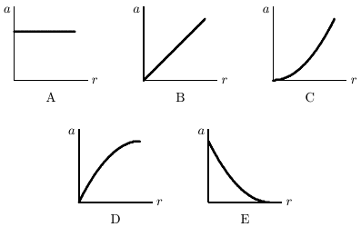

### Chapter 1:MEASUREMENT

1. The SI standard of time is based on:
A.The daily rotation of the earth
B.the frequency of light emitted by $\mathrm{Kr}^{86}$
C.the yearly revolution of the earth about the sun
D.a precision pendulum clock
E.none of these
ans: E

2. A nanosecond is:
A. $10^{9}$ s
B. $10^{-9}$ s
C. $10^{-10}$ s
D. $10^{-10}$ s
E. $10^{-12}$ s
ans: B

3. The SI standard of length is based on:
A.the distance from the north pole to the equator along a meridian passing through Paris
B.wavelength of light emitted by $\mathrm{Hg}^{198}$
C.wavelength of light emitted by $Kr^{86}$
D.a precision meter stick in Paris
E.the speed of light
ans: E

4. In 1866, the U. S. Congress defined the U. S.yard as exactly 3600/3937 international meter. This was done primarily because:
A. length can be measured more accurately in meters than in yards
B. the meter is more stable than the yard
C. this definition relates the common U. S.length units to a more widely used system
D. there are more wavelengths in a yard than in a meter
E. the members of this Congress were exceptionally intelligent
ans: C

5. Which of the following is closest to a yard in length?
A. 0.01 m
B. 0.1m
C. 1m
D. 100m
E. 1000m
ans: C

6. There is no SI base unit for area because:
A. an area has no thickness; hence no physical standard can be built
B. we live in a three (not a two) dimensional world
C. it is impossible to express square feet in terms of meters
D. area is not a fundamental quantity; it is derived from length
ans: D

7. The SI base unit for mass is:
A. gram
B. pound
C. kilogram
D. ounce
E. kilopound
ans: C

8. A gram is:
A. $10^{-6}$ kg
B. $10^{-3}$ kg
C. 1 kg
D. $10^{3}$ kg
E. $10^{6}$ kg
ans: B

9. Which of the following weighs about a pound?
A. 0.05 kg
B. 0.5 kg
C. 5kg
D. 50 kg
E. 500kg
ans: B

10. $(5.0\times10^{4})\times(3.0\times10^{6})=$
A. $1.5\times10^{9}$
B. $1.5\times10^{10}$
C. $1.5\times10^{11}$
D. $1.5\times10^{12}$
E. $1.5\times10^{13}$
ans: C

11. $(5.0\times10^{4})\times(3.0\times10^{-6})=$
A. $1.5\times10^{-3}$
B. $1.5\times10^{-1}$
C. $1.5\times10^{1}$
D. $1.5\times10^{3}$
E. $1.5\times10^{5}$
ans: B

12. $5.0\times10^{5}+3.0\times10^{6}=$
A. $8.0\times10^{5}$
B. $8.0\times10^{6}$
C. $5.3\times10^{5}$
D. $3.5\times10^{5}$
E. $3.5\times10^{6}$
ans: E

13. $(7.0\times10^{6})/(2.0\times10^{-6})=$
A. $3.5\times10^{-12}$
B. $3.5\times10^{-6}$
C. 3.5
D. $3.5\times10^{6}$
E. $3.5\times10^{12}$
ans: E

14. The number of significant figures in 0.00150 is:
A. 2
B. 3
C. 4
D. 5
E. 6
ans: B

15. The number of significant figures in 15.0 is:
A. 2
B. 3
C. 3
D. 4
E. 5
ans: C

16. $3.2\times2.7=$
A. 9
B. 8
C. 8.6
D. 8.64
E. 8.640
ans: C

17. 1.513+27.3=
A. 29
B. 28.8
C. 28.9
D. 28.81
E. 28.813
ans: B

18. 1 mi is equivalent to 1609 m so 55 mph is:
A. 15 m/s
B. 25m/s
C. 66m/s
D. 88m/s
E. 1500m/s
ans: B

19. A sphere with a radius of 1.7 cm has a volume of:
A. $2.1\times10^{-5} m^3$
B. $9.1\times10^{-4}\mathrm{~m}^{3}$
C. $3.6\times10^{-3}~\mathrm{m}^{3}$
D. 0.11 m$^3$
E. 21 m$^3$
ans: A

20. A sphere with a radius of 1.7 cm has a surface area of:
A. $2.1\times10^{-5} m^2$
B. $9. 1\times 10^{- 4} m^{2}$
C. $3.6\times10^{-3} m^2$
D. 0.11 m$^2$
E. $36\mathrm{~m}^{2}$
ans: C

21. A right circular cylinder with a radius of 2.3 cm and a height of 1.4 m has a volume of:
A. 0.20 $m^{3}$
B. 0.14 $m^{3}$
C. $9.3\times10^{-3}\mathrm{~m}^{3}$
D. $2.3\times10^{-3}\mathrm{~m}^{3}$
E. $7. 4\times 10^{- 4} \mathrm{m}^{3}$
ans: D

22. A right circular cylinder with a radius of 2.3 cm and a height of 1.4 cm has a total surface area of:
A. $1. 7\times 10^{- 3} m^{2}$
B. $3.2\times10^{-3}~\mathrm{m}^{2}$
C. $2.0\times10^{-3} m^{2}$
D. $5. 3\times 10^{- 3} m^{2}$
E. $7.4\times10^{-3}~\mathrm{m}^{2}$
ans: D

23. A cubic box with an edge of exactly 1cm has a volume of:
A. $10^{-9}\mathrm{m}^{3}$
B. $10^{- 6}m^3$
C. $10^{- 3}m^3$
D. $10^{3} m^{3}$
E. $10^{6} m^{3}$
ans: B

24. A square with an edge of exactly 1 cm has an area of:
A. $10^{- 6}m^2$
B. $10^{- 4}m^2$
C. $10^{2} m^{2}$
D. $10^{4}\mathrm{m}^{2}$
E. $10^{6} m^{2}$
ans: B

25. 1 m is equivalent to 3.281 ft. A cube with an edge of 1.5 ft has a volume of:
A. $1.2\times10^{2}m^3$
B. $9.6\times10^{-2}\mathrm{~m}^{3}$
C. 10.5 m$^3$
D. $9.5\times10^{-2}\mathrm{~m}^{3}$
E. 0.21 m$^3$
ans: B

26. During a short interval of time the speed $\mathcal{U}$ in m/s of an automobile is given by $v=at^2+bt^3$, where the time $t$ is in seconds. The units of $a$ and $b$ are respectively:
A. m$\cdot s^{2}$; m$\cdot s^{3}$
B. $\mathrm{s}^{3}/$m; $\mathrm{s} ^{4}/$m
C. m/ $s^{2}$; m/ $s^{3}$
D. m/ $s^{3}$; m/ $s^{4}$
E. m/ $s^{4}$; m/ $s^5$
ans: D

27. Suppose $A=BC$, where $A$ has the dimension L/M and $C$ has the dimension L/T. Then $B$ has the dimension:
A. T/M
B. $L^{2}/TM$
C. $TM/L^{2}$
D. $L^{2}/TM$
E. $M/L^{2}T$
ans: A

28. Suppose $A = B^{n}C^{m}$, where $A$ has dimensions LT, $B$ has dimensions $\mathrm{L}^{2}\mathrm{T}^{-1}$, and $C$ has dimensions $LT^{2}$. Then the exponents $n$ and $m$ have the values:
A. 2/3; 1/3
B. 2; 3
C. 4/5; -1/5
D. 1/5; 3/5
E. 1/2; 1/2
ans: D

### Chapter 2: MOTION ALONG A STRAIGHT LINE

1. A particle moves along the $3L$ axis from ${\mathcal{L}}_{i}$ to ${\mathcal{E}}f$ .Of the following values of the initial and final coordinates, which results in the displacement with the largest magnitude?
A. $x_{i}=4\:\mathrm{m},\:x_{f}=6\:\mathrm{m}$
B. $x_{i}=-4\:\mathrm{m},\:x_{f}=-8\:\mathrm{m}$
C. $x_{i}=-4\:\mathrm{m},\:x_{f}=2\:\mathrm{m}$
D. $x_{i}=4\:\mathrm{m},\:x_{f}=-2\:\mathrm{m}$
E. $x_{i}=-4\:\mathrm{m},\:x_{f}=4\:\mathrm{m}$
ans: E

2. A particle moves along the $3L$ axis from ${\mathcal{L}}_{i}$ to ${\mathcal{E}}f$ . Of the following values of the initial and final coordinates, which results in a negative displacement?
A. $x_{i}=4$m ， $x_{f}=6$ m
B. $x_{i}=-4$m ， $x_{f}=-8$m
C. $x_{i}=-4$m ， $x_{f}=2$m
D. $x_{i}=-4$m ， $x_{f}=-2$m
E. $x_{i}=-4$m ， $x_{f}=4$m
ans: B

3. The average speed of a moving object during a given interval of time is always:
A. the magnitude of its average velocity over the interval
B. the distance covered during the time interval divided by the time interval
C. one-half its speed at the end of the interval
D. its acceleration multiplied by the time interval
E. one-half its acceleration multiplied by the time interval
ans: B

4. Two automobiles are 150 kilometers apart and traveling toward each other.One automobile is moving at 60 km/h and the other is moving at 40 km/h mph. In how many hours will they meet?
A. 2.5
B. 2.0
C. 1.75
D. 1.5
E. 1.25
ans: D

5. A car travels 40 kilometers at an average speed of 80 km/h and then travels 40 kilometers at an average speed of $40\operatorname{km/h}$ .The average speed of the car for this 80-km trip is
A. 40km/h
B. 45km/h
C. 48km/h
D. 53km/h
E. $80\operatorname{km/h}$
ans: D

6. A car starts from Hither,goes 50 km in a straight line to Yon,immediately turns around and returns to Hither. The time for this round trip is 2 hours. The magnitude of the average velocity of the car for thisround trip is
A. 0
B. 50 km/hr
C. 100 km/hr
D. 200 km/hr
E. cannot be calculated without knowing the acceleration
ans: A

7. A car starts from Hither,goes 50 km in a straight line to Yon,immediately turns around,and returns to Hither.The time for this round trip is 2 hours.The average speed of the car for this round trip is:
A. 0
B. 50 km/h
C. 100 km/h
D. 200km/h
E. cannot be calculated without knowing the acceleration
ans: B

8. The coordinate of a particle in meters is given by $x(t)=16t-3.0t^{3}$ ,where the time $t$ is ir seconds. The particle is momentarily at rest at $t=$
A. 0.75s
B. 1.3s
C. 5.3s
D. 7.3s
E. 9.3s
ans: B

9. A drag racing car starts from rest at $t=0$ and moves along a straight line with velocity given by $v=bt^{2}$ ,where $b$ is a constant.The expression for the distance traveled by this car from its position at $t=0$ is
A. bt3
B. $bt^3/3$
C. $4bt^2$
D. $3bt^2$
E. $bt^{3/2}$
ans: B

10. A ball rolls up a slope. At the end of three seconds its velocity is 20 cm/s ；; at the end of eight seconds its velocity is 0 .What is the average acceleration from the third to the eighth second？
A. 2.5cm/s$^2$
B. 4.0cm/s$^2$
C. 5.0cm/s$^2$
D. 6.0cm/s$^2$
E. 6.67cm/s$^2$
ans: B

11. The coordinate of an object is given as a function of time by $x=7t-3t^{2}$ ，where $3L$ is in meters and $t$ is in seconds. Its average velocity over the interval from $t=0$ to $t=4$s is
A. 5m/ s
B. -5m/s
C. 11m/s
D. -1151 -11m/s -14.5m/s
ans: B

12. The velocity of an object is given as a function of time by $v=4t-3t^{2}$ ，where $2U$ is in m/s and $t$ is in seconds. Its average velocity over the interval from $t=0$ to $t=2$ S
A. is 0
B. is -2m/s
C. is 2m/s
D. is -4m/s
E. cannot be calculated unless the initial position is given
ans: A

13. The coordinate of an object is given as a function of time by $x=4t^2-3t^3$ ,where $3E$ is in meters and $t$ is in seconds.Its average acceleration over the intervalfrom $t=0$ to $t=2$s is
A. -4 $\mathrm{m/ s}^{2}$
B. 4 m/ $s^{2}$
C. $-10\mathrm{~m/s}^{2}$
D. $10\mathrm{m/s}^{2}$
E. -13m/ $s^{2}$
ans: C

14. Each of four particles move along an $U$ axis.Their coordinates (in meters) as functions of time (in seconds) are given by
particle 1: $x(t)=3.5-2.7t^{3}$
particle 2: $x(t)=3.5+2.7t^{3}$
particle 3: $x(t)=3.5+2.7t^{2}$
particle 4: $x(t)=3.5-3.4t-2.7t^{2}$
Which of these particles have constant acceleration?
A. All four
B. Only 1 and 2
C. Only 2 and 3
D. Only 3 and 4
E. None of them
ans: D

15. Each of four particles move along an $2L$ axis. Their coordinates (in meters) as functions of time (in seconds) are given by
particle 1: $x(t)=3.5-2.7t^{3}$
particle 2: $x(t)=3.5+2.7t^{3}$
particle 3: $x(t)=3.5+2.7t^{2}$
particle 4: $x(t)=3.5-3.4t-2.7t^{2}$
Which of these particles is speeding up for $t>0$
A. All four
B. Only 1
C. Only2and 3
D. Only23and4
E. None of them
ans: A

16. An object starts from rest at the origin and moves along the $U$ axis with a constant acceleration of 4 m/ $s^{2}$ .Its average velocity as it goes from $x=2$m to $x=8$m is
A. 1m/s
B. 2m/s
C. 3 m/ s
D. 5m/s
E. 6m/s
ans: E

17. Of the following situations,which one is impossible?
A. A body having velocity east and acceleration east
B. A body having velocity east and acceleration west
C. A body having zero velocity and non-zero acceleration
D. A body having constant acceleration and variable velocity
E. A body having constant velocity and variable acceleration
ans: E

18. Throughout a time interval,while the speed of a particle increases as it moves along the $3L$ axis. its velocity and acceleration might be：
A. ositive and negative, respectively
C. negative and negative, espetively
E. positive and zero, respectively
ans: C

19. A particle moves on the $U$ axis.When its acceleration is positive and increasing
A. its velocity must be positive
B. its velocity must be negative
C. it must be slowing down
D. it must be speeding up
E. none of the above must be true
ans: E

20. The position $y$ of a particle moving along the $y$ axis depends on the time $t$ according tothe equation $y=at-bt^{2}$ .The dimensions of the quantities $u$ and $t$ are respectively
A. $\mathrm{L}^{2}/$T ,L3/T2
B. L/ $T^{2}$ ,L²/T
C. L/TL/T2
D. $\mathrm{L}^{3}/$T ， $T^{2}$/ L
E. none of these
ans: C

21. A particle moves along the $3E$ axis according to the equation $x=6t^{2}$ ,where $2L$ is in meters anc $t$ is in seconds. Therefore:
A. the acceleration of the particle is 6m/ $s^{2}$
B. $t$ cannot be negative
C. the particle follows a parabolic path
D. each second the velocity of the particle changes by 9.8 m/s
E. none of the above
ans: E

22. Over a short intervalnear time $t=0$ the coordinate of an automobile in meters is given by $x(t)=27t-4.0t^{3}$ ,where $t$ is in seconds. At the end of 1.0 s the acceleration of the auto is:
A. 27m/s$^{2}$
B. 4.0m/s$^2$
C. -4.0m/s$^2$
D. -12m/s$^2$
E. -24 m/s$^2$
ans: E

23. Over a short interval, starting at time $t=0$ ,the coordinate of an automobile in meters is giver by $x(t)=27t-4.0t^{3}$ ,where $t$ is in seconds.The magnitudes of the initial(at $t=0$ ) velocity and acceleration of the auto respectively are
A. 0; 12 m/s$^2$
B. 0; 24 m/s$^{2}$
C. 27 m/s;0
D. 27 m/s; 12m/s$^{2}$
E. 27 m/s 24m/s$^{2}$
ans: C

24. At time $t=0$ a car has a velocity of 16m/s .It slows down with an acceleration given by $-0.50t$ ,in m/ $s^{2}$ for $t$ in seconds.It stops at $t=$
A. 64 s
B. 32 s
C. 16 s
D. 4.0 s
ans: D

25. At time $t=0$ a car has a velocity of 16 m/s. It slows down with an acceleration given by $-0.50t$ ,in m/ $s^{2}$ for $t$ in seconds.At the end of 4.0 s it has traveled:
A. 0
B. 12 m
C. 14 m
D. 25 m
E. 59 m
ans: E

26. At time $t=0$ a car has a velocity of 16 m/s. It slows down with an acceleration given by $-0.50t$ ，in m/ $s^{2}$ for $t$ in seconds.By the time it stops it has traveled
A. 15m
B. 31m
C. 62m
D. 85m
E. 100 m
ans: D

27. Starting at time $t=0$ ,an object moves along a straight line with velocity in m/s given by $v(t)=98-2t^{2}$ ,where $t$ is in seconds. When it momentarily stops its acceleration is:
A. 0
B. -4.0m/s$^2$
C. -9.8m/s$^2$
D. -28m/s$^2$
E. 49m/s$^2$
ans: D

28. Starting at time $t=0$ , an object moves along a straight line. Its coordinate in meters is given by $x(t)=75t-1.0t^{3}$ ，where $t$ is in seconds. When it momentarily stops its acceleration is:
A. 0
B. -73m/s$^2$
C. -30m/s$^2$
D. -9.8m/s$^2$
E. $9.2\times10^{3}$m/s$^2$
ans: C

29. A car,initially at rest, travels 20 m in 4 s along a straight line with constant acceleration.The acceleration of the car is:
A. 0.4m/ $s^{2}$
B. 1.3m/ $s^{2}$
C. $2.5\mathrm{m/s}^{2}$
D. $4.9\mathrm{m/s}^{2}$
E. 9.8m/ $s^{2}$
ans: C

30. A racing car traveling with constant acceleration increases its speed from 10m/s to 50m/s over a distance of 60m .How long does this take?
A. 2.0s
B. 4.0s
C. 5.0s
D. 8.0s
E. The time cannot be calculated since the speed is not constant
ans: B

31. A car starts from rest and goes down a slope with a constant acceleration of 5m/ $s^{2}$ .After 5 s the car reaches the bottom of the hill. Its speed at the bottom of the hill, in meters per second, is:
A. 1
B. 12.5
C. 25
D. 50
E. 160
ans: C

32. A car moving with an initial velocity of 25 m/s north has a constant acceleration of 3m/$\mathrm{s}^2$ south.After 6 seconds itsvelocity will be:
A. 7m/s north
B. 7m/s south
C. 43 m/s north
D. 20 m/s north
E. 20 m/s south
ans: A

33. An object with an initial velocity of 12 m/s west experiences a constant acceleration of 4 m/ $s^{2}$ west for 3 seconds. During this time the object travels a distance of
A. 12 m
B. 24 m
C. 36m
D. 54m
E. 144m
ans: D

34. How far does a car travel in 6 s if its initial velocity is 2 m/s and its acceleration is 2m/$s^2$ in the forward direction?
A. 12m
B. 14m
C. 24m
D. 36m
E. 48 m
ans: E

35. At a stop light, a truck traveling at 15m/s passes a car as it starts from rest. The truck travels at constant velocity and the car accelerates at 3m/s3 .How much time does the car take to catch up to the truck?
A. 5s
B. 10s
C. 15s
D. 20s
E. 25s
ans: B

36. A ball is in free fall. Its acceleration is:
A. downward during both ascent and descent
B. downward during ascent and upward during descent
C. upward during ascent and downward during descent
D. upward during both ascent and descent
E. downward at all times except at the very top,when it is zero
ans: A

37. A ball is in free fall. Upward is taken to be the positive direction. The displacement of the ball during a short time intervalis:
A. positive during both ascent and descent
B. negative during both ascent and descent
C. negative during ascent and positive during descent
D. positive during ascent and negative during descent
E. none of the above
ans: D

38. A baseball is thrown vertically into the air. The acceleration of the ball at its highest point is
A. zero
B. $y$ ,down
C. $y$ , up
D. 2g,down
E. $2g$ up
ans: B

39. Which one of the following statements is correct for an object released from rest?
A. The average velocity during the first second of time is 4.9m/s
B. During each second the object falls 9.8 m
C. The acceleration changes by 9.8m/ $s^{2}$ every second
D. The object falls 9.8m during thefirst second of time
E. The acceleration of the object is proportional to its weight
ans: A

40. A freely falling body has a constant acceleration of 9.8m/s$^2$ .This means that:
A. the body falls 9.8 m during each second
B. the body falls 9.8 m during the first second only
C. the speed of the body increases by 9.8 m/s during each second
D. the acceleration of the body increases by 9.8m/s$^{2}$ during each second
E. the acceleration of the body decreases by 9.8m/s$^2$ during each second
ans: C

41. An object is shot vertically upward. While it is rising
A. its velocity and acceleration are both upward
B. its velocity is upward and its acceleration is downward
C. its velocity and acceleration are both downward
D. its velocity is downward and its acceleration is upward
E. its velocity and acceleration are both decreasing
ans: B

42. An object is thrown straight up from ground level with a speed of 50 m/s. If $g=10$m/s$^2$ its distance above ground level 1.0 s later is:
A. 40 m
B. 45m
C. 50m
D. 55m
E. 60m
ans: B

43. An object is thrown straight up from ground level with a speed of 50m/s .If $g=10$m/s$^2$ its distance above ground level 6.0 s later is:
A. 0.00 m
B. 270m
C. 330m
D. 480 m
E. none of these
ans: E

44. At a location where $g=9.80$m/s$^2$ , an object is thrown vertically down with an initial speed of 1.00m/s .After 5.00 s the object will have traveled
A. 125 m
B. 127.5 m
C. 245m
D. 250 m
E. 255 m
ans: B

45. An object is thrown vertically upward at 35 m/s. Taking $g=10$m/s$^2$ ，the velocity of the object 5 s later is:
A. 7.0 m/s up
B. 15 m/s down
C. 15 m/s up
D. 85 m/s down
E. 85 m/s up
ans: B

46. A feather,initially at rest,is released in a vacuum 12 m above the surface of the earth.Which of the following statements is correct?
A. The maximum yelocity ofthe feather is 9.8m/s
B. The acceleration of the feather decreases until terminalvelocity is reached
C. The acceleration of the feather remains constant during the fall
D. The acceleration of the feather increases during the fall
E. The acceleration of the feather is zero
ans: C

47. An object is released from rest.How far does it fall during the second second of its fall?
A. 4.9m
B. 9.8m
C. 15m
D. 20m
E. 25m
ans: C

48. A heavy ball falls freely,starting from rest.Between the third and fourth second of time it travels a distance of
A. 4.9 m
B. 9.8m
C. 29.4m
D. 34.3m
E. 39.8m
ans: D

49. As a rocket is accelerating vertically upward at 9.8m/s$^2$ near Earth's surface, it releases a projectile. Immediately after release the acceleration (in m/ $^{\prime}\mathrm{s}^{2}$ )of the projectile iss
A. 9.8 down
B. 0
C. 9.8up
D. 19.6 up
E. none of the above
ans: A

50. A stone is released from a balloon that is descending at a constant speed of 10 m/s.Neglecting air resistance, after 20 s the speed of the stone iss
A. 2160 m/s
B. 1760 m/s
C. 206 m/s
D. 196 m/s
E. 186m/s
ans: C

51. An object dropped from the window of a tall building hits the ground in 12.0 s. Ifits acceleration is 9.80m/s$^2$ , the height of the window above the ground is
A. 29.4 m
B. 58.8 m
C. 118 m
D. 353m
E. 706 m
ans: E

52. Neglecting the effect of air resistance a stone dropped off a 175-m high building lands on the ground in:
A. 3 s
B. 4 s
C. 6 s
D. 18 s
E. 36s
ans: C

53. A stone is thrown vertically upward with an initial speed of 19.5 m/s. It will rise to a maximum height of:
A. 4.9 m
B. 9.8m
C. 19.4 m
D. 38.8 m
E. none of these
ans: C

54. A baseball is hit straight up and is caught by the catcher 2.0 slater.The maximum height of the ball during this interval is
A. 4.9 m
B. 7.4 m
C. 9.8 m
D. 12.6 m
E. 19.6 m
ans: A

55. An object is thrown straight down with an initial speed of 4 m/s from a window which is 8 m above the ground.The time it takes the object toreach the ground is:
A. 0.80 s
B. 0.93 s
C. 1.3 s
D. 1.7 s
E. 2.0 s
ans: B

56. A stone isreleasedfrom rest from the edge of abuilding roof 190m aboye the ground.Ne glecting air resistance, the speed of the stone, just before striking the ground, is
A. 43 m/s
B. 61 m/s
C. 120m/s
D. 190 m/s
E. 1400 m/s
ans: B

57. An object is thrown vertically upward with a certain initial velocity in a world where the acceleration due to gravity is 19.6m/ $s^{2}$ .The height to which it rises is that to which the object would rise if thrown upward with the same initial velocity on the Earth. Neglec. friction.
A. half
B. ${\sqrt{2}}$ times
C. twice
D. four times
E. cannot be calculated from the given data
ans: A

58. A projectile is shot vertically upward with a given initial velocity.It reaches a maximum height of 100 m.If,on a second shot, the initial velocity is doubled then the projectile will reach a maximum height of
A. 70.7 m
B. 141.4 m
C. 200m
D. 241 m
E. 400 m
ans: E

59. One object is thrown vertically upward with an initial velocity of 100m/s and another object with an initial velocity of 10m/s .The maximum height reached by the first object will be that of the other.
A. 10 times
B. 100 times
C. 1000 times
D. 10,000 times
E. none of these
ans: B

60. The area under a velocity-time graph represents
A. acceleration
B. change in acceleration
C. speed
D. change in velocity
E. displacement
ans: E

61. Displacement can be obtained from:
A. the slope of an acceleration-time graph
B. the slope of a velocity-time graph
C. the area under an acceleration-time graph
D. the area under a velocity-time graph
E. the slope of an acceleration-time graph
ans: D

62. An object has a constant acceleration of 3m/ $s^{2}$ .The coordinate versus time graph for this object has a slope:
A. that increases with time
B. that is constant
C. that decreases with time
D. of 3 m/s
E. of 3m/ $s^{2}$
ans: A

63. The coordinate-time graph of an object is a straight line with a positive slope.The object has
A. PLACEHOLDER
ans: D

64. Which of the following five coordinate versus time graphs represents the motion of an object moving with a constant nonzero speed?

A. PLACEHOLDER
ans: B

65. Which of the following five acceleration versus time graphs is correct for an object moving in a straight line at a constant velocity of 20m/s'

A. PLACEHOLDER
ans: E

66. Which of the following five coordinate versus time graphs represents the motion of an object whose speed is increasing?

A. PLACEHOLDER
ans: A

67. A car accelerates from rest on a straight road.A short time later, the car decelerates to a stop and then returns to its original position in a similar manner,by speeding up and then slowing to a stop.Which of the following five coordinate versus time graphsbest describes the motion

A. PLACEHOLDER
ans: E

68. The acceleration of an object,starting from rest,is shown in the graph below.Other than at $t=0$ ，when is the velocity of the object equal to zero?

A. During the interval from 1.0 s to 3.0 s
B. At $t=3.5$ S
C. At $t=4.0$ s
D. At $t=5.0$ s
E. At no other timeless than or equal to5s
ans: E

69. An elevator is moving upward with constant acceleration.The dashed curve shows the position $y$ of the ceiling of the elevator as a function of the time $t$ .At the instant indicated by the dot, a bolt breaks loose and drops from the ceiling.Which curve best represents the position of the bolt asafunction of time?

A. PLACEHOLDER
ans: B

70. The diagram shows a velocity-time graph for a car moving in a straight line.At point Q the car must be:

A. moving with zero acceleration
B. traveling downhille Se o ndeo e a e e
ans: E

71. The diagram shows a velocity-time graph for a car moving in a straight line. At point $P$ the car must be:

A. mliovig ith zero aceleration
D. accelerating
E. moving at about $45^{\circ}$ with respect to the $3L$ axis
ans: C

72. The graph represents the straight line motion of a car.How far does the car travelbetween $t=2$ s and $t=5$ s?

A. PLACEHOLDER
D. 36 m
ans: D

73. The diagram represents the straight line motion of a car.Which of the following statements is true?

A. PLACEHOLDER
ans: B

74. Consider the following five graphs (note the axes carefully).Which of these represents motior at constant speed?

A. IV only
B. IV and V only
C. I, II, and III only
D. I and II only
E. I and IV only
ans: E

75. An object is dropped from rest. Which of the following five graphs correctly represents its motion? The positive direction is taken to be downward

A. PLACEHOLDER
ans: B

76. A stone is dropped from a cliff. The graph (carefully note the axes)which best represents its motion while it falls is:

A. PLACEHOLDER
ans: C

77. An object is thrown vertically into the air.Which of the following five graphs represents the velocity (v) of the object as a function of the time (t)? The positive direction is taken to be upward.

A. PLACEHOLDER
ans: C

### Chapter 3:VECTORS

1. We say that the displacement of a particle is a vector quantity. Our best justification for this assertion is:
A. displacement can be specified by a magnitude and a direction
B. operating with displacements according to the rules for manipulating vectors leads to results in agreement with experiments
C. a displacement is obviously not a scalar
D. displacement can be specified by three numbers
E. displacement is associated with motion
ans: B

2. The vectors $\bar{a}$ $\bar{b}$ and $\bar{c}$ are related by $\vec{c}$ = $\vec{b} - \vec{a}$ .Which diagram below illustrates this relationship?

A.
B.
C.
D.
E. None of these
ans: D

3. A vector of magnitude 3 CANNOT be added to a vector of magnitude 4 so that the magnitude of the resultant is:
A. zero
B. 1
C. 3
D. 5
E. 7
ans: A

4. A vector of magnitude 20 is added to a vector of magnitude 25.The magnitude of this sun might be
A. zero
B. 3
C. 12
D. 47
E. 50
ans: C

5. A vector $\bar{S}$ ofmagnitude 6 and another vector $\vec{T}$ have a sum of magnitude 12.The vector $\bar{T}$
A. must have a magnitude of at least 6 but no more than 18
B. may have a magnitude of 20
C. must be perpendicular to $\bar{S}$ Cetetee
ans: A

6. The vector $-\bar{A}$ is:
A. greater than $\bar{A}$ in magnitude
B. less than $\bar{A}$ in magnitude
C. in the same direction as $\bar{A}$
D. in the direction opposite to $\bar{A}$
E. perpendicular to $\vec{A}$
ans: D

7. The vector $\vec{V}_{3}$ in the diagram is equal to

A. ${\vec{V}}_{1}-{\vec{V}}_{2}$
B. $\vec{V}_{2}-\vec{V}_{1}$ + $\vec{V}_{1}+\vec{V}_{2}$
D. ${\vec V}_{1}\cos\theta$
E. $\vec{V}_{1}/(\cos\theta)$
ans: C

8. If $|\vec{A}+\vec{B}|^2=A^2+B^2$ , then
A. $\bar{A}$ and $\vec{B}$ must be parallel and in the same direction
B. $\bar{A}$ and $\vec{B}$ must be parallel and in opposite directions
C. either $\bar{A}$ or $\bar{B}$ must be zero
D. the angle between $\bar{A}$ and $\vec{B}$ mustbe $60^{\circ}$
E. none of the above is true
ans: E

9. If $|\vec{A}+\vec{B}|=A+B$ and neither $\bar{A}$ nor $\vec{B}$ vanish, then
A. $\vec{A}$ and $\vec{B}$ are parallel and in the same direction
B. $\bar{A}$ and $\vec{B}$ are parallel and in opposite directions
C. the angle between $\bar{A}$ and $\vec{B}$ is 45°
D. the angle between $\bar{A}$ and $\vec{B}$ is $60^{\circ}$
E. $\bar{A}$ is perpendicular to $\vec{B}$
ans: A

10. If $|\vec{A}-\vec{B}|=A+B$ and neither $\bar{A}$ nor $\vec{B}$ vanish, then
A. $\bar{A}$ and $\vec{B}$ are parallel and in the same direction
B. $\bar{A}$ and $\vec{B}$ are parallel and in opposite directions
C. the angle between $\bar{A}$ and $\vec{B}$ is $45^{\circ}$
D. the angle between $\bar{A}$ and $\vec{B}$ is $60^{\circ}$
E. $\bar{A}$ is perpendicular to $\vec{B}$
ans: B

11. Four vectors ( $\bar{A}$ $\vec{B}$ ， $\tilde{C}$ ， $\bar{D}$ )all have the same magnitude. The angle $\theta$ between adjacent vectors is $45^{\circ}$ as shown. The correct vector equation is:

A. $\vec{A}-\vec{B}-\vec{C}+\vec{D}=0$
B. $\vec{B}+\vec{D}-\sqrt{2}\vec{C}=0$
C. $\vec{A}+\vec{B}=\vec{B}+\vec{D}$
D. $\vec{A}+\vec{B}+\vec{C}+\vec{D}=0$
E. $(\vec{A}+\vec{C})/\sqrt{2}=-\vec{B}$
ans: B

12. Vectors $\bar{A}$ and $\vec{B}$ lie in the $xy$ plane.We can deduce that $\vec{A}=\vec{B}$ if
A. $A_{x}^{2}+A_{y}^{2}=B_{x}^{2}+B_{y}^{2}$
B. $A_{x}+A_{y}=B_{x}+B_{y}$
C. $A_{x}=B_{x}$ and $A_{y}=B_{y}$
D. $A_{y}/A_{x}=B_{y}/B_{x}$
E. $A_{x}=A_{y}$ and $B_{x}=B_{y}$
ans: C

13. A vector has a magnitude of 12. When its tail is at the origin it lies between the positive $3L$ axis and the negative $y$ axis and makes an angle of $30^{\circ}$ with the 22 axis. Its $y$ component is:
A. $6/{\sqrt{3}}$
B. $-6{\sqrt{3}}$
C. 6
D. -6
E. 12
ans: D

14. If the ${:}L$ component of a vector $\bar{A}$ ，in the $xy$ plane, is half as large as the magnitude of the vector, the tangent of the angle between the vector and the 22 axis is:
A. $\sqrt{3}$
B. $1/2$
C. $\sqrt{3}/2$
D. 3/2
E. 3
ans: D

15. If $\vec{A}=(6$m$)\hat{\mathrm{i}}-(8$m$)\hat{\mathrm{j}}$ then $4\vec{A}$ has magnitude
A. $10m$
B. 20m
C. 30m
D. 40m
E. 50m
ans: D

16. A vector has a component of 10m in the $+x$ direction, a component of $10m$ in the $+y$ direction and a component of $5m$ in the $+z$ direction. The magnitude of this vector is:
A. zero
B. $15m$
C. 20m
D. 25m
E. 225m
ans: B

17. Let $\vec{V}=(2.00$m$)\hat{\mathrm{i}}+(6.00$m$)\hat{\mathrm{j}}-(3.00$m$)\hat{\mathrm{k}}$ .The magnitude of $\vec{V}$ is
A. 5.00m
B. 5.57m
C. 7.00m
D. 7.42m
E. 8.54m
ans: C

18. A vector in the $xy$ plane has a magnitude of 25m and an $3E$ component of $12m$ .The angle it makes with the positive $3E$ axis is
A. 26°
B. $29^{\circ}$
C. 61°
D. $64^{\circ}$
E. 2410
ans: C

19. The angle between $\vec{A}=(25$m$)\hat{\mathrm{i}}+(45$m$)\hat{\mathrm{j}}$ and the positive $3L$ axis is:
A. $29^{\circ}$
B. $61^{\circ}$
C. 1510
D. 209°
E. 241°
ans: B

20. The angle between $\vec{A}=(-25$m$)\hat{\mathbf{i}}+(45$m$)\hat{\mathbf{j}}$ and the positive $3L$ axis is
A. 29°
B. 61°
C. 119°
D. 151°
E. $209^{\circ}$
ans: C

21. Let $\vec{A} = ( 2$ m$) \hat{\mathrm{i} } + ( 6$ m$) \hat{\mathrm{j} } - ( 3$ m$) \hat{\mathrm{k} }$ and $\vec{B}=(4$m$)\hat{\mathrm{i}}+(2$m$)\hat{\mathrm{j}}+(1$m$)\hat{\mathrm{k}}$ .The vector sum $\vec{S}=\vec{A}+\vec{B}$ is:
A. (6m$)\hat{\mathrm{i}}+(8$m$)\hat{\mathrm{j}}-(2$m$)\hat{\mathrm{k}}$
B. (-2 m) $\hat{ı }+ ( 4$ m) $\hat{ȷ }- ( 4$ m) $\hat{k}$
C. (2 m) $\" i$- ( 4$\:$m) $\:\ddot{j}$+ ( 4$\:$m) $\:\ddot{k}$
D. (8 m) $\hat{\mathrm{i} } + ( 12$ m) $\hat{\mathrm{j} } - ( 3$ m) $\ddot{\mathrm{k} }$
E. none of these
ans: A

22. Let $\vec{A}=(2$m$)\mathbf{\hat{ı}}+(6$m$)\mathbf{\hat{j}}-(3$m$)\mathbf{\hat{k}}$ and $\vec{B}=(4$m$)\hat{\mathrm{i}}+(2$m$\hat{\mathrm{j}}+(1$m$)\hat{\mathrm{k}}$ .The vector difference $\vec{D}=\vec{A}-\vec{B}$ is:
A. (6m$)\hat{\mathrm{i}}+(8$m$)\hat{\mathrm{j}}-(2$m$)\hat{\mathrm{k}}$
B. (-2 m) $\hat{ı }+ ( 4$ m) $\hat{ȷ }- ( 4$ m) $\ddot{k}$
C. (2 m) $\hat{\mathrm{i} } - ( 4$ m) $\hat{\mathrm{j} } + ( 4$ m) $\ddot{\mathrm{k} }$
D. (8 m) $\hat{\mathrm{i} } + ( 12$ m) $\hat{\mathrm{j} } - ( 3$ m) $\hat{\mathrm{k} }$
E. none of these
ans: B

23. If $\vec{A} = ( 2$ m$) \hat{\mathrm{i} } - ( 3$ m$) \hat{\mathrm{j} }$ and $\vec{B}=(1$m$)^\mathbf{\hat{ı}}-(2$m$)\mathbf{\hat{J}}$ ,then $\vec{A}-2\vec{B}=$
A. (1m$)\mathbf{\hat{\mathbf{j}}}$
B. (-1 m) $\hat{j}$
C. (4m)i-(7m)j
D. (4m$)\hat{\mathrm{i}}+(1$m$)\hat{\mathrm{j}}$
E. $\left(-4\:\mathrm{m}\right){\hat{\mathbf{i}}}+\left(7\:\mathrm{m}\right){\hat{\mathbf{j}}}$
ans: A

24. In the diagram, $\bar{A}$ has magnitude $12m$ and $\vec{B}$ has magnitude $8m$ The $3L$ component of $\vec{A}+\vec{B}$ is about:

A. 5.5m
B. 7.6m
C. 12m
D. 14m
E. 15m
ans: C

25. A certain vector in the $\mathcal{E}y$ plane has an $3E$ component of $4m$ anda $y$ component of $10m$ .It is then rotated in the $2y$ plane so its $3L$ component is doubled. Its new $y$ component is about:
A. $20m$
B. 7.2m
C. 5.0m
D. 4.5m
E. 2.2m
ans: B

26. Vectors $\bar{A}$ and $\vec{B}$ each have magnitude $L$ .When drawn with their tails at the same point,the anglebetween them is $30^{\circ}$ .The value of $\vec{A}\cdot\vec{B}$ is
A. zero
B. $L^{2}$
C. ${\sqrt{3}}L^{2}/2$
D. $2L^{2}$
E. none of these
ans: C

27. Let $\vec{A} = ( 2$ m$) \hat{\mathrm{i} } + ( 6$ m$) \hat{\mathrm{j} } - ( 3$ m$) \hat{\mathrm{k} }$ and $\vec{B}=(4$m$)\mathbf{\hat{ı}}+(2$m$)\mathbf{\hat{j}}+(1$m$)\mathbf{\hat{k}}$ .Then $\vec{A}\cdot\vec{B}=$
A. (8 m) $\hat{\mathrm{i} } + ( 12$ m) $\hat{\mathrm{j} } - ( 3$ m) $\ddot{\mathrm{k} }$
B. (12 m$) \hat{\mathrm{i} } - ( 14$ m$) \hat{\mathrm{j} } - ( 20$ m) $\ddot{\mathrm{k} }$
C. 23m²
D. $17\mathrm{m}^{2}$
E. none of these
ans: D

28. Two vectors have magnitudes of 10m and $15m$ .The angle between them when they are drawn with their tails at the same point is $65^{\circ}$ .The component of the longer vector along the line of the shorter is:
A. 0
B. 4.2m
C. 6.3m
D. 9.1m
E. 14m
ans: C

29. Let $\vec{S}=(1$m$)\hat{\mathrm{i}}+(2$m$)\hat{\mathrm{j}}+(2$m$)\hat{\mathrm{k}}$ and $\vec{T}=\left(3\:\mathrm{m}\right)\hat{\mathrm{i}}+\left(4\:\mathrm{m}\right)\hat{\mathrm{k}}$ .The angle between these two vectors is given by
A. $\cos^{-1}(14/15)$
B. $\cos^{-1}(11/225)$
C. $\cos^{-1}(104/225)$
D. $\cos^{-1}(11/15)$
E. cannot be found since $\bar{S}$ and $\vec{T}$ do not lie in the same plane
ans: D

30. Two vectors lie with their tails at the same point. When the angle between them is increased by $20^{\circ}$ their scalar product has the same magnitude but changes from positive to negative The original angle between them was:
A. 0
B. $60^{\circ}$
C. $70^{\circ}$
D. $80^{\circ}$
E. $90^{\circ}$
ans: D

31. If the magnitude of the sum of two vectors is less than the magnitude of either vector,then
A. the scalar product of the vectors must be negative
B. the scalar product of the vectors must be positive
C. the vectors must be parallel and in opposite directions
D. the vectors must be parallel and in the same direction
E. none of the above
ans: A

32. If the magnitude of the sum of two vectors is greater than the magnitude of either vector, then
A. the scalar product of the vectors must be negative
B. the scalar product of the vectors must be positive
C. the vectors must be parallel and in opposite directions
D. the vectors must be parallel and in the same direction
E. none of the above
ans: E

33. Vectors $\bar{A}$ and $\vec{B}$ each have magnitude $L$ .When drawn with their tails at the same point,the angle between them is $60^{\circ}$ .The magnitude of the vector product $\vec{A}\times\vec{B}$ is:
A. $L^{2}/2$
B. $L^{2}/2$
C. ${\sqrt{3}}L^{2}/2$
D. $2L^{2}$
E. none of these
ans: C

34. Two vectors lie with their tails at the same point.When the angle between them is increasec by $20^{\circ}$ the magnitude of their vector product doubles.The original angle between them was about:
A. 0
B. $18^{\circ}$
C. $25^{\circ}$
D. $45^{\circ}$
E. $90^{\circ}$
ans: B

35. Two vectors have magnitudes of $10m$ and $15m$ The angle between them when they are drawn with their tails at the same point is $65^{\circ}$ .The component of the longer vector along the line perpendicular to the shorter vector, in the plane of the vectors, is:
A. 0
B. 4.2m
C. 6.3m
D. 9.1m
E. 14m
ans: E

36. The two vectors (3m)î-(2m)î and (2 m) $\hat{\mathrm{i} } + ( 3$ m) $\hat{\mathrm{j} } - ( 2$ m) $\hat{\mathrm{k} }$ define a plane. It is the plane of the triangle with both tails at one vertex and each head at one of the other vertices.Which of the following vectors is perpendicular to the plane?
A. (4 m) $\hat{\mathrm{i} } + ( 6$ m) $\hat{\mathrm{j} } + ( 13$ m) $\hat{\mathrm{k} }$
B. (-4 m) $\hat{ı }+ ( 6$ m) $\hat{ȷ }+ ( 13$ m) $\hat{k}$
C. (4 m) $\hat{\mathbf{i} } - ( 6$ m) $\hat{\mathbf{j} } + ( 13$ m) $\hat{\mathbf{k} }$
D. (4 m) $\hat{\mathrm{i} } + ( 6$ m $\hat{\mathrm{j} } - ( 13$ m) $\hat{\mathrm{k} }$
E. (4m)i+(6m)
ans: A

37. Let $\vec{R}=\vec{S}\times\vec{T}$ and $\theta\neq90^{\circ}$ ,where $\theta$ is the angle between $\bar{S}$ and $\bar{T}$ when they are drawn with their tails at the same point. Which of the following is NOT true?
A. $|\vec{R}|=|\vec{S}||\vec{T}|\sin\theta$
B. $-\vec{R}=\vec{T}\times\vec{S}$
C. $\vec{R}\cdot\vec{S}=0$
D. $\vec{R}\cdot\vec{T}=0$
E. $\vec{S}\cdot\vec{T}=0$
ans: E

38. The value of ${\stackrel{\Lambda}{\mathbf{i}}}\cdot({\stackrel{\Lambda}{\mathbf{j}}}\times{\stackrel{\Lambda}{\mathbf{k}}})$ is
A. 0
B. +1
C. -1
D. 3
E. ${\sqrt{3}}$
ans: B

39. The value of $\hat{\mathbf{k}}\cdot(\hat{\mathbf{k}}\times\hat{\mathbf{i}})$ is
A. 0
B. +1
C. -1
D. 3
E. ${\sqrt{3}}$
ans: A

### Chapter 4: MOTION IN TWO AND THREE DIMENSIONS

1. Velocity is defined as:
A. rate of change of position with time
B. position divided by time
C. rate of change of acceleration with time
D. a speeding up or slowing down
E. change of position
ans: A

2. Acceleration is defined as:
A. rate of change of position with time
B. speed divided by time
C. rate of change of velocity with time
D. a speeding up or slowing down
E. change of velocity
ans: C

3. Which of the following is a scalar quantity?
A. Speed
B. Velocity
C. Displacement
D. Acceleration
E. None of these
ans: A

4. Which of the following is a vector quantity？
A. Mass
B. Density
C. Speed
D. Temperature
E. None of these
ans: E

5. Which of the following is NOT an example of accelerated motion?
A. Vertical component of projectile motion
B. Circular motion at constant speed
C. A swinging pendulum
D. Earth's motion about sun
E. Horizontal component of projectile motion
ans: E

6. A particle goes from $x=-2$m ， $y=3$m ， $z=1$m to $x=3$m ， $y$ = -1 m ， $z=4$m .Its displacement is:
A. (1m$)\hat{\mathrm{i}}+(2$m$)\hat{\mathrm{j}}+(5$m$)\hat{\mathrm{k}}$
B. (5m$)\hat{\mathrm{i}}-(4$m$)\hat{\mathrm{j}}+(3$m$)\hat{\mathrm{k}}$
C. -(5m)i+(4m)j-(3m)k
D. -(1m$) \text{\^ {ı }}- ( 2$m$){\hat{\mathbf{j}}}-(5$m$){\hat{\mathbf{k}}}$
E. -(5m$) \text{\^ {ı }}- ( 2$m$)\mathbf{\hat{j}}+(3$m$)\mathbf{\hat{k}}$
ans: B

7. A jet plane in straight horizontal flight passes over your head. When it is directly above you, the sound seems to come from a point behind the plane in a direction $30^{\circ}$ from the vertical The speed of the plane is:
A. the same as the speed of sound
B. half the speed of sound
C. three-fifths the speed of sound
D. 0.866 times the speed of sound
E. twice the speed of sound
ans: B

8. A plane traveling north at 200m/s turns and then travels south at 200m/s .The change in its velocity is
A. zero
B. 200m/s north
C. 200m/s south
D. 400 m/s north
E. 400m/s south
ans: E

9. Two bodies are falling with negligible air resistance, side by side, above a horizontal plane. If one of the bodies is given an additional horizontal acceleration during its descent, it
A. strikes the plane at the same time as the other body
C. has the vertical component of its velocity altered
D. has the vertical component of its acceleration altered
E. follows a straight line path along the resultant acceleration vector
ans: A

10. The velocity of aprojectile equals its initialvelocity added to
A. a constant horizontal velocity
B. a constant vertical velocity
C. a constantly increasing horizontal velocity
D. a constantly increasing downward velocity
E. a constant velocity directed at the target
ans: D

11. A stone thrown from the top of a tall building follows a path that is:
A. circular
B. made of two straight line segments
C. hyperbolic
D. parabolic
E. a straight line
ans: D

12. Identical guns fire identical bullets horizontally at the same speed from the same height above levelplanes,one on the Earth and one on theMoon.Which of the following three statements is/are true?
I. Thehorizontal distance traveled by the bulletis greater for theMoon
II. The fight time is less for the bullet on the Earth.
III. The velocity of the bullets at impact are the same.
A. III only
B. I and II only
C. I and III only
D. II and III only
E. IIIIII
ans: B

13. A stone is thrownhorizontally and follows the path XYZ shown.The direction of the acceler ation of the stone at point Y is:

A. $\downarrow$
B. $\rightarrow$
C. $\searrow$
D. $\swarrow$
E. $\nearrow$
ans: A

14. A bullet shot horizontally from a gun
A. strikes the ground much later than one dropped vertically from the same point at the same instant
B. never strikes the ground
C. strikes the ground at approximately the same time as one dropped vertically from the same point at the same instant
D. travels in a straight line
E. strikes the ground much sooner than one dropped from the same point at the same instant
ans: C

15. A bomber fying in level fight with constant velocity releases a bomb before it is over the target. Neglecting air resistance,which one of the following is NOT true?
A. The bomber is over the target when the bomb strikes
B. The acceleration of the bomb is constant
C. The horizontal velocity of the plane equals the vertical velocity of the bomb when it hits the target
D. The bomb travels in a curved path
E. The time of flight of the bomb is independent of the horizontal speed of the plane
ans: C

16. The airplane shown is in level fight at an altitude of 0.50 km and a speed of 150km/h .At what distance d should it release a heavy bomb to hit the target X? Take $g= 10$ m/ $s^{2}$

A. 150m
B. 295m
C. 417m
D. 2550m
E. 15,000m
ans: C

17. An object is shot from the back of a railroad flatcar moving at $40\operatorname{km}/\operatorname{h}$ on a straight horizontal road. The launcher is aimed upward, perpendicular to the bed of the fatcar.The object falls
A. in front of the fatcar
B. behind the fatcar
C. on the fatcar
D. either behind or in front of the fatcar,depending on the initial speed of the object
E. to the side of the fatcar
ans: C

18. A ball is thrown horizontally from the top of a 20-m high hill.It strikes the ground at an angle of $45^{\circ}$ .With what speed was it thrown?

A. 14m/s
B. 20m/s
C. 28m/s
D. 32m/s
E. 40m/s
ans: B

19. A stone is thrown outward from the top of a59.4-mhigh cliff with an upwardvelocity compo nent of 19.5m/s . How long is stone in the air?
A. 4.00s
B. 5.00s
C. 6.00s
D. 7.00s
E. 8.00s
ans: C

20. A large cannon is fired from ground level over level ground at an angle of $30^{\circ}$ above the horizontal. The muzzle speed is 980m/s .Neglecting air resistance, the projectile will travel what horizontal distance before striking the ground?
A. 4.3km
B. 8.5km
C. 43km
D. 85 km
E. 170 km
ans: D

21. A boy on the edge of a vertical cliff 20m high throws a stone horizontally outward with a speec of 20m/s .It strikes the ground at what horizontal distance from the foot of the cliff? Use $g=10\mathrm{~m/s}^{2}$
A. $10m$
B. 40m
C. 50m
D. $50{\sqrt{5}}$m
E. none of these
ans: B

22. Which of the curves on the graph below best represents the vertical component ${\mathcal{U}}_{y}$ of the velocity versus the time $t$ for a projectile fired at an angle of $45^{0}$ above the horizontal?

A. OC
B. DE
C. AB
D. AE
E. AF
ans: D

23. A cannon fires a projectile as shown.The dashed line shows the trajectory in the absence of gravity; points MNOP correspond to the position of the projectile at one second intervals.If $g= 10$ m/ $s^{2}$ , the lengths X,Y,Z are:

A. 5m,10m15 m
B. 5 m, 20 m, 45 m
C. 10 m,40 m, 90 m
D. 10m, 20m, 30m
E. 0.2m.0.8m1.8m
ans: B

24. A dart is thrown horizontally toward X at 20m/s as shown. It hits Y 0.1s later. The distance XY is:

A. 2m
B. 1m
C. 0.5m
D. 0.1m
E. 0.05m
ans: E

25. A projectile is fired from ground level over levelground with an initial velocity that has a vertical component of 20m/s and a horizontal component of 30m/s .Using $g= 10$ m/ $s^{2}$ ，the distance from launching to landing points is
A. 40m
B. 60m
C. 80m
D. 120 m
E. 180m
ans: D

26. An object,tied to a string,moves in a circle at constant speed on a horizontal surface as shown The direction of the displacement of this object,as it travels from W to Xis

A. $\leftarrow$
B. $\downarrow$
C. $\nearrow$
D. $\searrow$
E. $\swarrow$
ans: E

27. A toy racing car moves with constant speed around the circle shown below. When it is at point A its coordinates are $x=0$ $y=3$m and its velocity is (6m/s)i .When it is at point B its velocity and acceleration are

A. -(6m/s$){\mathrm{j}}$ and (12 $\mathrm{m/ s}^{2})$ $\hat{ı }$ , respectively
B. (6m/s)i and -(12m/ $s^{2}) \hat{i}$ , respectively
C. (6m/s$){\widehat{\mathbf{j}}}$ and (12 $\mathrm{m/ s}^{2})$ $\hat{ı }$ , respectively
D. (6m/a) (6m/s)î (6m/s$){\widehat{\mathbf{j}}}$ and 0
E. (2m/ $s^{2}$) ${\hat{\mathbf{j} } }$ i vespectively
ans: C

28. An airplane makes a gradual $90^{\circ}$ turn while flying at a constant speed of 200m/s .The process takes 20.0 seconds to complete.For this turn the magnitude of the average acceleration of the plane is:
A. zero
B. 40m/ $s^{2}$
C. 20m/ $s^{2}$
D. 14m/ $s^{2}$
E. $10\mathrm{m/s}^{2}$
ans: D

29. An airplane is fying north at 500 km/h .It makes a gradual $180^{\circ}$ turn at constant speed changing its direction of travel from north through east to south. The process takes 40 s .The average acceleration of the plane for this turn (in km/h·s) is:
A. 12.5km/h$\cdot$s ,north
B. 12.5km/h$\cdot$s ,east
C. 12.5km/h$\cdot$s ,south
D. $25\operatorname{km/h}\cdot$s ,north
E. 25km/h$\cdot$s south
ans: E

30. An object is moving on a circular path of radius TI meters at a constant speed of 4.0m/s .The time required for one revolution is:
A. $2/\pi^{2}$ 8
B. $\pi^{2}/2$ s
C. $\pi/2$ S
D. $2/\pi$ s
E. $\pi^{2}/4$
ans: B

31. A particle moves at constant speed in a circular path.The instantaneous velocity and instantaneous acceleration vectors are:
A. both tangent to the circular path
B. both perpendicular to the circular path
C. perpendicular to each other
D. opposite to each other
E. none of the above
ans: C

32. A stone is tied to a string and whirled at constant speed in a horizontal circle.The speed is then doubled without changing the length of the string.Afterward the magnitude of the acceleration of the stone is:
A. the same
B. twice as great
C. four times as great
D. half as great
E. one-fourth as great
ans: C

33. Two objects are traveling around different circular orbits with constant speed. They both have the same acceleration but object A is traveling twice as fast as object B. The orbit radius for object A is the orbit radius for object B
A. one-fourth
B. one-half
C. the same as
D. twice
E. four times
ans: E

34. A stone is tied to a 0.50-m string and whirled at a constant speed of 4.0m/s in a vertical circle. Its acceleration at the top of the circle is
A. 9.8m/ $s^{2}$ , up
B. 9.8m/ $s^{2}$ , down
C. 8.0m/ $s^{2}$ , down
D. 32 m/ $s^{2}$ , up
E. $32\mathrm{m/s}^{2}$ , down
ans: E

35. A stone is tied to a 0.50-m string and whirled at a constant speed of 4.0m/s in a vertical circle Its acceleration at the bottom of the circle is
A. $9.8\mathrm{m/s}^{2}$ ,up
B. 9.8m/ $s^{2}$ , down
C. 8.0m/ $s^{2}$ , up
D. 32 m/ $s^{2}$ , up
E. 32m/ $s^{2}$ , down
ans: D

36. A car rounds a 20-m radius curve at 10m/s .The magnitude of its acceleration is:
A. 0
B. 0.20m/s$^2$
C. $5.0\mathrm{m/s}^{2}$
D. $40\mathrm{~m/s}^{2}$
E. 400m/ $s^{2}$
ans: C

37. For a biological sample in a 1.0-m radius centrifuge to have a centripetal acceleration of 25g its speed must be:
A. 11m/s
B. 16m/s
C. 50m/s
D. 122m/s
E. 245m/s
ans: B

38. A girl jogs around a horizontal circle with a constant speed.She travels one fourth of a revolution, a distance of 25m along the circumference of the circle.in5.0s.The magnitude of her acceleration is:
A. 0.31 m/ $s^{2}$
B. 1.3m/ $s^{2}$
C. 1.6m/ $s^{2}$
D. $3.9\mathrm{m/s}^{2}$
E. $6.3\mathrm{m/s}^{2}$
ans: C

39. A stone is tied to the end ofa string and is swung with constant speed arounda horizontal circle with a radius of $1.5m$ .If it makes two complete revolutions each second, the magnitude of its acceleration is
A. $0.24\mathrm{~m/s}^{2}$
B. 2.4 $\mathrm{m/ s}^{2}$
C. 24 m/ $s^{2}$
D. 240m/ $s^{2}$
E. 2400m/s$^2$
ans: D

40. A Ferris wheel with a radius of 8.0m makes 1 revolution every 10 s .When a passenger is at the top, essentially a diameter above the ground, he releases a ball. How far from the point on the ground directly under the release point does the ball land?
A. 0
B. 1.0m
C. 8.0m
D. 9.1m
E. 16m
ans: D

41. A boat is able to move through still water at 20m/s . It makes a round trip to a town 3.0 km upstream. If the river flows at 5m/ s , the time required for this round trip is:
A. 120s
B. 150s
C. 200s
D. 320s
E. 300s
ans: E

42. A boat is traveling upstream at $14\operatorname{km/h}$ with respect to a river that is fowing at $6\operatorname{km/h}$ (with respect to the ground). A man runs directly across the boat, from one side to the other, at $6\operatorname{km/h}$ (with respect to the boat). The speed of the man with respect to the ground is:
A. $10\operatorname{km}/\operatorname{h}$
B. 14km/h
C. $18.5\operatorname{km/h}$
D. 21 km/h
E. 26km/ h
ans: A

43. A ferry boat is sailing at 12 km/h $30^{0}$ W of N with respect to a river that is flowing at 6.0km/h E.As observed from the shore, the ferry boat is sailing
A. 30°Eof N
B. due N
C. $30^{\circ}$ W of N
D. 45°E of N
E. none of these
ans: B

44. A boy wishes to row across a river in the shortest possible time. He can row at 2m/ s in still water and the river is fowing at 1m/s .At what angle $\theta$ should he point the bow (front) of his boat?

A. $30^{\circ}$
B. $45^{\circ}$
C. $60^{\circ}$
D. $63^{\circ}$
E. $90^{\circ}$
ans: E

45. A girl wishes to swim across ariver to a point directly opposite as shown.She can swim at 2m/s in still water and the river is fowing at 1m/s .At what angle $\theta$ with respect to the line joining the starting and finishing points should she swim?

A. $30^{\circ}$
B. $45^{\circ}$
C. $60^{\circ}$ 60°
D. $63^{\circ}$
E. $90^{\circ}$
ans: A

46. A motor boat can travel at 10 km/h in still water. A river fows at 5 km/h west. A boatel wishes to cross from the south bank to a point directly opposite on the north bank. At what angle must the boat be headed?
A. $27^{\circ}$E of N
B. 30°Eof N
C. 45°Eof N
D. 60°E of N
E. depends on the width of the river
ans: B

47. Two projectiles are in flight at the same time.The acceleration of one relative to the other
A. is always 9.8m/ $s^{2}$
B. can be as large as 19.8m/s$^2$
C. can be horizontal
D. is zero
E. none of these
ans: D

### Chapter 5FORCE AND MOTIONI

1. An example of an inertial reference frame is:
A. any reference frame that is not accelerating
B. a frame attached to a particle on which there are no forces
C. any reference frame that is at rest
D. a reference frame attached to the center of the universe
E. a reference frame attached toEarth
ans: B

2. An object moving at constant velocity in an inertial frame must
A. have a net force on it
B. eventually stop due to gravity
C. not have any force of gravity on it
D. have zero net force on it
E. have no frictional force on it
ans: D

3. In SIunits a force is numerically equal to the when the force is applied to it.
A. velocity of the standard kilogram
B. speed of the standard kilogram
C. velocity of any object
D. acceleration of the standard kilogram
E. acceleration of any object
ans: D

4. Which of the following quantities is NOT a vector?
A. Mass
B. Displacement
C. Weight
D. Acceleration
E. Force
ans: A

5. A newton is the force：
A. of gravity on a 1 $kg$ body
B. of gravity on a $1\lg$ body
C. that gives a $1g$ body an acceleration of 1cm/s$^2$
D. that gives a 1 $kg$ body an acceleration of 1 m/ $s^{2}$
E. that gives a $1kg$ body an acceleration of 9.8m/ $s^{2}$
ans: D

6. The unit of force called the newton is
A. 9.8kg$\cdot$m/ $s^{2}$
B. $1\lg \cdot$m/ $s^2$
C. defined by means of Newton's third law
D. $1\log$ of mass
E. 1 $kg$ of force
ans: B

7. A force of $1N$ is:
A. $1\operatorname{kg/s}$
B. $1\log \cdot$m/ s
C. 1 kg$\cdot$m/s$^2$
D. $1\lg\cdot\mathrm{m}^{2}/$s
E. 1 kg$\cdot m^{2}$/ $s^{2}$
ans: C

8. The standard 1-kg mass is attached to a compressed spring and the spring is released.If the mass initially has an acceleration of 5.6m/ $s^{2}$ , the force of the spring has a magnitude of:
A. 2.8N
B. 5.6N
C. 11.2N
D. 0
E. an undetermined amount
ans: B

9. Acceleration is always in the direction:
A. of the displacement
B. of the initial velocity
C. of the final velocity
D. of the net force
E. opposite to the frictional force
ans: D

10. The term“mass”refers to the same physical concept as:
A. weight
B. inertia
C. force
D. acceleration
C. volume
ans: B

11. The inertia ofabody tends to cause thebody to
A. speed up
B. slow down
C. resist any change in its motion
D. fall toward Earth
E. decelerate due to friction
ans: C

12. A heavy ball is suspended as shown.A quick jerk on the lower string will break that string but a slow pull on the lower string will break the upper string. The first result occurs because

A. the force is too small to move the ball
B. action and reaction is operating
C. the bal a inerthe bal acke
E. the ball has too much energy
ans: C

13. When a certain force is applied to the standard kilogram its acceleration is 5.0m/s$^2$ .When the same force is applied to another object its acceleration is one-fifth as much.The mass of the object is:
A. 0.2kg
B. 0.5kg
C. $1.0\lg$
D. 5.0 kg
E. $10\lg$
ans: D

14. Mass differs from weight in that
A. all objects have weight but some lack mass
B. weight is a force and mass is not
C. the mass of an object is always more than its weighi
D. mass can be expressed only in the metric system
E. there is no diference
ans: B

15. The mass of a body
A. is slightly different at different places on Earth.
B. is a vector
C. is independent of the free-fall acceleratior
D. is the same for all bodies of the same volume
E. can be measured most accurately on a spring scale
ans: C

16. The mass and weight of a body
A. differ by a factor of 9.8
B. are identical
C. are the same physical quantities expressed in different units
D. are both a direct measure of the inertia of the body
E. have the same ratio as that of any other body placed at that location
ans: E

17. An object placed on an equal-arm balance requires $12\lg$ to balance it. When placed on a spring scale， the scale reads 12 kg .Everything (balance, scale, set of weights and object) is now transported to the Moon where the free-fall acceleration is one-sixth that on Earth. The new readings of the balance and spring scale(respectively) are
A. $12\lg$ ,12kg
B. 2kg,2kg
C. 12kg2kg
D. 2kg12kg
E. 12 kg,72kg
ans: C

18. Two objects, one having three times the mass of the other, are dropped from the same height in a vacuum.At the end of their fall, their velocities are equal because
A. anything falling in vacuum has constant velocity
B. all objects reach the same terminal velocity
C. the acceleration of the larger object is three times greater than that of the smaller object
D. the force of gravity is the same for both objects
E. none of the above
ans: E

19. A feather and a lead ball are dropped from rest in vacuum on the Moon.The acceleration of the feather is:
A. more than thatof the leadball
B. the same as that of the lead ball
C. less than that of the lead ball
D. 9.8m/ $s^{2}$
E. zero since it floats in a vacuum
ans: B

20. The block shown moves with constant velocity on ahorizontal surface.Two of the forces on it are shown.A frictional force exerted by the surface is the only other horizontal force on the block. The frictional force is:

A. 0
B. 2N,leftward
C. 2N.rightward
D. slightly more than 2N, leftward
E. slightly less than 2N, leftward
ans: B

21. Two forces,one with a magnitude of $3N$ and the other with a magnitude of $5N$ ,are applied to an object. For which orientations of the forces shown in the diagrams is the magnitude of the acceleration of the object the least?

A.
B.
C.
D.
E.
ans: A

22. A crate rests on a horizontal surface and a woman pulls on it with a 10-N force.Rank the situations shown below according to the magnitude of the normal force exerted by the surface on the crate,least to greatest.

A. 1,2,3
B. 2,1,3
C. 2,3,1
D. 1,3,2
E. 3,2,1
ans: E

23. A heavy woodenblock is draggedby aforce $\vec{F}$ along a rough steelplate.as shown in the diagrams for two cases. The magnitude of the applied force $\bar{F}$ is the same for both cases. The normal force in (ii),as compared with the normal force in (i) is

(i)

(ii)
A. the same
B. greater
C. less
D. less for some angles of the incline and greater for others
E. less or greater,depending on the magnitude of the applied force $\vec{F}$
ans: C

24. Equal forces $\bar{F}$ act on isolated bodies A and B.The mass of B is three times that of A.The magnitude of the acceleration of A is:
A. three times that of B
B. 1/3 that of B
C. the same as B
D. nine times that of B
E. 1/9 that of B
ans: A

25. A car travels east at constant velocity.The net force on the car is:
A. east
B. west
C. up
D. down
E. zero
ans: E

26. A constant force of 8.0 N is exerted for 4.0 s on a 16-kg object initially at rest.The change in speed of this object will be
A. 0.5m/s
B. 2m/s
C. 4m/s
D. 8m/s
E. 32m/s
ans: B

27. A 6-kg object is moving south. A net force of 12 N north on it results in the object having an acceleration of:
A. 2m/ $s^{2}$ ,north
B. 2 m/ $s^{2}$ ,south
C. 6 m/ $s^{2}$ , north
D. 18m/ $s^{2}$ , north
E. 18m/ $s^{2}$ , south
ans: A

28. A 9000-N automobile is pushed along a level road by four students who apply a total forward forceof 500N . Neglecting friction, the acceleration of the automobile is
A. 0.055 m/ $s^{2}$
B. 0.54m/ $s^{2}$
C. 1.8m/ $s^{2}$
D. $9.8\mathrm{m/s}^{2}$
E. $18\mathrm{m/s}^{2}$
ans: B

29. An object rests on a horizontal frictionless surface.A horizontal force of magnitude $F^{\prime}$ is applied. This force produces an acceleration:
A. only if $F^{\prime}$ is larger than the weight of the object
B. only while the object suddenly changes from rest to motion
C. always
D. only if the inertia of the object decreases
E. only if $F$ is increasing
ans: C

30. A 25-kg crate is pushed across a frictionless horizontal floor with a force of 20 N, directed $20^{\circ}$ below the horizontal. The acceleration of the crate is:
A. $0.27\mathrm{~m/s}^{2}$
B. $0.75\mathrm{~m/s}^{2}$
C. 0.80m/ $s^{2}$
D. 170m/ $s^{2}$
E. 470m/ $s^{2}$
ans: B

31. A ball with a weight of $1.5N$ is thrown at an angle of $30^{\circ}$ above the horizontalwith an initial speed of 12m/s .At its highest point, the net force on the ball is:
A. 9.8N, $30^{\circ}$ below horizontal
B. zero
C. 9.8N,up
D. 9.8 N, down
E. 1.5Ndown
ans: E

32. Two forces are applied to a5.0-kg crate:one is 6.0 $N$ to the north and the other is 8.0 $N$ to the west.The magnitude of the acceleration of the crate is:
A. 0.50 m/ $s^{2}$
B. $2.0\mathrm{m/s}^{2}$
C. $2.8\mathrm{m/s}^{2}$
D. 10m/ $s^{2}$
E. 50m/ $s^{2}$
ans: B

33. A 400-N steel ballis suspended by a light rope from the ceiling.The tension in the rope is
A. 400N
B. 800N
C. zero
D. 200N
E. 560N
ans: A

34. A heavy steel ball B is suspended by a cord from a block of wood W. The entire system is dropped through the air. Neglecting air resistance, the tension in the cord is:
A. zero
B. the difference in the masses ofB andW
C. the difference in the weights of B andW
D. the weight of B
E. none of these
ans: A

35. A circus performer ofweight $W$ is walking along a “high wire” as shown.The tension in the wire:

A. is approximately $W$
B. is approximately $W/2$
C. is much less than $W$
D. is much more than $W$
C. depends on whether he stands on one or two feet
ans: D

36. A 1000-kg elevator is rising and its speed is increasing at 3 m/ $s^{2}$ .The tension force of the cable on the elevator is:
A. 6800N
B. 1000N
C. 3000N
D. 9800N
E. 12800N
ans: E

*37. A 5-kg block is suspended by a rope from the ceiling of an elevator as the elevator accelerates downward at 3.0m/ $s^{2}$ .The tension force of the rope on the block is:
A. 15N,up
B. 34Nup
C. 34N.down
D. 64N, up
E. 64N,down
ans: B

38. A crane operator lowers a 16,000-N steel ball with a downward acceleration of 3 m/ $s^{2}$ .The tension force of the cable is
A. 4900N
B. 11000N
C. 16.000N
D. 21000N
E. 48000N
ans: B

39. A 1-N pendulum bob is held at an angle $\theta$ from the vertical by a 2-N horizontal force $F$ as shown.The tension in the string supporting the pendulum bob (in newtons)is:

A. $\cos\theta$
B. $2/\cos\theta$
C. $\sqrt{5}$
D. $\sqrt{3}$
E. 1
ans: C

40. A car moves horizontally with a constant acceleration of 3 m/ $s^{2}$ .A ball is suspended by a string from the ceiling of the car. The ball does not swing, being at rest with respect to the car.What angle does the string make with the vertical?
A. 17°
B. 35°
C. $52^{\circ}$
D. $73^{\circ}$
E. Cannot be found without knowing the length of the string
ans: A

41. A man weighing 700Nb is in an elevator that is accelerating upward at 4 m/ $s^{2}$ .The force exerted on him by the elevator foor is:
A. 71N
B. 290N
C. 410N
D. 700N
E. 990N
ans: E

42. You stand on a spring scale on the foor of an elevator. Of the following, the scale shows the highest reading when the elevator:
A. moves upward with increasing speed
B. moves upward with decreasing speed
C. remains stationary
D. moves downward wit increasing speed
E. moves downward with decreasing speed
ans: A

43. You stand on a spring scale on the foor of an elevator. Of the following, the scale shows the highest reading when the elevator:
A. moves downward with increasing speed
B. moves downward with decreasing speec
C. remains stationary
D. moves upward with decreasing speed
E. moves upward at constant speed
ans: B

44. When a 25-kg crate is pushed across a frictionless horizontal foor with a force of 200 N, directed $20^{\circ}$ below the horizontal, the magnitude of the normal force of the foor on the crate is:
A. 25N
B. 68N
C. 180N
D. 250N
E. 310N
ans: E

45. A block slides down a frictionless plane that makes an angle of $30^{\circ}$ with the horizontal.The acceleration of the block is
A. 980cm/s$^2$
B. 566cm/s$^2$
C. 849cm/ $s^{2}$
D. zero
E. 490cm/s$^2$
ans: E

46. A 25-N crate slides down a frictionless incline that is $25^{\circ}$ above the horizontal. The magnitud of the normal force of the incline on the crate is:
A. 11N
B. 23N
C. 25N
D. 100 N
E. 220N
ans: B

47. A 25-N crate is held at rest on a frictionless incline by a force that is parallel to the incline.If the incline is $25^{\circ}$ above the horizontal the magnitude of the applied force is:
A. 4.1 N
B. 4.6 N
C. 8.9N
D. 11 N
E. 23N
ans: D

48. A 25-N crate is held at rest on a frictionless incline by a force that is parallelto the incline.If the incline is $25^{\circ}$ above the horizontal the magnitude of the normal force of the incline on the crate is:
A. 4.1 N
B. 4.6N
C. 8.9N
D. 11N
E. 23N
ans: E

49. A 32-N force, parallel to the incline, is required to push a certain crate at constant velocity up a frictionless incline that is $30^{\circ}$ above the horizontal.The mass of the crate is
A. 3.3kg
B. 3.8kg
C. 5.7kg
D. 6.5 kg
E. $160\lg$
ans: D

50. A sled is on an icy (frictionless) slope that is $30^{\circ}$ above the horizontal.When a 40-N force parallel to the incline and directed up the incline, is applied to the sled, the acceleration of the sled is 2.0m/ $s^{2}$ , down the incline. The mass of the sled is
A. 3.8kg
B. 4.1 kg
C. $5.8\lg$
D. $6.2\lg$
E. $10\lg$
ans: E

51. When a 40-N force,parallel to the incline and directed up the incline,is applied to a crate on a frictionless incline that is $30^{\circ}$ above the horizontal, the acceleration of the crate is 2.0 m/ $s^{2}$ up the incline. The mass of the crate is:
A. 3.8kg
B. 4.1kg
C. 5.8kg
D. 6.2kg
E. 10kg
ans: C

52. The "reaction" force does not cancel the "action" force because
A. the action forceis greater than the reaction force
B. they are on different bodies
C. they are in the same direction
D. the reaction force exists only after the action force is removed
E. the reaction force is greater than the action force
ans: B

53. A book rests on a table,exerting a downward force on the table.The reaction to this force is:
A. the force of Earth on the book
B. the force of the table on the book
C. the force of Earth on the table
D. the force of the book on Earth
E. the inertia of the book
ans: B

54. A lead block is suspended from your hand by a string.The reaction to the force of gravity on the blockis the force exerted by:
A. the string on the block
B. the block on the string
C. the string on the hand
D. the hand on the string
E. the block on Earth
ans: E

55. A 5-kg concrete block is lowered with a downward acceleration of 2.8m/ $s^{2}$ by means of a rope The force of the block on the rope is
A. 14N, up
B. 14N, down
C. 35Nup
D. 35Ndown
E. 49N, up
ans: D

56. A 90-kg man stands in an elevator that is moving up at a constant speed of 5.0m/s .The force exerted by him on the floor is about
A. zero
B. 90N
C. 880N
D. 450N
E. 49N
ans: C

57. A 90-kg man stands in an elevator that has a downward acceleration of 1.4 m/ $s^{2}$ .The force exerted by him on the floor is about
A. zero
B. 90N
C. 760N
D. 880N
E. 1010N
ans: C

58. A 5-kg concrete block is lowered with a downward acceleration of 2.8m/ $s^{2}$ by means of a rope The force of the block on Earth is:
A. 14N, up
B. 14N, down
C. 35N,up
D. 35N, down
E. 49N, up
ans: E

59. Two blocks are connected by a string and pulley as shown. Assuming that the string and pulley are massless,the magnitude of the acceleration of each blockis

A. $0.049\mathrm{m/s}^{2}$
B. $0.020\mathrm{~m/s}^{2}$
C. 0.0098m/ $s^{2}$
D. 0.54m/ $s^{2}$
E. 0.98m/ $s^{2}$
ans: E

60. A 70-N block and a 35-N block are connected by a string as shown. If the pulley is massless and the surface is frictionless, the magnitude of the acceleration of the 35-N block is:

A. 1.6m/ $s^{2}$
B. $3.3\mathrm{m/s}^{2}$
C. $4.9\mathrm{m/s}^{2}$
D. $6.7\mathrm{m/s}^{2}$
E. $9.8\mathrm{m/s}^{2}$
ans: B

61. A 13-N weight and a 12-N weight are connected by a massless string over a massless,frictionless pulley.The 13-N weight has a downward acceleration with magnitude equal to that of a freely falling body times
A. 1
B. 1/12
C. 1/13
D. 1/25
E. 13/25
ans: D

62. A massless rope passes over a massless pulley suspended from the ceiling.A 4-kg block is attached to one end and a 5-kg block is attached to the other end.The acceleration of the 5-kg block is:
A. 9/4
B. $5g/9$
C. 4g/9
D. 9/5
E. 9/9
ans: E

63. Two blocks,weighing 250N and 350 N,respectively, are connected by a string that passes ove a massless pulley as shown. The tension in the string is:

A. 210N
B. 290N
C. 410N
D. 500N
E. 4900N
ans: B

64. Three books (X,Y,and Z)rest on a table.The weight of each book is indicated.The net force acting on book Y is

A. 4N down
B. 5N up
C. 9 N down
D. zero
E. none of these
ans: D

65. Three books (X, Y, and Z) rest on a table. The weight of each book is indicated. The force of book Z on book Y is:

A. 0
B. 5N
C. 9N
D. 14N
E. 19N
ans: C

66. Three blocks A,B,Ceach having mass $M$ ,are connected by strings as shown.Block C is pulled to the right by a force $\vec{F}$ that causes the entire system to accelerate. Neglecting friction, the net force acting on block B is:

A. 0
B. $\vec{F}/3$
C. $\vec{F}/2$
D. $2\vec{F}/3$
E. $\vec{F}$
ans: B

67. Two blocks with masses 7712 and $M$ are pushed along a horizontal frictionless surface by a horizontal applied force $\vec{F}$ as shown.The magnitude of the force of either of these blocks on the other is:

A. $mF/(m+M)$
B. $mF/M$
C. $mF/(M-m)$
D. $MF/(M+m)$
E. $MF/m$
ans: A

68. Two blocks (A and B)are in contact on a horizontal frictionless surface.A 36-N constant force is applied to A as shown. The magnitude of the force of $A$ on B is

A. 1.5N
B. 6.0N
C. 29N
D. 30N
E. 36N
ans: D

69. A short 10-g string is used to pull a 50-g toy across a frictionless horizontal surface. If a $3.0\times10^{-2}$ -N force is applied horizontally to the free end, the force of the string on the toy, at the other end,is:
A. 0.15 $\mathbb{N}$
B. $6.0\times10^{-3}$N
C. $2.5\times10^{-2}$N
D. $3.0\times10^{-2}$N
E. $3.5\times10^{-2}$N
ans: C

### Chapter 6:FORCE AND MOTION-II

1. A brick slides on ahorizontal surface.Whichof the following willincrease the magnitude of the frictional force on it?
A. Putting a second brick on top
B. Decreasing the surface area of contact
C. Increasing the surface area of contact
D. Decreasing the mass of the brick
E. None of the above
ans: A

2. The coefficient of kinetic friction
A. isin the direction of the frictional force
B. is in the direction of the normal force
C. is the ratio of force to area
D. can have units of newtons
E. is none of the above
ans: E

3. When the brakes of an automobile are applied, the road exerts the greatest retarding force
A. while the wheels are sliding
B. justbefore the wheels start to slide
C. when the automobile is going fastest
D. when the acceleration is least
E. at the instant when the speed begins to change
ans: B

4. A forward horizontal force of $12N$ is used to pull a 240-N crate at constant velocity across a horizontal floor. The coefficient of friction is
A. 0.5
B. 0.05
C. 2
D. 0.2
E. 20
ans: B

5. The speed of a 4.0-N hockey puck, sliding across a level ice surface,decreases at the rate of 0.61m/ $s^{2}$ .The coefficient of kinetic friction between the puck and ice isi
A. 0.062
B. 0.41
C. 0.62
D. 1.2
E. 1.8
ans: A

6. A crate rests on a horizontal surface and a woman pulls on it witha 10-N force.No matter what the orientation of the force,the crate does not move.Rank the situations shown below according to the magnitude of the frictional force of the surface on the crate,least to greatest

A. 1,2,3
B. 2,1,3
C. 2,3,1
D. 1,3,2
E. 3,2,1
ans: E

7. A crate with a weight of $50N$ rests on a horizontal surface.A person pulls horizontally on it with a force of $10N$ and it does not move. To start it moving, a second person pulls vertically upward on the crate.If the coefficient of static friction is O.4, what is the smallest vertical force for which the crate moves?

A. 10N
B. 4NN
C. 14N
D. 25N
E. 35N
ans: D

8. A 40-N crate rests on a rough horizontal floor. A 12-N horizontal force is then applied to it. If the coefficients of friction are $\mu_{8}=0.5$ and $\mu_{k}=0.4$ ,the magnitude of the frictional force on the crate is
A. 8N
B. 12N
C. 16N
D. 20N
E. 40N
ans: B

9. A 24-N horizontal force is applied to a 40-N block initially at rest on a rough horizontal surface. If the coefficients of friction are $\mu_{8}=0.5$ and $\mu_{k}=0.4$ , the magnitude of the frictional force on the block is：
A. 8N
B. 12N
C. 16N
D. 20N
E. 400N
ans: C

10. A horizontal shove of at least $200N$ is required to start moving a 800-N crate initially at rest on a horizontalfloor.The coefficient of static friction is
A. 0.25
B. 0.125
C. 0.50
D. 4.00
E. none of these
ans: A

11. A force $\vec{F}$ (larger than the largest possible force of static friction） is applied to the left to an object moving to the right on a horizontal surface.Then
A. the object must be moving at constant speed
B. $\vec{F}$ and the friction force act in opposite directions
C. the object must be slowing down
D. the object must be speeding up
E. the object must come to rest and remain at rest
ans: C

12. A bureau rests on a rough horizontal surface ( $\mu_{8}=0.50$ ， $\mu_{k}=0.40$ ).A constant horizontal force, just sufficient to start the bureau in motion, is then applied. The acceleration of the bureau is
A. 0
B. $0.98\mathrm{~m/s}^{2}$
C. 3.3 $\mathrm{m/ s}^{2}$
D. $4.5\mathrm{m/s}^{2}$
E. 8.9m/ $s^{2}$
ans: B

13. A car is traveling at 15m/s on a horizontal road. The brakes are applied and the car skids to a stop in 4.0s.The coefficient of kinetic friction between the tires and road is
A. 0.38
B. 0.69
C. 0.76
D. 0.92
E. 1.11
ans: A

14. A boy pulls a wooden box along a rough horizontal foor at constant speed by means of a force $\bar{P}$ as shown.In the diagram $f$ is the magnitude of the force of friction, $N$ is the magnitude of the normal force, and $F_{g}^{'}$ is the magnitude of the force of gravity. Which of the following must be true?

A. $P=f$ and $N=F_{g}$
B. $P=f$ and $N>F_{g}$
C. $P>f$ and $N<F_{g}$
D. $P>f$ and $N=F_{g}$
E. none of these
ans: A

15. A boy pulls a wooden box along a rough horizontal foor at constant speed by means of a force $\bar{P}$ as shown. In the diagram $f$ is the magnitude of the force of friction, $N$ is the magnitude of the normal force, and $F_{g}^{'}$ is the magnitude of the force of gravity. Which of the following must be true?

A. $P=f$ and $N=F_{g}$
B. $P=f$ and $N<F_{g}$
C. $P>f$ and $N>F_{g}$
D. $P>f$ and $N=F_{g}$
E. $P>f$ and $N<F_{g}$
ans: C

16. A 400-N block is dragged along a horizontal surface by an applied force $\vec{F}$ as shown. The coef ficient of kinetic friction is $\mu_{k}=0.4$ :and the block moves at constant velocity. The magnitude of $\vec{F}$ is:

A. 100N
B. 150N
C. 200N
D. 290N
E. 400Nb
ans: B

17. A block of mass TIL is pulled at constant velocity along a rough horizontal floor by an appliec force $\bar{T}$ as shown. The magnitude of the frictional force is:

A. $T\cos\theta$
B. $\mu_{k}T\cos\theta$
C. $\mu_{k}(mg-T\sin\theta)$
D. $\mu_{k}(mg+T\sin\theta)$
E. $\mu_{k}mg$
ans: A

18. A block of mass 711 is pulled along arough horizontal floor by an applied force $\bar{T}$ as shown The vertical component of the force exerted on the block by the floor is

A. mg
B. $mg-T\cos\theta$
C. $mg+T\cos\theta$
D. $mg-T\sin\theta$
E. $mg+T\sin\theta$
ans: D

19. A 12-kg crate rests on a horizontal surface and a boy pulls on it with a force that is $30^{\circ}$ below thehorizontal.If the coefficient of static friction is 0.40,the minimum magnitude force he needs to start the crate moving is
A. 44N
B. 47N
C. 54N
D. 56N
E. 71N
ans: E

20. A crate resting on a roughhorizontalfloor is tobe moved horizontally.The coefficient of static friction is 0.40.To start the crate moving with the weakest possible applied force,in what direction should the force be applied
A. Horizontal
B. $24^{\circ}$ below the horizonta
C. $22^{\circ}$ above the horizonta
D. $24^{\circ}$ above the horizontal
E. $66^{\circ}$ below the horizontal
ans: C

21. A 50-N force is applied to a crate on a horizontal rough foor, causing it to move horizontally If the coefficient of kinetic friction is 0.50,in what direction should the force be applied to obtain the greatest acceleration?
A. Horizontal
B. $60^{\circ}$ above the horizontal
C. $30^{\circ}$ above the horizontal
D. $27^{\circ}$ above the horizontal
E. $30^{\circ}$ below the horizontal
ans: D

22. A professor holds an eraser against a vertical chalkboard by pushing horizontally on it. He pushes with a force that is much greater than is required to hold the eraser.The force of friction exerted by the board on the eraser increases if he
A. pushes with slightly greater force
C. pushes with slightly less force, but the eraser still does not move
D. pushes so his force is slightly downward but the eraser still does not move
E. stops pushing
ans: D

23. A horizontal force of $12N$ pushes a 0.5-kg book against a vertical wall. The book is initially at rest. If the coefficients of friction are $\mu_{8}=0.6$ and $\mu_{k}=0.8$ which of the following is true?
A. The magnitude of the frictional force is 4.9N
B. The magnitude of the frictional force is 7.2N
C. The normal force is $4.9N$
D. The book will start moving and accelerate
E. If started moving downward, the book will decelerate
ans: A

24. A horizontal force of 5.0N pushes a 0.50-kg book against a vertical wall. The book is initially at rest.If the coefficients of friction are $\mu_{8}=0.6$ and $\mu_{k}=0.80$ , the magnitude of the frictional force is:
A. 0
B. 4.9N
C. 3.0N
D. 5.0N
E. 4.0N
ans: E

25. A horizontal force of 12N pushes a 0.50-kg book against a vertical wall. The book is initially at rest. If $\mu_{s}=0.6$ and $\mu_{k}=0.80$ ,the acceleration of the book in m/ $s^{2}$ is
A. 0
B. $9.4\mathrm{m/s}^{2}$
C. $9.8\mathrm{m/s}^{2}$
D. 14.4 m/ $s^{2}$
E. 19.2m/ $s^{2}$
ans: A

26. A horizontal force of 5.0N pushes a 0.50-kg block against a vertical wall. The block is initially at rest. If $\mu_{s}=0.60$ and $\mu_{k}=0.80$ , the acceleration of the block in m/ $s^{2}$ is:
A. 0
B. 1.8
C. 6.0
D. 8.0
E. 9.8
ans: B

27. A heavy woodenblock is draggedby aforce $\vec{F}$ along a rough steel plate,as shown below for two possible situations. The magnitude of $\bar{F}$ is the same for the two situations. The magnitude of the frictional force in (i), as compared with that in (i) is:

(i)

(ii)
A. the same
B. greater
C. less
D. less for some angles and greater for others
E. can be less or greater, depending on the magnitude of the applied force.
ans: C

28. A block is first placed on its long side and then on its short side on the same inclined plane,as shown. The block slides down the plane on its short side but remains at rest on its long side A possible explanation is:

A. the short side is smoother
B. the frictional force is less because the contact area is less
C. the center of gravity is higher in the second case
D. the normal force is less in the second case
E. the force of gravity is more nearly down the plane in the second case
ans: A

29. A box rests on a rough board 10 meters long. When one end of the board is slowly raised to a height of 6 meters above the other end,the box begins to slide.The coefficient of static friction is:
A. 0.8
B. .25
C. 0.4
D. 0.6
E. 0.75
ans: E

30. A block is placed on a rough wooden plane. It is found that when the plane is tilted $30^{\circ}$ to the horizontal, the block will slide down at constant speed. The coefficient of kinetic friction of the block with the plane is
A. 0.500
B. 0.577
C. 1.73
D. 0.866
E. 4.90
ans: B

31. A crate is sliding down an incline that is $35^{0}$ above the horizontal. If the coefficient of kinetic friction is 0.40,the acceleration of the crate is
A. 0
B. $2.4\mathrm{m/s}^{2}$
C. 5.8m/ $s^{2}$
D. 8.8 $\mathrm{m/ s}^{2}$
E. 10.3m/s$^2$
ans: B

32. A 5.0-kg crate is resting on a horizontal plank. The coefficient of static friction is 0.50 and the coefficient of kinetic friction is 0.40.After one end of the plank is raised so the plank makes an angle of $25^{\circ}$ with the horizontal, the force of friction is:
A. 0
B. 18N
C. 21N
D. 22N
E. 44N
ans: C

33. A 5.0-kg crate is resting on a horizontal plank. The coefficient of static friction is 0.50 and the coefficient of kinetic friction is O.40.After one end of the plank is raised so the plank makes an angle of $30^{\circ}$ with the horizontal, the force of friction is:
A. 0
B. 17N
C. 21N
D. 25N
E. 44N
ans: B

34. A 5.0-kg crate is on an incline that makes an angle of $30^{\circ}$ with the horizontal.If the coefficient of static friction is 0.50, the minimum force that can be applied parallel to the plane tohold the crate at rest is
A. 0
B. 3.3N
C. 30N
D. 46 N
E. 55N
ans: B

35. A 5.0-kg crate is on an incline that makes an angle of $30^{\circ}$ with the horizontal. If the coefficient of static friction is 0.5, the maximum force that can be applied parallel to the plane without moving the crate is:
A. 0
B. 3.3N
C. 30N
D. 46 N
E. 55N
ans: D

36. Block A,with mass $m_{A}$ ,is initially at rest on a horizontal floor. Block B, with mass $m_{B}$ ,is initially at rest on the horizontal top surface of A.The coefficient of staticfriction between the two blocks is $\mu_{8}$ .Block A is pulled with a horizontal force. It begins to slide out from under B if the force is greater than:
A. $m_{A}g$
B. $m_{B}g$
C. $\mu_{s}m_{A}g$
D. $\mu_{s}\eta l_{B}g$
E. $\mu_{s}(m_{A}+m_{B})g$
ans: E

37. The system shown remains at rest. Each block weighs 20 N. The force of friction on the uppel block is:

A. 4N
B. 8N
C. 12N
D. 16N
E. 20N
ans: B

38. Block A,with a mass of 50 kg ,rests on a horizontal table top. The coefficient of static friction is 0.40. A horizontal string is attached to A and passes over a massless,frictionless pulley as shown.The smallest mass $7mB$ of block B,attached to the dangling end,that will start A moving when it is attached to the other end of the string is:

A. 20kg
B. 30kg
C. $40\lg$
D. 50 kg
E. $70\lg$
ans: A

39. Block A,with a mass of 10 kg ,rests on a $35^{0}$ incline.The coefficient of static friction is 0.40 An attached string is parallel to the incline and passes over a massless, frictionless pulley at the top. The largest mass TIlB of block B, attached to the dangling end, for which A begins to slide down the incline is:

A. 2.5kg
B. 3.5kg
C. 5.9kg
D. 9.0kg
E. $10.5\operatorname{kg}$
ans: A

40. Block A,with a mass of 10 kg ,rests on a $35^{0}$ incline.The coefficient of static friction is 0.40 An attached string is parallel to the incline and passes over a massless,frictionless pulley at the top. The largest mass $THB$ ,attached to the dangling end,for which A remains at rest is:

A. 2.5kg
B. 3.5kg
C. 5.9kg
D. 9.0 kg
E. 10.5 kg
ans: D

41. Block A, with a mass of $10\lg$ , rests on a $30^{\circ}$ incline. The coefficient of kinetic friction is 0.20 The attached string is parallel to the incline and passes over a massless, frictionless pulley at the top. Block B, with a mass of 8.0 kg ,is attached to the dangling end of the string. The acceleration of B is:

A. $0.69\mathrm{m/s}^{2}$ ,up the plane
B. $0.69\mathrm{~m/s}^{2}$ ,down the plane
C. $2.6\mathrm{m/s}^{2}$ , up the plane
D. $2.6\mathrm{m/s}^{2}$ , down the plane
E. 0
ans: B

42. Block A, with a mass of $10\lg$ , rests on a $30^{\circ}$ incline.The coefficient of kinetic friction is O.20 The attached string is parallel to the incline and passes over a massless,frictionless pulley at the top. Block B,with a mass of 3.0 kg ,is attached to the dangling end of the string. The acceleration of B is:

A. 0.20 m/ $s^{2}$ ,up
B. 0.20 m/ $s^{2}$ , down
C. 2.8m/ $s^{2}$ ,up
D. 2.8m/ $s^{2}$ , down
E. 0
ans: A

43. A 1000-kg airplane moves in straight fight at constant speed. The force of air friction is 1800 N The net force on the plane is:
A. zero
B. 11800N
C. 1800N
D. 9800N
E. none of these
ans: A

44. Why do raindrops fallwith constant speed during thelater stages of their descent?
A. The gravitational force is the same for all drops
B. Air resistance just balances the force of gravity
C. The drops all fall from the same height
D. The force of gravity is negligible for objects as small as raindrops
E. Gravity cannot increase the speed of a falling object tomore than 9.8m/s
ans: B

45. A ball is thrown downward from the edge of a cliff with an initial speed that is three times the terminal speed. Initially its acceleration is
A. upward and greater than $y$
B. upward and less than $g$
C. downward and greater than $y$
D. downward and less than $y$
E. downward and equal to $g$
ans: A

46. A ball is thrown upward into the air with a speed that is greater than terminal speed.On the way up it slows down and, after its speed equals the terminal speed but before it gets to the top of its trajectory
A. its speed is constant
B. it continues to slow down
C. its speed is constant
D. it continues to slow down but its acceleration is decreasing
E. none of the above
ans: B

47. A ball is thrown upward into the air with a speed that is greater than terminal speed.It lands at the place where it was thrown.During its fight the force of air resistance is the greatest
A. just after it is thrown
B. halfway up
C. at the top of its trajectory
D. halfway down
E. just before it lands.
ans: A

48. Uniform circular motion is the direct consequence of
A. Newton's third law
B. a force that is always tangent to the path
C. an acceleration tangent to the path
D. a force of constant magnitude that is always directed away from the same fixed point
E. a force of constant magnitude that is always directed toward the same fixed point
ans: E

49. An object moving in a circle at constant speed
A. must have only one force acting on it
B. is not accelerating
C. is held to its path by centrifugal force
D. has an acceleration of constant magnitude
E. has an acceleration that is tangent to the circle
ans: D

50. An object of mass 7712 and another object of mass $2m$ are each forced to move along a circle of radius 1.0m at a constant speed of 1.0m/s .The magnitudes of their accelerations are
A. equal
B. in the ratio of $\sqrt{2}:1$
C. in the ratio of 2:1
D. in the ratio of 4:1
E. zero
ans: A

51. The magnitude of the force required to cause a 0.04-kg object to move at 0.6m/s in a circle of radius 1.0m is
A. $2.4\times10^{-2}$N
B. $1.4\times10^{-2}$N
C. $1.4\pi\times10^{-2}$N
D. $2.4\pi^{2}\times10^{-2}$N
E. 3.13N
ans: B

52. A 0.2-kg stone is attached to a string and swung ina circle of radius 0.6m on a horizontal and frictionless surface.If the stone makes 150 revolutions per minute,the tension force of the string on the stone is:
A. 0.03N
B. 0.2N
C. 0.9N
D. 1.96 N
E. 30N
ans: E

53. Which of the following five graphs is correct for a particle moving in a circle of radius 7 at8 constant speed of 10m/s

A.
B.
C.
D.
E.
ans: E

54. An object moves arounda circle.If the radius is doubled keeping the speed the same then the magnitude ofthe centripetal force must be
A. twice as great
B. half as great
C. four times as great
D. one-fourth as great
E. the same
ans: B

55. An object moves in a circle. If the mass is tripled, the speed halved, and the radius unchanged then themagnitude of the centripetal force must be multiplied by a factor of:
A. 3/2
B. $3/4$
C. 9/4
D. 6
E. 12
ans: B

56. If a satellite moves above Earth's atmosphere in a circular orbit with constant speed, then
A. its acceleration andvelocity are always in the same direction
B. the net force on it is zero
C. its velocity is constant
D. it will fall back to Earth when its fuel is used up
E. its acceleration is toward the Earth
ans: E

57. A 800-N passenger in a car presses against the car door with a 200N force when the car makes a left turn at 13m/s .The (faulty) door will pop open under a force of 800 N. Of the following, the least speed for which the passenger is thrown out of the car is:
A. 14m/s
B. 19m/s
C. 20m/s
D. 26m/s
E. 54m/s
ans: D

58. If a certain car, going with speed $v_{1}$ ,rounds a level curve with a radius $R_{1}$ ,it is just on the verge of skidding. If its speed is now doubled, the radius of the tightest curve on the same roac that it can round without skidding is:
A. $2R_{1}$
B. $4R_{1}$
C. $R_{1}/2$
D. $R_{1}/4$
E. $R_{1}$
ans: B

59. An automobile moves on alevelhorizontalroad in a circle ofradius 30m .The coefficient of friction between tires and road is 0.50.The maximum speed with which this car can rounc this curve is
A. 3.0m/s
B. 4.9m/s
C. 9.8m/s
D. 12m/s
E. 13m/s
ans: D

60. The driver of a 1000-kg car tries to turn through a circle of radius 100 m on an unbanked curve at a speed of 10 m/s.The actual frictional force between the tires and slippery road has a magnitude of 900 N. The car:
A. slides into the inside of the curve
B. makes the turn
C. slows down due to the frictional force
D. makes the turn only if it goes faster
E. slides off to the outsideof the curve
ans: E

61. A car rounds a 75-m radius curve at a constant speed of 18m/s .A ball is suspended by a string from the ceiling the car and moves with the car. The angle between the string and the vertical is:
A. 0
B. 1.4°
C. $24^{\circ}$
D. $90^{\circ}$
E. cannot be found withoutknowing the mass of theball
ans: C

62. A giant wheel, having a diameter of $40m$ ,is fitted with a cage and platform on which a man of mass 7712 stands.The wheel is rotated in a verticalplane at such a speed that the force exerted by the man on the platform is equal to his weight when the cage is at X, as shown. The net force on the man at point $X$ is：

A. zero
B. $mg$ , down
C. $mg$ , up
D. $2mg$ , down
E. $2mg$ , up
ans: D

63. A giant wheel, $40m$ in diameter,is fitted with a cage andplatform on which a man can stand The wheel rotates at such a speed that when the cage is at X (as shown) the force exerted by the man on the platform is equal to his weight.The speed of the man is:

A. 14m/s
B. 20m/s
C. 28m/s
D. 10m/
E. 80m/s 120m/s
ans: B

64. A person riding a Ferris wheel is strapped into her seat by a seat belt. The wheel is spun so that the centripetal acceleration is g. Select the correct combination of forces that act on her when she is at the top. In the table F, = force of gravity, down; F, = seat belt force, down; and Fg = seat force, up.
A. $F_{g}=mg$ , $F_{b}=0$ , $F_{s}=0$
B. $F_{g}=mg$ , $F_{b}=mg$ , $F_{s}=0$
C. $F_{g}=mg$ , $F_{b}=0$ , $F_{s}=mg$
D. $F_{g}=mg$ , $F_{b}=mg/2$ , $F_{s}=mg/2$
E. $F_{g}=0$ , $F_{b}=mg$ , $F_{s}=0$
ans: B

65. One end of a 1.0-m long string is fixed, the other end is attached to a 2.0-kg stone. The stone swings in a vertical circle, passing the bottom point at 4.0m/s .The tension force of the string at this point is about:
A. 0
B. 12N
C. 20N
D. 32N
E. 52N
ans: E

66. One end of a 1.0-m string is fixed,the other end is attached to a 2.0-kg stone.The stone swings in a vertical circle, passing the top point at 4.0m/s .The tension force of the string (in newtons)at this point is about:
A. 0
B. 12
C. 20
D. 32
E. 52
ans: B

67. A coin is placed on a horizontal phonograph turntable. Let N be the magnitude of the normal force exerted by the turntable on the coin, f be the magnitude of the frictional force exerted by the turntable on the coin, and fs. max be the maximum possible force of static friction. The speed of the turntable is increased in small steps.If the coin does not slide,then
A. $f$ increases, $N$ increases, and $f_{\mathrm{s}}$ max increases
B. $f$ increases, $N$ remains the same, and $f_{\mathrm{s,~max}}$ increases
C. $f$ increases, $N$ remains the same, and $f_{\mathrm{s,~max}}$ remains the same
D. $f$ remains the same, $N$ increases, and $f_{\mathrm{s,~max}}$ increases
E. $f$ $N$, and $f_{\mathrm{s}}$ max all remain the same
ans: C

68. The iron ball shown is being swung in a vertical circle at the end of a 0.7-m long string.How slowly can the ball go through its top position without having the string go slack?

A. 1.3m/s
B. 2.6m/s
C. 3.9m/s
D. 6.9m/s
E. 9.8m/s
ans: B

69. A block is suspended by a rope from the ceiling of a car.When the car rounds a 45-m radius horizontal curve at 22m/s (about 50mph ),what angle does the rope make with the vertical?
A. 0
B. 25°
C. 48°
D. 650
E. $90^{\circ}$
ans: C

70. Circular freeway entrance and exit ramps are commonly banked to handle a car moving at 13m/s .To design a similar ramp for 26m/s one should：
A. increase radius by factor of 2
B. decrease radius by factor of 2
C. increase radius by factor of 4
D. decrease radius by a factor of 2
E. decrease radius by factor of ${\sqrt{2}}$
ans: C

71. At what angle should the roadway on a curve with a 50m radius be banked to allow cars to negotiate the curve at 12m/s even if the roadway is icy (and the frictional force is zero)
A. 0
B. $16^{\circ}$
C. $18^{\circ}$
D. $35^{\circ}$
E. $75^{\circ}$
ans: B

### Chapter 7:KINETIC ENERGY AND WORK

1. Which of the following is NOT a correct unit for work
A. erg
B. ft·lb
C. watt
D. newtonmeter
E. joule
ans: C

2. Which of the following groups does NOT contain a scalar quantity?
A. velocity, force, power
B. displacement, acceleration, force
C. acceleration, speed, work
D. energy, work, distance
E. pressure, weight, time
ans: B

3. A boy holds a 40-N weight at arm's length for 10 s .His arm is 1.5m above the ground.The work done by the force of the boy on the weight while he is holding it is
A. 0
B. 6.1J
C. 40J
D. 60J
E. 90J
ans: A

4. A crate moves $10m$ to the right on a horizontal surface as a woman pulls on it with a 10-N force Rank the situations shown below according to the work done by her force,least to greatest.

A. 1,2,3
B. 2,1,3
C. 2,3,1
D. 1,3,2
E. 3,2,1
ans: E

5. An object moves in a circle at constant speed. The work done by the centripetal force is zero because:
A. the displacement for each revolution iszero
B. the average force for each revolution is zero
C. there is no friction
D. the magnitude of the acceleration is zero
E. the centripetal force isperpendicular to the velocity
ans: E

6. An object of mass $1\lg$ is whirled in a horizontal circle of radius 0.5m at a constant speed of 2m/ s .The work done on the object during one revolution is
A. 0
B. 1J
C. 2J
D. 4J
E. 16J
ans: A

7. The work done by gravity during the descent of a projectile：
A. is positive
B. is negative
C. is zero
D. depends for its sign on the direction of the $y$ axis
E. depends for its sign on the direction of both the $3L$ and $y$ axes
ans: A

8. A baseball is hit high into the upper bleachers of left field. Over its entire fight the work done by gravity and the work done by air resistance, respectively, are
A. positive; positive
B. positive; negative
C. negative; positive
D. negative; negative
E. unknown since vital information is lacking
ans: D

9. A line drive to the shortstop is caught at the same height as it was originally hit.Over its entire flight the work done by gravity and the work done by air resistance, respectively, are:
A. zero; positive
B. zero; negative
C. positive; negative
D. negative; positive
E. positive; positive
ans: B

10. A 2-kg object is moving at 3m/s .A 4-N force is applied in the direction of motion and then removed after the object has traveled an additional 5m . The work done by this force is:
A. 12J
B. 15J
C. 18J
D. 20J
E. 38J
ans: D

11. A sledge (including load) weighs 5000N .It is pulled on level snow by a dog team exerting a horizontal force on it.The coefficient of kinetic friction between sledge and snow is 0.05.How much work is done by the dog team pulling the sledge 1000m at constant speed
A. $2. 5\times 10^{4}$ J
B. $2.5\times10^{5}$ J
C. $5.0\times10^{5}$ J
D. $2.5\times10^{6}$J
E. $5.0\times10^{6}$J
ans: B

12. Camping equipment weighing 6000N is pulled across a frozen lake by means of a horizontal rope.The coefficient of kinetic friction is 0.o5.The work done by the campers in pulling the equipment 1000m at constant velocity is:
A. $3.1\times10^{4}$J
B. $1.5\times10^{5}$ J
C. $3.0\times10^{5}$ J
D. $2.9\times10^{6}$J
E. $6.0\times10^{6}$ J
ans: C

13. Camping equipment weighing 6000N is pulled across a frozen lake by means of a horizontal rope. The coefficient of kinetic friction is 0.05.How much work is done by the campers in pulling the equipment $1000m$ if its speed is increasing at the constant rate of 0.20m/ $s^{2}?$
A. $- 1. 2\times 10^{6}$ J
B. $1.8\times10^{5}.$ J
C. $3.0\times10^{5}$ J
D. $4.2\times10^{5}$ J
E. $1.2\times10^{6}$J
ans: D

14. A 1-kg block is lifted vertically $1m$ by a boy.The work done by theboy is about
A. 1ft · lb
B. 1J
C. 10J
D. 0.1J
E. zero
ans: C

15. A 0.50-kg object moves in ahorizontal circular track with a radius of 2.5m .An external force of 3.0 $\mathbb{N}$ ,always tangent to the track, causes the object to speed up as it goes around. The work done by the external force as the mass makes one revolution is:
A. 24J
B. 47 J
C. 59J
D. 94J
E. 120J
ans: B

16. A man pulls a 100-N crate up a frictionless $30^{\circ}$ slope 5 m high, as shown. Assuming that the crate moves at constant speed, the work done by the man is:

A. -500J
B. -250J
C. 0
D. 250J
E. 500J
ans: E

17. A man pushes an 80-N crate a distance of 5.0m upward along a frictionless slope that makes an angle of $30^{\circ}$ with the horizontal. His force is parallel to the slope.If the speed of the crate decreases at a rate of 1.5m/ $s^{2}$ , then the work done by the man is:
A. -200 J
B. 61J
C. 140J
D. 200J
E. 260J
ans: C

18. A man pushes an 80-N crate a distance of 5.0m upward along a frictionless slope that makes an angle of $30^{\circ}$ with the horizontal. The force he exerts is parallel to the slope.If the speed of the crate is constant,then the work done by the man is:
A. -200 J
B. 61J
C. 140J
D. 200 J
E. 260J
ans: D

19. An 80-N crate slides with constant speed a distance of 5.0m downward along a rough slope that makes an angle of $30^{\circ}$ with the horizontal. The work done by the force of gravity is:
A. -400. J
B. -200J
C. -69 J
D. 200J
E. 400J
ans: D

20. A man pulls a sled along a rough horizontal surface by applying a constant force $\vec{F}$ at an angle $\theta$ above the horizontal.In pulling the sled a horizontal distance $d$ ，the work done by the man is:
A. Fd
B. $Fd\cos\theta$
C. $Fd\sin\theta$
D. $Fd/\cos\theta$
E. $Fd/\sin\theta$
ans: B

21. A man wishes to pull a crate $15m$ across a rough floor by exerting a force of $100N$ .The coefficient of kinetic friction is 0.25.For the man to do the least work, the angle between the force and the horizontal should be:
A. 0
B. 14°
C. 43°
D. 66°
E. $76^{\circ}$
ans: A

22. A particle moves 5m in thepositive $2L$ direction while being acted upon by a constant force $\vec{F}=(4$N$)\hat{\mathrm{i}}+(2$N$)\hat{\mathrm{j}}-(4$N)k .The work done on the particle by this force is
A. 20J
B. 10J
C. -20 J
D. 30J
E. is impossible to calculate without knowing other forces
ans: A

23. A block is attached to the end of an ideal spring and moved from coordinate $L_{i}$ to coordinate $x_{f}$ . The relaxed position is at $x=0$ .The work done by spring is positive if:
A. $x_{i}=2$cm and f= 4cm
B. $x_{i}=-2$cm and $x_{f}=4$cm
C. $x_{i}=-2$cm and $x_{f}=-4$cm
D. $x_{i}=2$cm and $x_{f}=-4$cm
E. $x_{i}=-4$cm and $x_{f}=-2$cm
ans: E

24. An ideal spring.with a pointer attached to its end,hangs next to a scale.With a 100-N weight attached, the pointer indicates “40" on the scale as shown. Using a 200-N weight instead results in “60" on the scale. Using an unknown weight X instead results in “30" on the scale. The weight of Xis

A. 10N
B. 20N
C. 30N
D. 40N
E. 50N
ans: E

25. Three identical ideal springs (X,Y,Z) are arranged as shown. When a 4.0-kg mass is hung on X, the mass descends 3.0cm .When a 6.0-kg mass is hung on Y, the mass descends:

A. 2.0 cm
B. 4.0 cm
C. 4.5 cm
D. 6.0 cm
E. 9.0 cm
ans: E

26. When a certain rubber band is stretched a distance $3L$ , it exerts a restoring force of magnitude $F^{\prime}=Ax$ ,where $A$ is a constant. The work done by a person in stretching this rubber band from $x=0$ to $x=L$ ,beginning and ending at rest,is
A. $AL^{2}$
B. $A+2L$
C. $A+2L^{2}$
D. $A/L$
E. $AL^{2}/2$
ans: E

27. When a certain rubber band is stretched a distance $3L$ ,it exerts a restoring force of magnitude $F=ax+bx^{2}$ ,where $u.$ and $b$ are constants.Thework done in stretching this rubber band from $x=0$ to $x=L$ is:
A. $aL^{2}+bLx^{3}$
B. $aL+2bL^{2}$
C. $a+2bL$
D. bL
E. $aL^{2}/2+bL^{3}/3$
ans: E

28. An ideal spring is hung vertically from the ceiling. When a 2.0-kg mass hangs at rest from it the spring is extended 6.0cm from its relaxed length. A downward external force is now appliec to the mass to extend the spring an additional 10cm .While the spring isbeing extended by the force, the work done by the spring is:
A. -3.6 J
B. -3.3 J
C. $-3.4\times10^{-5}$ J
D. 3.3J
E. 3.6 J
ans: A

29. An ideal spring is hung vertically from the ceiling. When a 2.0-kg block hangs at rest from it the spring is extended 6.0cm from its relaxed length. A upward external force is then applied to the block to move it upward a distance of 16cm .While the block is moving upward the work done by the spring is
A. -1.0 J
B. -0.52 J
C. -0.26 J
D. 0.52 J
E. 1.0 J 2
ans: A

30. Which of the following bodies has the largest kinetic energy?
A. Mass $3M$ and speed $V$
B. Mass $3M$ and speed $2V$
C. Mass $2M$ and speed $3V$
D. Mass $M$ and speed $4V$
E. All four of the above have the same kinetic energy
ans: C

31. Two trailers, X with mass 500 kg and Y with mass $2000kg$ , are being pulled at the same speed. The ratio of the kinetic energy of Y to that of X is:
A. 1:1
B. 2:1
C. 4:1
D. 9:1
E. 1500:1
ans: C

32. A 8000-N car is traveling at 12m/s along a horizontal road when the brakes are applied. The car skids to a stop in 4.0 s .How much kinetic energy does the car lose in this time?
A. $4.8\times10^{4}$J
B. $5.9\times10^{4}$J
C. $1.2\times10^{5}$ J
D. $5.8\times10^{5}$J
E. $4.8\times10^{6}$ J
ans: B

33. The velocity of a particle moving along the 22 axis changes from $v_{i}$ to $v_{f}$ .For which values of $U_{i}$ and ${\mathcal{U}}f$ is the total work done on the particle positive?
A. $v_{i}=5$m/s ， $v_{f}=2$m/s
B. $v_{i}=5$m/s ， $v_{f}=-2$m/s
C. $v_{i}=-5$m/s ， $v_{f}=-2$m/s
D. $v_{i}=-5$m/s ， $v_{f}=2$m/s
E. $v_{i}=2$m/s ， $v_{f}=-5$m/s
ans: E

34. An object is constrained by a cord to move in a circular path of radius 0.5m on a horizonta frictionless surface.The cord will break if its tension exceeds $16N$ .The maximum kinetic energy the object can have is:
A. 4J
B. 8J
C. 16J
D. 32J
E. 64J
ans: A

35. The weight of an object on the moon is one-sixth of its weight on Earth. The ratio of the kinetic energy of a body on Earth moving with speed $V$ to that of the same body moving with speed $V$ on the moon is:
A. 6:1
B. 36:1
C. 1:1
D. 1:6
E. 1:36
ans: C

36. Which of the following is the correct combination of dimensions for energy?
A. MLT
B. L$T^{2}$/ m
C. $\mathrm{ML}^{2}/\mathrm{T}^{2}$
D. $M^{2}L^{3}$T
E. ML/ $T^{2}$
ans: C

37. The amount of work required to stop a moving object is equal to
A. the velocity of the object
B. the kinetic energy of the object
C. the mass of the object times its acceleration
D. the mass of the object times its velocity
E. the square of the velocity of the object
ans: B

38. A 5.0-kg cart is moving horizontally at 6.0m/s .In order to change its speed to 10.0m/s ,the net work done on the cart must be:
A. 40J
B. 90J
C. 160J
D. 400J
E. 550J
ans: C

39. A crate is initially at rest on a horizontalfrictionless table.A constant horizontal force $F$ is applied. Which of the following five graphs is a correct plot of work $W$ as a function of the crate's speed $\upsilon$

A.
B.
C.
D.
E.
ans: D

40. An 8-N block slides down an incline. It has an initial speed of 7m/s .The work done by the resultant force on this block is:
A. 3J
B. 6J
C. 56J
D. impossible to calculate without more information
E. none of these
ans: D

41. A 4-kg cart starts up an incline with a speed of 3m/s and comes to rest 2m up the incline The total work done on the car is:
A. -6J
B. -8J
C. -12J
D. -18J
E. impossible to calculate without more informatior
ans: D

42. Two objects with masses of $71l1$ and $71l2$ have the same kinetic energy and are both moving tc the right.The same constant force $\vec{F}$ is applied to the left to both masses.If $m_{1}=4m_{2}$ ,the ratio of the stopping distance of $7m_{1}$ to that of $TIl_{2}$ is
A. 1:4
B. 4:1
C. 1:2
D. 2:1
E. 1:1
ans: E

43. A Boston Red Sox baseball player catches a ball of mass 7772 that is moving toward him with speed $t$ .While bringing the ball to rest, his hand moves back a distance $d$ . Assuming constant deceleration,the horizontal force exerted on the ball by his hand is
A. mo/d
B. mud
C. $mv^{2}/d$
D. $2mv/d$
E. $mv^{2}/(2d)$
ans: E

44. A 0.50-kg object moves on a horizontal circular track with a radius of 2.5m .An external force of 3.0 N , always tangent to the track, causes the object to speed up as it goes around. If it starts from rest its speed at the end of one revolution is:
A. 9.8m/s
B. 14m/s
C. 15m/s
D. 19m/s
E. 21m/s
ans: B

45. A 0.50-kg object moves on a horizontal frictionless circular track with a radius of 2.5m .An external force of 3.0 $\mathbb{N}$ ，always tangent to the track,causes the object to speed up as it goes around.If it starts from rest,then at the end of one revolution the radial component of the force of the track on it is:
A. 19N
B. 38N
C. 47N
D. 75N
E. 96N
ans: B

46. A 2-kg block is attached to a horizonal ideal spring with a spring constant of 200N/m .When the spring has its equilibrium length the block is given a speed of 5m/s .What is the maximum elongation of the spring？
A. 0
B. 0.05m
C. 0.5m
D. 10m
E. 100m
ans: C

47. At time $t=0$ a particle starts moving along the $3L$ axis. If its kinetic energy increases uniformly with $t$ the net force acting on it must be:
A. constant
B. proportional to $t$
C. inversely proportional to $t$
D. proportional to $\sqrt{t}$
E. proportional to $1/{\sqrt{t}}$
ans: E

48. At time $t=0$ a 2-kg particle has a velocity of (4 m/ s) $\hat{ı }$- ( 3m/ s) $\:\hat{\mathbf{j} }$ .At $t=3$s its velocity is (2m/s)i+(3m/s)j .During this time the work done on it was
A. 4J
B. -4. J
C. -12 J
D. -40 J
E. (4 $\mathbf{J} ) \hat{\mathbf{i} } + ( 36$ $\mathbf{J} ) \hat{\mathbf{j} }$
ans: C

49. A particle starts from rest at time $t=0$ and moves along the $U$ axis.If the net force on it is proportional to $t$ ,its kinetic energy is proportional to
A. $t$
B. $t^{2}$
C. $t^{4}$
D. $1/t^2$
E. none of the above
ans: C

50. A 1.5-kg crate falls from a height of 2.0m onto an industrial spring scale with a spring constant of $1.5\times10^{5}$N/m .At its greatest compression the reading on the scale is
A. 15N
B. $30N$
C. $1.5\times10^{3}$N
D. $2.1\times10^{3}$N
E. $3.0\times10^{3}$N
ans: E

51. A particle moving along the 22 axis is acted upon by a single force $F=F_0e^{-kx}$ ,where $F_{0}$ and $k$ are constants. The particle is released from rest at $x=0$ .It will attain a maximum kinetic energy of:
A. $F_{0}/k$
B. $F_{0}/e^{k}$
C. $kF_{0}$
D. $1/2(kF_{0})^{2}$
E. $ke^{k}F_{0}$
ans: A

52. The mechanical advantage of any machine is
A. the efficiency of the machine
B. the work done by the machine
C. the ratio of the work done by the machine to the work expended on it
D. theratio of the force exerted by the machine to the force applied to it
E. the ratio of the force applied to the machine to the force exerted by it
ans: D

53. In raising an object to a given height by means of an inclined plane, as compared with raising the object vertically, there is a reduction in:
A. work required
B. distance pushed
C. friction
D. force required
E. value of the acceleration due to gravity
ans: D

54. Awatt is:
A. kg$\cdot$m/ $s^{3}$
B. kg$\cdot m^{2}$/ s
C. kg$\cdot m^{2}$/ $s^{3}$
D. kg$\cdot$m/ s
E. kg$\cdot m^{2}$/ $s^{2}$
ans: C

55. Power has the dimensions of
A. $\mathrm{ML}^{2}/\mathrm{T}^{2}$
B. MT/L2
C. ML/T2
D. $\mathrm{ML}^{2}/\mathrm{T}^{3}$
E. none of these
ans: D

56. Which of the following five units represents a quantity that isNOT the same as the other four?
A. joule
B. erg
C. watt
D. foot-pound
E. newton-meter
ans: C

57. Which of the following five quantities is NOT an expression for energy?Here 7112 is a mass $y$ is the acceleration due to gravity, $h$ and $d$ are distances, $F$ is a force, $7b$ is a speed, $u$ is an acceleration, $P$ is power,and $t$ is time
A. mgh
B. Fd
C. $1/2mv^{2}$
D. ma
E. Pt
ans: D

58. A watt-second is a unit of:
A. force
B. power
C. displacement
D. speed
E. energy
ans: E

59. A watt per hour is a unit of
A. energy
B. power
C. force
D. acceleration
E. none of these
ans: E

60. A kilowatt-hour is a unit of
A. energy
B. power/time
C. power
D. force/distance
E. force/area
ans: C

61. A man moves the10-g object shown in averticalplane from position $X$ to position Y along a circular track ofradius $20m$ .The process takes $0.75\min$ .The work done by the man is about

A. 1 J
B. 2 J
C. 4 J
D. 6 J
E. 12 J
ans: C

62. A woman lifts a barbell 2.0m in 5.0s.If she lifts it the same distance in 10s,the work done by her is:
A. four times as great
B. two times as great
C. the same
D. half as great
E. one-fourth as great
ans: C

63. An escalator is used to move 20 people ( 60 kg each)per minute from the first foor of a de partment store to the second foor, $5m$ above. Neglecting friction, the power required is approximately:

A. 100W
B. 200W
C. 1000W
D. 2000W
E. 60.000W
ans: C

64. A person holds an 80-N weight $2m$ above the foor for 30 seconds. The power required to do this is:
A. 80W
B. 40W
C. 20W
D. 10W
E. none of these
ans: E

65. A 50-N force is the only force on a 2-kg object that starts from rest. When the force has been acting for 2s the rate at which it is doing work is:
A. 75W
B. 100W
C. 1000W
D. 2500W
E. 5000W
ans: D

66. A 50-N force is the only force a 2-kg crate that starts from rest.At the instant the object has gone $2m$ the rate at which the force is doing work is:
A. 2.5W
B. 25W
C. 75W
D. 100W
E. 500W
ans: E

67. Aparticle starts from rest and is acted onby a net force that does work at a rate that is proportional to the time $t$ .The speed of the particle is proportional to:
A. $\sqrt{t}$
B. $t$
C. $t^{2}$
D. $1/{\sqrt{t}}$
E. $1/t$
ans: A

### Chapter 8: POTENTIAL ENERGY AND CONSERVATION OF ENERGY

1. Only if a force on a particle is conservative
A. is its work zero when the particle moves exactly once around any closed path
B. is its work always equal to the change in the kinetic energy of the particle
C. does it obey Newton's second law
D. does it obey Newton's third law
E. is it not a frictional force
ans: A

2. A nonconservative force:
A. violates Newton's second law
B. violates Newton's third law
C. cannot do any work
D. must be perpendicular to the velocity of the particle on which it acts
E. none of the above
ans: E

3. The sum of the kinetic and potential energies of a system of objects is conserved：
A. only when no external force acts on the objects
B. only when the objects move along closed paths
C. only when the work done by the resultant external force is zero
D. always
E. none of the above
ans: E

4. A force on a particle is conservative if
A. its work equals the change in the kinetic energy of the particle
B. it obeys Newton's second law
C. it obeys Newton's third law
D. its work depends on the end points of every motion,not on the path between
E. it is not a frictional force
ans: D

5. Two particles interact by conservative forces.In addition,an external force acts on eacl particle. They complete round trips, ending at the points where they started.Which of the following must have the same values at the beginning and end of this trip?
A. The total kinetic energy of the particles
B. The potential energy of the two-particle system
C. The mechanical energy of the two-particle system
D. The total linear momentum of the two-particle system
E. The total energy of the two particles and their environment
ans: B

