28. The dimensions of $\vec{S}=(1/\mu_{0})\vec{E}\times\vec{B}$ are

A J/ $m^{2}$ D. W/m2 ans: D

29.The time-averaged energy in a sinusoidal electromagnetic wave is:

A. overwhelmingly electrical B. slightly more electrical than magnetic C. equally divided between the electric and magnetic fields D. slightly more magnetic than elerical ans: C

30.At a certain point and a certain time the electric field of an electromagnetic wave is in the negative $z$ direction and the magnetic field is in the positive $y$ direction. Which of the following statements is true?

A.Energy is being transported in the positive $3E$ direction but half a cycle later, when the electric field is in the opposite direction, it will be transported in the negative $3L$ direction B. Energy is being transported in the positive $3L$ direction and half a cycle later,when the electric field is in the opposite direction, it will still be transported in the positive 22 direction C.Energy is being transported in the negative $3E$ direction but half a cycle later,when the electric field is in the opposite direction, it will be transported in the positive $3L$ direction D. Energy is being transported in the negative $3L$ direction and half a cycle later, when the electric field is in the opposite direction, it will still be transported in the negative $3E$ direction E.None of the above are true ans:B

31.An electromagnetic wave is transporting energy in the negative $y$ direction. At one point and one instant the magnetic field is in the positive $3L$ direction.The electric field at that point and instant is:

B. nesitive $y$ $y$ direction c. restiv Z Z $2L$ drsie ans:D

32.A point source emits electromagnetic energy at a rate of 100 W.The intensity $10m$ from the source is:

A. 10 W/ $m^{2}$ B. $1.6\mathrm{~W/m}^{2}$ C.1W/m² D. $0.024\mathrm{~W/m}^{2}$ E. $0.080\mathrm{~W/m}^{2}$ ans: E

33.The light intensity 10m from a point source is 1000 W/m².The intensity $100m$ from the same source is:

A. $1000\mathrm{~W/m}^{2}$ B. 100 W/ $m^{2}$ C. 10 W/ $m^{2}$ D.1W/m² E. 0.1 $\mathrm{W/ m}^{2}$ ans:C

34.When the distance between a point source of light and a light meter is reduced from 6.0m to 2.0m ,the intensity of illumination at the meter will be the original value multiplied by:

A.3 B.9 C.1/3 D.1/9 E.1 ans: A

35. The magnetic field in a sinusoidal light wave has an amplitude of $3.3\times10^{-7}$ T.The intensity of the wave is:

A. $1.7\times10^{-4}\mathrm{~W/m}^{2}$ B. 13 W/ $m^{2}$ C. 27 W/ $m^{2}$ D. $1.0\times10^{5}$W/m$^2$ E. $4.0\times10^{10}\mathrm{~W/m}^{2}$ ans: B

36.A sinusoidal electromagnetic wave with an electric field amplitude of 100V/m is incident nor mally on a surface with an area of $1\mathrm{cm}^{2}$ and is completely absorbed.The energy absorbed in 10 s is:

A.1.3mJ B.13mJ C.27mJ D.130mJ E.270mJ ans:B

37.Evidence that electromagnetic waves carry momentum is

A.the tail of a comet points away from the Sun B.electron fow through a wire generates heat C.a charged particle in a magnetic field moves in a circular orbit D.heat can be generated by rubbing two sticks together E.the Doppler effect ans: A

38. Light of uniform intensity shines perpendicularly on a totally absorbing surface, fully illumi nating the surface.If the area of the surface is decreased

A.the radiation pressure increases and the radiation force increases B.the radiation pressure increases and the radiation force decreases C.the radiation pressure stays the same and the radiation force increases D.the radiation pressure stays the same and the radiation force decreases E.the radiation pressure decreases and the radiation force decreases ans: D

39.Light with an intensity of 1kW/m$^2$ 2 $^{2}$ falls normally on a surface and is completely absorbed. The radiation pressure is:

A.1kPa B. $3\times10^{11}$Pa C. $1.7\times10^{-6}$Pa D. $3.3\times10^{-6}$Pa E. $6.7\times10^{-6}$Pa ans: D

40.Light with an intensity of 1kW/m$^2$ falls normally on a surface and is completely reflected. The radiation pressure is

A.1kPa B. $3\times10^{11}$ Pa C. $1.7\times10^{-6}$Pa D. $3.3\times10^{-6}$Pa E. $6.7\times10^{-6}$ Pa ans:E

41.Light with an intensity of 1kW/m$^2$ falls normally on a surface with an area of 1cm$^2$ and is completely absorbed. The force of the radiation on the surface is:

A. $1.0\times10^{-4}$ N B. $3.3\times10^{-11}$N C. $1.7\times10^{-10}$N D. $3.3\times10^{-10}$N E. $6.7\times10^{-10}$N ans: D

502 Chapter 33:ELECTROMAGNETIC WAVES

42. Light with an intensity of 1kW/m$^2$ falls normally on a surface with an area of 1cm$^2$ and is completely reflected.The force of the radiation on the surface is:

A. $1.0\times10^{-4}$ N B. $3.3\times10^{-11}$N C. $1.7\times10^{-10}$N D. $3.3\times10^{-10}$N E. $6.7\times10^{-10}$N ans: E

43.A company claims to have developedmaterial that absorbslight energy without a transfer of momentum. Such material is:

A.impossible B.possible, but very expensive C.inexpensive and already in common use D.in use by NASA but is not commercially available E.a breakthrough in high technology ans:A

44. Polarization experiments provide evidence that light is:

A.a longitudinal wave B.a stream of particles C.a transverse wave D. some type of wave E. nearly monochromatic ans: C

45.Avertical automobile radio antenna is sensitive to electric fields that are polarized：

A.horizontally B.in circles around the antenna C.vertically D.normal to the antenna in the forward direction E.none of the above ans:C

46.For linearly polarized light the plane of polarization is:

ans: D

47.Light from any ordinary source (such as a flame)is usually

A. unpolarized B.plane polarized C. circularly polarized D. elitialy polarizedl ans:A

48. The electric field in unpolarized light.

A.has no direction at any time B.rotates rapidly C.is always parallel to the direction of propagation D.changes direction randomly and often E.remains along the same line but reverses direction randomly and often ans: D

49.The diagrams show four pairs of polarizing sheets, with the polarizing directions indicated by dashed lines. The two sheets of each pair are placed one behind the other and the front sheet is illuminated by unpolarized light. The incident intensity is the same for all pairs of sheets Rank the pairs according to the intensity of the transmitted light,least to greatest

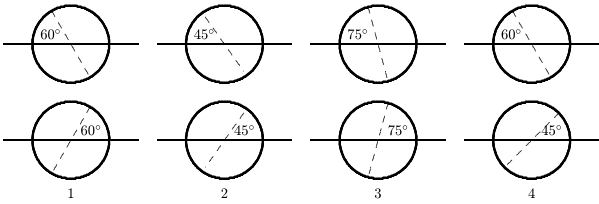

A. 1,2,3,4 3. 4,2,1,3 C. 2,4,3,1 D. 2,4,1,3 E. 3,1,4,2 ans: D

504 Chapter 33:ELECTROMAGNETIC WAVES

50.A clear sheet of polaroid is placed on top of a similar sheet so that their polarizing axes make an angle of $30^{\circ}$ with each other. The ratio of the intensity of emerging light to incident unpolarized light is:

A. 1:4 B. 1:3 C. 1:2 D. 3:4 E. 3:8 ans:E

51.An unpolarized beam of light has intensity $I_{0}$ .It is incident on two ideal polarizing sheets The angle between the axes of polarization of these sheets is $\theta$ .Find $\theta$ if the emerging ligh has intensity $I_{0}/4$

B. sin-(1/) $\sin^{-1}(1/2)$ $\begin{array}{l}\sin^{-1}(1/2)\\\sin^{-1}(1/\sqrt{5})\end{array}$ C. $\cos^{-1}(1/2)$ D. $\cos^{-1}(1/{\sqrt{2}})$ E. $\tan^{-1}(1/4)$ ans: D

52.In a stack of three polarizing sheets the first and third are crossedwhile themiddle one has its axis at $45^{\circ}$ to the axes of the other two. The fraction of the intensity of an incident unpolarized beam of light that is transmitted by the stack is

ans: D

53.Three polarizing sheets are placed in a stack with the polarizing directions of the first and third perpendicular to each other. What angle should the polarizing direction of the middle sheet make with the polarizing direction of the first sheet to obtain maximum transmitted intensity when unpolarized light is incident on the stack?

$45^{\circ}$ $90^{\circ}$ $30^{\circ}$ $60^{\circ}$ ans: C

54.Three polarizing sheets are placed in a stack with the polarizing directions of the first and third perpendicular to each other. What angle should the polarizing direction of the middle sheet make with the polarizing direction of the first sheet to obtain zero transmitted intensity when unpolarized light is incident on the stack?

A.0 B. $30^{\circ}$ C. $45^{\circ}$ D. $60^{\circ}$ E.All angles allow light to pass through ans: A

55. The relation $\theta_{\mathrm{incident}}=\theta_{\mathrm{reflected}}$ , which applies as a ray of light strikes an interface between two media, is known as:

A.Faraday's law B. Snell's law C.Ampere's law D.Cole's law E.none of these ans:E

56.The relation $n_{1}\sin\theta_{1}=n_{2}\sin\theta_{2}$ , which applies as a ray of light strikes an interface between two media, is known as:

A.Gausslaw B.Snell's law C.Faradav's law D.Cole's law E.law of sines ans: B

57.As used in the laws of refection and refraction, the“normal" direction is

A.any convenient directior B.tangent to the interface C.along the incident ray D.perpendicular to the electric field vector of the light E.perpendicular to the interface ans: E

58.When an electromagnetic wave meets areflecting surface,the direction taken by the reflected wave is determined by:

A.the material of the reflecting surface B.the angle of incidence C.the index of the medium D.the intensity of the wave E.the wavelength ans:B

506 Chapter 33:ELECTROMAGNETIC WAVES

59.The index of refraction of a substance is

A.the speed of light in the substance B.the angle of refraction C.the angle of incidence D.the speed of light in vacuum divided by the speed of light in the substance E.measured in radians ans:D

60.The units of index of refraction are:

A.m/s B.s/m C.radian D.m/s2 E.none of these ans:E

61. The diagram shows the passage of a ray of light from air into a substance X. The index of refraction of X is:

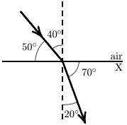

ans: C

62.If $n_{\mathrm{water}}=1.33$ , what is the angle of refraction for the ray shown?

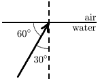

$42^{\circ}$ $22^{\circ}$ ans: D

63.Which diagram below illustrates the path of a light ray as it travels from a given point X in air to another given point Y in glass?

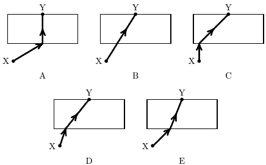

ans: E

508 Chapter 33:ELECTROMAGNETIC WAVES

64.The index ofrefractionfor diamondis 2.5.Which of the following is correct for the situatior shown?

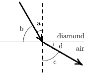

A. $(\sin a)/(\sin b)=2.5$ B. $(\sin b)/(\sin d)=2.5$ C. $(\cos a)/(\cos c)=2.5$ D. (si 0 $a/c=2.5$ $(\sin c)/(\sin a)=2.5$ ans: D

65.When light travels from medium X to mediumY as shown

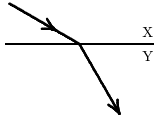

A.both the speed and the frequency decrease B.both the speed and the frequency increase C. both the speed and the wavelengthderease E.both the wavelength and the frequency are unchanged ans:C

66.A ray of light passes obliquely through a plate of glass having parallel faces. The emerging ray

A. is totally internally reflected B.is bent more toward the normal than the incident ray Sttreraese ea ans:D

67.When light passes from air to glass.it bends

A. toward the normal without changing speed B.toward the normal and slows down C.toward the normal and speeds up D. ay fom the omaland sloesdowr ans:B

68.A ray of light passes through three media as shown. The speed of light in these media obey

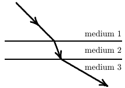

$\therefore$ $v_1> v_2> v_3$ $\therefore$ $v_3> v_2> v_1$ $\therefore$ $v_3> v_1> v_2$ $\therefore$ $v_2> v_1> v_3$ $\therefore$ $v_1> v_3> v_2$ ans: C $v_{1}>v_{3}>v_{2}$ $v_{3}>v_{1}>v_{2}$ $v_{2}>v_{1}>v_{3}$ $v_{1}>v_{2}>v_{3}$ 推$v_{3}>v_{2}>v_{1}$

69.As light goes from one medium to another, it is bent away from the normal. Then

A.the speed of thelight has increased B.dispersion must occur C.the second medium has a higher index of refraction than the first D.no change in speed has occurred E.refraction has not occurred because refraction means a bending toward the normal ans: A

70.A pole stands in a river, half in and half out of the water. Another pole of the same length stands vertically on the shore at a place where the ground is level.The shadow cast by the pole in the river on the river bottom is:

A.slightly longer than the shadow of the pole on land B. much longer than the shadow of the pole on land C.shorter than the shadow of the pole on land D. sherter then he shadow o the pole o landif the Su is high and longer f the su slow ans: C

510 Chapter 33:ELECTROMAGNETIC WAVES

71. The rectangular metal tank shown is filled with an unknown liquid. The observer, whose eye is level with the top of the tank, can just see corner E. The index of refraction of this liquid is

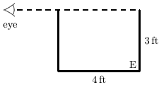

B. 1.75 C.1.50 D.1.33 E.1.25 ans:E

72.The index of refraction of benzene is 1.80.The critical angle for total internal reflection,at a benzene-air interface, is about:

A.56° B.47° C.349 D. $22^{\circ}$ E.18° ans:C

73.The index of refraction of a certain glass is 1.50. The sine of the critical angle for total internal reflection at a glass-air interface is:

A.0.50 B.0.67 C.0.75 D.1.00 E.1.50 ans: B

74.The illustration shows total internal refection taking place in a piece of glass.The index of refraction of this glass:

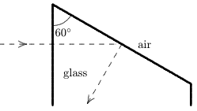

A.is at least 2.0 B.is at most 2.0 C.is at least 1.15 D.is at most 1.15 E.cannot be calculated from the given data ans: C

75.The criticalangle for total internalreflection at a diamond-air interface is $25^{\circ}$ .Suppose light is incident at an angle of $\theta$ with the normal.Total internal refection will occur if the incident medium is:

A.air and0=25° B.air and0>25° C.air and0<25° D.diamond and 025 E.diamond and 0>25 ans:E

76.If $n_{\mathrm{water}}=1.50$ and $n_{\mathrm{glass}}=1.33$ ，then total internal refection at an interface between this glass and water:

A.occurs whenever the light goes from glass to water B.occurs whenever the light goes from water to glass C.may occur when the light goesfrom glass to water D.may occur when the light goes from water to glas E.can never occur at this interface

ans:D

77.The separation of white light into colors by a prism is associated with:

A. total internal reflection B. partial reflection from each surface C. variation of index of refraction with wavelength. D.a decrease in the speed of light in the glass E. selective absorption of various colors. ans: C

512 Chapter 33:ELECTROMAGNETIC WAVES

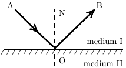

A.Angle AON is the angle of incidence B.Angle AON = angle BON 8 a 

79.A ray of light in water (index $7l_{1}$ ) is incident on its surface (with air) at the critical angle for total internal reflection. Some oil (index $7t_{2}$ )is now floated on the water.The angle betweer the ray in the oil and the normal is:

AB. sin-1(1/0) $\sin^{-1}(1.00)$ $\sin^{-1}(1/n_{1})$ C. $\sin^{-1}(1/n_{2})$ D. sin-'(m/m) $\sin^{-1}(n_{1}/n_{2})$ $\sin^{-1}(n_{2}/n_{1})$ ans: C

### Chapter 34:IMAGES

1.A virtual image is one:

A.toward which light rays converge but do not pass through B.from which light rays diverge but do not pass through C.from which light rays diverge as they pass through D.toward which light rays converge and pass through E.with a ray normal to a mirror passing through it ans: B

2.Which of the following is true of all virtual images?

A. They can be seen but not photographed C.They are smaller than the objects D.They are larger than the objects E.None of the above ans:E

3.When you stand in front of a plane mirror, your image is:

A.real, erect,and smaller than you B.real,erect,and the same size as you C.virtual,erect, and smaller than you D.virtual,erect,and the same size as you E.real, inverted, and the same size as you ans: D

4.An object is $2m$ in front of a plane mirror. Its image is:

A. virtual, inverted, and $2m$ behind the mirror B. virtual, inverted, and $2m$ in front of the mirror C.virtual, erect, and $2m$ in front of the mirron D.real, erect, and $2m$ behind the mirror E.none of the above ans:E

5. A ball is held 50cm in front of a plane mirror. The distance between the ball and its image is:

A. 100cm B. 150cm C. 200cm D.0 E. 50cm ans: A

514 Chapter 34:IMAGES

6.A card marked IAHIO8 is standing upright in front of a plane mirror. Which of the following is NOT true?

A.The image is virtual B.The image shifts its position as the observer shifts his position C.The image appears as 8OIHAI to a person looking in the mirror D. The imageiscased mostly by speularatherthan difuse relection ans:B

7.The angle between a horizontal ruler and a vertical plane mirror is $30^{\circ}$ .The angle between the ruler and its image is

A. $15^{\circ}$ B. $30^{\circ}$ C. $60^{\circ}$ D. $90^{\circ}$ E.180° ans:C

8. A 5.0-ft woman wishes to see a full length image of herself in a plane mirror. The minimum length mirror required is

A.5ft B.10ft C.2.5ft D.3.54 ft E.variable:the farther away she stands the smaller the required mirror length ans:C

9.A man holds arectangular card in front ofandparallel to aplanemirror.In order for him to see the entire image of the card, the least mirror area needed is:

A.that of the whole mirror, regardless of its size B.that of the pupil of his eye C.one-half that of the card D.one-fourth that of the card E.an amount which decreaseswithhis distance from the mirror ans: D

10.A light bulb burns in front of the center of a 40-cm wide plane mirror that is hung vertically on a wall. A man walks in front of the mirror along a line that is parallel to the mirror and twice as far from it as the bulb.The greatest distance he can walk and still see the image of the bulb is:

20 cm 40 cm 60 cm 80 cm 120 cm ans:  E

11.A plane mirror is in a vertical plane and is rotating about a vertical axis at 100rpm ：A horizontal beam of light is incident on the mirror. The refected beam will rotate at:

A. 100rpm B.141 rpm C.0rpm D. 200rpm E. 10,000rpm ans: D

12.A candle C sits between two parallel mirrors,a distance $0.2d$ from mirror 1.Here $d$ is the distance between the mirrors. Multiple images of the candle appear in both mirrors.How far behind mirror 1 are the nearest three images of the candle in that mirror?

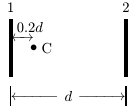

A.0.2d1.8d2.2d B.0.2d2.2d4.2d C.0.2d.1.8d.3.8d D.0.2d0.8d1.4d E.0.2d.1.8d3.4d ans: A

13.Two plane mirrors make an angle of $120^{\circ}$ with each other. The maximum number of images of an objectplaced between them is:

A.one B.two C.three D.four E.more than four ans:B

14.A parallel beam of monochromatic light in air is incident on a plane glass surface. In the glass the beam:

A. remains parallel D. undergoes dispersion B. becomes diverging E.follows a parabolic path C. becomes converging ans: A

15.The focal lengthof a sphericalmirror is $N$ times its radius of curvature where $N$ is

A.1/4 B.1/2 C.1 D.2 E.4 ans:B

16.Real images formed by a spherical mirror are always

A.on the side of the mirror opposite the source B.on the same side of the mirror as the source but closer to the mirror than the source C.on the same side of the mirror as the source but closer to the mirror than the focal point D.on the same side of the mirror as the source but further from the mirror than the focal point E.none of the above ans:E

17.The image produced by a convex mirror of an erect object in front of the mirror is always

A. virtual, erect, and larger than the object B.virtual, erect,and smaller than the object C.real, erect,and larger than the object D. real, erect, and smaller than the object E.none of the above ans: B

18. An erect object is located between a concave mirror and its focal point. Its image is:

A.real,erect,and larger than the object B.real, inverted, and larger than the object C. virtual, erect, and larger than the object. D. virtual. inveted and larger than the bjet ans: C

19.An erect object is in front of a convex mirror a distance greater than the focal length.The image is:

A. real ianverted, and maler than the objet Corelineed andle ta teee ans: D

20.As an object is moved from the center of curvature of a concave mirror towardits focalpoint its image

A. remains virtual and becomes largeer Crselea e leme sea eoe ans:C

21.As an object is moved from a distant location toward the center of curvature of a concave mirror its image:

A.remains virtual and becomes smaller B.remains virtual and becomes larger C.remains real and becomes smaller D. remains real and becomes larger E.changes from real to virtual ans: D

22.The image of an erect candle,formed using a convexmirror,is always

A. virtual, inverted, and smaller than the candle B. virtual, inverted, and larger than the candle C.virtual, erect, and larger than the candle D. virtual, erect, and smaller than the candle. E. real, erect, and smaller than the candle ans: D

23.At what distance in front of a concave mirror must an object be placed so that the image and object are the same size? A. a focal length

B.half a focal length C.twice a focal length D.less than half focal length E.more than twice a focal length ans:B

24.A point source is to be used with a concave mirror to produce a beam of parallel light. The source should be placed：

A.as close to the mirror as possible B.at the center of curvature C.midway between the center of curvature and the focal point D. midway betwen the ente of curvature and the miror ans: D

25.A concave mirror forms a real image that is twice the size of the object.If the object is 20cm from the mirror, the radius of curvature of the mirror must be about:

A.13cm B.20cm C.27cm D.40cm E.80cm ans: C

26.A man stands with his nose 8cm from a concave shaving mirror of radius 32cm The distance from the mirror to the image of his nose is:

A.8cm B.12cm C.16cm D.24cm E.32cm ans:C

27.The figure shows a concave mirror with a smallobject located at the pointmarked 6.If the image is also at this point, then the center of curvature of the mirror is at the point marked：

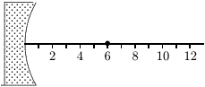

12 ans:C

28.A concave spherical mirror has a focal length of 12cm .If an object is placed $6cm$ in front of it the image position is:

A.4cm behind the mirror B.4 cm in front of the mirror C.12 cm behind the mirror D.12 cm in front of the mirror E.at infinity ans:C

29.A concave spherical mirror has a focal length of 12cm .If an object is placed 18cm in front of it the image position is:

A.7.2cm behind the mirror B.7.2 cm in front of the mirror C.36cm behind the mirror D.36 cm in front of the mirron E.at infinity ans:D

30.A convex spherical mirror has a focal length of 12cm .If an object is placed 6 cm in front of it the image position is:

A.4cmbehind the mirror B.4 cm in front of the mirror C.12 cm behind the mirror D.12 cm in front of the mirror E.at infinity ans:A

31. A concave spherical mirror has a focal length of 12cm Ifan erect object isplaced 6cm in front ofit：

A. the magnification is 2 and the image is erect B.the magnification is 2 and the image is inverted C.the magnification is 0.67 and the image is erect D.the magnification is 0.67 and the image is inverted E.the magnification is 0.5 and the image is erect ans:A

32. An erect object is located on the central axis of a spherical mirror. The magnification is -3 This means:

A. its image is real, inverted, and on the same side of the mirro B.its image is virtual, erect, and on the opposite side of the mirron C.its image is real, erect, and on the same side of the mirron D.its image is real, inverted, and on the opposite side of the mirror E. its image is virtual, inverted, and on the opposite side of the mirror ans: A

33.An object O,in air,is in front of the concave spherical refracting surface of a piece of glass Which of the general situations depicted below is like this situation?

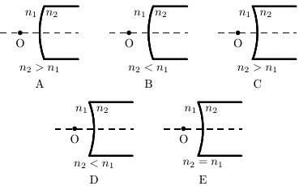

ans:C

34.A concave refracting surface is one with a center of curvature:

A.to the left of the surface B.to the right of the surface C.on the side of the incident light D.on the side of the refracted light E.on the side with the higher index of refraction ans: C

35.A convex refracting surface has a radius of 12cm .Light is incident in air $n=1$ ）and is refracted into a medium with an index ofrefraction of 2.Lightincident parallelto the central axis is focused at a point: A.3cm from the surface

B.6 cm from the surface C.12cm from the surface D.18cm from the surface E.24cm from the surface ans:E

36.A convex refracting surface has a radius of 12cm .Light is incident in air ( $n=1$ ) and refractec into a medium with an index of refraction of 2.To obtain light with rays parallel to the central axis after refraction a point source shouldbe placedon the axis

A.3cm from the surface B.6cm from the surface C.12 cm from the surface D.18 cm from the surface E.24cm from the surface ans:C

37.A concave refracting surface of a medium with index of refraction 71 produces a real image no matter where an object is placed outside:

A.always B.only if the index of refraction of the surrounding medium is less than n C.only if the index of refraction of the surrounding medium is greater than 7L D. neve of theabove ans:E

38. A convex spherical refracting surface separates a medium with index of refraction 2 from air The image of an object outside the surface is real

A.always B.never C.only if it is close to the surface D.only if it is far from the surface E.only if the radius of curvature is small ans:D

39.A convex spherical surface with radius 7 separates a medium with index of refraction 2 from air. As an object is moved toward the surface from far away along the central axis, its image

B. changes from itual torealwheit is ” 7 $r/2$ from thesurface C.changes from real to virtual when it is $r/2$ from the surface D.changes from real to virtual when it is 7 from the surface E.remains real ans: D

40.A concave spherical surface with radius 7 separates a medium with index of refraction 2 from air. As an object is moved toward the surface from far away along the central axis, its image?

A. change fom itil to ral he i ist $2r$ 2/ $r/2$ foom thesue C.changes from real to virtual when it is $r/2$ from the surface D. changs from ral to virtual when itis $2r$ from thesuface ans:E

41.An erect object is placed on the central axis of a thin lens,further from the lens than the magnitude of its focal length. The magnification is +0.4 .This means A. the image is real and erect and the lens is a converging lens

B.the image is real and inverted and the lens is a converging lens C.de e vtadot an lees dg ans: C

42.Where must an object be placed in front of a converging lens in order to obtain a virtual image?

A.At the focal point B.At twice the focal length C.Greater than the focal length D.Between the focal point and the lens E.Between the focal length and twice the focal length ans:D

43.An erect object placed outside the focalpoint of a converging lens will produce an image that is:

A.erect and virtual B.inverted and virtual C.erect and real D.inverted and real E.impossible to locate ans: D

44. An object is 30cm in front of a converging lens of focal length 10cm The image is

A.real and larger than the object B.real and the same size than the object C.real and smaller than the object D.virtual and the same size than the object E.virtual and smaller than the object ans:C

45.Let $P$ denote the object-lens distance and $\dot{\boldsymbol{\tau}}$ the image-lens distance. The image produced by a lens of focal length $f$ has a height that can be obtained from the object height by multiplying it by:

$i/p$ $i/f$ $f/i$ $f/p$ ans:B

46.A camera with a lens of focal length 6.0cm takes a picture of a 1.4-m tall man standing 11 m away. The height of the image is about

A. 0.39cm B.0.77 cm C.1.5cm D.3.0cm E. 6.0cm ans: B

47. A hollow lens is made of thin glass, as shown. It can be filled with air, water ( $n=1.3$ ）or $\mathrm{CS}_{2}$ $^{12}$ $n=1.6$ ).The lens will diverge a beam of parallel light if it is filled with:

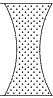

AB. air and immeresed in water 1212 S 2 ans: D

48.The object-lens distance for a certain converging lens is 400mm .The image is three times the size of the object.To make the image five times the size of the object-lens distance must be changed to:

A. 360mm B.540mm C.600mm D.720mm E. 960mm ans: A

49.An erect object is $2f$ in front of a converging lens of focal length $f$ .The image is: A. real, inverted, magnified

B. real, erect, same size C. real, inverted, same size D. virtual, inverted, reduced E. real, inverted, reduced ans: C

50.An ordinary magnifying glass in front of an erect object produces an image that is:

A.real and erect B. real and inverted C.virtual and inverted D.virtual and erect E.none of these ans:D

51.The Sun subtends $0.5^{\circ}$ as seen from Earth.The diameter of its image,using a 1.0-m focal length lens,is about:

A.10cm B.2cm C.1cm D.5mm E.1mm ans:C

52. An object is in front of a converging lens, at a distance less than the focal length from the lens. Its image is:

A.virtual and larger than the object B.real and smaller than the object C.virtual and smaller than the object D.real and larger than the object E.yirtual and the same size as the object ans: A

53.A plano-convex glass ( $n=1.5$ )lens has a curved side whose radius is 50cm If the image size is to be the same as the object size,the object should be placed at a distance from the lens of

A.50cm B.100cm C.200cm D.400cm E. 340cm ans:C

54.Which of the following five glass lenses is a diverging lens?

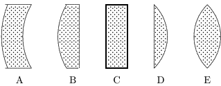

ans: A

55. The bellows of an adiustable camera can be extended so that the largest film to lens distanc is one and one-half times the focal length.If the focal length is 12cm ,the nearest object that can be sharply focused on the film must be what distance from the lens?

A.12cm B.24 cm C.36cm D. 48 cm ans:C

56. A 3-cm high object is in front of a thin lens. The object distance is 4 cm and the image distance is -8cm .The image height is

A. 0.5cm B.1cm C.1.5cm D.6cm E.24cm ans: D

57.When a single-lens camera is focused on a distant object,the lens-to-film distance is found to be 40.0mm To focus on an object 0.54m in front of the lens, the film-to-lens distance should be:

A.40.0mm B.37.3mm C.36.8mm D.42.7mm E.43.2mm ans:E

58.In a cinema,apicture 2.5cm wide on the film is projected to an image 3.0m wide on a screen that is 18 m away. The focal length of the lens is about

A. 7.5cm B.10cm C.12.5cm D.15cm E.20cm ans: D

59. The term “"virtual” as applied to an image made by a mirror means that the image

A.is on the mirror surface B.cannot be photographed by a camera C.is in front of the mirror D.is the same size as the object E.cannot be shown directly on a screen ans:E

60.Which instrument uses a single converging lens with the object placed just inside the focal point?

A.Camera B. Compound microscope C.Magnifying glass D. Overhead projector E. Telescopee ans:C

61. Let $f_{o}$ and $f_{e}$ be the focal lengths of the objective and eyepiece of a compound microscope. In ordinary use, the object：

A. is less that $f_{0}$ $f_{o}$ rom the objective lens Ce saea $2f_{e}$ $f_{o}$ ee $f_{e}$ Som h epee ans: B

62. Consider the following four statements concerning a compound microscope.

1. Each lens produces an image that is virtual and inverted 2.The objective lens has a very short focal length 3. The eyepiece is used as a simple magnifying glass. 4. The objective lens is convex and the eyepiece is concave

Whichtwo ofthe four statements are correct?

A.1, 2 B.1,3 C.1, 4 D.2.3 E.2.4 ans: D

63.What type of eyeglasses should a nearsighted person wear?

A. diverging lenses D.bifocal lenses B.converging lenses E. plano-convex lenses C.double convex lenses ans: A

64.Which of the following is NOT correct for a simple magnifying glass?

A.The image is virtual B.The image is erect C.The image is larger than the object D.The object is inside the focal point E.The lens is diverging ans:E

65.A nearsighted person can see clearly only objects within 1.4m of her eye.To see distant objects. she should wear eyeglasses of what type and focal length?.

AB. diverging 2.8 m C. converging, 2.8 m E.diverging,0.72m ans:B

66. A magnifying glass has a focal length of 15cm .If the near point of the eye is 25cm from the eye the angular magnification of the glass is about:

A.0.067 B.0.33 C.0.67 D.1.7 E.15 ans: D

67. An object is 20cm to the left of a lens of focal length +10cm .A second lens, of focal length +12.5cm ,is 30cm to the right of the first lens.The distance between the original object and the final image is:

A.28 cm B.50cm C.100cm D.0 E.infinity ans: D

68. A converging lens of focal length 20cm is placed in contact with a converging lens of focal length 30cm .The focal length of this combination is

A. +10cm B. -10cm C. +60cm D. -60cm E. +25cm ans: A

69.A student sets the cross-hairs of an eyepiece in line with an image that he is measuring.He then notes that when he moves his head slightly to the right, the image moves slightly to the left (with respect to the cross-hairs). Therefore the image is

A.infinitely far away B. farther away from him that the cross-hairs C.nearer to him than the cross-hairs D.in the focal plane of the eyepiece E.in the plane of the cross-hairs ans: C

70. In a two lens microscope, the intermediate image is

A. virtual, erect, and magnified B.real, erect, and magnified C. real, inverted, and magnified D. virtual, inverted, and reduced E. virtual, inverted, and magnified ans:C

71.Two thin lenses (focal lengths $f_{1}$ and $f_{2}$ ) are in contact. Their equivalent focal length is

A. $f_{1}+f_{2}$ B. $f_{1}f_{2}/(f_{1}+f_{2})$ C. $1/f_{1}+1/f_{2}$ D. $f_{1}-f_{2}$ E. $f_{1}(f_{1}-f_{2})/f_{2}$ ans:B

72.The two lenses shown are illuminated by a beam of parallellight from the left.Lens Bis then moved slowly toward lens A.The beam emerging from lens B is

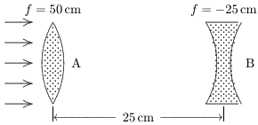

A. ialy pal and hen diverginge 1e ans: A

### Chapter 35:INTERFERENCE

1.A“wave front”is a surface of constant:

A.phase B.frequency C.wavelength D.amplitude E.speed ans: A

2.Huygens construction can be used only

A.for light B.for an electromagnetic wave C.if one of the media is vacuum (or air) D.for transverse waves E.for all of the above and other situations ans:E

3. Consider (I) the law of reflection and (II) the law of refraction. Huygensprinciple can be usec to derive：

A.only I B.only II C.both I and II D.neither I nor II E.the question is meaningless because Huygens’ principle is for wave fronts whereas both I and II concern rays ans:C

4.Units of “optical path length"are

A. $m^- 1$ B.m C.m/s D. ${\mathrm{m/Hz}}$ ans:B

5.The light waves represented by the three rays shown in the diagram all have the same frequency 4.7 wavelengths fit into layer 1, 3.2 wavelengths fit into layer 2, and 5.3 wavelengths fit into layer 3.Rank the layers according to the speeds of the waves,least to greatest

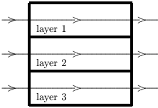

A. 1,2,3 B. 2,1,3 C. 3,1,2 D. 3,1,2 E. 1,3,2 ans: D

6.Interference of light is evidence that

A.the speed of light is very large B.light is a transverse wave C.light is electromagnetic in character D.light is a wave phenomenon E.light does not obey conservation of energy ans: D

7.The reason there are two slits,rather than one,in a Young's experiment is

A.to increase the intensity B.one slit is for frequency,the other for wavelength C.to create a path length difference D. one slit is for $\vec{E}$ fields,the other is for $\vec{B}$ fields E.two slits in parallel offer lessresistance ans:C

8.In aYoung's double-slit experiment the center of a bright fringe occurs wherever wavesfrom the slits differ in the distance they travel by a multiple of

A. a fourth of a wavelength B. a half a wavelength C.a wavelength D.three-fourths of a wavelength E.none of the above ans:E

9 .In a. Young's double-slit exneriment the center of a bright fringe occurs wherever wayes from the slits dliffer in phase by amultiple of:

B. $\begin{array}{l}{\pi/4}\\{\pi/2}\end{array}$ C.π D. $3\pi/4$ E. $2\pi$ ans:E

10.Waves from two slits are in phase at the slits and travel to a distant screen to produce the third side maximum of the interference pattern.The difference in the distance traveled by the waves is:

A. half a wavelength B.a wavelength C.three halves of a wavelength D.two wavelengths E. three wavelengths ans:E

11. Waves from two slits are in phase at the slits and travel to a distant screen to produce the second minimum of the interference pattern.The difference in the distance traveled by the waves is:

A. half a wavelength B.a wavelength C.three halves of a wavelength D.two wavelengths E.five halves of a wavelength ans:C

12.Amonochromatic light source illuminates a double slit and the resulting interference pattern is observed on a distant screen.Let $d=$ center-to-center slit spacing, $u=$ individual slit width D = screen-to-slit distance, and $\ell=$ adjacent dark line spacing in the interference pattern.The wavelength of the light is then:

$Ld/a$ $d\ell/D$ $\ell D/a$ $da/D$ $D$ Dd/e ans:A

13. Light from a small region of an ordinary incandescent bulb is passed through a yellow filter and then serves as the source for a Young's double-slit experiment.Which of the following changes would cause the interference pattern to be more closely spaced?

A.Use slits that are closer together B.Use a light source of lower intensity C. Uuse light source o higherintensi yitere E.Move the light source further away from the slits. ans: D

14. In a Young's double-slit experiment, the slit separation is doubled. To maintain the same fringe spacing on the screen, the screen-to-slit distance $LD$ must be changed to:

A. $D/2$ B. $D/{\sqrt{2}}$ C. $D{\sqrt{2}}$ D. $2D$ E. $4D$ ans: D

15.In a Youngs double-slit experiment, light of wavelength 500 nm illuminates two slits that are separated by 1mm .The separation between adjacent bright fringes on a screen $5m$ from the slits is:

A. 0.10cm B.0.25cm C.0.50cm D.1.0cm E.none of theabove ans: B

16.In a Young's double-slit experiment, the separation between slits is $a$ and the screen is a distance $LD$ from the slits. $D$ is much greater than $d$ and $\lambda$ is the wavelength of the light.The number of bright fringes per unit width on the screen is:

A. $Dd/\lambda$ B. $D\lambda/d$ C. $D/d\lambda$ D. $\lambda/Dd$ E. $d/D\lambda$ ans: E

17.In a Young's double-slit experiment, the slit separation is doubled. This results in

A.an increase in fringe intensity B.a decrease in fringe intensity C.a halving of the wavelength D.a halving of the fringe spacing E.a doubling of the fringe spacing ans: D

18. In an experiment to measure the wavelength of light using a double slit, it is found that the fringes are too close together to easily count them.To spread out the fringe pattern, one could

A. decrease the slit separation B.increase the slit separation C.increase the width ofeach slit D. decrease the width o ach slit ans:A

19.The phase difference between the two waves that give rise to a dark spot in a Young's double-sli experiment is (where $m=$integer ：

A.zero B. $2\pi m+\pi/8$ C. $2\pi m+\pi/4$ D. $2\pi m+\pi/2$ E. $2\pi m+\pi$ ans:E

20.In a Young's experiment, it is essential that the two beams: A.have exactly equal intensity

B.be exactly parallel C.travel equal distances D.come originally from the same source E.be composed of a broad band of frequencies ans: D

21.A light wave with an electric field amplitude of $E_{0}$ and a phase constant of zero is to be combined with one of the following waves:

wave A has an amplitude of $E_{0}$ and a phase constant of zero wave B has an amplitude of $E_{0}$ and a phase constant of TI wave C has an amplitude of $2E_{0}$ and a phase constant of zero wave D has an amplitude of $2E_{0}$ and a phase constant of TI wave E has an amplitude of $3E_{0}$ andaphase constant of 71 Which of these combinations produces the greatest intensity? ans:C

22. A light wave with an electric field amplitude of $2E_{0}$ and a phase constant of zero is to be combined with one of the following waves:

wave A has an amplitude of $E_{0}$ and a phase constant of zero wave B has an amplitude of $E_{0}$ and a phase constant of TT wave C has an amplitude of $2E_{0}$ and a phase constant of zero wave D has an amplitude of $2E_{0}$ and a phase constant of TT wave E has an amplitude of $3E_{0}$ and a phase constant of 71 Which of these combinations produces the least intensity? ans:D

534 Chapter 35:INTERFERENCE

23.One of the two slits in a Young's experiment is painted over so that it transmits only one-half the intensity of the other slit. As a result

A.the fringe system disappears B.the bright fringes get brighter and the dark ones get darker C.the fringes just get dimmer D.the dark fringes just get brighter E.the dark fringes get brighter and the bright ones get darker ans:E

24.In a Young's double-slit experiment,a thin sheet of mica is placed over one of the two slits.As a result,the center of the fringe pattern (on the screen) shifts by an amount corresponding to 30 dark bands. The wavelength of the light in this experiment is 480nm and the index of the mica is 1.60. The mica thickness is:

A. 0.090mm B.0.012mm C.0.014 mm D.0.024 mm E. 0.062mm ans: D

25.Light from a point source X contains only blue and red components.After passing through a mysterious box, the light falls on a screen. Bright red and blue hands are observed as shown The box must contain:

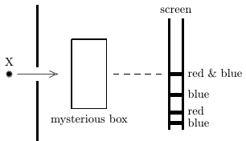

A D. a doublesie it ele ans:D

26.Binoculars and microscopes are frequently made with coatedoptics by adding a thinlaver of transparent material to the lens surface as shown. One wants

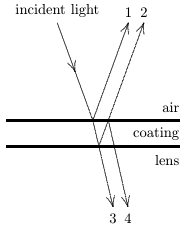

A.constructive interference between waves 1 and 2 B.destructive interference between waves 3 and 4 C. constructive interference between 3 and 4 D.the coating to be more transparent than thelens E.the speed of light in the coating to be less than that in the lens ans:C

27. Monochromatic light, at normal incidence, strikes a thin film in air. If $\lambda$ denotes the wavelength in the film, what is the thinnest film in which the reflected light will be a maximum？

A.Much less than $\lambda$ B.入/4 C.入/2 D. $3\lambda/4$ E.入ans: B

28.A soap film is illuminated by white light normal to its surface.The index of refraction of the film is 1.50.Wavelengths of 480nm and 800nm and no wavelengths between are be intensified in the reflected beam.The thickness of the film is:

A. $1.5\times10^{-5}$ cm B. $2.4\times10^{-5}$ cm C. $3.6\times10^{-5}$ cm D. $4.0\times10^{-5}$ cm E. $6.0\times10^{-5}$cm ans: D

29.Red light is viewed through a thin vertical soap film.At the third dark area shown, the thickness of the film, in terms of the wavelength within the film,is:

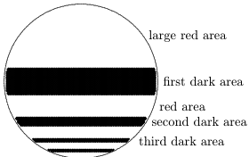

ans:E

30.Yellow light is viewed by refection from a thin vertical soap film.Let $\lambda$ be the wavelength of the light within the film.Why is there a large dark space at the top of the film?

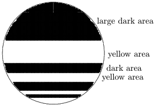

$\lambda/4$ $\lambda$ ma ans:C

31.Three experiments involving a thin film (in air)are shown.If $t$ denotes the film thickness and $\lambda$ denotes the wavelength of the light in the film,which experiments will produce constructive interference as seen by the observer? The incident light is nearly normal to the surface

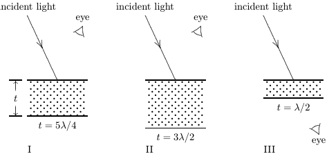

$$\begin{aligned}
&\text{A}&& \mathrm{I~only} \\
&\text{B}&& \mathrm{II~only} \\
&\text{C}&& \mathrm{III~only} \\
&\mathrm{D.}&& \mathrm{I~and~III~only} \\
&\mathrm{E.}&& \mathrm{II~and~III~only} \\
&&&\text{ans:D}
\end{aligned}$$

32. A liquid of refractive index $n=4/3$ replaces the air between a fixed wedge formed from two glass plates as shown.As a result,the spacing between adjacent dark bandsin the interference pattern:

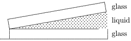

decreases to 3/4of its original value E.decreases to 1/3 of its original value ans: D

33.A lens with a refractive index of 1.5 is coated with a material of refractive index 1.2 in order to minimize reflection. If $\lambda$ denotes the wavelength of the incident light in air,what is the thinnest possible such coating?

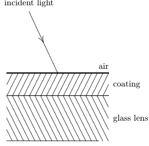

A.0.5入B.0.416入C.0.3入D.0.208入E.0.25入ans: D

34.In a thin film experiment, a wedge of air is used between two glass plates. If the wavelength of the incident light in air is 480nm ,how much thicker is the air wedge at the $16^{\mathrm{th}}$ dark fringe than it is at the $6^{\mathrm{th}}$

A. 2400m B. 4800m C.240nm D.480 nm E.None of these ans:A

35.An air wedge is formed from two glass plates that are in contact at their left edges.There are ten dark bands when viewed by reflection using monochromatic light. The left edge of the top plate is now slowly lifted until the plates are parallel. During this process:

A.the dark bands crowd toward the right edge B.the dark bands remain stationary C.the dark bands crowd toward the left edge D.the dark bands spread out, disappearing off the right edge E.the dark bands spread out,disappearing off the left edge ans: E

36.An air wedge is formedusing two glass plates that arein contact along theirleft edge.Wher viewed by highly monochromatic light, there are exactly 4001 dark bands in the reflected light. The air is now evacuated (with the glass plates remaining rigidly fixed) and the number of dark bands decreases to exactly 400o.The index of refraction of the air is:

A.0.00025 B.0.00050 C.1.00025 D.1.00050 E.1.00000,by definition ans: C

37.A glass ( $n=1.6$ )lens is coated with a thin film ( $n=1.3$ ) to reduce reflection of certain incident light. If $\lambda$ is the wavelength of the light in the film, the least film thickness is

A.less than $\lambda/4$ B. $\lambda/4$ C.入/2 D.入E.more than $\lambda$ ans: B

38. Two point sources, vibrating in phase,produce an interference pattern in a ripple tank. If the frequency is increased by $20\%$ ,the number of nodal lines:

A.is increased by $20\%$ B.is increased by $40\%$ C.remains the same D.is decreased by 20% E.is decreased by 40% ans: A

39.If two light waves are coherent:

A.their amplitudes are the same B.their frequencies are the same C.their wavelengths are the same D.their phase difference is constant E. the difference in their frequencies is constant ans: D

40.To obtain an observable double-slit interference pattern

A.the lightmust be incident normally on the slits B.the light must be monochromatic C.the light must consist of plane waves D.the light must be coherent E.the screen must be far away from the slits ans: D

540 Chapter 35:INTERFERENCE

### Chapter 36:DIFFRACTION

1.Sound differs from light in that sound:

A.is not subject to difraction B.is a torsionalwave rather than a longitudinalwave C.does not require energy for its origin D.is a longitudinalwave rather than a transverse wave E. is always monochromatic ans: D

2.Radio waves are readily diffracted around buildings whereas light waves are negligibly diffracted around buildings. This is because radio waves: A.are plane polarized

B.have much longer wavelengths than light waves C.have much shorter wavelengths than light waves D. are nearly monochromatic (single frequency) E.are amplitude modulated (AM) ans: B

3.Diffraction plays an important role in which of the following phenomena?

A.The sun appears as a disk rather than a point to the naked eye B.Light is bent as it passes through a glass prism C.A cheerleader yells through a megaphone D.A farsighted person uses eyeglasses of positive focal length E.A thin soap film exhibits colors when illuminated with white light ans:C

4.The rainbow seen after a rain shower is caused by

A. diffraction B.interference C.refraction D.polarization E. absorption ans:C

5.When a highly coherent beam of light is directed against avery fine wire,the shadow formec behind it is not just that of a single wire but rather looks like the shadow of several parallel wires. The explanation of this involves:

A. refraction B.diffraction C. reflection D. theDoplefet ans: B

6.When the atmosphere is not quite clear. one may sometimes see colored circles concentric with the Sun or the Moon.These are generally not more than a few diameters of the Sun or Moon and invariably the innermost ring is blue.The explanation for this phenomena involves:

A. reflection B.refraction C. interference D. diffraction E.the Doppler effect ans: D

7.The shimmering or wavy lines that can often be seen near the ground on a hot day are due to

A.Brownian movement B. reflection C.refraction D.diffraction E. dispersion ans:C

8.A point source of monochromatic light is placed in front of a soccer ball and a screen is placed behind the ball. The light intensity pattern on the screen is best described as

A.a dark disk on a bright background B.a dark disk with bright rings outside C.a dark disk with a bright spot at its center D.a dark disk with a bright spot at its center and bright rings outside E.a bright disk with bright rings outside ans: D

9.In the equation $\sin\theta=\lambda/a$ for single-slit diffraction, $\theta$ is：

A.the angle to the first minimum B.the angle to the second maximum C.the phase angle between the extreme rays D. $N\pi$ where $N$ is an integer E. $(N+1/2)\pi$ where $N$ is an integer ans: A

10.In the equation $\phi=(2\pi a/\lambda)\sin\theta$ for single-slit diffraction, $\phi$ is

A.the angle to the first minimum B.the angle to the second maximum C.the phase angle between the extreme rays D. $N\pi$ where $N$ is an integer E. $(N+1/2)\pi$ where $N$ is an integer ans:C

11.No fringes are seen in a single-slit diffraction pattern if

A.the screen is far away B.the wavelength is less than the slit width C.the wavelength is greater than the slit width D.the wavelength is less than the distance to the screen E.the distance to the screen is greater than the slit width ans:C

12.A student wishes to produce a single-slit diffraction pattern in a ripple tank experiment.He considers the following parameters:

1. frequency 2.wavelength 3.water depth 4.slit width

Which two of the above should be decreased to produce more bending?

A.1,3 B.1, 4 C.2.3 D.2,4 E.3.4 ans:B

13.A parallel beam of monochromatic light is incident on a slit of width 2cm The light passing through the slit falls on a screen $2m$ away. As the slit width is decreased

A.the widthof the pattern on the screen continuously decreases B.the width of the pattern on the screen at first decreases but then increases C.the width of the pattern on the screen increases and then decreases D.thewidth of the pattern on the screenremains the same E.the pattern on the screen changes color going from red to blue ans:B

14.Monochromatic plane waves of light are incident normally on a single slit.Which one of the five figures below correctly shows the diffraction pattern observed on a distant screen?

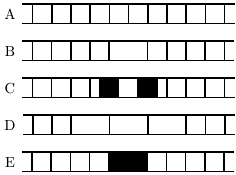

ans: B

15.The diagram shows a single slit with the direction to a point P on a distant screen shown.At P, the pattern has its second minimum (from its central maximum). If X and Y are the edges of the slit,what is the path length difference (PX) - (PY)?

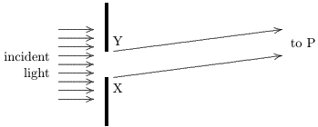

B. 入/2 C. $3\lambda/2$ D. $2\lambda$ E. $5\lambda/2$ ans: D

16.The diagram shows a single slit with the direction to a point $P$ on a distant screen shown. At P, the pattern has its maximum nearest the central maximum.If X and Y are the edges of the slit.what is the path length difference (PX)-(PY)？

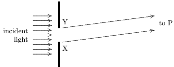

$5\lambda/2$ ans:C

17.At the first minimum adjacent to the centralmaximum of a single-slit diffraction pattern the phase difference between the Huygens wavelet from the top of the slit and the wavelet from the midpoint of the slit is:

A. $\pi/8$ rad B. T/2 $\pi/4$ $\pi/2$ rad D. 3r/a ad ans: D

544 Chapter 36:DIFFRACTION

18.At the second minimum adjacent to the central maximum of a single-slit diffraction pattern the Huygens wavelet from the top of the slit is $180^{\circ}$ out of phase with the wavelet from:

A. a point one-fourth of the slit width from the top B. the midpoint of the slit C.a point one-fourth of the slit width from the bottom of the slit D.the bottom of the slit E.none of these ans: A

19.A plane wave with a wavelength of 500nm is incident normally on a single slit with a width of $5.0\times10^{-6}$m . Consider waves that reach a point on a far-away screen such that rays from the slit make an angle of $1.0^{\circ}$ with the normal. The difference in phase for waves from the top and bottom of the slit is:

A.0 B.0.55rad C.1.1rad D.1.6rad E.2.2rad ans: C

20.A diffraction pattern is produced on a viewing screen by illuminating a long narrow slit with light of wavelength $\lambda$ .If $\lambda$ is increased and no other changes aremade:

A.the intensity at the center of the pattern decreases and the pattern expands away from the bright center B.the intensity at the center of the pattern increases and the pattern contracts toward the bright center C.the intensity at the center of the pattern does not change and the pattern expands away from the bright center D.the intensity at the center of the pattern does not change and the pattern contracts towarc the bright center E.neither the intensity at the center of the pattern nor the pattern itself change ans:C

21.A diffraction pattern is produced on a viewing screen by illuminating a long narrow slit with light of wavelength $\lambda$ .If the slit width is decreased and no other changes are made:

A.the intensity at the center of the pattern decreases and the pattern expands away from the bright center B.the intensity at the center of the pattern increases and the pattern contracts toward the bright center C. the intensity at the center of the pattern does not change and the pattern expands away from the bright center D.the intensity at the center of the pattern does not change and the pattern contracts toward the bright center E.neither the intensity at the center of the pattern nor the pattern itself change ans: A

22.In order to obtain a good single-slit diffraction pattern.the slit width could be

A.入B. $\lambda/10$ C. $10\lambda$ D. $10^{4}\lambda$ E. $\lambda/10^4$ ans:C

23.Consider a single-slit diffraction pattern caused by a slit ofwidth $d$ .There is a maximum if $\sin\theta$ is equal to:

A.slightly more than $3\lambda/2a$ B.slightly less than $3\lambda/2a$ C.exactly $3\lambda/2a$ D. exactly $\lambda/2a$ E.very nearly $\lambda/2a$ ans:B

24.Consider a single-slit diffraction pattern caused by a slit of width $u$ .There is a minimum if $\sin\theta$ isequal to:

A. exactly $\lambda/a$ B.slightly more than $\lambda/a$ C.slightly less than $\lambda/a$ D. exactly $\lambda/2a$ E.very nearly $\lambda/2a$ ans: A

25.In a single-slit diffraction pattern, the central maximum is about twice as wide as the other maxima. This is because: A. half the light is diffracted up and half is diffracted down

B.the central maximum has both electric and magnetic fields present C.the small angle approximation applies only near the central maximum D.the screen is fat instead of spherical E.none of the above ans: E

26.The intensity at a secondary maximum of a single-slit diffraction pattern is less than the intensity at the central maximum chiefly because

A.some Huygens wavelets sum to zero at the secondary maximum but not at the central maximum B.the secondary maximum is further from the slits than the central maximum and intensity decreases as the square of the distance C.the Huygens construction is not valid for a secondary maximum D.the amplitude of every Huygens wavelet is smaller when it travels to a secondary maximum than when it travels to the central maximum E.none of the above ans:A

546 Chapter 36:DIFFRACTION

27.Figure (i) shows a double-slit pattern obtained using monochromatic light.Consider the fol lowing five possible changes in conditions:

1. decrease the frequency 2. increase the frequency 3. increase the width of each slit 4.increase the separation between the slits 5.decrease the separation between the slits

Which of the above would change Figure (i) into Figure (ii)？

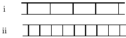

28.Two wavelengths, 800 nm and 600 nm , are used separately in single-slit diffraction experiments The diagram shows the intensities on a far-away viewing screen as function of the angle made by the rays with the straight-ahead direction.If both wavelengths are then used simultaneously. at which angle is the light on the screen purely 800-nm light?

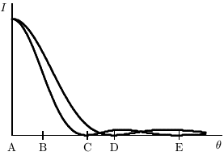

ans: C

29. If we increase the wavelength of the light used to form a double-slit diffraction pattern:

A.the width of the central diffraction peak increases and the number of bright fringes within the peak increases B.the width of the central diffraction peak increases and the number of bright fringes withir the peak decreases C.the width of the central diffraction peak decreases and the number of bright fringes within the peak increases D.the width of the central diffraction peak decreases and the number of bright fringes within the peak decreases E.the width of the central diffraction peak increases and the number of bright fringes within the peak stays the same ans: E

30. Two slits of width $u$ and separation $d$ are illuminated by a beam of light of wavelength $\lambda$ .The separation of the interference fringes on a screen a distance $D$ away is

A. $\lambda a/D$ B. $\lambda d/D$ C. $\lambda D/d$ D. $dD/\lambda$ E. $\lambda D/a$ ans: C

31.Two slits in an opaque barrier each have a width of 0.020mm and are separated by 0.050mm When coherent monochromatic light passes through the slits the number of interference maxima within the central diffraction maximum

A.is 1 B.is 2 C.is 4 D.is 5 E.cannot be determined unless the wavelength is given ans: D

32.When 450-nm lightis incidentnormally on a certain double-slit svstem the number ofinterfer ence maxima within the central diffraction maximum is 5. When 900-nm light is incident on the same slit system the number is:

ans:C

548 Chapter 36:DIFFRACTION

33.In a double-slit diffraction experiment the number ofinterference fringes within the centra diffraction maximum can be increased by：

A. increasing the wavelength B. decreasing the wavelength. C. decreasing the slit separation D.increasing the slit width E.decreasing the slit width ans:E

34. A diffraction-limited laser of length $E$ and aperture diameter $d$ generates light of wavelength $\lambda$ .If the beam is directed at the surface of the Moon a distance $D$ away, the radius of the illuminated area on the Moon is approximately

A.dD/ B. $dD/\lambda$ C.DX/ D. $D\lambda/d$ E.e入/d ans: D

35.Two stars that are close together are photographed through a telescope.The black and white film is equally sensitive to all colors.Which situation would result in the most clearly separated images of the stars?

A.Small lens,red stars B.Small lens, blue stars C. Large lens, re stars E.Large lens. one star red and the other blue ans: D

36.Theresolvingpower of a telescope canbe increased by

A.increasing the objective focal length and decreasing the eyepiece focal length B.increasing the lens diameters C.decreasing the lens diameters D.inserting a correction lens between objective and eyepiece E.none of the above ans:B

37. In the equation $d\sin\theta=m\lambda$ for the lines of a diffraction grating 7772 iss

A.the number of slits B.the slit width C.the slit separation D.the order of the line E.the index of refraction ans: D

38.In the equation $d\sin\theta=m\lambda$ for the lines of a diffraction grating $d$ is:

A.the number of slits B.the slit width C.the slit separation D.the order of the line E. the index of refraction ans:C

39.As more slits with the same spacing are added to a diffraction grating the lines:

A. spread farther apart B.move closer together C.become wider D.becomes narrower E.do not change in position or width ans: D

40.An $N$ -slit system has slit separation $d$ and slit width $d$ .Plane waves with intensity $I$ and wavelength $\lambda$ are incident normally on it.The angular separation of the lines depends only on

A. $u.$ and $N$ B. $u$ and $\lambda$ C. $N$ and $\lambda$ D.dand 入E. $I$ and $N$ ans: D

41.600-nm light is incident on a diffraction grating with a ruling separation of $1.7\times10^{-6}$m .The second order line occurs at a diffraction angle of

A.0 B.10° C.21° D.42° E.45° ans:E

42. The widths of the lines produced by monochromatic light falling on a diffraction grating can be reduced by:

A.increasing the wavelength of the light B.increasing the number of rulings without changing their spacing C. dereasingthe spacing betwe adaent rling without changing the uinber f rulings E.increasing the number of rulings and decreasing their spacing so the length of the grating remains the same ans: B

550 Chapter 36:DIFFRACTION

43.Monochromatic light is normally incident on a diffraction grating that is 1cm wide and has 10,000 slits. The first order line is deviated at a $30^{\circ}$ angle. What is the wavelength, in nm, of the incident light？

A.300 B.400 C.500 D.600 E.1000 ans: C

44.A light spectrum is formed on a screen using a diffraction grating. The entire apparatus (source grating and screen) is now immersed in a liquid of refractive index 1.33. As a result, the pattern on the screen:

A.remains the same B.spreads out C. crowds together D.becomes reversed,with the previously blue end becoming red E.disappears because the refractive index isn't an integer ans: C

45.The spacing between adjacent slits on a diffraction grating is $3\lambda$ .The deviation $\theta$ of the first order diffracted beam is given by

A. $\sin(\theta/2)=1/3$ B. $\sin(\theta/3)=2/3$ C. $\sin(\theta)=1/3$ D. $\tan(\theta/2)=1/3$ E. $\tan(\theta)=2/3$ ans:C

46.When light of a certain wavelength is incident normally on a certain diffraction grating the line of order 1 is at a diffraction angle of $25^{\circ}$ .The diffraction angle for the second order line is

A. $25^{\circ}$ B. $42^{\circ}$ C. $50^{\circ}$ D. $58^{\circ}$ E. $75^{\circ}$ ans D

47. A diffraction grating of width $W$ produces a deviation $\theta$ in second order for light of wavelength $\lambda$ .The total number $N$ of slits in the grating is given by:

A. $2W\lambda/\sin\theta$ B. $(W/\lambda)\sin\theta$ C. $\lambda W/2\sin\theta$ D. $(W/2\lambda)\sin\theta$ E. $2\lambda/\operatorname{sin}\theta$ ans: D

48.Light of wavelength $\lambda$ is normally incident on a diffraction grating G. On the screen S, the central line is at $P$ and the first order line is at Q,as shown.The distance between adjacent slits in the grating is:

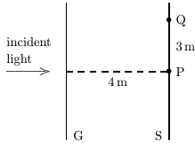

5入/3 ans:E

49.550-nm light is incident normally on a diffraction grating and exactly 6lines are produced The ruling separation must be:

A.between $2.75\times10^{-7}$m and $5.50\times10^{-7}$ m B.between $5.50\times10^{-7}$ m and $1.10\times10^{-6}$ m C.between $3.30\times10^{-6}$m and $3.85\times10^{-6}$ D.between $3.85\times10^{-6}$m and $4.40\times10^{-6}$r E.greater than $4.40\times10^{-6}$ m ans:E

50.A mixture of 450-nm and 900-nm light is incident on a diffraction grating.Which of the following is true?

A.all lines of the 900-nm light coincide with even order lines of the 450-nm light B.all lines of the 450-nm light coincide with even order lines of the 900-nm light C.all lines of the 900-nm light coincide with odd order lines of the 450-nm light D.None of the lines of the 450-nm light coincide with lines of the 900-nm light E.All of thelines of the 450-nm light coincidewith lines of the900-nm light ans: A

51.Abeam of white light （from 400nm for violet to 700nm for red)is normallyincident on 8 diffraction grating. It produces two orders on a distant screen. Which diagram below ( $\mathbf{R}=$ red,V=violet)correctly shows the pattern on the screen?

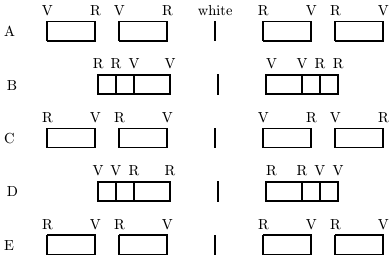

ans: C

52.If white light is incident on a diffraction grating

A.the first order lines for all visible wavelengths occur at smaller diffraction angles than any of the second order lines B.some first order lines overlap the second order lines if the ruling separationis smallbut dc not if it is large C.some first order lines overlap second order lines if the ruling separation is large but do not if it is small D.some first order lines overlap second order lines no matter what the ruling separation E.first and second order lineshave the same range of diffraction angles ans: A

53.Light of wavelength is normally incident on some plane optical device. The intensity pattern shown is observed on a distant screen( $\theta$ is the angle measured from the normal of the device) The device could be:

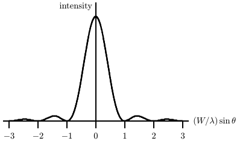

A.a single slit of width $W$ B.a single slit of width 2W C.two narrow slits with separation $W$ D.two narrow slits with separation $2W$ E.a diffraction grating with slit separation $W$ ans:A

54.A person with her eye relaxed looks through a diffraction grating at a distant monochromatic point source of light. The slits of the grating are vertical. She sees:

A. one point of light B.a hazy horizontal strip of light of the same color as the source D. alhay sti o ight vayingfromvilet to redl E.a sequence of closely spaced vertical lines ans:D

55.Monochromatic light is normally incident on a diffraction grating. The $m^{\mathrm{th}}$ order line is at a diffraction angle $\theta$ and has width $ub$ .A wide single slit is now placed in front of the grating and its width is then slowly reduced.As a result：

A.both $\theta$ and $ub$ increase B.both $\theta$ and $ub$ decrease C. $\theta$ remains the same and $u$ increases D. $\theta$ remains the same and $u$ decreases E. $\theta$ decreases and $ub$ increases ans:C

56. At a diffraction line phasors associated with waves from the slits of a multiple-slit barrier

A.are aligned B.form a closed polygon C.form a polygon with several sides missing D.are parallel but adjacent phasors point in opposite directions E.form the arc of a circle ans:A

57.For a certain multiple-slit barrier the slit separation is 4 times the slit width.For this system

A.the orders of the lines that appear are all multiples of 4 B.the orders of lines that appear are all multiples of 2 C.the orders of the missing lines are all multiples of 4 D.the orders of the missing lines are all multiples of 2 E.none of the above are true ans: C

58. The dispersion $D$ of a grating can have units

A.cm B.1/nm C.nm/cm D.radian E.none of these ans: B

59.The resolving power $k$ of a grating can have units

A.cm B.degree/nm C.watt D.nm/cm E.watt/nm ans: D

60.The dispersion of a diffraction grating indicates

A.the resolution of the grating B.the separation of lines of the same order C.the number of rulings in the grating D.the width of the lines E.the separation of lines of different order for the same wavelength ans: B

61.The resolving power of a diffraction grating is defined by $R=\lambda/\Delta\lambda$ .Here $\lambda$ and $\lambda+\Delta\lambda$ are:

A.any two wavelengths B.any twowavelengths that are nearly the same C.two wavelengths for which lines of the same order are separated by TI radians D.two wavelengths for which lines of the same order are separated by $2\pi$ radians E.two wavelengths for which lines of the same order are separated by half the width of a maximum ans:E

62.A light beam incident on a diffraction grating consists of waves with two different wavelengths The separation of the two first order lines is great if:

A.the dispersion is great B.the resolution is great C.the dispersion is small D.the resolution is small E.none of the above (line separation does not depend on either dispersion or resolution ans: A

63.To obtain greater dispersion by a diffraction grating:

A.the slit width should be increased B.the slit width should be decreased C.the slit separation should be increased D.the slit separation should be decreased E.more slits with the same width and separation should be added to the system ans: D

64.Two nearly equal wavelengths of light are incident on an $N$ -slit grating. The two wavelengths are not resolvable. When $N$ is increased they become resolvable. This is because A.more light gets through the grating

B.the lines get more intense C.the entire pattern spreads out D.there are more orders present E.the lines become more narrow ans:E

65.A diffraction grating just resolves the wavelengths 400.0 nm and 400.1nm in frst order. The number of slits in the grating is

A.400 B.1000 C.2500 D.4000 E.not enough information is given ans: D

66. What is the minimum number of slits required in a diffraction grating to just resolve light witl wavelengths of 471.0 nm and 471.6m

A.99 B.197 C.393 D.786 E.1179 ans:C

67.X rays are:

A.electromagnetic waves B.negatively charged ions C. rapidly moving electrons D. rapidly moving protons E. rapidly moving neutrons ans: A

68.Bragg's law for x-ray diffraction is $2d\sin\theta=m\lambda$ ,where $\theta$ is the angle between the incident beam and

A.a reflecting plane of atoms B.the normal to a reflecting plane of atoms C.the scattered beam D.the normal to the scattered beam E.the refracted beam ans: A

69.Bragg's law for x-ray diffraction is $2d\sin\theta=m\lambda$ ,where the quantity $d$ is

A.the height of a unit cell B.the smallest interatomic distance C.the distance from detector to sample D.the distance between planes of atoms E.the usual calculus symbol for a differential ans: D

70.Which of the following is true for Bragg diffraction but not for diffraction from a grating?

A.Two different wavelengths may be used B.For a given wavelength,a maximum may exist in several directions C.Long waves are deviated more than short ones D. Th c ans:E

71.The longest x-ray wavelength that can be diffracted by crystal planes with a separation of 0.316m is:

A.0.158 nm B.0.316 nm C.0.474nm D. 0.632nm E.1.26nm ans: D

72.A beam of X rays of wavelength 0.20m isdiffractedbya set of planesin a crystalwhose separation is $3.1\times10^{-8}$cm .The smallest angle between the beam and the crystal planes for which a reflection occurs is:

A.0.70rad B.0.33rad C.0.033rad D.0.066rad E.no such angle exists ans: C

73.An x-ray beam of wavelength $3\times10^{-11}$m is incident on a calcite crystalof lattice spacing 0.3nm .The smallest angle between crystal planes and the x-ray beam that will result in constructive interference is:

A.2.87° B.5.73° C.11.63 D.23.27 E.none of these ans: A

74.A beam of x rays of wavelength 0.10m is found to diffract in second order from the face of a LiF crystal at a Bragg angle of $30^{\circ}$ .The distance between adjacent crystal planes,in nm,is about:

A.0.15 B.0.20 C.0.25 D.0.30 E.0.40 ans: B

### Chapter 37: SPECIAL THEORY OF RELATIVITY

1.A basic postulate of Einstein's theory of relativity is:

A.moving clocks run more slowly than when they are at rest B.moving rods are shorter than when they are at rest C. light has bothwave and patile propertieobservers moving with niformn veloit relatie to each other E. everything is relative ans: D

2.A consequence of Einstein's theory of relativity is:

A.moving clocks run more slowly than when they are at rest B.moving rods are longer than when they are at rest C.light has both wave and particle properties D.the laws of physics must appear the same to all observers moving with uniform velocity relative to each other E.everything is relative ans: A

3.A consequence of Einstein's theory ofrelativity is:

A.moving clocks run faster than when they are at rest B.moving rods are shorter than when they are at rest C.light has both wave and particle properties D.the laws of physics must appear the same to all observers moving with uniform velocity relative to each other E.everything is relative ans: B

4.According to the theory of relativity

A.moving clocks run fast B.energy is not conserved in high speed collisions C.the speed of light must be measured relative to the ether D.momentum is not conserved in high speed collisions E.none of the above are true ans: E

5.Two events occur simultaneously on the $3E$ axis of reference frame S,one at $x=-a$ and the other at $x=+a$ .According to an observer moving in the positive $3E$ direction

A.the event at $x=+a$ occurs first B.the event at $x=-a$ occurs first C.either event might occur first,depending on the value of $d$ and the observer's speed D.the events are simultaneous E.none of the above ans: A

6.Two events occur simultaneously at separated points on the $y$ axis of reference frame S.Ac cording to an observer moving in the positive 22 direction:

B. thevent with thegreater $y$ $y$ coordinate ocurs fest C. ateoeaiee iet eeoa oa e erae ans: D

7.A train traveling very fast ( $v=0.6c$ c)has an engineer (E)at the front,a guard (G)at the rear, and an observer ( $S^{\prime}$ )exactly half way between them.Both $E$ and G are equipped with yellow signaling lamps. The train passes a station, closely observed by the station master (S) Both $E$ and G use their lamps to send signals.According to both S and S' these signals arrive simultaneously at the instant S' is passing S. According to $\mathbf{S}^{\prime}$

A.E and G sent their signals simultaneously from diferent distances B.G sent his signal before $E$ and from farther away C.G sent his signal before E but was the same distance away D.E sent his signal before G and from farther away E.none of the above ans:E

8.The proper time between two events is measured by clocks at rest in a reference frame in whicl the two events:

A.occur at the same time B.occur at the same coordinates C.are separated by the distance a light signal can travel during the time interva D. occur in Boston E.satisfy none of the above ans: B

9. The spaceship U.S.S. Enterprise, traveling through the galaxy, sends out a smaller explore craft that travels to a nearby planet and signals its findings back. The proper time for the trip to the planet is measured by clocks:

A.on board the Enterprise B.on board the explorer craft C. on Earth D.at the center of the galaxy E.none of the above ans:B

10. Spaceship A, traveling past us at 0.7c, sends a message capsule to spaceship B, which is in front of A and is traveling in the same direction as A at 0.8c relative to us. The capsule travels at $0.95c$ ：relative to us.A clock that measures the proper time between the sending and receiving of the capsule travels:

A.in the same direction as the spaceships at $0.7c$ relative to us B.in the opposite direction from the spaceships at O.7c relative to us C.in the same direction as the spaceships at 0.8c relative to us D. in the same direction as the spaceships at $0.95c$ relative to us E.in the opposite direction from the spaceships at $0.95c$ relative to us ans: D

11.Two events occur on the $3L$ axis separated in time by $\Delta t$ and in space by $\Delta x$ .A reference frame traveling at less than the speed of light,in which the two events occur at the same time

A.exists no matter what the values of $\Delta x$ and $\Delta t$ B. exists only if $\Delta x/\Delta t<0$ C. exists only if $\Delta x/\Delta t>0$ D. exis only if $\Delta x/\Delta t=0$ condition ans:C

12.Two events occur on the $3L$ axis separated in time by $\Delta t$ and in space by $\Delta x$ A reference frame, traveling at less than the speed of light,in which the two events occur at the same coordinate

A.exists no matter what the values of $\Delta x$ and $\Delta t$ B. exists only if $\Delta x/\Delta t<0$ C. exists only if $\Delta x/\Delta t>0$ D. exists only if $\Delta x/\Delta t=0$ E.does not exist under any condition ans: B

13. As we watch, a spaceship passes us in time $\Delta t$ .The crew of the spaceship measures the passage time and finds it to be $\Delta t^{\prime}$ Which of the following statements is true?

A. $\Delta t$ is the proper time for the passage and it is smaller than $\Delta t^{\prime}$ B. $\Delta t$ is the proper time for the passage and it is greater than $\Delta t^{\prime}$ C. $\Delta t^{\prime}$ is the proper time for the passage and it is smaller than $\Delta t$ D. $\Delta t^{\prime}$ is the proper time for the passage and it is greater than $\Delta t$ E.None of the above statements are true. ans: C

14.A millionairess was told in 1992 that she had exactly 15years to live. However, if she travels away from the Earth at 0.8c and then returns at the same speed, the last New Year’s day the doctors expect her to celebrate is:

A.2001 B.2003 C.2007 D.2010 E.2017 ans:E

15.Two events occur 100m apart with an intervening time interval of $0.60\mu$s .The speed of a reference frame in which they occur at the same coordinate is:

A.0 B.0.25c C.0.56c D.1.1c E.1.8c ans:C

16. Two independent events occur $100m$ apart with an intervening time interval of $0.42\mu$s .The proper time in $\mu$s between the events is:

A.0 B.0.16 C.0.26 D.0.42 E.0.69 ans: C

17. Two events occur 100m apart with an intervening time interval of $0.37\mu$S .The speed of a clock that measures the proper time between the events is

A.0 B.0.45c C.0.56c D.0.90c E.1.8c ans: D

18.A rocket traveling with constant velocity makes a $8.4\times10^{15}$ m trip in exactly one year.The proper time in years between events that mark the beginning and end of the trip is:

A.0.21 B.0.46 C.1.0 D.2.2 E.4.7 ans:B

19. An observer notices that a moving clock runs slow by a factor of exactly 10. The speed of the clock is:

A.0.100c B.0.0100c C.0.990c D.0.900c E.0.995c ans:E

562 Chapter 37:SPECIAL THEORY OF RELATIVITY

20.A meson when at rest decays $2\mu$S after it is created.If moving in the laboratory at 0.99c, its lifetime according to laboratory clocks would be:

A.the same B.0.28si C. 14 μs D.4.6 s E.none of these ans:C

21. Pi mesons at rest have a half-life of 7 . If a beam of pi mesons is traveling at a speed of $v=\beta c$ the distance in which the intensity of the beam is halved is:

A. $c\beta T(1-\beta^{2})^{-1/2}$ B. $c\beta T[(1+\beta)/(1-\beta)]^{1/2}$ C. $\beta vT$ D. $(1-\beta^{2})^{1/2}vT$ E.none of the above ans: A

22. A meson moving through a laboratory of length $3L$ at a speed $2U$ decays after alifetime ${'I}$ as measured by an observer at rest in the laboratory. If the meson were at rest in the laboratory its lifetime would be:

A. $T(1-v/c)$ B. $T(1-v/c)^{-1}$ C. $T(1-v^{2}/c^{2})^{-1/2}$ D. $T(1-v^{2}/c^{2})^{1/2}$ E. $(T-vx/c^{2})(1-v^{2}/c^{2})^{-1/2}$ ans:D

23. A measurement of the length of an object that is moving relative to the laboratory consists of noting the coordinates of the front and back:

A.at different times according to clocks at rest in the laboratory B.at the same time according to clocks that move with the object C.at the same time according to clocks at rest in the laboratory D.at the same time according to clocks at rest with respect to the fixed stars E. none of the above ans:C

24.A meter stick moves in the direction of its length through alaboratory.According to measure ments taken in the laboratory, its length is 0.31 m The speed of the meter stick relative to the laboratory is:

A.0.096c B.0.31c C.0.69c D.0.83c E.0.95c ans:E

25.A meter stick moves sideways at 0.95c.According to measurements taken in the laboratory its length is:

A.0 B.0.098 m C.0.31m D.3.2m E.1.0m ans:E

26. A rocket ship of rest length 100m is moving at speed 0.8c past a timing device that records the time interval between the passage of the front and back ends of the ship. This time interval is:

A. $0.20\mu$S B. $0.25\mu$s C. $0.33\mu$S D. $0.52\mu$s E. $0.69\mu$s ans:B

27. The length of a meter stick moving at $0.95c$ in the direction of its length is measured by simultaneously marking its ends on a stationary axis.As measured by clocks moving with the stick,the time interval between the making of the back mark and the making of the front marl is:

A.0 B. $3.1\times10^{-10}$ S C. $1.0\times10^{-9}$ S D. $3.2\times10^{-9}$ S E. $1.0\times10^{-8}$ S ans: D

28. A certain automobile is $6m$ long if at rest. If it is measured to be 4/5 as long, its speed is

A.0.1c B.0.3c C.0.6c D.0.8c E. $>0.95c$ ans:C

29.As a rocket ship moves by at $0.95c$ a mark is made on a stationary axis at the front end of the rocket and $9\times10^{-8}$ s later a mark is made on the axis at the back end. The marks are found to be 100m apart. The rest length of the rocket is:

A.31m B.78m C.100m D.240m E. 320m ans: D

564 Chapter 37:SPECIAL THEORY OF RELATIVITY

30.A clock is moving along the $3L$ axis at 0.6c. It reads zero as it passes the origin ( $x=0$ ).When it passes the $x=180$m mark on the 22 axis the clock reads

A. $0.60\mu$S B. $0.80\mu$s C. $1.00\mu$S D. $1.25\mu$S E. $1.67\mu$S ans:B

31. Relative to reference frame 1, reference frame 2 moves with speed $\mathcal{U}$ in the negative $3L$ direction When the origins of the two frames coincide the clocks in both frames are set to zero.An event occurs at coordinate $2L1$ and time $t_{1}$ as measured in reference frame 1 and at coordinate $ll2$ and time $t_{2}$ as measured in frame 2. If $\gamma=1/\sqrt{1-v^{2}/c^{2}}$ ，then the coordinates and times of the event are related by

A. $x_{2}=\gamma[x_{1}-vt_{1}]$ and $t_2=\gamma[t_1-vx_1/c^2]$ B. $x_2=\gamma[x_1-vt_1]$ and $t_2=\gamma[t_1+vx_1/c^2]$ C. $x_{2}=\gamma[x_{1}+vt_{1}]$ and $t_2=\gamma[t_1-vx_1/c^2]$ D. $x_{2}=\gamma[x_{1}+vt_{1}]$ and $t_2=\gamma[t_1+vx_1/c^2]$ E.none of the above are correct ans: D

32.An event occurs at $x=500$m 1 $t= 0. 90$ $\mu$s in one frame ofreference.Another frame ismoving at $0.90c$ in the positive $3L$ direction.The origins coincide at $t=0$ and clocks in the second frame are zeroed when the origins coincide.The coordinate and time of the event in the second frame are:

A. 500m ， $0.90\mu$S B.1700m $5.5\mu$S C.740m2.4 s D.260m, -0.60 $\mu$s E.590m, $-1.4\mu$S ans:E

33. An event occurs at $x=500$m $t= 0. 90$ $\mu$s in one frame of reference. Another frame is moving at $0.90c$ ：in the negative $3E$ direction. The origins coincide at $t=0$ and clocks in the second frame are zeroed when the origins coincide.The coordinate and time of the event in the second frame are:

A. 500m ， $0.90\mu$S B.1700m $5.5\mu$S C.740m2.4s D.260m, -0.60 $\mu$s E. 590m ， $-1.4\mu$S ans:B

34.Two flashes of light occur simultaneously at $t=0$ in reference frame S,one at $x=0$ andthe other at $x=600$m .They are observed inreference frame $S^{\prime}$ ,which is moving at $0.95c$ in the positive $2L$ direction.The origins of the two frames coincide at $t=0$ and the clocks of S' are zeroed when the origins coincide.In S' the coordinate where the leading edges of the two light fashes meet and the time when they meet are:

A. 300m ， $1.0\mu$S B.15m, $0.050\mu$s C.585m, $1.95\mu$S D.49 m, $0.16\mu$S E.1900m $0.16\mu$S ans: D

35.Frame S'moves in the positive $2L$ direction at 0.6c with respect to frame S.A particle moves in the positive $3L$ direction at $0.4c$ as measured by an observer in S' .The speed of the particle as measured by an observer in S is

B. $\begin{array}{l}{c/5}\\{5c/19}\end{array}$ C.8c/25 D.25c/31 E.c ans: D

36.Star S1 is moving away from us at a speed of 0.8c.Star S2 is moving away from us in the opposite direction at a speed of 0.5c. The speed of S1 as measured by an observer on S2 iss

A.0.21c B.0.5c C.0.93c D.1.3c E.2.17c ans:C

37.Observer A measures the velocity of a rocket as $\bar{v}$ and a comet as $\bar{u}$ .Here $\bar{u}$ and $\vec{v}$ are paralle and in the direction of the observer’s positive $3L$ axis. The speed of the comet as measured by observer B on the rocket is

A. $(u-v)/(1-uv/c^{2})$ B. $(u-v)/(1-v^2/c^2)$ C. $(u-v)/(1+uv/c^{2})$ (-3)/1+w/) $(u-v)/(1-v^{2}/c^{2})^{1/2}$ E. $(u+v)/(1-uv/c^2)$ ans: A

38.Two electrons move in opposite directions at $0.70c$ as measured in the laboratory. The speed of one electron as measured from the other is:

A.0.35c B.0.70c C.0.94c D.1.00c E.1.40c ans:C

39.Light from some stars shows an apparent change in frequency because of:

A. interference B.refraction by layers of air C.diffraction D.reflection E. relative motion ans:E

40.While emitting light of proper frequency $f_{0}$ , a source moves to the right with speed $c/4$ relative to reference frame S.A detector, to the left of the source,measures the frequency to be $f$ which is greater than $f_{0}$ .This means:

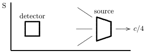

A.the detector is moving to the right with a speed that is greater than $c/4$ relative to S B.the detector is moving to the right with a speed that is lessthan $c/4$ relative toS C.the detector is moving to the left with a speed that is greater than $c/4$ relative to S D. the detector is moving to the left with a speed that is less than $c/4$ relative to S E.the detector is not moving ans: A

41.Light from a stationary spaceship is observed, then the spaceship moves directly away from the observer at high speed while still emitting the light. As a result, the light seen by the observer has:

A.a higher frequency and a longer wavelength than before B.a lower frequency and a shorter wavelength than before C.a higher frequency and a shorter wavelength than before D.a lower frequency and a longer wavelength than before E.the same frequency and wavelength as before ans: D

42.A train traveling very fast ( $v=0.6c$ )has an engineer (E) at the front, a guard (G) at the rear, and a passenger (S') exactly halfway between them.Both E and G are equipped with yellow signaling lamps.The train passes a station, closely observed by the station master (S) Both E and G use their lamps to send signals.According to both S and S' these signals arrive simultaneously at the instant S' is passing S. According to S, the signal from E will look and that from G will look

A.red, blue B.yellow, yellow C. blue rede E.red, red ans: A

43. A console lamp in the cabin of a spaceship appears green when the ship and observer are both at rest on Earth. When the ship is moving at $0.90c$ away from Earth, passengers on board see

A.nothing(the frequency is too high to be seen） B.nothing (the frequency is too low to be seen) C.a red lamp D.a violet lamp E.a green lamp ans:E

44.A spectral line of a certain star is observed to be “red shifted” from a wavelength of 500nm to a wavelength of 1500nm .Interpreting this as a Doppler effect, the speed of recession of this star is:

A.0.33c B.0.50c C.0.71c D.0.8c E.c ans: D

45.A source at rest emits light ofwavelength 500 nm .When itismoving at $0.90c$ toward an observer, the observer detects light of wavelength

A.26 nm B.115nm C.500nm D.2200 nm E.9500 nm ans:B

568 Chapter 37:SPECIAL THEORY OF RELATIVITY

46.A source at rest emitslight ofwavelength 500 nm .When it is moving at $0.90c$ ：awayfrom an observer, the observer detects light of wavelength

A.26nm B.115 nm C.500nm D. 2200m E. 9500nm ans: D

47. Visible light, with a frequency of $6.0\times10^{14}$Hz , is refected from a spaceship moving directly away at a speed of $0.90c$ .The frequency of the reflected waves observed at the source is:

A. $3.2\times10^{13}$Hz B. $1.4\times10^{14}$Hz C. $6.0\times10^{14}$Hz D. $2.6\times10^{15}$Hz E. $1.1\times10^{16}$Hz ans: A

48.How fast should you move away from a $6.0\times10^{14}$Hz light source to observe waves witha frequency of $4.0\times10^{14}$Hz$7.00\times10^{14}$Hz$7.00\times10^{14}$Hz7.00

A.0.20c B.0.38c C.0.45c D.0.51c E.0.76c ans:B

49. A particle with rest mass m moves with speed 0.6c. Its kinetic energy is

A. $0.18mc^{2}$ B. $0.22mc^{2}$ C. $0.25mc^{2}$ D. $mc^{2}$ E. $1.25mc^{2}$ ans:C

50.An electron is moving at 0.6c. If we calculate its kinetic energy using $(1/2)mv^{2}$ , we get a result that is:

A. just right B. just half enough C.twice the correct yalue D.about $1\%$ toolow E.about 28%too low ans:E

51. The velocity of an electron is changed from $c/2$ in the $-x$ direction to $c/2$ in the $+x$ direction As a result, its kinetic energy changes by:

A. $mc^{2}$ B. $0.5mc^{2}$ C. $\sqrt{2}mc^{2}$ D. $2mc^{2}$ E.zero ans:E

52. The work that must be done to increase the speed of an electron ( $m=9.11\times10^{-31}$kg ）from $0.90c$ to $0.95c$ is:

A. $2. 6\times 10^{- 13}$ . B. $8. 2\times 10^{- 13}$ J C. $3.2\times10^{-13}$ J D. $7.4\times10^{-14}$ J E. $3. 8\times 10^{- 15}$ . ans: D

53.An electron $(m=9.11\times10^{-31}$kg) has a speed of $0.95c$ .Its kinetic energy is

A. $8.2\times10^{-14}$ J B. $1. 8\times 10^{- 13}$ . C. $2. 0\times 10^{- 13}$ J D. $2.2\times10^{-13}$ J E. $2.6\times10^{-13}$ J ans: B

54.An electron $(m=9.11\times10^{-31}$kg) has a speed of $0.95c$ .The magnitude of its momentum is

A. $2.6\times10^{-22}$kg$\cdot$m/s B. $2.9\times10^{-22}$kg$\cdot$m/s C. $6.0\times10^{-22}$kg$\cdot$m/s D. $8.3\times10^{-22}$kg$\cdot$m/s E. $8.8\times10^{-22}$kg$\cdot$m/s ans: D

55.According to the special theory of relativity:

A.all forms of energy have mass-like properties B.moving particles lose mass C.momentum is not conserved in high speed collisions D.a rod moving rapidly sideways is shorter along its length E.a rodmoving rapidly sideways is longer along its length ans: A

570 Chapter 37:SPECIAL THEORY OF RELATIVITY

56.The mass of a particle is 777 .In order for its total energy to be twice its rest energy,its momentum must be:

B. $\begin{array}{l}mc/2\\mc/\sqrt{2}\end{array}$ C.mc D. $\sqrt{3}mc$ E.2mc ans: D

57. If the kinetic energy of a particle is equal to its rest energy then its speed must be

A.0.25c B.0.50c C.0.87c D.c E.unknown unless its mass is giver ans:C

58.If the mass of a particle is zero its speed must be:

A.C B.infinite C.0 D. any speed less than $C$ E.any speed greater than ${\boldsymbol{C}}$ ans: A

59.A particle with zero mass and energy $E$ carries momentum

A. $Ec$ B. $Ec^{2}$ $\sqrt{Ec}$ D. $E/c$ E/c $E/c^{2}$ ans: D

60. According to relativity theory a particle of mass 7772 with a momentum of $2mc$ has a speed of:

B. 2c C. c D. c/29c ans:E

61.If the kinetic energy of a free particle is much greater than its rest energy then its kinetic energy is proportional to:

A.the magnitude of its momentum B. the square of the magnitude of its momentum C.the square root of the magnitude of its momentum D. the reciproca of the magitude o its momentum ans: A

62.If the kinetic energy of a free particle is much less than its rest energy then its kinetic energy is proportional to:

A.the magnitude of its momentum B.the square of the magnitude of its momentum C.the square root of the magnitude of its momentum D. the reciprocal of the magnitude of its momentum E.none of the above ans: B

63. The magnitude of the momentum of a particle can never exceed

A. $TIUC$ ,where TIL is its mass B. $E/c$ where $E$ is its total energy C. $K/c$ where $K$ is its kinetic energy D.none of the above,but there is an upper limit E.none of the above; there is no upper limit ans: B

64.An electron $m=9.11\times10^{-31}$kg) has a momentum of $4.0\times10^{-22}$kg$\cdot$m/s .Its kinetic energy is:

A. $6.3\times10^{-14}$, B. $8. 2\times 10^{- 14}$ J C. $1. 2\times 10^{- 13}$ . D. $1.5\times10^{-13}$J E. $2.7\times10^{-13}$, ans: A

65.A certain particle has a kinetic energy of $3.2\times10^{-10}$ J and a momentum of $1.7\times10^{-18}$kg$\cdot$m/s Its mass is

A. $9.11\times10^{-31}$k g B. $2.7\times10^{-27}$k C. $4.5\times10^{-27}$kg D. $6.3\times10^{-27}$kg E. $8.6\times10^{-27}$kg ans: B

572 Chapter 37:SPECIAL THEORY OF RELATIVITY

66.An electron $m=9.11\times10^{-31}$ kg, $q=1.60\times10^{-19}$C, travels at $0.95c$ around a circular orbit perpendicular to a uniform 1.8-T magnetic field. The radius of its orbit is:

A.0.28mm B.0.90mm C.1.1mm D.2.9mm E.4.7mm ans: D

67. An electron ( $m=9.11\times10^{-31}$kg ， $q=1.60\times10^{-19}$ C) travels around a 1.7-mm radius circular orbit perpendicular to a 2.8-T magnetic field. Its speed is:

A.0.16c B.0.36c C.0.94c D.c E.2.8c ans:C

### Chapter 38:PHOTONS AND MATTER WAVES

1.The units of the Planck constant $h$ are those of

A. energy B.power C.momentum D.angular momentum E. frequency ans: D

2.If $h$ is the Planck constant,then $\hbar$ is

A. $2\pi h$ B. $2h$ C. $h/2$ D. $h/2\pi$ E. $2h/\pi$ ans: D

3.The quantization of energy, $E=nhf$ , is not important for an ordinary pendulum because

A.the formula applies only to mass-spring oscillators B.the allowed energy levels are too closely spaced C.the allowed energy levels are too widely spaced D.the formula applies only to atoms E.the value of $h$ for a pendulum is too large ans: B

4.The frequency of light beam A is twice that of light beam B. The ratio $E_{A}/E_{B}$ of photon energies is:

A.1/2 B. 1/4 D.2 E.4 ans: D

5.The wavelength of light beam Bis twice the wavelength of light beam B.The energy ofa photon in beam A is:

A.half the energy of a photon in beam B B.one-fourth the energy of a photon in beam B C.equal to the energy of a photon in beam B D.twice the energy of a photon in beam B E.four times the energy of a photon in beamE ans: A

574 Chapter 38:PHOTONS AND MATTER WAVES

6.A photon in light beam A has twice the energy of a photon in light beam B. The ratio $p_{A}/p_{B}$ of their momenta is:

A.1/2 B.1/4 C.1 D.2 E.4 ans: D

7.Which of the following electromagnetic radiations has photons with the greatest energy?

A.blue light B.yellow light C. x rays D.radio waves E.microwaves ans:C

8.Which of the following electromagnetic radiations has photons with the greatest momentum?

A.blue light B.yellow light C.x rays D.radio waves E.microwaves ans:C

9. Rank following electromagnetic radiations according to the energies of their photons, from least to greatest.

1.blue light 2.yellow light 3.x rays 4.radio waves A.1, 2, 3,4 B.4,2,1,3 C.4.1,2,3 D.3,2,1,4 E.3,1,2,4 ans: B

10.The intensity of a uniform light beam with a wavelength of 500 nm is 2000 W/ $m^{2}$ .The photon fux (in number/m².s)is about: A. $5\times10^{17}$

B. $5\times10^{19}$ C. $5\times10^{21}$ D. $5\times10^{23}$ E. $5\times10^{25}$ ans:C

11.The concentration of photons in a uniform light beam with a wavelength of 500 nm is $1.7\times$ $10^{13}\mathrm{m}^{-3}$ .The intensity of the beam is:

A. $6. 7\times 10^{- 6}$ W/ $m^{2}$ B. $1.0\times10^{3}$W/m$1.0\times10^{3}$W/m$1.0\times10^{3}$W/m1 C. $2.0\times10^{3}$W/m$^2$ D. $4.0\times10^{3}$W/m$^2$ E. $3. 2\times 10^{2}$ $\mathrm{W/ m}^{2}$ ans:C

12.Light beams A and B have the same intensity but the wavelength associated with beam A is longer than that associated with beam B. The photon fux (number crossing a unit area pe) unit time) is:

ans:A

13.In a photoelectric effect experiment the stopping potential is:

A.the energy required to remove an electron from the sample B.the kinetic energy of the most energetic electron ejected C.the potential energy of the most energetic electron ejected D. the photon energy E.the electric potential that causes the electron current to vanish ans:E

14.In a photoelectric effect experiment at a frequency above cut off,the stopping potential is proportional to:

A.the energy of the least energetic electron before it is ejected B.the energy of the least energetic electron after it is ejected C.the energy of the most energetic electron before it is ejected D.the energy of the most energetic electron after it is ejected E.the electron potential energy at the surface of the sample ans:D

15.In a photoelectric effect experiment ata frequency above cut off,the number of electrons ejectec is proportional to:

A.their kinetic energy B.their potential energy C.the work function D.the frequency of the incident light E.the number of photons that hit the sample ans:E

576 Chapter 38:PHOTONS AND MATTER WAVES

16.In a photoelectric effect experiment no electrons are ejectedif the frequency of the inciden light is less than $A/h$ ,where $h$ is the Planck constant and $A$ is:

A. the maximum energy needed to ejet the least ergei eletron Cetle meir seteet oe eeee ans: D

17.The diagram shows the graphs of the stopping potential as a function of the frequency of the incident light for photoelectric experiments performed on three different materials. Rank the materials according to the values of their work functions, from least to greatest.

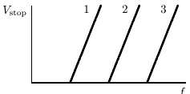

18.The work function for a certain sample is 2.3eV .The stopping potential for electrons ejected from the sample by $7.0\times10^{14}$ -Hz electromagnetic radiation is:

A.0 B.0.60V C.2.3V D.2.9V E.5.2V ans:B

19.The stopping potential for electrons ejected by $6.8\times10^{14}$ -Hz electromagnetic radiation incident on a certain sample is $1.8V$ .The kinetic energy of the most energetic electrons ejected and the work function of the sample, respectively, are.

A.1.8eV.2.8eV B.1.8eV1.0eV C.1.8eV4.6eV D.2.8eV1.0eV E.1.0eV4.6eV ans:B

20.Separate Compton effect experiments are carried out using visible light and X rays.The scattered radiation is observed at the same scattering angle.For these experiments

A.the X rays have the greater shift in wavelength and the greater change in photon energy B.the two radiations have the same shift in wavelength and the x rays have the greater change in photon energy C.the two radiations have the same shift in wavelength and the visible light has the greater change in photon energy D. the two radiations have the same shift in wavelength and the same change in photon energy E.the visible light has the greater shift in wavelength and the greater shift in photon energy ans: B

21.In Compton scattering from stationary particles the maximum change in wavelength can be made smaller by using

A.higher frequency radiation B. lower frequency radiation C. more massive particles D. less massive particles E.particles with greater charge ans: C

22.Of the following, Compton scattering from electrons is most easily observed for:

A. microwaves B. infrared light C.visible light D. ultraviolet light E.x rays ans:E

23.In Compton scattering from stationary electrons the largest change in wavelength occurs when the photon is scattered through

A. $0^{\circ}$ B.22.5° C.45° D.90° E.180° ans:E

24. In Compton scattering from stationary electrons the frequency of the emitted light is indepen dent of:

A.the frequency of the incident light B.the speed of the electron C.the scattering angle D.the electron recoil energy E.none of the above ans:E

578 Chapter 38:PHOTONS AND MATTER WAVES

25.In Compton scattering from stationary electrons the largest change in wavelength that can occur is

A. $2.43\times10^{-15}$ m B. $2.43\times10^{-12}$ m C. $2.43\times10^{-9}$m D. dependent on the frequency of the incident light E.dependent on the work function ans:B

26.Electromagnetic radiation with a wavelength of $5.7\times10^{-12}$ m is incident on stationary electrons Radiation that has a wavelength of $6.57\times10^{-12}$ m is detected at a scattering angle of

A. $10^{\circ}$ B.121° C.40° D. $50^{\circ}$ E. $69^{\circ}$ ans: D

27. Electromagnetic radiation with a wavelength of $3.5\times10^{-12}$m is scattered from stationary electrons and photons that have been scattered through $50^{\circ}$ are detected.An electron from which one of these photons was scattered receives an energy of:

A.0 B. $1.1\times10^{-14}$ J C. $1.9\times10^{-14}$J D. $2.3\times10^{-14}$ J E. $1.3\times10^{-13}$ J ans:B

28. Electromagnetic radiation with a wavelength of $3.5\times10^{-12}$m is scattered from stationary electrons and photons that have been scattered through $50^{0}$ are detected.After a scattering event the magnitude of the electron’s momentum is:

A.0 B. $1.5\times10^{-22}$kg$\cdot$m/s C. $2.0\times10^{-22}$kg$\cdot$m/s D. $2.2\times10^{-22}$kg$\cdot$m/s E. $8.7\times10^{-23}$kg$\cdot$m/s ans: B

29. Consider the following

1.a photoelectric process in which some emitted electrons have kinetic energy greater than $hf$ ,where $f$ is the frequency of the incident light. 2.a photoelectric process in which all emitted electrons have energy less than $hf$ 3.Compton scattering from stationary electrons for which the emitted light has a wave length thatisgreater than thatof the incident light 4.Compton scattering from stationary electrons for which the emitted light has a wave length that is less than that of the incident light.

The only possible processes are:

A.1 B.3 C.1 and 3 D.2 and 3 E.2and 4 ans: D

30. J. J. Thompson's measurement of $e/m$ for electrons provides evidence of the:

A.wave nature of matter B.particle nature of matter C.wave nature of radiation D.particle nature of radiation E.transverse wave nature of light ans: B

31.Evidence for the wave nature of matter is:

A. electron diffraction experiments of Davisson and Germer B.Thompson's measurement of $e/m$ C.Young's double slit experiment D.the Compton effect E.Lenz's law ans: A

32.Which of the following is NOT evidence for the wave nature of matter?

A.The photoelectric effect B.The difraction pattern obtained when electrons pass through a slit C.Electron tunneling D.The validity of the Heisenberg uncertainty principle E.The interference pattern obtained when electrons pass through a two-slit system ans: A

33.Of the following whichis thebest evidence for the wave nature of matter？

A.The photoelectric effect B.The Compton effect C.The spectral radiancy of cavity radiation D.The relationship between momentum and energy for an electron E.The reflection of electrons by crystals ans: E

580 Chapter 38:PHOTONS AND MATTER WAVES

34.Monoenergetic electrons are incident on a single slit barrier.If the energy ofeach inciden electron is increased the centralmaximum of the diffraction pattern

A.widens B.narrows C.stays the same width D. widens forslow eletrons and arows fo fast lectrons ans:B

35.A free electron and a free proton have the same kinetic energy. This means that,compared to the matter wave associated with the proton, the matter wave associated with the electron has:

A.a shorter wavelength and a greater frequency B.a longer wavelength and a greater frequency C.a shorter wavelength and the same frequency D.a longer wavelength and the same frequency E.a shorter wavelength and a smaller frequency ans: D

36.A free electron and a free proton have the same momentum.This means that, compared to the matter wave associated with the proton,the matter wave associatedwith the electron:

A. has a shorter wavelength and a greater frequency B.has a longer wavelength and a greater frequency C.has the same wavelength and the same frequency D.has the same wavelength and a greater frequency E.has the same wavelength and a smaller frequency ans: D

37. A free electron and a free proton have the same speed. This means that,compared to the matter wave associated with the proton,the matter wave associated withthe electron:

A. has a shorter wavelength and a greater frequency B.has a longer wavelength and a greater frequency C.has the same wavelength and the same frequency D.has the same wavelength and a greater frequency E.has a longer wavelength and a smaller frequency ans:E

38. Consider the following three particles

1.a free electron with speed $U0$ 2.a free proton with speed $v_{0}$ 3.a free proton with speed $2v_{0}$

Rank them according to the wavelengths of their matter waves,least to greatest

A.1,2,3 B.3,2,1 C.2,3.1 D.1,3,2 E.1.then 2 and 3 tied ans:B

39.Consider the following three particles

1.a free electron with kinetic energy $K_{0}$ 2.a free proton with kinetic energy $K_{0}$ 3.a free proton with kinetic energy $2K_{0}$

Rank them according to the wavelengths of their matter waves, least to greatest

A.1,2, 3 B.3,2,1 C.2,3,1 D.1,3,2 E.1,then 2 and 3 tied ans: B

40.A free electron has a momentum of $5.0\times10^{-24}$kg$\cdot$m/s The wavelength of its wave functior is:

A. $1.3\times10^{-8}$ m B. $1.3\times10^{-10}$m C. $2.1\times10^{-11}$ m D. $2.1\times10^{-13}$m E.none of these ans:B

41.The frequency and wavelength of the matter wave associated with a 10-eV free electron are:

A. $1.5\times10^{34}$Hz ， $3.9\times10^{-10}$ m B. $1.5\times10^{34}$Hz ， $1.3\times10^{-34}$ m C. $2.4\times10^{15}$Hz . $1.2\times10^{-9}$ m D. $2.4\times10^{15}$Hz . $3.9\times10^{-10}$ m E. $4.8\times10^{15}$Hz ， $1.9\times10^{-10}$ m ans: D

42.If the kinetic energy of a non-relativistic free electron doubles,the frequency ofits wave function changes by the factor:

A. $1/{\sqrt{2}}$ B.1/2 C. $\begin{array}{l}{1/4}\\{\sqrt{2}}\end{array}$ E.2 ans:E

43.A non-relativistic free electron has kinetic energy $K$ .If its wavelength doubles,its kinetic energy is:

B. 4k $4K$ $2K$ 1 $K/2$ $K$ ans:E

582 Chapter 38:PHOTONS AND MATTER WAVES

44.The probability that a particle is in a given small region of space is proportional to

A.its energy B.its momentum C.the frequency of its wave function D.the wavelength of its wave function E.the square of the magnitude of its wave function ans:E

45. $\psi(x)$ is the wave function for a particle moving along the 22 axis.The probability that the particle is in the interval from ${\mathcal{L}}={\mathcal{U}}$ to $x=b$ is given by

A. $\psi(b)-\psi(a)$ B. $|\psi(b)|/|\psi(a)|$ C. $|\psi(b)|^{2}/|\psi(a)|^{2}$ D. $\int _{a}^{b}\psi ( x)$ $dx$ E. $\int _a^b| \psi ( x) | ^2$ $dx$ ans:E

46. The significance of $|\psi|^2$ is:

A.probability B. energy C. probability density D. energy density E. wavelength ans:C

47.Maxwell's equations are to electric and magnetic fields as equation is to the wave function for a particle.

A.Einstein's B.Fermi's C.Newton's D.Schrodinger's E.Bohr's ans: D

48.A free electron in motion along the $3E$ axis has a localized wave function.The uncertainty in its momentum is decreased if:

A.the wave function is made more narrow B.the wave function is made less narrow C.the wave function remains the same but the energy of the electron is increased D.the wave function remains the same but the energy of the electron is decreasec E.none of the above ans: B

49.The uncertainty in position of an electron in a certain state is $5\times10^{-10}$m The uncertainty in its momentum might be：

A. $5.0\times10^{-24}$kg$\cdot$m/s B. $4.0\times10^{-24}$kg$\cdot$m/s C. $3.0\times10^{-24}$kg$\cdot$m/s D. all of the above E.none of the above ans: D

50.The reflection coefficient $R$ for a certain barrier tunneling problem is 0.80. The corresponding transmission coefficient $I$ is

A.0.80 B.0.60 C.0.50 D.0.20 E.0 ans: D

51.An electron with energy $E$ is incident upon a potential energy barrier of height $E_{\mathrm{pot}}>E$ and thickness $L$ . The transmission coefficient 7

A.is zero B.decreases exponentially with $L$ C.is proportional to $1/L$ D. is proportional to $1/L^{2}$ E.is non-zero and independent of $L$ ans: B

52.In order to tunnel through a potential barrier a particle must:

A.have energy greater than the barrier height B.have spin C. be massive D.have a wavelength longer than the barrier width E.none of the above ans:E

53. An electron with energy $E$ is incident on a potential energy barrier of height $E_{\mathrm{pot}}$ and thickness $L$ .The probability of tunneling increases if:

A. $E$ decreases without any other changes B. $E_{\mathrm{pot}}^{\prime}$ increases without any other changes C. $L$ decreases without any other changes D. B $E$ $E$ and $E_{\mathrm{pot}}$ Epot $E_{\mathrm{pot}}$ incereaseby the same amount ans: C

584 Chapter 38:PHOTONS AND MATTER WAVES

54. Identical particles, each with energy $E$ ，are incident on the following four potential energy barriers:

$$\begin{aligned}
&\text{1} \\
&&1.\quad\mathrm{barrier~height}& =5E,\mathrm{~barrier~width}=2L \\
&&3.\quad\mathrm{barrier~height}& =17E,\mathrm{~barrier~width}=L/2 \\
&&4.\quad\mathrm{barrier~height}& =26E,\mathrm{~barrier~width}=L/3 \\
\end{aligned}$$

Rank the barriers in terms of the probability that the particles tunnel through them, from least probability to greatest probability

A.12,34 B.4, 3, 2, 1 C.1 and 2 tied,then 3,then 4 D. 2, then 1 and 3 tied, then 4 E.3,2,1,4 ans: A

### Chapter 39:MORE ABOUT MATTER WAVES

1.If a wave function $\psi$ for a particle moving along the $3L$ axis is normalized, then:

A. $\int | \psi | ^{2}$ $dt= 1$ B. $\int | \psi | ^{2}$ $dx= 1$ C. $\partial\psi/\partial x=1$ D. $\partial\psi/\partial t=1$ E. $|\psi|^2=1$ ans: B

2.The energy of a particle in a one-dimensional trap with zero potential energy in the interion and infinite potential energy at the walls is proportional to ( $TL=$ quantum number)

A. $TL$ 1 $n^{2}$ $\sqrt{n}$ $1/n$ $1/n^{2}$ ans:E

3.The ground state energy of an electron in a one-dimensional trap with zero potential energy in the interior and infinite potential energy at the walls is 2.0eV .If the width of the well is doubled, the ground state energy will be:

A.0.5eV B.1.0eV C.2.0eV D.4.0eV E.8.0eV ans: A

4.An electron is in a one-dimensional trap with zero potential energy in the interior and infinite potential energy at the walls. The ratio $E_{3}/E_{1}$ of the energy for $n=3$ to that for $n=1$ is

ans:D

586 Chapter 39:MORE ABOUT MATTER WAVES

8.The ground state energy of an electron in a one-dimensional trap with zero potential energy in the interior and infinite potential energy at the walls:

A.is zero B. decreases with temperature C. increases with temperature D. is independen o temperature ans:D

9.An electron is in a one-dimensional trap with zero potential energy inthe interior and infinite potential energy at the walls.A graph of its wave function $\psi(x)$ versus $3E$ is shown. The value of quantum number 7L is:

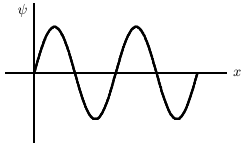

ans:C

10.An electron is in a one-dimensional trap with zero potential energy in the interior and infinite potential energy at the walls. A graph of its probability density $P(x)$ versus $3L$ is shown. The value of the quantum number 772 is

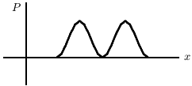

ans:C

588 Chapter 39:MORE ABOUT MATTER WAVES

11.A particle is trapped in an infinite potential energy well. It is in the state with quantum number $n=14$ .How many nodes does the probability density have (counting the nodes at the ends of the well)?

AB.one C.13 D.14 E.15 ans:E

12.A particle is trapped in an infinite potential energy well.It is in the state with quantum number $n=14$ .How many maxima does the probability density have?

A.none B.7 C.13 D.14 E.15 ans: D

13.A particle is confined to a one-dimensional trap by infinite potentialenergy walls.Of the following states, designed by the quantum number $7L$ ,for which one is the probability density greatest near the center of the well?

A. $n=2$ B. $n=3$ C. $n=4$ D. $n=5$ E. $n=6$ ans: B

14.Two one-dimensional traps have infinite potential energy at their walls Trap A has width $L$ and trap B has width $2L$ .For which value of the quantum number $7t$ does a particle in trap B have the same energy as a particle in the ground state of trap A?

A. $n=1$ B. $n=2$ C. $n=3$ D. $n=4$ E. $n=5$ ans: B

15. An electron is trapped in a deep well with a width of 0.3nm .If it is in the state with quantum number $n=3$ its kinetic energy is:

A. $6.0\times10^{-28}$ J B. $1. 8\times 10^{- 27}$ J C. $6.7\times10^{-19}$ D. $2.0\times10^{-18}$J E. $6.0\times10^{-18}$ J ans:E

16. An electron is in a one-dimensional well with finite potential energy barriers at the walls. The matter wave:

A.is zero at the barriers B.is zero everywhere within each barrier C.is zero in the well D.extends into the barriers E.is discontinuous at the barriers ans:D

17.A particle is confined by finite potential energy walls to a one-dimensional trap from $x=0$ to $x=L.$ Its wave function in the region $x>L$ has the form

A. $\psi(x)=A\sin(kx)$ B. $\psi(x)=Ae^{kx}$ C. $\psi(x)=Ae^{-kx}$ D. $\psi(x)=Ae^{ikx}$ E. $\psi(x)=0$ ans:C

18. A particle is trapped in a finite potential energy well that is deep enough so that the electror can be in the state with $n=4$ .For this state how many nodes does the probability density have?

A.none B.1 C.3 D.5 E.7 ans: C

19.A particle in a certain finite potential energy well can have any of five quantized energy values and no more.Which of the following would allow it to have any of six quantized energy levels

A.Increase the momentum of the particle B.Decrease the momentum of the particle C.Decrease the well width D.Increase the well depth E.Decrease the well depth ans: D

20.Aparticlein a certain finite potentialenergy well can have any of five quantizedenergy values and nomore.Which of the followingwouldallow it tohave any of six quantized energylevels A.Increase the energy of the particle

B.Decrease the energy of the particle C.Make the well shallower D.Make the well deeper E. Make the well narrower ans:D

590 Chapter 39:MORE ABOUT MATTER WAVES

21. An electron in an atom initially has an energy 5.5eV above the ground state energy.It drops to a state with energy 3.2 eV above the ground state energy and emits a photon in the process. The wave associated with the photon has a wavelength of:

A. $5.4\times10^{-7}$ m B. $3.0\times10^{-7}$ m C. $1.7\times10^{-7}$m D. $1.15\times10^{-7}$m E. $1.0\times10^{-7}$ m ans: A

22. An electron in an atom drops from an energy level at $-1.1\times10^{-18}$J to an energy level at $-2.4\times10^{-18}$ J.The wave associated with the emitted photon has a frequency of

A. $2.0\times10^{17}$Hz B. $2.0\times10^{15}$Hz C. $2.0\times10^{13}$Hz D. $2.0\times10^{11}$Hz E. $2.0\times10^{9}$Hz ans: B

23.An electron in an atom initiallyhas an energy 7.5eV above the ground state energy.It drops toa state with an energy of 3.2 eV above the ground state energy and emits a photon in the process. The momentum of the photon is:

A. $1.7\times10^{-27}$kg$\cdot$m/s B. $2.3\times10^{-27}$kg$\cdot$m/s C. $4.0\times10^{-27}$kg$\cdot$m/s D. $5.7\times10^{-27}$kg$\cdot$m/s E. $8.0\times10^{-27}$kg$\cdot$m/s ans: B

24. The quantum number 7L is most closely associated with what property of the electron in a hydrogen atom?

A.Energy B.Orbital angular momentum C.Spin angular momentum D.Magnetic moment E. Z component of angular momentum ans: A

25.Take the potentialenergy of ahydrogen atom tobe zero for infinite separation of the electron and proton.Then, according to quantum theory the energy $E_{n}$ of a state with principal quantum number $7t.$ is proportional to:

A. $TL$ B. 17 $n^{2}$ $1/n$ D. $1/n^{2}$ of theabove ans: D

26.The binding energy of an electron in the ground state in a hydrogen atom is about

A.13.6eV B.3.4eV C.10.2eV D.1.0eV E.27.2eV ans: A

27.Take the potential energy of a hydrogen atom to be zero for infinite separation of the electron and proton. Then the ground state energy is -13.6eV .The energy of the first excited state is

A.0 B.-3.4eV C.6.8eV D. -9.6eV E.-27eV ans:B

28.Take the potential energy of a hydrogen atom tobe zero for infinite separation of the electron and proton. Then the ground state energy is -13.6eV .The negative sign indicates

A.the kinetic energy is negative B. the potential energy is positive C.the electron might escape from the atom D.the electron and proton are bound together E.none of the above ans: D

29.Take the potential energy of a hydrogen atom to be zero for infinite separation of the electron and proton. Then the ground state energy of a hydrogen atom is -13.6eV .When the electror is in the first excited state its excitation energy is:

A.0 B.3.4eV C.6.8eV D.10.2eV E.13.6eV ans: D

30.Take the potential energy of a hydrogen atom tobe zero for infinite separation of the electror and proton. Then the ground state energy is -13.6eV .When the electron is in the first excited state the ionization energy is

A.0 B.3.4eV C.6.8eV D.10.2eV E.13.6eV ans:B

592 Chapter 39:MORE ABOUT MATTER WAVES

31.The diagram shows the energy levels for an electron in a certain atom.Of the transitions shown,whichrepresents the emission of a photon with the most energy

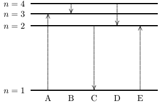

ans:C

32.When a hydrogen atom makes the transition from the second excited state to the ground state (at -13.6eV )the energy of the photon emitted is:

A.0 B.1.5eV C.9.1eV D.12.1eV E.13.6eV ans: D

33.The series limit for the Balmer series represents a transition $m\to76$ ,where $(m,n)$ is

A. (2,1) B. (3,2) C. $(\infty,0)$ D. $(\infty,1)$ E. $(\infty,2)$ ans:E

34. The Balmer series of hydrogen is important because it

A.is the only one for which the quantum theory can beused B.is the only series that occurs for hydrogen C.is in the visible region D.involves the lowest possible quantum number n E.involves the highest possible quantum number n ans:C

35.The principle of complementarity is due to:

A.Einstein B.Maxwell C.Newton D.Bohr E. Schrodinger ans: D

36. Which of the following sets of quantum numbers is possible for an electron in a hydrogen atom?

A. $n=4$ ， $\ell=3$ ， $m_{\ell}=-3$ B. $n=4$ . $\ell=4$ . $m_{\ell}=-2$ C. $n=5$ ， $\ell=-1$ ， $m_{\ell}=2$ D. $n=3$ ， $\ell=1$ ， $m_{\ell}=-2$ E. $n=2$ ， $\ell=3$ ， $m_{\ell}=-2$ ans:A

37.The wave function for an electron in a state with zero angular momentum

A.is zero everywhere B.is spherically symmetric C.depends on the angle from the Z axis D.depends on the angle from the $U$ axis E.is spherically symmetric for some shells and depends on the angle from the $z$ axis for others ans: B

38.Consider the following:

1.the probability density for an $\ell=0$ state 2. the probability density for a state with $\ell\neq0$ 3. the average of the probability densities for all states in an $\ell\neq0$ subshell

Of these which are spherically symmetric?

A. only 1 B.only 2 C.only 1 and 2 D.only 1 and 3 E.1,2,and 3 ans: D

39.If the wave function $\psi$ is spherically symmetric then the radial probability density is given by

A. $4\pi r^{2}\psi$ B. $|\psi|^2$ C. $4\pi r^{2}|\psi|^{2}$ D. $4\pi|\psi|^2$ E. $4\pi r|\psi|^{2}$ ans:C

40.If $P(r)$ is the radial probability density then the probability that the separation of the electron and proton is between 7 and $r+dr$ is

A. Pdr B. $|P|^{2}dr$ C. $4\pi r^{2}P$ $dr$ D. $4\pi r^{2}| P|$ $dr$ E. $4\pi | P| ^{2}$ $dr$ ans: A

594 Chapter 39:MORE ABOUT MATTER WAVES

41.The radialprobability density for the electron in the ground state of a hydrogen atomhas 8 peak at about:

0.5pm 500 pm 5000pm 5000pm ans: C

### Chapter 40: ALL ABOUT ATOMS

1.The magnitude of the orbital angular momentum of an electron in an atom is what multiple of $\hbar$ ？ $\ell$ is a positive integer.)

全$\ell^{2}$ $2\ell+1$ $\begin{array}{ll}{1/2}\\{\sqrt{\ell(\ell+1)}}\end{array}$ ans:C

2.The magnetic quantum number $THt\epsilon$ is most closely associated with what property of an electron in an atom?

A.Magnitude of the orbital angular momentum B.Energy C. Z component of the spin angular momentum D. $Z$ component of the orbital angular momentum E.Radius of the orbit ans: D

3.The quantum number $77l_{8}$ is most closely associated with what property of the electron in an atom?

A.Magnitude of the orbital angular momentum B. Energy C. Z component of the spin angular momentum D. $z$ component of the orbital angular momentum E.Radius of the orbit ans: C

4.Possible values of the principal quantum number 77 for an electron in an atom are

A.only 0 and 1 B.only 0,1, 2,..., $0X$ C.only 0, 1,..., $\ell-1$ D. only 1/2 and -1/2 E.only123.. $0X$ ans:E

5.The number of values of the orbital quantum number $\ell$ associated with the principal quantum number $n=3$ is:

ans:C

596 Chapter 40:ALL ABOUT ATOMS

6.The number of possible values of the magnetic quantum number $m_{E}$ associated with a given value of the orbital quantum number $E$ is:

B. 2 C. D.2 E. $2\ell+1$ ans:E

7.An atom is in a state with orbital quantum number $\ell=2$ .Possible values of the magnetic quantum number THte are:

A.1, 2 B.0,1,2 C.0,1 D. -1, 0, 1 E. -2 -1 ，0,1,2 ans:E

8. An electron is in a quantum state for which the magnitude of the orbital angular momentum is $6{\sqrt{2}}\hbar$ .How many allowed values of the $z$ component of the angular momentum are there?

B. 4 C.7 D. 9 ans: D

9.An electron is in a quantum state for which there are seven allowed values of the Z component of the angular momentum. The magnitude of the angular momentum is:

$\sqrt{9}\hbar$ $\begin{array}{c}{{\sqrt{3}\hbar}}\\{{\sqrt{7}\hbar}}\\\end{array}$ $\sqrt{12}\hbar$ $\sqrt{14}\hbar$ ans: D

10.The number of states in a subshellwith orbital quantum number $\ell=3$ is

ans:E

11.The number of states in a shell with principal quantum number $n=3$ is

A.3 B.9 C.15 D.18 E.25 ans: D

12.An electron in an atom is in a state with principal quantum number $n=4$ .The possible values of the orbital quantum number $E$ are:

A.1,2,3 B.12,3,4 C.-3, -2 -10123 D.0123 E.0.1.2 ans: D

13. Space quantization means that

A.space is quantized B. $L_{z}$ can have only certain discrete values C. $\vec{L}$ and $\overrightarrow{\mu}$ are in the same direction D. $\vec{L}$ and $\overrightarrow{\mu}$ are in opposite directions E.an electron has a magnetic dipole moment ans: B

14.An electron in an atom is in a state with $\ell=3$ and $m_{\ell}=2$ .The angle between $\bar{L}$ and the $z$ axis is:

A.48.2° B. $60^\circ$ C. $30^\circ$ D.35.30 E.54.70 ans: E

15. An electron in an atom is in a state with $\ell=5$ .The minimum angle between $\vec{L}$ and the Z axis is: A. $0^{\circ}$

B.18.00 C.24.1° D. 36.70 ans: C

16. In the relation $\mu_{z}=-m_{\ell}\mu_{B}$ ，the quantity $\mu_{B}$ is：

A.the Bohr magneton B.the component of the dipole moment along the magnetic field C.the permeability of the material D.a friction coefficient E.none of the above ans: A

17.The electron states that constitute a single shell for an atom all have:

A.the same value of 7L B.the same value of $\ell$ C.the same value of 7L and the same value of D.the same value of $\ell$ and the same value of $THt_{E}$ E.the same set of all four quantum numbers ans: A

18.The electron states that constitute a single subshell for an atom all have

A.only the same value of 772 B.only the same value of $\ell$ C.only the same value of 77 and the same value of $\ell$ D.only the same value of $\ell$ and the same value of $THE$ E.the same set of all four quantum numbers ans: C

19. The total number of electron states with $n=2$ and $\ell=1$ for an atom is

A.two B.four C.six D.eight E.ten ans:C

20.The possible values for the magnetic quantum number $THl_{8}$ of an electron in an atom

A.depend on 74 B.depend on $E$ C.depend on both 7L and $\ell$ D.depend on whether there is an external magnetic field present E.are $\pm1/2$ ans:E

21.The Stern-Gerlach experiment makes use of

A. a strong uniform magnetic field B.a strong non-uniform magnetic field C.a strong uniform electric field D.a strong non-uniform electric field E. strong perpendicular electric and magnetic fields. ans: B

22.The magnetic field $\vec{B}$ is along the Z axis in a Stern-Gerlach experiment. The force it exerts on a magnetic dipole with dipole moment $\vec{\mu}$ is proportional to A. $\begin{array}{c}{\mu_{z}^{2}}\\{B^{2}}\\\end{array}$

C $dB/dz$ $\int B$ $dz$ $d^{2}B/dz^{2}$ ans: C

23.A magnetic dipole $\bar{\mu}$ is placed in a strong uniform magnetic field $\bar{B}$ .The associated force exerted on the dipole is

A.along $\bar{\mu}$ B.along -μ C.along B D.along $\vec{\mu}\times\vec{B}$ E.zero ans:E

24.The force exerted on a magneticdipole asit moves with velocity $\bar{v}$ through a Stern-Gerlach apparatus is

A.proportional to $2U$ B. proportional to $1/v$ C.zero D. proportioa o $t$ $v^{2}$ ans:E

25. A magnetic dipole is placed between the poles of a magnet as shown. The direction of the associated force exerted on the dipole is

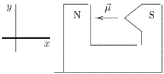

三$y$ $2L$ $y$ $2L$ into or out of the page ans: C

26.To observe the Zeeman effect one uses:

A.a strong uniform magnetic field B.a strong non-uniform magnetic field C.a strong uniform electric field D.a strong non-uniform electric field E. mutually perpendicular electric and magnetic fields ans: B

27.An electron in a K shell of an atom has the principal quantum number

A. $n=0$ B. $n=1$ C. $n=2$ D. $n=3$ E. $Tl=0$ ans: B

28.An electron in an L shell of an atom has the principal quantum number

A. $n=0$ B. $n=1$ C. $n=2$ D. $n=3$ E. $Tl=0$ ans: C

29. The most energetic photon in a continuous X -ray spectrum has an energy approximately equa to:

A.the energy of all the electrons in a target atom B.the kinetic energy of an incident-beam electron C.the rest energy, $mc^{2}$ ,of an electron D.the total energy of a K-electron in the target atom E. the kinetic energy of a K-electron in the target atom. ans:B

30.Two different electron beams are incident on two different targets and both produce x rays The cutoff wavelength for target 1 is shorter than the cutoff wavelength for target 2. We can conclude that

A.target 2 has a higher atomic number than target 1 B.target 2 has a lower atomic number than target 1 C.the electrons in beam1 have greater kinetic energy than those in beam 2 D.the electrons in beam 1 have less kinetic energy than those in beam2 E.target 1 is thicker than target 2 ans:C

31.A photon with the smallest wavelength in the continuous z-ray spectrum is emitted when

A.an electron is knocked from a K shell B.a valence electron is knocked from the atom C.the incident electron becomes bound to the atom D.the atom has the greatest recoil energy E.the incident electron loses all its energy in a single decelerating event ans:E

32.Radiation with the minimum wavelength as well as the K x-ray lines are detected for a certain target. The energy of the incident electrons is then doubled, with the result that

A.the minimum wavelength increases and the wavelengths of the K lines remain the same B.the minimum wavelength decreases and the wavelengths of the K lines remain the same C.the minimum wavelength and the wavelengths of the K lines all increase D.the minimum wavelength and the wavelengths of the K lines all decrease E.the minimum wavelength increases and the wavelengths of the K lines all decrease ans:B

33. Characteristic K x-radiation of an element occurs when:

A.the incident electron is absorbedby a target nucleus B.the incident electron is scattered by a target atom without an energy loss C.an electron is ejected from an outer shell of a target atom D.an electron in a target atom makes a transition to the lowest energy state E.the incident electron goes into thelowest energy state ans: D

34.The $K_{\alpha}$ x rays arising from a cobalt ( $Z=27$ )target have a wavelength of about 179 pm.The atomic number of a target that gives rise to $K_{\alpha}$ x rays with a wavelength one-third as great $\approx60$ pm) is:

A. $Z=9$ B. $Z=10$ C. $Z=12$ D. $Z=16$ E. $Z=46$ ans:E

35.In connection with x-ray emission the symbol $K_{\alpha}$ refers to:

A.an alpha particle radiation B.an effect of the dielectric constant on energy levels C. oray radiaton fom pdtasih an letron goig fron $\eta=0$ to $n=1$ E.x-ray radiation associated with an electron going from $n=2$ to $n=1$ ans:E

602 Chapter 40:ALL ABOUT ATOMS

36. In connection with x-ray emission the symbol $\mathcal{L}_{\beta}$ refers to

A.a beta particle radiation B.an atomic state of angular momentum $h/2\pi$ C.the inductance associated with an orbiting electron D. x-radiation associated with an electron going from $n=4$ to $n=2$ E.none of the above ans:D

37.The transition shown gives rise to an x-ray. The correct label for this is

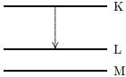

$L_{\alpha}$ $\mathrm{L}_{\beta}$ $K_{\beta}$ $K_{\alpha}$ $^{\prime}\beta$ ans: A

38.In a Moseley graph

A.the x-ray frequency is plotted as a function of atomic number B.the square of the x-ray frequency is plotted as a function of atomic number C.the square root of the x-ray frequency is plotted as a function of atomic number D.the x-ray frequency is plotted as a function of the square root of atomic number E.the square root of the x-ray frequency is plotted as a function of atomic mass ans:C

39.In calculating the x-ray energy levels the effective charge of the nucleus is taken to be $Z-b$ where $Z$ is the atomic number.The parameter $b$ enters because

A.an electron is removed from the inner shell B.a proton is removed from the nucleus C.the quantum mechanical force between two charges is less than the classical force D.the nucleus is screened by electrons E.the Pauli exclusion principle must be obeyed ans: D

40.The ratio of the wavelength of the $K_{\alpha}$ x-ray line for Nb ( $Z=41$ )to that of Ga ( $Z=31$ )is

ans: A

41.The Pauli exclusion principle is obeyed by:

A.all particles B.all charged particles C.all particles with spin quantum numbers of 1/2 D.all particles with spin quantum numbers of 1 E.all particles with mass ans:C

42. No state in an atom can be occupied by more than one electron. This is most closely related to:

A.the wave nature of matter B. the finite value for the speed of light C.the Bohr magneton D.the Pauli exclusion principle E.the Einstein-de Haas effect ans: D

43.Electrons are in a two-dimensional square potential energy well with sides of length $L$ .The potential energy is infinite at the sides and zero inside. The single-particle energies are given by $(h^{2}/8mL^{2})(n_{x}^{2}+n_{y}^{2})$ ,where $Tl_{2}$ and $\eta_{y}$ are integers. At most the number of electrons that can have energy $8(h^{2}/8mL^{2})$ is

A.1 B.2 C.3 D.4 E.any number ans: B

44.Five electrons are in a two-dimensional square potential energy well with sides of length $L$ The potential energy is infinite at the sides and zero inside.The single-particle energies are given by $(h^{2}/8mL^{2})(n_{x}^{2}+n_{y}^{2})$ ，where $\eta l_{x}$ and $\eta t_{y}$ are integers. In units of $(h^{2}/8mL^{2})$ the energy of the ground state of the system is:

A.0 B.10 C.19 D.24 E.48 ans:C

45. Five electrons are in a two-dimensional square potential energy well with sides of length $L$ The potential energy is infinite at the sides and zero inside.The single-particle energies are given by $(h^{2}/8mL^{2})(n_{x}^{2}+n_{y}^{2})$ ,where $\eta l_{x}$ and $\eta_{y}$ are integers. In units of $(h^{2}/8mL^{2})$ the energy of the first excited state of the system is:

A.13 B.22 C.24 D.25 E.27 ans: B

46.Electrons are in a two-dimensional square potential energy well with sides of length $L$ .The potential energy is infinite at the sides and zero inside. The single-particle energies are given by $(h^{2}/8mL^{2})(n_{x}^{2}+n_{y}^{2})$ ，where $Tt_{2}$ and $\eta t_{y}$ are integers. The number of single-particle states with energy $5(h^{2}/8mL^{2})$ is

A.1 B.2 C.3 D.4 E.5 ans: B

47. Six electrons are in a two-dimensional square potential energy well with sides of length $L$ .The potential energy is infinite at the sides and zero inside. The single-particle energies are given by $(h^{2}/8mL^{2})(n_{x}^{2}+n_{y}^{2})$ ,where $\eta l_{x}$ and $Tl_{y}$ are integers. If a seventh electron is added to the system when it is in its ground state the least energy the additional electron can have is:

A. $2(h^{2}/8mL^{2})$ B. $\begin{array}{l}{2(h^{2}/8mL^{2})}\\{5(h^{2}/8mL^{2})}\end{array}$ C. $10(h^{2}/8mL^{2})$ D. $13(h^{2}/8mL^{2})$ E. $18(h^{2}/8mL^{2})$ ans:C

48. When a lithium atom is made from a helium atom by adding a proton (and neutron) to the nucleus and an electron outside,the electron goes into an $n=2$ ， $E=0$ state rather than an $n=1$ ， $\ell=0$ state. This is an indication that electrons:

A.obey the Pauli exclusion principle B.obey the minimum energy principle C.undergo the Zeeman effect D. are diffracted E. and protons are interchangeable ans: A

49. When a lithium atom in its ground state is made from a helium atom by adding a proton (and neutron) to the nucleus and an electron outside, the electron goes into an $n=2$ ， $\ell=0$ state rather than an $n=3$ ， $\ell=0$ state.This is an indication that electrons

A.obey the Pauli exclusion principle Bee e E. and protons are interchangeablee. ans:B

50.If electrons did not have intrinsic angular momentum (spin)but still obeyed the Pauli exclusior principle, the states occupied by electrons in the ground state of helium would be

A.( $n=1$ ， $\ell=0$ )：（ $n=1$ ， $\ell=0$ B.( $n=1$ ， $\ell=0$ )：( $n=1$ ， $\ell=1$ C.（ $n=1$ ， $\ell=0$ )；（ $n=2$ ， $\ell=0$ D.（ $n=2$ $\ell=0$ )：（ $n=2$ ， $\ell=1$ E.（ $n=2$ ， $\ell=1$ ）：（ $n=2$ ， $\ell=1$ ans:C

51.The minimum energy principle tells us that:.

A.the energy of an atom with a high atomic number is less than the energy of an atom with a low atomic number B.the energy of an atom with a low atomic number is less than the energy of an atom with a high atomic number C. when an atom makes an upward transition the energy of the absorbed photon is the least possible D.the ground state configuration of any atom is the one with the least energy E.the ground state configuration of any atom is the one with the least ionization energy ans: D

52.Which of the following (n,, $THt_{E}$ ， $THl_{8}$ )combinations is impossible for an electron in an atom?

A. 3, 1, 1, -1/2 B.6201/2 C.3,2, -2 ， -1/2 D.3,1, -21/2 E.1,0,0, -1/2 ans: D

53. Which of the following subshells cannot exist?

ans:E

606 Chapter 40:ALL ABOUT ATOMS

54.For any atom other than hydrogen and helium all electrons in the same shell have

A. the same energy B.the same magnitude of angular momentum C.the same magnetic quantum numbel D.the same spin quantum number E.none of the above ans:E

55.The states being filled from the beginning to end of the lanthanide series of atoms are:

A. $n=3$ ， $\ell=2$ states B. $n=4$ ， $\ell=1$ states C. $n=4$ ， $\ell=2$ states D. $n=4$ ， $\ell=3$ states E. $n=5$ ， $\ell=2$ states ans: D

56.The most energetic electron in any atom at the beginning of a period of the periodic table is in:

A.an $\ell=0$ state B.an $\ell=1$ state C.an $\ell=2$ state D.an $n=0$ state with unspecified angular momentum E.an $n=1$ state with unspecified angular momentum ans: A

57.The most energetic electron in any atom at the end of a period of the periodic table is in

A.an $\ell=0$ state B.an $\ell=1$ state C.an $\ell=2$ state D. an $n=0$ state with unspecified angular momentum E.an $n=1$ state with unspecified angular momentum ans:B

58.The group of atoms at the ends ofperiods of the periodic table are called：

A.alkali metals B.rare earths C. transition metal atoms D. alaine atomis ans:E

59 The group of atoms at the beginning of periods of the periodic table are called

A.alkali metal atoms B.rare earth atoms C.transition metal atoms D.alkaline atoms E.inert gas atoms ans: A

60.Suppose the energyrequiredto ionizean argon atom is $i$ ，the energy to excite it is $e$ ，and its thermal energy at room temperature is $t$ . In increasing order, these three energies are

A.i,e, $t$ B.t,i,e C.e,t,i D.i,t,e E.t,e,i ans:C

61.The ionization energy of an atom in its ground state is:

A.the energy required to remove the least energetic electron B.the energy required to remove the most energetic electron C. the energy difference between the most energetic electron and the least energetic electron D.the same as the energy of a $K_{\alpha}$ photon E.the same as the excitation energy of the most energetic electron ans: B

62.The effective charge acting on a single valence electron outside a closed shell is about $Ne$ where $N$ is:

A.the atomic number of the nucleus B.the atomic mass of the atom C.usually between 1 and 3 D.half the atomic number E.less than 1 ans:C

63. In a laser

A.excited atoms are stimulated to emit photons by radiation external to the laser B.the transitions for laser emission are directly to the ground state C.the states which give rise to laser emission are usually very unstable states that decay rapidly D.the state in which an atom is initially excited is never between two states that are involved in the stimulated emission E.a minimum of two energy levels are required. ans: D

64. Photons in a laser beam have the same energy, wavelength, polarization direction, and phase because:

A.each is produced in an emission that is stimulated by another B.all come from the same atom C.the lasingmaterialhas only two quantum states D.all photons are alike, no matter what their source E.none of the above ans: A

65. A laser must be pumped to achieve:

A.a metastable state B.fast response C. stimulated emission D. population inversion E.the same wavelength for all photons ans: D

66.Photons in a laser beam are produced by:

A.transitions from a metastable state B.transitions to a metastable state C.transitions from a state that decays rapidly D.splitting of other photons E.pumping ans: A

67.Which of the following is essential for laser action to occur between two energy levels of an atom?

A.the lower level is metastable B.the upper level is metastable C.the lower level is the ground state D.there are more atoms in the lower level than in the upper level E.the lasing material is a gas ans: B

68.Which of the following is essential for laser action to occur between two energy levels of an atom?

A.the lower level is metastable B.there are more atoms the upper level than in the lower level C.there aremore atoms in the lower level than in the upper level D.the lower level is the ground state E.the lasing material is a gas ans:B

69.Population inversion is important for the generation of a laser beam because it assures that

ans:C

70.A metastable state is important for the generation of a laser beam because it assures that:

A.spontaneous emission does not occur more often than stimulated emission B.photons do not split too rapidly C. more photons are emitted than are absorbed. D.photons do not collide with each other E.photons do not make upward transitions ans: A

71.Electrons in a certain laser make transitions from a metastable state to the ground state Initially there are $6\times10^{20}$ atoms in the metastable state and $2\times10^{20}$ atoms in the grounc state.The number ofphotons that can be producedin a singleburst is about

A. $2\times10^{20}$ B. $3\times10^{20}$ C. $4\times10^{20}$ D. $6\times10^{20}$ E. $8\times10^{20}$ ans: C

72. In a helium-neon laser, the laser light arises from a transition from a state to a state

A.He,He B.Ne,Ne C.He,Ne D.Ne,He E.N,He ans:B

73.The purpose of the mirrors at the ends of a helium-neon laser is:

A.to assure that no laser light leaks out B.to increase the number of stimulated emissions C.to absorb some of the photons D.to keep the light used for pumping inside the laser E.to double the effective length of thelaser ans: B

74.A group of electromagnetic waves might

I.be monochromatic II.be coherent III. have the same polarization direction Which of these describe the waves from a laser?

A.Ionly B.II only C.II only D.I and II only E.I, II, and III ans:E

75.A laser beam can be sharply focused because it is:

A. highly coherent B. plane polarized C. intense D. circularly polarized E. highly directional ans:E

76.The “e” in laser stands for

A. electric B.emf C.energy D.emission E. entropy ans: D

### Chapter 41: CONDUCTION OF ELECTRICITY IN SOLIDS

1.In a pure metal the collisions that are characterized by the mean free time 7 in the expression for the resistivity are chiefly between

A.electrons and other electrons B.electrons with energy about equal to the Fermi energy and atoms C.all electrons and atoms D.electrons with energy much less than the Fermi energy and atoms E.atoms and other atoms ans:B

2.A certain metal has $5.3\times10^{29}$ conduction electrons/m $\therefore3$ and an electrical resistivity of $1.9\times$ $10^{-9}\Omega\cdot$m .The average time between collisions of electrons with atoms in the metal is:

A. $5.6\times10^{-33}$ S B. $1.3\times10^{-31}$ S C. $9.9\times10^{-22}$ S D. $4.6\times10^{-15}$ 8 E. $3.5\times10^{-14}$ S ans:C

3.Which one of the following statements concerning electron energy bands in solids is true?

A.The bands occur as a direct consequence of the Fermi-Dirac occupancy probability function B.Electrical conduction arises from the motion of electrons in completely filled bands C.Within a givenband,allelectron energy levels are equal to each other D.An insulator has a large energy separation between the highest filled band and the lowest empty band E.Only insulators have energy bands ans: D

4.If $E_{0}$ and $E_{T}$ are the average energies of the “free” electrons in a metal at $0K$ and room temperature, respectively, then the ratio $E_{T}/E_{0}$ is approximately

A.0 B.1 C.100 D. $10^{6}$ E.infinity ans:B

5. The energy gap (in eV) between the valence and conduction bands of an insulator is of the order of:

A. $10^{-19}$ B.0.001 C.0.1 D.10 E.1000 ans: D

612 Chapter 41:CONDUCTION OF ELECTRICITY IN SOLIDS

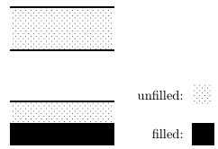

A.a conductor B. an inslatdpietoin D. an ioleted molcule ans:A

7.The energy leveldiagram shown applies to:

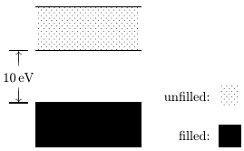

E. an ieolated atom ans:B

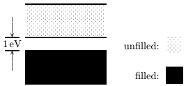

A.a conductor B.an insulator C.a semiconductor D.an isolated molecule E.an isolated atom ans:C

9.Possible units for the density of states function $N(E)$ are

A. J/ $m^{3}$ B.1/J C. $\mathrm{m}^{-3}$ D. , $J^- 1\cdot m^{- 3}$ E.kg/m3 ans: D

10.The density of states for a metal depends primarily on

A. the temperature B.the energy C.the density of the metal D.the volume of the sample E.none of these ans:B

11. The Fermi-Dirac occupancy probability $P(E)$ varies between

A. 0 and 1 B.0 and infnity C.1 and infinity D. -1 and 1 E.0 and $E_{F}$ ans:A

12.For a metal at absolute temperature 7 ，with Fermi energy $E_{F}$ ，the occupancy probability is given by： A. $e^{(E-E_{F})/kT}$

B. $e^{-(E-E_{F})/kT}$

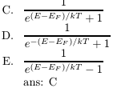

13. In a metal at $0K$ ,the Fermi energy is:

A.the highest energy of any electron B.the lowest energy of any electron C.the mean thermal energy of the electrons D.the energy of the top of the valence band E.the energy at the bottom of the conduction band ans: A

14.The occupancy probability for a state with energy equal to the Fermi energy is

A.0 B.0.5 C.1 D.1.5 E.2 ans: B

15.TheFermi energy of a metal depends primarily on:

A.the temperature B.the volume of the sample C.the mass density of the metal D. the size of the sample E.the number density of conduction electrons ans: E

16.The speed of an electron with energy equal to the Fermi energy for copper is on the order of

A. $10^{6}$m/s B. $10^{-6}$m/s C. 10m/s D. $10^{9}$m/s 10-m $10^{-1}$m/s ans:A

17.At $T=0$K the probability that a state 0.50eV below the Fermi level is occupied is about:

A.0 B. $5.0\times10^{-9}$ C. $5.0\times10^{-6}$ D. $5.0\times10^{-3}$ E.1 ans:E

18.At $T=0$K the probability that a state 0.50eV above the Fermi level is occupied is about:

A.0 B. $5.0\times10^{-9}$ C. $5.0\times10^{-6}$ D. $5.0\times10^{-3}$ E.1 ans: A

19.At room temperature $kI$ is about 0.0259eV .The probability thata state 0.50eVabove the Fermi level is occupied at room temperature is

A.1 B.0.05 C.0.025 D. $5.0\times10^{-6}$ E. $4.1\times10^{-9}$ ans:E

20.At room temperature $kT$ isabout 0.0259eV .The probability that a state 0.50eV below the Fermi level is unoccupied at room temperature is:

A.1 B.0.05 C.0.025 D. $5.0\times10^{-6}$ E. $4.1\times10^{-9}$ ans:E

21. If the density of states is $N(E)$ and the occupancy probability is $P(E)$ ，then the density of occupied states is

A. $N(E)+P(E)$ B. $N(E)/P(E)$ C. $N(E)-P(E)$ D. $N(E)P(E)$ E. $P(E)/N(E)$ ans: D

22.A hole refers to:

A.a proton B.a positively charged electron C.an electron that has somehow lost its charge D. a microscopic defect in a solid E.the absence of an electron in an otherwise filled band ans:E

23.Electrons in a full band do not contribute to the current when an electric field exists in a solid because:

A.the field cannot exert a force on them B. the individual contributions cancel each other C.they are not moving D.they make transitions to other bands E.they leave the solid ans: B

24.For a pure semiconductor the Fermi level is:

A.in the conduction band B.well above the conduction band C.in the valence band D.well below the valence band E.near the center of the gap between the valence and conduction bands ans: E

25.The number density 71 of conduction electrons, the resistivity $\mu$ and the temperature coefficient of resistivity $\boldsymbol{O}$ are given below for five materials.Which is a semiconductor?

C.
$$\begin{array}{c}n=10^{29}\:\mathrm{m}^{-3},\:\rho=10^{-8}\:\Omega\cdot\mathrm{m},\:\alpha=+10^{-3}\:\mathrm{K}^{-1}\\n=10^{28}\:\mathrm{m}^{-3},\:\rho=10^{-9}\:\Omega\cdot\mathrm{m},\:\alpha=-10^{-3}\:\mathrm{K}^{-1}\\n=10^{28}\:\mathrm{m}^{-3},\:\rho=10^{-9}\:\Omega\cdot\mathrm{m},\:\alpha=+10^{-3}\:\mathrm{K}^{-1}\\n=10^{15}\:\mathrm{m}^{-3},\:\rho=10^{3}\:\Omega\cdot\mathrm{m},\:\alpha=-10^{-2}\:\mathrm{K}^{-1}\\n=10^{15}\:\mathrm{m}^{-3},\:\rho=10^{-7}\:\Omega\cdot\mathrm{m},\:\alpha=+10^{-3}\:\mathrm{K}^{-1}\end{array}$$
ans:D

26.A pure semiconductor at room temperature has:

A. more electrons/m 3 in its conduction band than holes/m 3 in its valence band B. more electrons/ $\mathrm{'m}^{3}$ in its conduction band than a typical metal C.more electrons/ $\mathrm{m}^{3}$ in its valence band than at $I^{\prime}=0$ K D.more holes/min its valence band than electrons $\mathrm{m}^{3}$ in its valence band E.none of the above ans:E

27. For a metal at room temperature the temperature coefficient of resistivity is determined pri marily by:

A.the number of electrons in the conduction band B.the number of impurity atoms C.the binding energy of outer shell electrons D. collisions between conduction electrons and atoms E.none of the above ans: D

28. For a pure semiconductor at room temperature the temperature coefficient of resistivity is determined primarily by:

A.the number of electrons in the conduction band B.the number of replacement atoms C.the binding energy of outer shell electrons D. collisions between conduction electrons and atoms E.none of the above ans: A

29.A certain material has a resistivity of $7. 8\times 10^{3}$ $\Omega \cdot$m at room temperature and it increases as the temperature is raised by $100^{\circ}$ C. The material is most likely

A.a metal B.a pure semiconductor C.a heavily doped semiconductor D.an insulator E.none of the above ans:C

30.A certain material has a resistivity of $7. 8\times 10^{3}$ $\Omega \cdot$m at room temperature and it decreases as the temperature israised by $100^{\circ}$C .The material is most likely

A.a metal B.a pure semiconductor C.a heavily doped semiconductor D. an insulator E.none of the above ans:B

31.A certain material has a resistivity of $7.8\times10^{-8}\Omega\cdot$m at room temperature and it increases as the temperature is raised by $100^{\circ}$ C. The material is most likely

A. a metal B.a pure semiconductor C. a heavily doped semiconductor D.an insulator E.none of the above ans: A

618 Chapter 41:CONDUCTION OF ELECTRICITY IN SOLIDS

32. Donor atoms introduced into a pure semiconductor at room temperature

A. increase the number of electrons in the conduction band B.increase the number of holes in the valence band C.lower the Fermi level D. increase the electrical resistivity. E.none of the above ans: A

33.Acceptor atoms introduced into a pure semiconductor at room temperature

A.increase the number of electrons in the conduction band B.increase the number of holes in the valence band C.raise the Fermi level D. increase the electrical resistivity E.none of the above ans:B

electrons inits outer shell 34. An acceptor replacement atom in silicon might have

A D.6 E.7 ans:A

35. A donor replacement atom in silicon might have. electrons in its outer shell

A.1 B.2 C.3 D.4 E.5 ans:E

36.A given doped semiconductor can be identified as $P$ or $7t.$ typeby:

A.measuring its electrical conductivity B. measuring its magnetic susceptibility C. measuring its coefficient of resistivity D.measuring its heat capacity E. performing a Hall effect experiment ans:E

37. The contact electric field in the depletion region of a $F$ $\cdot74$ junction is produced by

A.electrons in the conduction band alone B.holes in the valence band alone C.electrons and holes together D. charged replacement atoms E.an applied bias potential difference ans:D

38. For an unbiased $P$ $\cdot7t$ junction, the energy at the bottom of the conduction band on the $7L$ side is:

A.higher than the energy at the bottom of the conduction band on the $F$ side B.lower than the energy at the bottom of the conduction band on the $P$ side Cle heateatete teae $P$ 71 siae $F$ Side ans:B

39. In an unbiased $P$ 71 junction

A. the electric potential vanishes everywhere B. the electric field vanishes everywhere C.the drift current vanishes everywhere D. the diffusion current vanishes everywhere E.the diffusion and drift currents cancel each other ans:E

40. Application of a forward bias to a $P$ $\cdot7L$ junction

A.narrows the depletion zone B.increases the electric field in the depletion zone C.increases the potential difference across the depletion zone D.increases the number of donors on the $7t.$ side E.decreases the number of donors on the $7L$ side ans: A

41. Application of a forward bias to a $P$ $7L$ junction

A.increases the drift current in the depletion zone B.increases the diffusion current in the depletion zone C.decreases the drift current on the $P$ side outside the depletion zone D. deereases the diteurrent on the 7L side outside the depletion zone ans: B

42.When a forward bias is applied to a $F$ $7t$ junction the concentration of electrons on the $P$ side

A.increases slightly B.increases dramatically C.decreases slightly D. decreases dramaticall ans:B

43.Which of the following is NOT true when a back bias is applied to a $F$ 71 junction?

A.Electrons fow from the p to the 71 side B.Holes fow from the $P$ tothe 71 side C.The electric field in the depletion zone increases D.The potential difference across the depletion zone increases E.The depletion zone narrows ans:B

44.Switch S is closed to apply a potential difference $V$ across a $P$ $7L$ junction as shown. Relative to the energy levels of the $TL$ -type material,with the switch open,the electron levels of the $P$ -type material are:

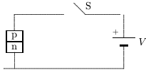

A.unchanged B.lowered by the amount $e^{-Ve/kT}$ C.lowered by the amount $Ve$ D. raised by the amount $e^{-Ve/kT}$ E.raised by the amount $Ve$ ans:C

45. A sinusoidal potential difference $V_{\mathrm{in}}$ $= V_{m}\sin ( \omega t)$ is applied to the $P$ $\cdot72$ junction as shown Which graph correctly shows $V_{\mathrm{out}}$ as a function of time?

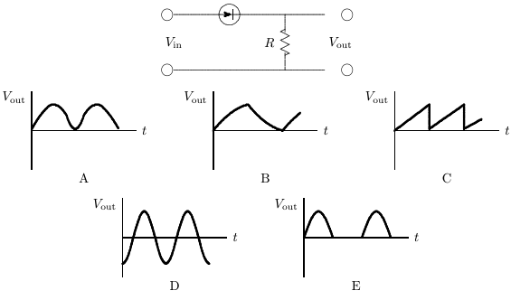
ans: E

Chapter 41:CONDUCTION OF ELECTRICITY IN SOLIDS621

46. In normal operation the current in a MOSFIT device is controlled by changing

A.the number of donors and acceptors B.the width of the depletion zone C.the size of the sample D.the density of electron states E.the temperature ans:B

47.LEDstands for

A.Less Energy Donated B.Light Energy Degrader C.Luminescent Energy Developer D.Laser Energy Detonato E.none of the above ans:E

48.A light emitting diode emits light when

A.electrons are excitedfrom the valence to the conduction band B.electrons from the conduction band recombine with holes from the valence band C.electrons collide with atoms D.electrons are accelerated by the electric field in the depletion region E.the junction gets hot ans:B

49.The gap between the valence and conduction bands of a certain semiconductor is 0.85eV When this semiconductor is used to form a light emitting diode, the wavelength of the light emitted:

A. is i a range above 1.5 x 10-6 $1.5\times10^{-6}$ $1.5\times10^{-6}$m C. is lways $1.5\times10^{-6}$ dlon $1.5\times10^{-6}$m E.has nothing to do with the gap ans: B

### Chapter 42:NUCLEAR PHYSICS

1. The smallest particle of any chemical element that can exist by itself and yet retain the qualitie that distinguish it as that element is

A.an electron B.a proton C.a neutron D. an atom E.a molecule ans: D

2.Of the following,which has the smallest rest energy?

A.A neutron B.An electron C.An ion D.A proton E.An atom ans:B

3.The mass of an electron

A.is almost the same as that ofa neutron B.is negative C.equals that of a proton D.is zero if the electron is at rest E.is much less than that of a protor ans:E

4.The mass of a neutron:

A.equals that of an electron B.equals that of a proton C.is a little more than that of a proton D.is exactly that of a proton plus an electron E.is as yet unmeasured ans:C

5.The mass of a hydrogen atom,in kilograms,is approximately:

B. $10^{-31}$ 10-31 $10^{-27}$ 1 $10^{-8}$ $10^{-24}$ $10^{-13}$ ans: A

6.1 atomic mass unit is about:

A. $1.66\times10^{-31}$ kg B. $9.11\times10^{-31}$kg C. $1.66\times10^{-27}$kg D. $9.11\times10^{-27}$kg E. $1.66\times10^{-25}$kg ans:C

7.The atomic number of an element is:

A.the whole number nearest to its mass B.the number of protons in its nucleus C.the nearest whole number of hydrogen atoms having the same mass as a single atom of the given element D. the number of neutrons in its nucleus E.its order of discovery ans: B

8.Iron has atomic number 26. Naturally mined iron contains isotopes of mass numbers 54, 5657,and 58.Which of the following statements is FALSE？

A.Every atom of iron has 26 protons B.Some iron atoms have 30 neutrons C.Some iron atoms have 54 neutrons D.The isotopes may be separated in a mass spectrometer E.There are four kinds of naturally occurring iron atoms with the same chemical properties ans:C

9.Let $Z$ denote the atomic number and $A$ denote the mass number ofa nucleus.The number of neutrons in this nucleus is

A. $Z$ B. $A-Z$ C. $A-2Z$ D.A E. $2A-Z$ ans:B

10.The isotopes of an element:

A.cannot be separated at all B.occur wel e parated i nature D.cannot be separated by physical methods E.have equal masses ans: C

11. Bromine, with atomic mass 79.942u, is composed of nearly equal amounts of two isotopes, one of which contains 79 nucleons per atom. The mass number of the other isotope is:

B. 79 C. ans: D

12.The mass density of an atomic nucleus is

A.about $10^{15}\mathrm{kg/m}^{3}$ B.about $10^{12}\operatorname{kg/m}^{3}$ C.increases with increasing nuclear mass D. increases with decreasing nuclear radius E.about the same as that of all other nucle? ans: E

13. Volumes of atomic nuclei are proportional to

A.the mass number B.the atomic number C.the total nuclear spin D.the number of neutrons E.none of these ans:A

14.A femtometer is:

A.larger than $10^{-9}$ m B. $10^{-9}$ m C. $10^{-12}$ m D. $10^{-15}$m E. $10^{-18}$m ans: D

15.A nucleus with a mass number of 64 has a mean radius of about:

A.4.8 fm B.19fm C.77fm D. 260 fm E. $2.6\times10^{5}$ fm ans: A

16.A proton in a large nucleus:

A.attracts all other protons B.repels all other protons C. repelsal neutroton and repels thers E.attracts some neutrons and repels others ans:D

17.Two protons are separated by $10^{-16}$m .The nuclear (N),electrostatic (E),and gravitational (G) forces between these protons, in order of increasing strength, are:

A.E,N,G B.N,G,E C.G.E.N D.G,N,E E.E.G.N ans:C

18. Two protons are about $10^{-10}$ m apart. Their relative motion is chiefly determined by:

A. gravitational forces B. electrical forces C.nuclear forces D.magnetic forces E.torque due to electric dipole moments ans: B

19.The binding energy of a nucleus is the energy that must be supplied to:

A.remove a nucleon B. remove an alpha particle D. renparea eta atieinto ts costituent nucleons E.separate the nucleus into a collection of alpha particles ans: D

20. If a nucleus has mass $M$ $Z$ protons (mass $m_{p}$ ), and $N$ neutrons (mass $\eta n_{n}$ ),its binding energy is equal to:

A. $Mc^{2}$ B. $(M-Zm_{p}-Nm_{n})c^{2}$ C. $(Zm_{p}+Nm_{n}-M)c^{2}$ D. $(Zm_{p}+Nm_{n})c^{2}$ E. $(Zm_{p}-M)c^{2}$ ans:C

21.Stable nuclei generally

A.have agreater number ofprotons than neutrons B.have low mass numbers C.have high mass numbers D.are beta emitters E.none of the above ans:E

22.Let $A$ be the mass number and $Z$ be the atomic number of a nucleus. Which of the following is approximately correct for light nuclei?

A. $Z=2A$ B. $Z=A$ C. $Z=A/2$ D. $Z={\sqrt{A}}$ E. $Z=A^{2}$ ans:C

23.The greatest binding energy per nucleon occurs for nuclides with masses near that of

A.helium B.sodium C.iron D.mercury E.uranium ans:C

24.Which of the following nuclides is least likely to be detected?

A. 52 Fe ( $Z=26$ B. 115 Nd ( $Z=60$ C. 175 Lu $Z=71$ D. 208 Pb $Z=82$ E. 238 U( $Z=92$ ans: B

25.The half-life of a radioactive substance is:

A.half the time it takes for the entire substance to decay B.usually about 50 years C.the time for radium to change into lead D. calculated from $E=mc^{2}$ E.the time for half the substance to decay ans:E

26.Which expression correctly describes the radioactive decay of a substance whose half-life is 7 A. $N(t)=N_{0}e^{-(t\ln2)/T}$

B. $N(t)=N_{0}e^{-t/T}$ C. $N(t)=N_{0}e^{-tT}$ D. $N(t)=N_{0}e^{-tT\ln2}$ E. $N(t)=N_{0}e^{-t/T\ln2}$ ans:A

27.Radioactive element Adecays to the stable element B with ahalf-life $I$ .Starting with a sample of pure A and no $B$ which graph below correctly shows the number of A atoms, $N_{A}$ as a function of time $t!$

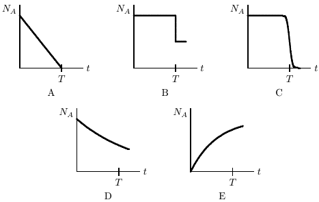

ans: D

28.Alarge collection ofnuclei are undergoing alpha decay.The rate ofdecay at any instant is proportional to:

A.the number of undecayed nuclei present at that instant B.the time since the decays started C.the time remaining before all have decayed D. the half-life of the decay E.the average time between decays ans: A

29. The relation between the disintegration constant $\lambda$ and the half-life ${'I}$ of a radioactive substance is:

A. $\lambda=2I$ B. $\lambda=1/T$ C. $\lambda=2/T$ D. $\lambda T=\ln2$ E. $\lambda T=\ln(1/2)$ ans:D

628 Chapter 42:NUCLEAR PHYSICS

30. Possible units for the disintegration constant $\lambda$ are

D. $\mathrm{cm}^{-1}$ -1 -1 ans: D

31.The half-life of a given nuclear disintegration $\mathbf{A}\rightarrow\mathbf{B}$

A.depends on the initial number of A atoms B.depends on the initial number of B atoms C.is an exponentially increasing function of time D.is an exponentially decreasing function of time E.none of the above ans:E

32.The graph shows the activity $k$ as a function of time $t$ for three radioactive samples.Rank the samples according to their half-lives, shortest to longest

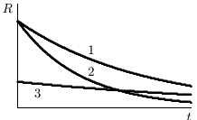

A. 1,2,3 B. 1,3,2 C. 2,1,3 D. 2,3,1 E. 3,1,2 ans: C

33. The half-life of radium is about 1600 years. If a rock initially contains $1\lg$ of radium, the amount left after 6400 years will be about:

A. 938mg B.62mg C.31mg D.16mg E.less than 16 mg ans: C

34. Starting with a sample of pure 66 Cu, 7/8 of it decays into Zn in 15 minutes. The corresponding half-life is:

A.15minutes B.5minutes C.7minutes D.3.75 minutes E.10minutes ans:B

35. 210Bi (an isotope of bismuth) has a half-life of 5.0 days. The time for three-quarters of a sample of 210 Bi to decay is:

A.2.5 days B.10 days C.15 days D.20days E.3.75days ans:B

36.Radioactive 90 Sr has a half-life of 30 years.What percent of a sample of $90Sr$ will remain after 60 years?

A.0% B. $25\%$ C. $50\%$ D. $75\%$ E. $14\%$ ans:B

37. The half-life of a radioactive isotope is 6.5h. If there are initially $48\times10^{32}$ atoms of this isotope, the number of atoms of this isotope remaining after 26h is:

A. $12\times10^{32}$ B. $6\times10^{32}$ C. $3\times10^{32}$ D. $6\times10^{4}$ E. $3\times10^{2}$ ans:C

38.At the end of $14min$ 1/16 of a sample of radioactive polonium remains. The corresponding half-life is:

A. $(7/8)\operatorname*{min}$ B. $(8/7)\min$ C. $(7/4)\min$ D. $(7/2)\min$ E. $(14/3)\operatorname*{min}$ ans: D

630 Chapter 42:NUCLEAR PHYSICS

39.The half-life of a radioactive isotope is 140 days. In how many days does the decay rate of a sample of this isotope decrease to one-fourth of its initial decay rate?

A.35 B.105 C.187 D.210 E.280 ans: E

40.Of the three common types of radiation (alpha, beta, gamma) from radioactive sources, electric charge is carried by:

A. only beta and gamma B.only beta C.only alpha and gamma D.only alpha E.only alpha and beta ans:E

41. An alpha particle is:

A.ahelium atom with two electrons removed B.an aggregate of two or more electrons C.a hydrogen atom D.the ultimate unit of positive charge E. sometimes negatively charged ans: A

42.A nucleus with mass number $A$ and atomic number $Z$ emits an alpha particle.The mass number and atomic number,respectively, of the daughter nucleus are:

A.A, $Z-2$ B. $A-2$ A-2 $A- 2$, $Z- 2$ C. $A-2$ ， $Z$ D. $A-4$ $Z$ E. $A-4$ ， $Z-2$ ans:E

43.Radioactive polonium, 214 Po( $Z=84$ ),decays by alpha emission to:

A. 214 Po ( $Z=84$ B. 210Pb 210Pb ${}^{210}$Pb$(Z=82)$ $Z=82$ Z=8210214210218 $Z=83$ $Z=85$ $Z=84$ ans: B

44. A radium atom, 226 Ra ( $Z=86$ ) emits an alpha particle. The number of protons in the resulting atom is:

A. 84 C.86 D. some oher mumber ans: A

45. Some alpha emitters have longer half-lives than others because:

A.their alpha particles have greater mass B.their alpha particles have less mass C.their barriers to decay are higher and wider D.their barriers to decay are lower and narrower E.their decays include the emission of a photon ans: C

46.In an alpha decay the disintegration energy appears chiefy as:

A. photon energies B.the kinetic energies of the alpha and the daughter nucleus C.the excitation energy of the daughter nucleus D.the excitation energy of the alpha particle E.heat ans: B

47.Rank the following collections of particles according to the total binding energy of all the particles in each collection,least to greatest.

collection 1: ${}^{244}$Pu ( $Z=94$ )nucleus alone collection 2: 240 U( $Z=92$ ) nucleus, $\boldsymbol{U}$ particle collection 3: 240 U ( $Z=92$ )nucleus, two separated protons, two separated neutrons

A. 1,2,3 B. 3,2,1 C. 2,1,3 D. 1,3,2 E. 2,3,1 ans: D

48.A beta particle is:

A.a helium nucleus B.an electron or a positron C.a radioactive element D. any negative particle E.a hydrogen atom ans: B

632 Chapter 42:NUCLEAR PHYSICS

49.Beta particles from various radioactive sources all have.

A.the same mass D.the same speed B.the same charge E.the same defection C. the same energy in a magnetic field ans: A

50.A radioactive atom X emits a $\beta^{-}$ particle. The resulting atom:

A.must be very reactive chemically B.has an atomic number that is one more than that of X C.has a mass number that is one less than that of X D.must be radioactive E.is the same chemical element as X ans: B

51.A nucleus with mass number $A$ and atomic number $Z$ undergoes $\beta^{-}$ decay.The mass number and atomic number, respectively, of the daughter nucleus are:.

A.A, $Z-1$ B. $A-1$ ， $Z$ C. A + 1 $A+1$ $A+ 1$, $Z- 1$ D.A, $Z+1$ E.A, $Z-1$ ans: D

52.A nucleus with mass number $A$ and atomic number $Z$ undergoes $\beta^{+}$ decay. The mass number and atomic number, respectively, of the daughter nucleus are:

A. A -1 $A-1$ $A- 1$, $Z- 1$ $Z-1$ Z-1 B. $A-1$ ， $Z+1$ C. $A+1$ ， $Z-1$ D.A, $Z+1$ E.A, $Z-1$ ans:E

53. In addition to the daughter nucleus and an electron or positron, the products of a beta decay include:

A.a neutron B.a neutrino C.a proton D. an alpha particle E.no other particle ans: B

54.The energies of electrons emitted in $\beta^{-}$ decays have a continuous spectrum because:

A. the original neutron has a continuous spectrum. B.a neutrino can carry off energy C.the emitted electron is free D.energy is not conserved E. the daughter nucleus may have any energy ans:B

55.If 204 T1( $Z=81$ )emits a $\beta^{-}$ particle from its nucleus:

A. stable TI is formed B $^{202}$Hg ( $Z=80$ )is formed C.204pb $Z=82$ )is formed D.radioactive TI is formed E. 197 Au( $Z=79$ )is formed ans:C

56.An atom of 235 U( $Z=92$ ) disintegrates to 207 Pb( $Z=82$ )with a half-life of about a billion years by emitting seven alpha particles and $\beta^{-}$ particles

A.3 B.4 C.5 D.6 E.7 ans:B

57.When ordinary sodium ( 23 Na, $Z=11$ )is bombarded with deuterons,the products are a neutron and:

A. 27 Al, $Z=13$ B. 24 Na, $Z=11$ C. 24 Mg, $Z=12$ D. 202025 Mg, $Z=10$ Z=10 $Z=12$ ans: D

58. 65 Cu can be turnedinto 66 Cu,with no accompanying product except a gamma, if bombardec with:

A.protons B. neutrons C.deuterons D. electrons E.alpha particles ans: B

634 Chapter 42:NUCLEAR PHYSICS

59.Magnesium has atomic number 12, hydrogen has atomic number 1,and helium has atomic number 2. In the nuclear reaction $^{24}$Mg$+^2$H$\to ($ $) + \:^4$He the missing quantity is

A. 23 Na ( $Z=11$ B. 2222 $^{22}$Ne$(Z=10)$ Z=10 $Z=10$ C. $^{21}$Na$(Z=11)$ Z=11 $Z=11$ D. 212222 Na $^{21}$Ne$(Z=10)$ $^{22}$Na$(Z=11)$ $Z=10$ Z=10 $Z=11$ ans:E

60.Aluminum has atomic number 13.helium has atomic number 2.and siliconhas atomic numbe 14. In the nuclear reaction $^{27}$Al$+{}^4$He$\to{}^30$Si+({}) the missing particle is

A.an $\boldsymbol{O}$ particle B.a positron C.an electron D.a proton E.a neutron ans: D

61. The 66 Cu ( $Z=29$ ) produced in a nuclear bombardment is unstable, changing to 6666 $^{66}$Zn$\left(Z=30\right)$ by the emission of

A.a proton B.a gamma ray photon C.a positron D.an electron E.an alpha particle ans: D

62.When ordinary sulfur, $^{32}$S$\left(Z=16\right)$ , is bombarded with neutrons, the products are $^{32}$P$\left(Z=15\right)$ and:

A. alpha particles B.protons C. deuterons D.gamma ray particles E. electrons ans:B

63.A certain nucleus, after absorbing a neutron, emits a $\beta^{-}$ and then splits into two alpha particles The $(A,Z)$ of the original nucleus must have been:

B. 6, 28.10 ans: D

64.When 23 Na ( $Z=11$ )is bombarded with protons, the products are 20 Ne( $Z=10$ ) and:

A.a neutron B.an alpha particle C.a deuteron D.a gamma ray particle E.two beta particles ans:B

65. Bombardment of 28 Si( $Z=14$ ) with alpha particles may produce

A. a proton and 31 P( $Z=15$ B.hydrogen and $32S$ ( $Z=16$ C.a deuteron and 27 A1 ( $Z=13$ D. helium and $31P$ $Z=15$ E. 35 C1( $Z=17$ ans: A

66.The becquerel is the correct unit to use in reporting the measurement of

A.the rate of decay of a radioactive source B.the ability of a beam of gamma ray photons to produce ions in a target C.the energy delivered by radiation to a target D.the biological effect of radiation E.none of the above ans: A

67.The gray is the correct unit to use in reporting the measurement of:

A.the rate of decay of a radioactive source B.the ability of a beam of gamma ray photons to produce ions in a target C.the energy per unit mass of target delivered by radiation to a target D.the biological effect of radiation E.none of the above ans:C

68.The sievert is the correct unit to use in reporting the measurement of:

A.the rate of decay of a radioactive source B.the ability of a beam of gamma ray photons to produce ions in a target C.the energy delivered by radiation to a target D.the biological effect of radiation E.none of the above ans: D

### Chapter 43:ENERGY FROM THE NUCLEUS

1.If the nucleus of a lead atom were broken into two identical nuclei,the total mass of the resultant nuclei would be:

A.the same as before B.greater than before C.less than before D. converted into radiation E.converted into kinetic energy ans: C

2.Consider the following energies

1.minimum energy needed to excite a hydrogen atom 2.energy needed to ionize a hydrogen atom 3.energy released in 235 U fission 4. energy needed to remove a neutron from a 12 C nucleus Rank them in order of increasing value

A. 1,2,3,4 B. 1,3,2,4 C. 1,2,4,3 D. 2,1,4,3 E. 2,4,1,3 ans:C

3.The binding energy per nucleon:

A. increases for all fission events B.increases for some,but not all,fission events C.decreases for all fission events D.decreases for some,but not all,fission events E.remains the same for all fission events ans: A

4.When uranium undergoes fission as a result of neutron bombardment, the energy released is due to:

A.oxidation of the uranium B.kinetic energy of the bombarding neutrons C.radioactivity of the uranium nucleus D.radioactivity of the fission products E.a reduction in binding energy ans:E

5.The energy supplied by a thermal neutron in a fission event is essentially its

A. excitation energy B. binding energy C. kinetic energy D. rest energy E. electric potential energy ans:B

6.The barrier to fission comes about because the fragments

A.attract each other via the strong nuclearforce B. repel each other electrically C.produce magnetic fields D.have large masses E. attract electrons electrically ans: A

7. 235 U is readily made fissionable by a thermal neutron but 238 U is not because:

A.the neutron has a smaller binding energy in 236 U B.the neutron has a smaller excitation energy in 236 U C.the potential barrier for the fragments is less in 239 U D.the neutron binding energy is greater than the barrier height for 236 Uand less than the barrier height for 239 U E. the neutron binding energy is less than the barrier height for 236 U and greater than the barrier height for 239 U ans: D

8.An explosion does not result from a small piece of 235 U because

A.it does not fission B.the neutrons releasedmove too fast C. 238 U is required D.too many neutrons escape, preventing a chain reaction from starting E.a few neutrons must be injected to start the chain reaction ans: D

9.When 236 U fissions the fragments are A. always 140 Xe and $94Sr$

B. always identical C.never 140 Xe and $94Sr$ D. never identical E.none of the above ans:E

638 Chapter 43:ENERGY FROM THE NUCLEUS

10.Fission fragments usually decay by emitting

A. alpha particles B. electrons and neutrinos C. positrons and neutrinos D.only neutrons E.only electrons ans:B

11.When 236 U fissions,the products might be

A. 146 Ba, 8989 $89Kr$ ,and a proton B. 146 Ba, 8989 $^{89}$Kr ,and a neutron C. 148 Cs and 8585 $85Br$ D. 1331, 92 Sr, and an alpha particle E.two uranium nuclei ans: B

12. Consider all possible fission events. Which of the following statements is true?

A.Light initial fragments have more protons than neutrons and heavy initial fragments have fewer protons than neutrons B.Heavy initial fragments have more protons than neutrons and light initial fragments have fewer protons than neutrons C.All initial fragments have more protons than neutrons D.All initial fragments have about the same number of protons and neutrons E.All initial fragments have more neutrons than protons ans: E

13.Which one of the following represents a fission reaction that can be activated by slow neutrons? A. $^{238}U_{92}$+ $ ^{1}n_{0}\to ^{90}$K$r_{36}$+ $ ^{146}$C$s_{55}$+ $ ^{2}H_{1}$+ $ ^{1}$m 10

B. ${}^{239}$Pu$_94+{}^{1}$n$_0\to{}^{96}$Sr$_38+{}^{141}$Ba$_56+3{}^{1}$n$_0$ C. $^{238}\mathrm{U}_{92}\to^{234}\mathrm{Th}_{90}+^{4}\mathrm{He}_{2}$ D. $^{3}\mathrm{H}_{1}+^{2}\mathrm{H}_{1}\to^{4}\mathrm{He}_{2}+^{1}\mathrm{n}_{0}$ E. $^{107}\mathrm{Ag}_{47}+^{1}\mathrm{n}_{0}\to^{108}\mathrm{Ag}_{47}\to^{108}\mathrm{Cd}_{48}+^{0}e_{-1}$ ans:B

14. In the uranium disintegration series.

A.the emission of a $\beta^{-}$ particle increases the mass number $A$ by one and decreases the atomic number $Z$ by one B. the disintegrating element merely ejects atomic electrons C.the emission of an $dx$ particle decreases the mass number $A$ by four and decreases the atomic number $Z$ by two D.the nucleus always remains unaffected E.the series of disintegrations continues until an element having eight outermost orbital elec trons is obtained ans:C

15.Separation of the isotopes of uranium requires a physical, rather than chemical, method be cause:

A.mixing other chemicals with uranium is too dangerous B.the isotopes are chemically the same C.the isotopes have exactly the same number of neutrons per nucleus D.natural uranium contains only $0.7\%$ 235 U E.uranium is the heaviest element in nature ans:B

16.Which one of the following is NOT needed in a nuclear fission reactor?

A.Moderator B.Fuel C.Coolant D.Control device E.Accelerator ans:E

17.The function of the control rods in a nuclear reactor is to:

A.increase fission by slowing down the neutrons B.decrease the energy of the neutrons without absorbing them C. increase the ability of the neutrons to cause fission D.decrease fission by absorbing neutrons E.provide the critical mass for the fission reaction ans: D

18.A nuclear reactor is operating at a certain power level,with its multiplication factor adjusted tounity.The controlrods are now used toreduce the power output to one-half its former value. After the reduction in power the multiplication factor is maintained at:

A.1/2 B.1/4 C.2 D. 4 ans:E

19.The purpose of a moderator in a nuclear reactor is to

A.provide neutrons for the fission process B.slow down fast neutrons to increase the probability of capture by uranium . ah u datio E.none of the above ans:B

640 Chapter 43:ENERGY FROM THE NUCLEUS

20. In a neutron-induced fission process, delayed neutrons come from.

A.the fission products B.the original nucleus just before it absorbs the neutron C.the original nucleus just after it absorbs the neutron D. the moderator material E.the control rods ans: A

21.In a nuclear reactor the fissionable fuel is formed into pellets rather than finely ground and the pellets are mixed with the moderator. This reduces the probability of:

A.non-fissioning absorption of neutrons B.loss of neutrons through the reactor container C.absorption of two neutrons by single fissionable nucleus D.loss of neutrons in the control rods E.none of theabove ans: A

22.In a subcritical nuclear reactor:

A.the number of fission events per unit time decreases with time B.the number of fission events per unit time increases with time C.each fission event produces fewer neutrons than when the reactor is critical D.each fission event produces more neutrons than when the reactor is critical E.none of the above ans: A

23.In the normal operation of a nuclear reactor:

A.control rods are adjusted so the reactor is subcritical B.control rods are adjusted so the reactor is critical C.themoderating fuid is drained D. the moderating fuid s continully reyeled ans: B

24.In a nuclear power plant, the power discharged to the environment

A.can be made zero by proper design B.must be less than the electrical power generated C.must be greater than the electrical power generated D. can be entirelyreeyled toproduce an equalanmount oelecrical powel ans:E

25. The binding energy per nucleon:

A.increases for all fusion events B.increases for some, but not all, fusion events C.remains the same for some fusion events D.decreases for all fusion events E.decreases for some,but not all, fusion events ans: A

26.To produce energy by fusion of two nuclei,the nuclei must:

A.have at least several thousand electron volts of kinetic energy B.both be above iron in mass number C.have more neutrons than protons D.be unstable E.be magic number nuclei ans:A

27.Which one of the following represents a fusion reaction that yields large amounts of energy?

A. $^{238}\mathrm{U}_{92}+^{1}\mathrm{n}_{0}\to^{90}\mathrm{Kr}_{36}+^{146}\mathrm{Cs}_{55}+^{2}\mathrm{H}_{1}+^{1}\mathrm{n}_{0}$ B. ${}^{239}\mathrm{Pu}_{92}+{}^{1}\mathrm{n}_{0}\to{}^{96}\mathrm{Sr}_{38}+{}^{141}\mathrm{Ba}_{56}+3^{1}\mathrm{n}_{0}$ C. $^{238}\mathrm{U}_{92}\to^{234}\mathrm{Th}_{90}+^{4}\mathrm{He}_{2}$ D. $^{3}\mathrm{H}_{1}+^{2}\mathrm{H}_{1}\to^{4}\mathrm{He}_{2}+^{1}\mathrm{n}_{0}$ E. $^{107}\mathrm{Ag}_{47}+^{1}\mathrm{n}_{0}\to^{108}\mathrm{Ag}_{47}\to^{108}\mathrm{Cd}_{48}+^{0}e_{-1}$ ans: D

28.The barrier to fusion comes about because protons:

A.attract each other via the strong nuclear force B.repel each other electrically C.produce magnetic fields D.attract neutrons via the strong nuclear force E.attract electrons electrically ans: B

29.High temperatures are required in thermonuclear fusion so that：

A.some nuclei are moving fast enough to overcome the barrier to fusion B.there is a high probability some nuclei will strike each other head on C.the atoms are ionized D.thermal expansion gives the nuclei more room E.the uncertainty principle can be circumvented ans: A

30.For a controlled nuclear fusion reaction,one needs:

A.high number density 71 and high temperature 7 B.high number density 71 and low temperature 7 C.low number density $Tt$ and high temperature $I$ D. low nmber density $TL$ 71 and lowtemperat $I^{\prime}=0$ T 7 K ans: A

642 Chapter 43:ENERGY FROM THE NUCLEUS

31.Most of the energy produced by the Sun is due to

A. nuclear fission B.nuclear fusion C.chemical reaction D.gravitational collapse E.induced emfs associated with the Sun's magnetic field ans: B

32.Nuclear fusion in stars produces all the chemical elements with mass numbers less than

A.56 B.66 C.70 D.82 E.92 ans: A

33. Nuclear fusion in the Sun is increasing its supply of:

A. hydrogen B. helium C.nucleons D. positrons E.neutrons ans:B

34.Which of the following chemical elements is not produced by thermonuclear fusion in stars

A.Carbon ( $Z=6$ ， $A\approx12$ B.Silicon ( $Z=14$ ， $A\approx28$ C.Oxygen $Z=8$ ， $A\approx16$ D.Mercury ( $Z=80$ ， $A\approx200$ E.Chromium $Z=24$ $A\approx52$ ans: D

35.The first step of the proton-proton cycle is:

A. $^{1}$H$+ ^1$H$\to^2$H B. $^{1}$H$+^1$H$\to^2$H$+e^++\nu$ C. $^{1}$H$+^1$H$\to^2$H$+e^-+\nu$ D. $^{1}$H$+ ^1$H$\to^2$H$+\gamma$ E. $^{1}$H$+^1$H$\to^3$H$+e^-+\nu$ ans:B

36. The overall proton-proton cycle is equivalent to

A. $2^{1}$H$\to^2$H B. $4^{1}$H$\to^4$H C. $4^{1}$H$\to^4$H+4n D. $4^{1}$H$+2e^-\to^4$He$+2\nu+6\gamma$ E. $4^{1}$H$+2e^+\to^4$He$+2\nu+3\gamma$ ans: D

37.The energy released in a complete proton-proton cycle is about

A.3keV B.30keV C.3MeV D.30MeV E.300MeV ans: D

38.For purposes of a practical (energy producing)reaction one wants a disintegration energy $Q$ that is

A.positive for fusion reactions and negative for fission reactions B.negative for fusion reactions and positive for fission reactions C.negative for both fusion and fission reactions D.positive for both fusion and fission reactions E.as close to zero as possible for both fusion and fission reactions ans: D

39.Lawson's number is $10^{20}$ s$\cdot \mathrm{m} ^- 3$ .If the density of deuteron nuclei is $2\times10^{21}$m$^-3$ what shoulc the confinement time be to achieve sustained fusion?

A.16ms B.50ms C.160ms D.250ms E.500ms ans:B

40. Tokamaks confine deuteron plasmas using

A.thick steel walls B. magnetic fields C.laser beams D.vacuum tubes E. electric fields ans:B

41. Most magnetic confinement projects attempt

A. proton-proton fusion B. proton-deuteron fusion C.deuteron-deuteron fusion D. deuteron-triton fusion E. triton-triton fusion ans:C

644 Chapter 43:ENERGY FROM THE NUCLEUS

42.Compared to fusion in a tokamak, laser fusion makes use of:

A.smaller particle number densities B. greter parice numberdensies D. highe temperature ans:B

43.Most laser fusion projects attempt:

A. proton-proton fusion B. proton-deuteron fusion C.deuteron-deuteron fusion D. deuteron-triton fusion E. triton-triton fusion ans: D

44.In laser fusion, the laser light is:

A.emitted by the reacting nuclei B.used to cause transitions between nuclear energy levels C.used to cause transitions between atomic energy levels D. used to replace the emitted gamma rays E.used to heat the fuel pellet ans: E

### Chapter 44QUARKS,LEPTONS,AND THE BIG BANG

1.Which of the following particles is stable?

A. Neutron B.Proton C.Pion D.Muon E.Kaon ans:B

2.The stability of the proton is predicted by the laws of conservation of energy and conservation of: A. momentum

B.angular momentum C.baryon number D.lepton number E.strangeness ans:C

3.When a kaon decays via the strong interaction the products must include a:

A.baryon B.lepton C.strange particle D. electron E. neutrino ans:C

4.A particle with spin angular momentum $\hbar/2$ is called a

A.lepton B.hadron C.fermion D. boson E. electron ans: C

5.A particle with spin angular momentum $\hbar$ is called a:

A.lepton B.hadron C.fermion D. boson E.electron ans: D

646 Chapter 44:QUARKS,LEPTONS,AND THE BIG BANG

6.An example of a fermion is a

A.photon B.pion C.neutrino D. kaon E.none of these ans:C

7. An example of a boson is a:

A. photon B.electron C.neutrino D. proton E. neutron ans: A

8.All particles with spin angular momentum $\hbar/2$

A.interact via the strong force B.travel at the speed of light C.obey the Pauli exclusion principle D. have non-zero rest mass E.are charged ans:C

9.All leptons interact with each other via the:

A.strong force B.weak force C.electromagnetic force D. strange force E.none of these ans:B

10.An electron participates in:

A.the strong force only B.the strong and weak forces only C.the electromagnetic and gravitational forces only D. the electromagnetic, gravitational, and weak forces only E. the electromagnetic, gravitational, and strong forces only ans: D

11.Which of the following particles has a lepton number of zero?

$V_{\mathrm{e}}$ ${\overline{V}}_{\mu}$ $\mathrm{e}^{+}$ $\mu^{+}$ ans:E

12.Which of the following particles has a lepton number of +1?

${\overline{V}_{\mathrm{e}}}$ $\mathrm{e}^{+}$ $\mu^{-}$ $\mu^{+}$ ans:C

13. $\pi^{+}$ represents a pion (a meson), $\mu^{-}$ represents a muon (a lepton), $V_{\mathrm{e}}$ represents an electron neutrino (a lepton), $\nu_{\mu}$ and p represents a proton represents a muon neutrino (a lepton). Which of the following decays might occur?

A. $\pi^{+}\longrightarrow\mu^{-}+\nu_{\mu}$ B. $\pi^{+}\longrightarrow$p$+\nu_\mathrm{e}$ C. $\pi^{+}\longrightarrow\mu^{+}+\overline{\nu}_{\mathrm{e}}$ D. $\pi^{+}\longrightarrow$p$+\overline{\nu}_\mu$ E. $\pi^{+}\longrightarrow\mu^{+}+\nu_{\mu}$ ans:E

14.A particle can decay to particles with greater total rest mass

A.only if antiparticles are produced B.only if photons are also produced C.only if neutrinos are also produced D.only if the original particle has kinetic energy E.never ans: E

15.The interaction $\pi^{-}+p\to\pi^{-}+\Sigma^{+}$ violates the principle of conservation of

A.baryon number B.lepton number C.strangeness D.angular momentum E.none of these ans:C

16. The interaction $\pi^{-}+p\to K^{-}+\Sigma^{+}$ violates the principle of conservation of:

A.baryon number B.lepton number C.strangeness D. angular momentum E.none of these ans:E

17. A neutral muon cannot decay into two neutrinos. Of the following conservation laws, which would be violated if it did?

A.Energy B.Baryon number C.Charge D. Angular momentum E.None of the above ans: D

18. A positron cannot decay into three neutrinos. Of the following conservation laws, which would be violated if it did?

A.Energy B.Baryon number C.Lepton number D.Linear momentum E. Angular momentum ans:C

19. Two particles interact to produce only photons, with the original particles disappearing. Th particles must have been:

A.mesons B. strange particles C.strongly interacting D.leptons E.a particle, antiparticle pain ans: E

20.Two baryons interact to produce pions only, the original baryons disappearing. One of the baryons must have been:

A.a proton B.an omega minus C.a sigma D. an antiparticle E.none of these ans:D

21. A baryon with strangeness -1 decays via the strong interaction into two particles,one of which is a baryon with strangeness 0 .The other might be

A.a baryon with strangeness 0 B.a baryon with strangeness +1 C.a meson with strangeness -1 D.a meson with strangeness +1 E.a meson with strangeness 0 ans: C

22.A baryon with strangeness 0 decays via the strong interaction into two particles,one ofwhicl is a baryon with strangeness +1 .The other might be：

A. a baryon withstrangenes 1 C.a baryon with strangeness -1 D. a meson with strangeness +1 E.a meson with strangeness -1 ans: E

23.In order of increasing strength the four basic interactions are

A. gravitational, weak, electromagnetic, and strong B. gravitational, electromagnetic, weak, and strong C.weak, gravitational, electromagnetic, and strong D. weak, electromagnetic, gravitational, and strong E. weak, electromagnetic, strong, and gravitational ans: A

24.The two basic interactions that have finite ranges are:

A. electromagnetic and gravitational B. electromagnetic and strong C. electromagnetic and weak D. gravitational and weak. E.weak and strong ans:E

25.A certain process produces baryons that decay with a lifetime of $4\times10^{-24}$ s.The decay is a result of:

A. the gravitational interaction B.the weak interaction C. the electromagnetic interaction D. the strong interaction E.some combination of the above ans: D

26. A certain process produces mesons that decay with a lifetime of $6\times10^{-10}$ 8.The decay is a result of:

A. the gravitational interaction B.the weak interaction C. the electromagnetic interaction D. the strong interaction E.some combination of the above ans: B

650 Chapter 44:QUARKS, LEPTONS,AND THE BIG BANG

27.Compared to the lifetimes ofparticles that decay via the weak interaction,thelifetimes of particles that decay via the strong interaction are A. $10^{-12}$ times as long

B. $10^{-23}$ times as long C. $10^{24}$ times as long D. $10^{12}$ Itimes as ong ans: A

28.Strangeness is conserved in:

A.all particle decays B.no particle decays C.all weak particle decays D. all strong particle decays E. some strong particle decays ans: D

29.Different types of neutrinos can be distinguished from each other by:

A.the directions of their spins B.the leptons withwhich they interact C. the baryons with which they interact. D.the number of photons that accompany them E.their baryon numbers ans: B

30.All known quarks have:

A.charges that are multiples of $E$ and integer baryon numbers B. charges ha aremutiles ofe $E$ $e/3$ nd baryon e mbers tat re itee +1/3 or -1/3 E. chares that are multiples of 2/3 $e/3$ $2e/3$ and aryo mbers that are ithee +1/3 +113 +1/3 Do -1/3 /3 -1/3 ans: D

31.The baryon number of a quark is:

ans:C

32.Quarks are the constituents of：

A.all particles B.all leptons C. all strongly interacting particles D. only strange particles E.only mesons ans:C

33.Any meson is a combination of:

A. three quarks B.two quarks and an antiquark C.one quark and two antiquarks D. one quark and one antiquark E.two quarks ans: D

34.Any baryon is a combination of:

A.three quarks B.two quarks and an antiquark C.one quark and two antiquarks D.one quark and one antiquark E.two quarks ans: A

35. The quark content of a proton is

A.uuu B.uud C.udd D. ddd E.uds ans:B

36.The quark content of a $\pi^{+}$ meson is

A. u C. ans: D

37.In terms of quark content a beta decay can be written:

A. $\operatorname{udd}\to\operatorname{uud}+e^-+\nu$ B. $\operatorname{udd}\to\operatorname{udd}+\operatorname{d\overline{d}}+\nu$ C. udd$\to$udd+d$\overline\mathrm d+e^-$ D. udd$\to$uud+u$\overline\mathrm d+\nu$ E. udd$\to$uud+u$\overline\mathrm d+e^-+\nu$ ans: A

652 Chapter 44:QUARKS, LEPTONS, AND THE BIG BANG

38. The up quark u has charge $+2e/3$ and strangeness 0 ; the down quark d has charge $-e/3$ and strangeness 0 ; the strange quark s has charge $-e/3$ and strangeness -1 . This means there can be no baryon with:

A.charge 0 and strangeness 0 $-e$ $+e$ $+e$ 福-1 -1 -2 E.charge O and strangeness +2 ans:C

39.The up quark u has charge $+2e/3$ and strangeness 0 ；the down quark d has charge $-e/3$ anc strangeness 0 ; the strange quark s has charge $-e/3$ and strangeness -1 .This means there can be no meson with:

A.charge O and strangeness -1 B. charge $-e$ and strangeness -1 C. charge $+e$ and strangeness -1 D. charge $+e$ and strangeness +1 E.charge O and strangeness +1 ans: C

40. Messenger particles of the electromagnetic interaction are called.

A. gluons B.photons C.Wand Z D. gravitons ans:B

41.Messenger particles of the strong interaction are called：

A. gluons B.photons C.W and Z E. gravitons ans:A

42.Messenger particles of the weak interaction are called

A.gluons B.photons C.Wand Z D. gravitons ans: C

43.A down quark can be changed into an up quark (plus other particles perhaps) by

A. the gravitational interactior B.the electromagnetic interaction C.the weak interaction D. the strong interaction E.none of these ans:C

44.The color theory explains why quarks

A.form particles in pairs and triplets B.have charge that is a multiple of $e/3$ C.have spin D.have mass E.none of the above ans: A

45. Color is carried by:

A.only quarks B.only leptons C.only quarks and leptons D. only quarks and gluons E.only photons and gluons ans: D

46.Hubble's law is evidence that:

A.the speed of light is increasing B.the universe is expanding C.the Earth is slowing down in its orbit D. galaxies have rotational motion E.none of the above ans:B

47. Objects in the universe are receding from us with a speed that is proportional to

A.the reciprocal of their distance from us B.the reciprocal of the square of their distance from us C.their distance from us D. the square of their distance from us E.their distance from the center of the universe ans: C

48.The velocities of distant objects in the universe indicate that the time elapsed since the big bang is about:

A $10^5$ $10^{15}$ $10^{10}$y D. 1028y $10^{20}$y $10^{25}$ y ans:B

49.The intensity of the microwave background radiation, a remnant of the big bang

A.is greatest in directions toward the center of the galaxy B.is least in directions toward the center of the galaxy C.is proportional to the reciprocal of the distance from us D.is proportional to the square of the distance from us E.is nearly the same in all directions ans:E

50.As a result of the big bang there is, in addition to the microwave background radiation,8 uniform distribution of background:

A.electrons B.quarks C.gluons D.neutrinos E.atoms ans: D

51.Dark matter is suspected to exist in the universe because

A.the night sky is dark between stars B.the orbital period of stars in the outer parts of a galaxy is greater than the orbital period of stars near the galactic center C.the orbital period of stars in the outer parts of a galaxy is less than the orbital period of stars near the galactic center D.the orbital period of stars in the outer parts of a galaxy is about the same as the orbital period of stars near the galactic center E.all galaxies have about the same mass ans: D

52. If dark matter did not exist it is likely that:

A.the universe would expand forever B.the universe would begin contracting soon C.the night sky would be brighter D.the night sky would be darker E.we would be able to see the center of the universe ans: A